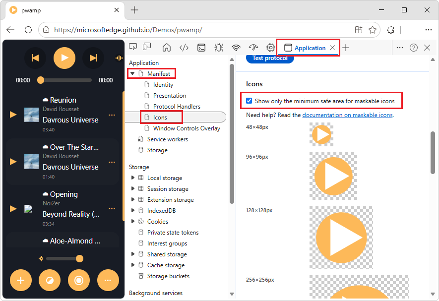
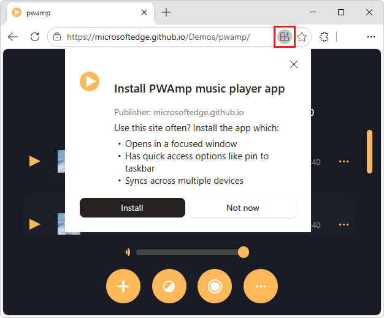
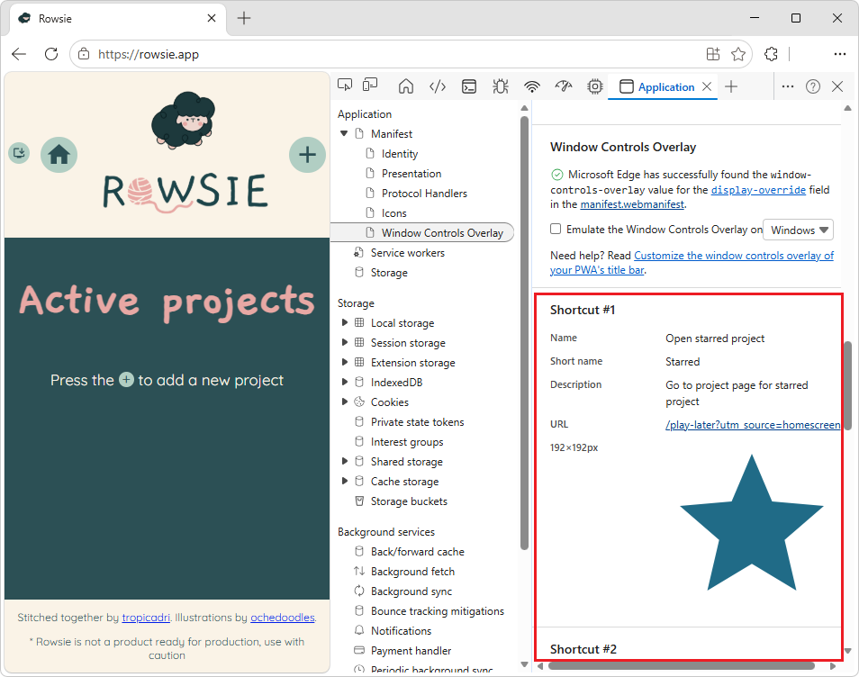
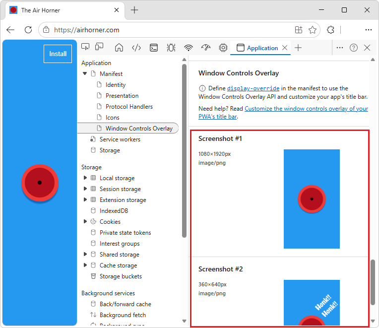

<!-- Copyright Kayce Basques

   Licensed under the Apache License, Version 2.0 (the "License");
   you may not use this file except in compliance with the License.
   You may obtain a copy of the License at

       https://www.apache.org/licenses/LICENSE-2.0

   Unless required by applicable law or agreed to in writing, software
   distributed under the License is distributed on an "AS IS" BASIS,
   WITHOUT WARRANTIES OR CONDITIONS OF ANY KIND, either express or implied.
   See the License for the specific language governing permissions and
   limitations under the License.  -->
# Debug a Progressive Web App (PWA)
<!-- https://learn.microsoft.com/microsoft-edge/devtools/progressive-web-apps/ -->
<!-- https://developer.chrome.com/docs/devtools/progressive-web-apps/ -->

Use the **Application** tool to inspect, modify, and debug a PWA's web app manifests, service workers, and service worker caches.

**Detailed contents:**
* [Introduction](#introduction)
* [Summary](#summary)
* [Web app manifest](#web-app-manifest)
   * [View and check maskable icons](#view-and-check-maskable-icons)
   * [Trigger installation](#trigger-installation)
   * [Inspect shortcuts](#inspect-shortcuts)
   * [Inspect screenshots for a richer installation UI](#inspect-screenshots-for-a-richer-installation-ui)
   * [Test URL protocol handler registration](#test-url-protocol-handler-registration)
* [Service workers](#service-workers)
* [Display network requests handled by a service worker](#display-network-requests-handled-by-a-service-worker)
* [Service worker caches](#service-worker-caches)
* [Quota usage](#quota-usage)
* [Clear storage](#clear-storage)
* [Other Application tool guides](#other-application-tool-guides)
* [See also](#see-also)

<!-- ====================================================================== -->
## Introduction
<!-- heading not upstream; content = top of https://developer.chrome.com/docs/devtools/progressive-web-apps/ -->

Progressive Web Apps (PWAs) are modern, high-quality applications built using web technology.  PWAs offer similar capabilities to apps on iOS, Android, and desktop:

* Reliable even in unstable network conditions.
* Installable to launch surfaces of operating systems, such as the Applications folder on Mac OS X, the Start menu on Windows, and the home screen on Android and iOS.
* Show up in activity switchers, device search engines such as Spotlight, and in content sharing sheets.

The features that are discussed below are features of the **Application** tool are relevant for PWAs.  For help on the other features and panes in the **Application** tool, see:
* [Other Application tool guides](#other-application-tool-guides), below.
* [View the resource files that make up a webpage](../resources/index.md)
* [View and edit local storage](../storage/localstorage.md)

See also:
* [Progressive Web Apps](https://web.dev/progressive-web-apps) at web.dev.
* [Overview of Progressive Web Apps (PWAs)](../../progressive-web-apps/index.md)

<!-- ====================================================================== -->
## Summary
<!-- https://developer.chrome.com/docs/devtools/progressive-web-apps/#summary -->

The  **Application** tool includes the following panes (accessed via the tree on the left) that cover PWA features:

* Use the **Manifest** pane to inspect your web app manifest.

* Use the **Service workers** pane for service-worker-related tasks, such as:
  * Unregistering or updating a service.
  * Emulating push events.
  * Going offline.
  * Stopping a service worker.

* Use the **Storage** pane to view how much data your app is storing on the device, and clear the stored data.

* Use the **Cache storage** pane to view your service worker cache.

<!-- todo: png showing these tree items of interest -->

<!-- ====================================================================== -->
## Web app manifest
<!-- https://developer.chrome.com/docs/devtools/progressive-web-apps/#manifest -->

If you want your users to be able to add your app to their mobile home screen, you need a web app manifest.  The web app manifest defines:
* How the app appears on the home screen.<!-- todo: clarify "the home screen" -->
* Where to direct the user when launching from the home screen
* What the app looks like when launched.

<!--Related Guides:

* [Improve user experiences with a Web App Manifest](/web/fundamentals/web-app-manifest)
* [Using App Install Banners](/web/fundamentals/app-install-banners)  -->

<!--TODO: link to sections when available -->

To inspect a manifest:

1. Go to the webpage that uses the manifest, such as [Airhorner.com](https://airhorner.com)<!-- todo: PWAmp -->, in a new window or tab.

1. Right-click the webpage, and then select **Inspect**.

   DevTools opens.

1. In DevTools, select the  **Application** tool.

1. In the outline on the left, in the **Application** section, select **Manifest**.

   The **App Manifest** pane is displayed, where you can inspect the manifest:

<!-- todo: from airhorn to pwamp -->

The **App Manifest** pane contains the following sections:
* Top section, containing the manifest link
* **Identity**
* **Presentation**
* **Protocol Handlers**
* **Icons**
* **Window Controls Overlay**
* **Screenshot #1**
* **Screenshot #2**

* To view the manifest source file, click the link below the **App Manifest** label.  In the previous figure, that link is `manifest.json`, which opens `https://airhorner.com/manifest.json`<!-- todo: PWAmp -->, for [Airhorner.com](https://airhorner.com).
<!-- * Click the **Add to home screen** button to simulate an Add to home screen event.  Check out the next section for more information.  -->

* The **Identity** and **Presentation** sections display fields from the manifest source in a more user-friendly display.

* The **Icons** section displays every icon that's been specified in the manifest.

See also:
* [Add a web app manifest](https://web.dev/add-manifest/) at web.dev.

<!-- ------------------------------ --
#### Simulate Add to home screen events -->
<!-- not upstream, upstream article has 0 hits on "home screen" -->

<!--A web app may only be added to a home screen when the site is visited at least twice, with at least five minutes between visits.  While developing or debugging your Add to home screen workflow, the criteria is potentially inconvenient.
The **Add to home screen** button on the **App Manifest** pane lets you simulate Add to home screen events whenever you want.  -->

<!--You can test out this feature with the [Microsoft I/O 2016 progressive web app](https://events.alpahabet.com/io2016/), which has proper support for Add to home screen.  Choosing on **Add to home screen** while the app is open prompts Microsoft Edge to display the "add this site to your shelf" banner, which is the desktop equivalent of the "add to home screen" banner for mobile devices.  -->

<!--

-->

<!--
> [!Tip]
> Keep the **Console** open in the **Quick View** panel at the bottom of DevTools while simulating Add to home screen events.  The Console tells you if your manifest has any issues and logs other information about the Add to home screen lifecycle.  -->

<!--The **Add to home screen** feature cannot yet simulate the workflow for mobile devices.  Notice how the "add to shelf" prompt was triggered in the screenshot above, even though DevTools is in Device Mode (Device Emulation).  However, if you can successfully add your app to your desktop shelf, then it works for mobile, too.  -->

<!-- TODO: rework content after sample app is created -->

<!--If you want to test out the genuine mobile experience, you can connect a real mobile device to DevTools via [remote debugging](/debug/remote-debugging/remote-debugging), and then click the **Add to home screen** button (on DevTools) to trigger the "add to home screen" prompt on the connected mobile device.  -->

<!--TODO: link to "remote debugging" sections when available -->

<!-- ------------------------------ -->
#### View and check maskable icons
<!-- https://developer.chrome.com/docs/devtools/progressive-web-apps/#icons -->

The **Icons** section of the **Manifest** page of the **Application** tool displays all the icons of your application.  In the **Icons** section, you can also check safe areas for maskable icons, which is the format of icons that adapt to platforms.

To trim the icons so that only the minimum safe area is visible, select the **Show only the minimum safe area for maskable icons** checkbox:

<!-- https://microsoftedge.github.io/Demos/pwamp/ -->

If your entire logo is visible in the safe area, the formatting is valid.

See also:
* [Adaptive icon support in PWAs with maskable icons](https://web.dev/articles/maskable-icon) at web.dev.

<!-- ------------------------------ -->
#### Trigger installation
<!-- https://developer.chrome.com/docs/devtools/progressive-web-apps/#trigger-installation -->

Microsoft Edge makes it possible for you to enable and promote the installation of your PWA directly within its user interface.

See also:
* [How to provide your own in-app installation experience](https://web.dev/customize-install/) at web.dev.

To trigger the installation flow of your PWA:

1. Open the PWA's landing page in Microsoft Edge.  For example, open the [PWAmp](https://microsoftedge.github.io/Demos/pwamp/) demo in a new window or tab.

1. On the right side of the Address bar at the top, click the **App available.  Install PWAmp music player** button.

   The **Install PWAmp music player app** dialog opens: 

   

1. Click the **Install** button.

<!-- ---------- -->
###### Monitor the Console tool in the Quick view panel

It's recommended that you keep the DevTools **Console** tool open in the **Quick view** panel when you trigger installation.  The **Console** tells you if your manifest has any issues, and logs other information about the installation lifecycle.

The **Install app** feature cannot simulate the workflow for mobile devices.  The desktop Microsoft Edge browser displays the installation button in the Address bar, even though<!-- todo: even when? --> DevTools is in [Device Mode](https://developer.chrome.com/docs/devtools/device-mode)<!-- todo: true? is DevTools in Device Mode? --><!-- todo: local link -->.  However, if you can successfully add your app to your desktop, then the app will work for mobile, too.

<!-- ---------- -->
###### Test a mobile device

If you want to test out the actual mobile experience, you can connect a mobile device to DevTools via [remote debugging](https://developer.chrome.com/docs/devtools/remote-debugging)<!-- todo: local link -->.  To trigger the installation on the connected mobile device, open the three-dot menu (), and then click **Install app**.

<!-- ------------------------------ -->
#### Inspect shortcuts
<!-- https://developer.chrome.com/docs/devtools/progressive-web-apps/#shortcut -->

App shortcuts let you to provide quick access to a handful of common actions that users need frequently.

To inspect the shortcuts that you defined in your [manifest file](https://web.dev/articles/app-shortcuts#define_app_shortcuts_in_the_web_app_manifest), scroll to the **Shortcut #N** sections of the **Manifest** page of the **Application** tool.  The **Shortcut #N** sections are below the **Windows Control Overlay** section of the **Manifest** page:

<!-- todo: pwamp -->

The above screenshot is from the [Rowsie](https://rowsie.app)<!-- todo: pwamp --> demo page.  For more examples of shortcuts, inspect the demo page.

See also:
* [App shortcuts](https://web.dev/articles/app-shortcuts) at web.dev.

<!-- ------------------------------ -->
#### Inspect screenshots for a richer installation UI
<!-- https://developer.chrome.com/docs/devtools/progressive-web-apps/#screenshot -->

When you add a description and a set of screenshots to your manifest file, your app gets a richer installation dialog.

To inspect the screenshots, scroll down to the **Screenshot #N** sections of the **Manifest** page of the **Application** tool:

<!-- todo: pwamp -->
<!-- https://airhorner.com -->

See also:
* [screenshots](https://web.dev/add-manifest#screenshots) in _Add a web app manifest_ at web.dev.

<!-- ------------------------------ -->
#### Test URL protocol handler registration
<!-- https://developer.chrome.com/docs/devtools/progressive-web-apps/#test-protocol-handler -->

todo: format, links, pngs - https://developer.chrome.com/docs/devtools/progressive-web-apps/#test-protocol-handler

A PWA can handle links that use a specific protocol, for a more integrated experience.  To learn how to create a handler, see [URL protocol handler registration for PWAs](https://developer.chrome.com/docs/web-platform/best-practices/url-protocol-handler)<!-- todo: local link or mdn -->.

To test your handler:

1. [Open DevTools](https://developer.chrome.com/docs/devtools/open)<!-- todo: inline steps, or local link --> on the landing page of your PWA.  For example, check out the [URL protocol handler](https://chrome.dev/devtools-protocol-handler/) demo PWA.

1. From the demo page, install the PWA.<!-- todo: but there is no "app available, install" button in address bar for https://chrome.dev/devtools-protocol-handler/ -->

1. Reload the app.

   The browser has now registered the PWA as a handler for the `web+coffee` protocol.

1. In the **Application** > **Manifest** > **Protocol Handlers** section, enter the URL<!-- todo: portion?  suffix?  path? --> that you want the handler to test, and then click the **Test protocol** button:

   ![Testing the handler] ./index-images/testing-handler.png todo

   In this example, the handler can process `americano`, `chai`, and `latte-macchiato`.

   Microsoft Edge asks you if it can open the app.

1. Click the **Open Protocol Handler** button:

   ![Open the app] open-protocol-handler.png todo

   The **Allow app to open web+coffee links?** dialog opens:

   ![Allow to handle links] allow-handle-links.png todo

1. Click the **Allow** button.

   The handler processes the link.  An image of a coffee cup is displayed in the app.

<!-- ====================================================================== -->
## Service workers
<!-- https://developer.chrome.com/docs/devtools/progressive-web-apps/#service-workers -->

Service workers are a fundamental technology in the web platform.  Service workers are scripts that the browser runs in the background, separate from a webpage.  Service worker scripts enable your app to access features that don't need a webpage or user interaction, such as push notifications, background sync, and offline experiences.

<!--Related Guides:

* [Intro to Service Workers](/web/fundamentals/primers/service-worker) - not found: https://learn.microsoft.com/web/fundamentals/primers/service-worker
* [Push Notifications: Timely, Relevant, and Precise](/web/fundamentals/push-notifications)  -->

<!-- [How Push Works](/web/fundamentals/push-notifications/how-push-works) -->

<!--TODO: link to sections when available -->

The main place in DevTools to inspect and debug service workers is the **Service workers** pane in the  **Application** tool.

To view service workers:

1. Go to a webpage, such as [Airhorner.com](https://airhorner.com)<!-- todo: PWAmp -->, in a new window or tab.

1. Right-click the webpage, and then select **Inspect**.

   DevTools opens.

1. In DevTools, select the  **Application** tool.

1. In the outline on the left, in the **Application** section, select **Service workers**.

   The **Service workers** pane is displayed:

<!-- todo: latest ui has 'w' -->

* If a service worker is installed to the currently open page, then the service worker is listed in the **Service workers** pane.  For example, in the previous figure, there is a service worker installed for the scope of `https://weather-pwa-sample.firebaseapp.com`.<!-- todo: update when use PWAmp instead of Airhorner -->

* The **Offline** checkbox puts DevTools into offline mode.  This is equivalent to the offline mode available from the  **Network** tool, or the `Go offline` option in the [Command Menu](../command-menu/index.md).

* The **Update on reload** checkbox forces the service worker to update on every page load.

* The **Bypass for network** checkbox bypasses the service worker and forces the browser to go to the network for requested resources.

* The **Network requests** link takes you to the **Network** tool with a list of intercepted requests related to the service worker (the `is:service-worker-intercepted` filter).  See [Display network requests handled by a service worker](#display-network-requests-handled-by-a-service-worker), below.

* The **Update** button performs a one-time update of the specified service worker.

* The **Push** button emulates a push notification without a payload (also known as a _tickle_).

* The **Sync** button emulates a background sync event.

* The **Unregister** link unregisters the specified service worker.  To unregister a service worker and wipe storage and caches with a single button-click, see [Clear storage](#clear-storage), below.

* The **Source** line tells you when the currently running service worker was installed.  The link is the name of the source file of the service worker.  Choosing on the link sends you to the source of the service worker.

* The **Status** line tells you the status of the service worker.  The ID number next to the green status indicator (`#36` in the previous figure) is for the currently active service worker.

  Next to the status:
  * If the service worker is stopped, a **start** button is displayed.
  * If the service worker is running, a **stop** button is displayed.

  Service workers are designed to be stopped and started by the browser at any time.  Explicitly stopping your service worker using the **stop** button may simulate that.

  Stopping your service worker is a great way to test how your code behaves when the service worker starts back up again.  It frequently reveals bugs due to faulty assumptions about persistent global state.

* The **Clients** line tells you the origin that the service worker is scoped to.  The **focus** button is mostly useful when you've enabled the **show all** checkbox.  When that checkbox is enabled, all registered service workers are listed.  If you click the **focus** button next to a service worker that is running in a different tab, Microsoft Edge focuses on that tab.

* The **Update Cycle** table displays the service worker's activities and their elapsed times, such as **Install**, **Wait**, and **Activate**.  To see the exact timestamp of each activity, click the **Expand** () buttons.

If the service worker causes any errors, an **Errors** label is displayed.

<!--

-->

<!--TODO: capture "Service Worker Errors" sample when available -->

<!--TODO: link Web "How tickle works" sections when available -->

See also:
* [Service Worker API](https://developer.mozilla.org/docs/Web/API/Service_Worker_API) - at MDN, about service workers.

<!-- ====================================================================== -->
## Display network requests handled by a service worker
<!-- not in upstream -->

From the **Service workers** pane of the **Application** tool, you can quickly access the list of network requests that are handled by a service worker, through the **Network** tool.

To display the network requests that are handled by a service worker:

1. Go to a webpage, such as [Airhorner.com](https://airhorner.com)<!-- todo: PWAmp -->, in a new window or tab.

1. Right-click the webpage, and then select **Inspect**.

   DevTools opens.

1. In DevTools, select the  **Application** tool.

1. In the outline on the left, in the **Application** section, select **Service workers**.

   The **Service workers** pane is displayed.

1. In the upper right of the **Service workers** pane, click the **Network requests** button.

   The  **Network** tool opens.

   The **Filter** text box contains `is:service-worker-intercepted`.  This filter only displays the requests that were handled by this service worker.

1. Refresh the webpage.

1. Select one of the requests, such as **main.css**.

   The sidebar appears.

1. In the sidebar, click the **Timing** tab.

   The **Service Worker** section displays timing information about the **Startup** and **respondWith** phases.

<!-- ====================================================================== -->
## Service worker caches
<!-- https://developer.chrome.com/docs/devtools/progressive-web-apps/#caches -->

The **Cache Storage** pane provides a read-only list of resources that have been cached using the (service worker) [Cache API](https://developer.mozilla.org/docs/Web/API/Cache):

The first time you open a cache and add a resource to it, DevTools might not detect the change.  Refresh the page to display the cache.

All open caches are listed under the **Cache Storage** expander.

<!-- ====================================================================== -->
## Quota usage
<!-- https://developer.chrome.com/docs/devtools/progressive-web-apps/#opaque-responses -->

Some responses within the **Cache Storage** pane may be flagged as being "opaque".<!-- [opaque](/web/fundamentals/glossary#opaque-response) -->  This refers to a response retrieved from a different origin, like from a **CDN**<!-- [CDN](/web/fundamentals/glossary#CDN) --> or remote API, when [CORS](https://fetch.spec.whatwg.org/#http-cors-protocol) isn't enabled.

<!--TODO: link Web "CDN" section when available -->

<!--TODO: link Web "opaque" section when available -->

In order to avoid leakage of cross-domain information, significant padding is added to the size of an opaque response used for calculating storage quota limits (for example whether a `QuotaExceeded` exception is thrown) and reported by the `navigator.storage` API.

<!--TODO: link Estimating "`navigator.storage` API" sections when available -->
<!-- [Estimating available storage space](whats-new/2017/08/estimating-available-storage-space) -->

The details of this padding vary from browser to browser, but for Microsoft Edge, this means that the **minimum size** that any single cached opaque response contributes to the overall storage usage is [approximately 7 megabytes](https://bugs.chromium.org/p/chromium/issues/detail?id=796060#c17).  Remember the padding when determining how many opaque responses you want to cache, since you may easily exceed storage quota limitations much sooner than you otherwise expect based on the actual size of the opaque resources.

Related Guides:
* [Stack Overflow: What limitations apply to opaque responses?](https://stackoverflow.com/q/39109789/385997)
<!--
* [Alphabet work container: Understanding Storage Quota](/web/tools/Alphabet-work-container/guides/storage-quota#beware_of_opaque_responses)
-->

<!--TODO: link Work container storage quota for opaque responses section when available -->

<!-- ====================================================================== -->
## Clear storage
<!-- https://developer.chrome.com/docs/devtools/progressive-web-apps/#clear-storage -->

todo: there's no longer a "Clear Storage" tab/pane, though upstream outdated section mentions it and links to an article about it, but that linked upstream article no longer says "the Clear Storage tab/pane"

The **Clear Storage** tab is useful when developing a progressive web app.  Use the **Clear Storage** pane to unregister service workers and clear all caches and storage, with a single button-click.

<!-- ====================================================================== -->
## Other Application tool guides
<!-- Other Application panel guides  https://developer.chrome.com/docs/devtools/progressive-web-apps/#other -->

For the other panes of the  **Application** tool, see:
* [Inspect page resources](/iterate/manage-data/page-resources)
* [Inspect and manage local storage and caches](/iterate/manage-data/local-storage)
<!--TODO: link to sections when available -->

<!-- ====================================================================== -->
## See also
<!-- not in upstream -->

* [Inspect network activity](./index.md)

<!-- ====================================================================== -->
> [!NOTE]
> Portions of this page are modifications based on work created and [shared by Google](https://developers.google.com/terms/site-policies) and used according to terms described in the [Creative Commons Attribution 4.0 International License](https://creativecommons.org/licenses/by/4.0).
> The original page is found [here](https://developer.chrome.com/docs/devtools/progressive-web-apps/) and is authored by Kayce Basques.

This work is licensed under a [Creative Commons Attribution 4.0 International License](https://creativecommons.org/licenses/by/4.0).
