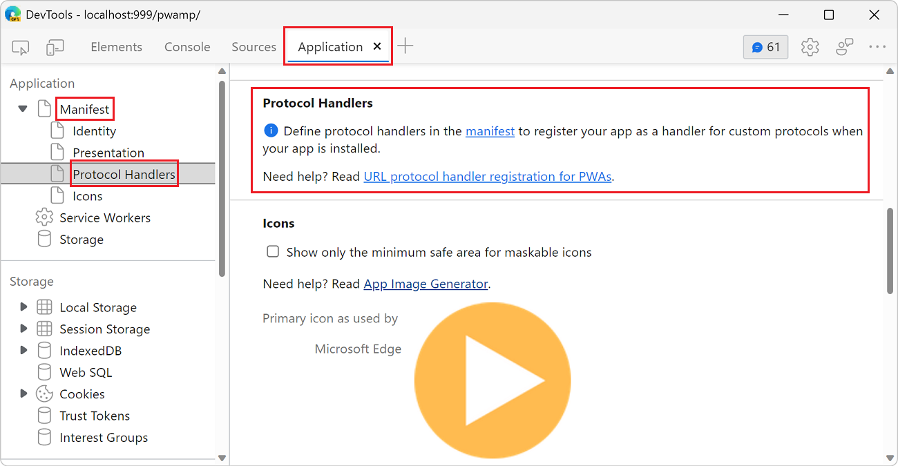
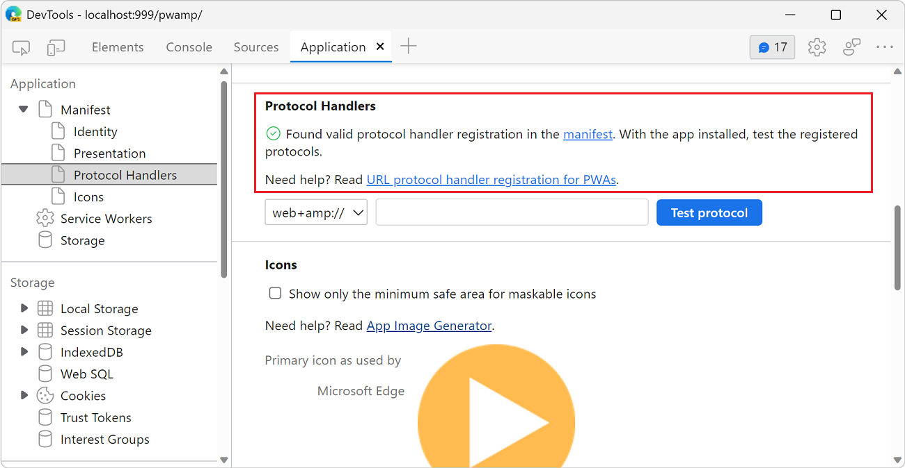
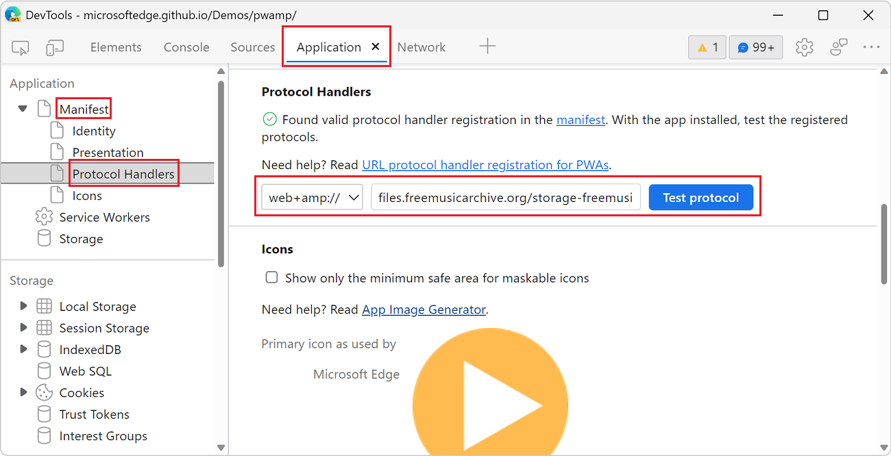

# Test Progressive Web App (PWA) protocol handling

This article assumes that you have already defined protocol handlers in your PWA web app manifest and are debugging your app by using DevTools.  To learn about how to define and register protocols in your PWA, see [Handle protocols in a PWA](../../progressive-web-apps/how-to/handle-protocols.md).

Use the **Application** tool to verify and test that Microsoft Edge has successfully registered your app as a handler for protocols defined in your web app manifest.

See also:
* [Test URL protocol handler registration](./index.md#test-url-protocol-handler-registration) in _Debug a Progressive Web App (PWA)_.

<!-- ====================================================================== -->
## Verify that protocol handlers are defined correctly

If you haven't already defined handlers for protocols in your PWA web app manifest, the **Application** tool will note that protocols haven't been defined and will provide additional information on how to update your web app manifest.

If you have defined protocols correctly in your web app manifest, the **Application** tool will report that Microsoft Edge has found valid protocol handler registrations and that you can test these protocol handlers with your installed PWA.

To verify that you have correctly defined protocol handlers:

1. In Microsoft Edge, go to your PWA.  You can use [the PWAmp demo application](https://microsoftedge.github.io/Demos/pwamp/).

1. Open DevTools (**F12**).

1. In the **Activity Bar**, select the **Application** tool.

1. In the tree on the left, expand **Manifest**, and then select **Protocol Handlers**.

   The **Manifest** page scrolls down to the **Protocol Handlers** section.

   * If protocol handlers have not been defined in the web app manifest, or have been defined incorrectly, the following message is displayed: "Define protocol handlers in the manifest to register your app as a handler for custom protocols when your app is installed."

      

   * If protocol handlers have been defined successfully in the web app manifest, the following message is displayed: "Found valid protocol handler registration in the manifest.  With the app installed, test the registered protocols."

      

<!-- ====================================================================== -->
## Test protocols from the Application tool

To test protocol handlers that you've defined, use the **Application** tool > **Manifest** page > **Protocol Handlers** section.

To test your protocol handlers from the **Application** tool, you must first install your PWA; see [Installing a PWA](../../progressive-web-apps/ux.md#installing-a-pwa) in _Use Progressive Web Apps (PWAs) in Microsoft Edge_.

The **Application** tool detects all the protocol handlers from your web app manifest.

To test a protocol handler:

1. Open a PWA in Microsoft Edge.  You can use [the PWAmp demo application](https://microsoftedge.github.io/Demos/pwamp/).

1. Install the PWA; see [Installing a PWA](../../progressive-web-apps/ux.md#installing-a-pwa) in _Use Progressive Web Apps (PWAs) in Microsoft Edge_.

1. Open DevTools (**F12**).

1. In the **Activity Bar**, select the **Application** tool.

1. In the tree on the left, expand **Manifest**, and then select **Protocol Handlers**.

   The **Manifest** page scrolls down to the **Protocol Handlers** section.

1. In the dropdown list, select the protocol to test.

1. Enter the rest of the URI in the text box, and then click the **Test protocol** button:

   

   In the above example, the following URI is being tested:

   `web+amp://files.freemusicarchive.org/storage-freemusicarchive-org/music/no_curator/Kevin_MacLeod/Jazz_Sampler/Kevin_MacLeod_-_AcidJazz.mp3`

   Your PWA is launched.  Depending on your operating system (OS), you might need to allow Microsoft Edge to open your PWA and accept any OS-level permissions for registering your app as a handler for your protocol.

<!-- ====================================================================== -->
## See also

* [Test URL protocol handler registration](./index.md#test-url-protocol-handler-registration) in _Debug a Progressive Web App (PWA)_.
* [Handle protocols in a PWA](../../progressive-web-apps/how-to/handle-protocols.md)

Windows blog:
* [Getting started with Protocol Handlers for your web app](https://blogs.windows.com/msedgedev/2022/01/20/getting-started-url-protocol-handlers-microsoft-edge/)

MDN:
* [protocol_handlers](https://developer.mozilla.org/docs/Web/Progressive_web_apps/Manifest/Reference/protocol_handlers) at MDN > PWA manifest.
* [Navigator: registerProtocolHandler() method](https://developer.mozilla.org/docs/Web/API/Navigator/registerProtocolHandler) at MDN.
