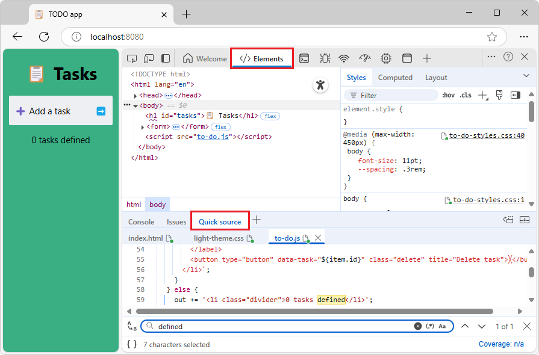
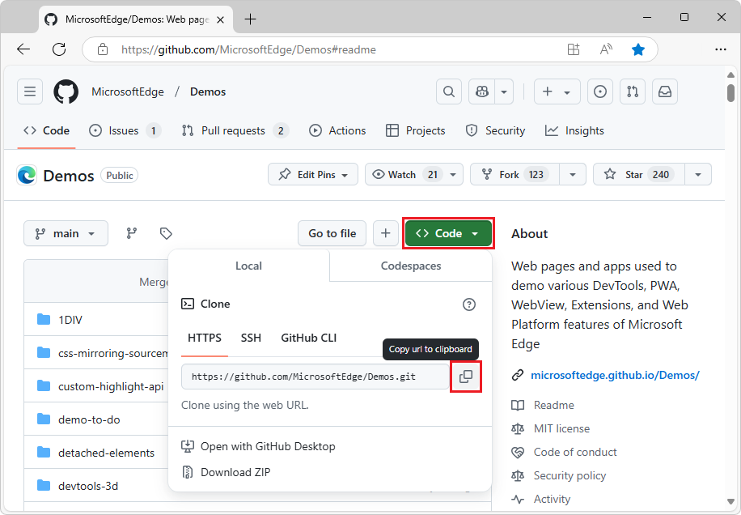
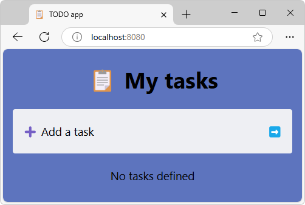
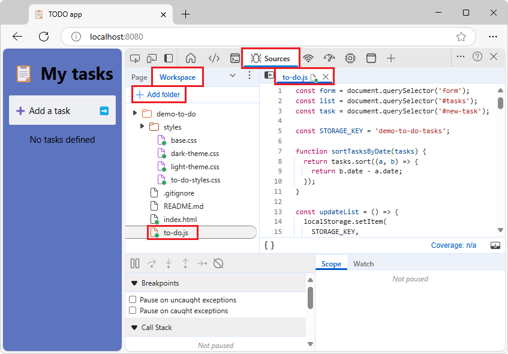
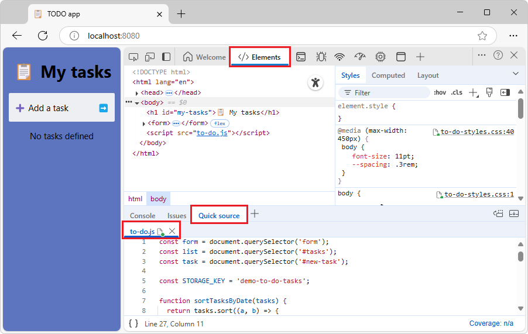
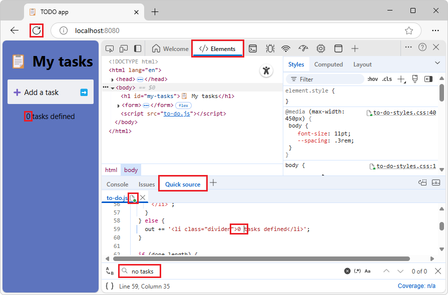
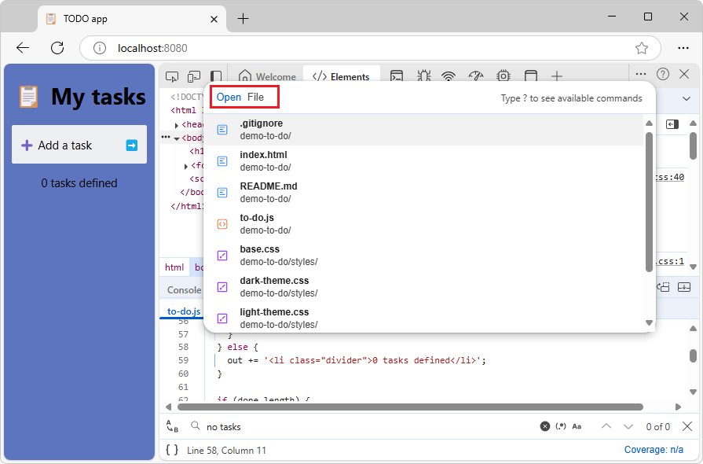

# Display or edit source files using the Quick source tool
<!-- https://developer.chrome.com/docs/devtools/quick-source -->
<!-- give the always-available GUI way, don't doc the empty tool UI -->

Use the **Quick source** tool to display or edit source files at the same time as displaying a tool other than the **Sources** tool.  The **Quick source** tool always displays the same files that are open in the **Sources** tool.



The main place to view source files in the DevTools is within the **Sources** tool.  But sometimes you need to access other tools, such as **Elements** or **Console**, while viewing or editing your source files.  Use the **Quick source** tool, which by default opens in the **Quick View** panel at the bottom of DevTools.


<!-- ------------------------------ -->
#### Use the Quick source tool in conjunction with the Sources tool

To display the **Quick source** tool in **Quick View** at the bottom of DevTools, a tool other than the **Sources** tool must be open in the **Activity Bar** at the top of DevTools.

The **Quick source** tool provides an alternative display of the files that are open in the **Sources** tool.  The **Quick source** tool has a subset of features.  For full features, use the **Sources** tool.

If you open or close a file in one tool, the file is opened or closed in the other tool.  In both tools, there's a tab for each open file.


<!-- ====================================================================== -->
## Edit local source files in DevTools by selecting a Workspace folder

This is an end-to-end tutorial of all steps to demonstrate the **Quick source** tool, by using the ToDo web app in the **MicrosoftEdge / Demos** repo.

By selecting a local folder as a **Workspace** in the **Sources** tool, you can then edit files from within the **Quick source** tool at the same time as displaying a different tool, and have those edits be saved to your local drive.  This way, you can edit files in the **Quick source** tool while using another tool, such as **Elements** or **Network**, and have your edits be saved to the corresponding source file on your local drive.

To edit source files in the **Quick source** tool, you'll do the following:

1. Have access to the webpage source files locally, such as a cloned repo.

1. In the **Workspace** tab in the **Sources** () tool, add a local folder of source files.

1. In the **Workspace** tab, open a file, such as a `.js` file.

1. In the **Activity Bar**, select a tool other than the **Sources** tool, such as the **Elements** tool.

1. In the **Quick View** panel at the bottom of DevTools, open the **Quick source** tool.  The opened `.js` file is shown in a streamlined editor, and the **Elements** tool is still displayed.

These steps are detailed in the tutorial below.


<!-- ====================================================================== -->
## Have local source files, such as a cloned repo

To use the **Quick source** tool to save changes locally, you must have local source files that match the web server files.  Make sure there are source files on your local drive, that match the transient files that are returned by the web server.

For example, if not done already, clone the **MicrosoftEdge / Demos** repo to your local drive, as follows:

1. If not done already, [Download git](https://git-scm.com/downloads) and install it.

1. If not done already, install an up-to-date version of Node.js and npm from [Node.js](https://nodejs.org).

1. Go to [MicrosoftEdge / Demos](https://github.com/MicrosoftEdge/Demos) in a new window or tab.

1. Click the **Code** drop-down button.

1. Click the **Copy url to clipboard** button.

   

   The URL is copied to the clipboard: `https://github.com/MicrosoftEdge/Demos.git`

   Or, if you have GitHub Desktop installed, click **Open with GitHub Desktop** to clone the repo, and skip the command prompt step below.

   Or, you can use Visual Studio Code's **Source Control** pane to clone the repo, and skip the command prompt step below.

1. Assuming you have git installed, open a command prompt.

1. Clone the repo to your local drive, entering the URL string that you copied from the GitHub repo.  If you use a command prompt:

   ```console
   # example location where the repo directory will be added:
   cd ~/GitHub
   git clone https://github.com/MicrosoftEdge/Demos.git
   ```

   For details about cloning a repo, see:
   * [Clone the Edge Demos repo to your drive](../samples/index.md#clone-the-edge-demos-repo-to-your-drive) in _Sample code for DevTools_.
   * [Clone the WebView2Samples repo](../../webview2/how-to/machine-setup.md#clone-the-webview2samples-repo) in _Set up your Dev environment for WebView2_.  Shows a different sample repo, but shows steps for several tools.
   * [Cloning a repository](https://docs.github.com/en/repositories/creating-and-managing-repositories/cloning-a-repository) - GitHub docs.

Now you have a local folder of source files (such as `/demo-to-do/`) that match the files on the web server.

Continue with the next section.


<!-- ====================================================================== -->
## Start a localhost server

1. Go to a command prompt, such as the git bash shell, or the Terminal pane in Microsoft Visual Studio Code.

1. Go to the cloned `/demo-to-do/` directory, such as `C:\Users\localAccount\GitHub\Demos\demo-to-do\`.

   If you use the git bash shell, it's a UNIX shell, so even on Windows, you need to wrap a directory path that has backslashes in quotes, or else use forward slashes rather than backslashes.

1. Create a working branch named "test" and switch to it (to avoid altering the demo's files in the "main" branch):

   ```console
   git checkout -b test
   ```

   That's equivalent to:

   ```console
   git branch test
   git switch test
   ```

1. Run one of the following commands, to start the web server:

   ```bash
   # Node.js option
   cd ~/GitHub/demos/demo-to-do
   npx http-server  # Node.js
   ```

   For more information and options, see [Start the server (npx http-server)](../../visual-studio-code/microsoft-edge-devtools-extension/install.md#start-the-server-npx-http-server) in _Installing the DevTools extension for Visual Studio Code_.

   ``` bash
   # Python 2 option
   cd ~/GitHub/demos/demo-to-do
   python -m SimpleHTTPServer  # Python 2
   ```
  
   ``` bash
   # Python 3 option
   cd ~/GitHub/demos/demo-to-do
   python -m http.server  # Python 3
   ```

1. Open a tab in Microsoft Edge, and go to the locally hosted version of the site.  You should be able to access it by using `localhost:8080`:

   

   Another common equivalent URL is `http://0.0.0.0:8080`.  The default port number for the Python server option is `8000`.  The exact [port number](https://wikipedia.org/wiki/Port_(computer_networking)#Use_in_URLs) might be different.

   The **DevTools Workspaces Demo** webpage opens.

See also:
* [Running a simple local HTTP server](https://developer.mozilla.org/docs/Learn/Common_questions/set_up_a_local_testing_server#running_a_simple_local_http_server) in _How do you set up a local testing server?_ at MDN - shows Python.
<!--
* [Set up a localhost server](../../visual-studio-code/microsoft-edge-devtools-extension/install.md#step-6-set-up-a-localhost-server) in _Installing the DevTools extension for Visual Studio Code_.  How to run a local HTTP web server by using Node.js. -->

Continue with the next section.


<!-- ====================================================================== -->
## Select a local folder of source files as the Workspace

1. Continuing from above, right-click the demo webpage and then select **Inspect**.

   DevTools opens.

1. In the **Activity Bar** at the top of DevTools, select the **Sources** () tool, select the **Workspace** tab (grouped with the **Page** tab), and then in the **Workspace** tab, click the **Add folder** button.

   The **Select Folder** dialog opens.

1. Navigate to a folder, such as `C:\Users\localAccount\GitHub\Demos\demo-to-do`, and then click the **Select Folder** button.

   At the top of DevTools, a message reads **DevTools requests full access to \<path\>**.

1. Click the **Allow** button.

   The tree of `demo-to-do` files appears in the **Workspace** tab of the **Sources** tool.  The HTML, JS, and CSS files have a green "mapped" dot.

1. In the **Workspace** tab, expand the file tree, and then click one or more files, such as `to-do.js`.

   The file opens in the **Sources** tool:

   


<!-- ====================================================================== -->
## Open the Quick source tool and edit a file

Suppose you want to continue viewing the **Elements** tool, but you want to simultaneously view and edit the source files that were opened via the **Sources** tool.

1. Continuing from above, in the **Activity Bar** at the top of DevTools, select a tool other than the **Sources** () tool, such as the **Elements**  () tool.

1. If the **Quick View** toolbar isn't shown at the bottom of DevTools, press **Esc**.

1. In the **Quick View** toolbar at the bottom of DevTools, click the **More tools** button, and then select **Quick source**.

   The **Quick source** tool opens in **Quick View** at the bottom of DevTools:

   

   `todo.js` is displayed, because that file is open in the **Sources** tool.

1. In the demo To Do webpage, delete any tasks.

1. Click the **Quick source** panel, and then press **Ctrl+F**.

   In the **Quick source** tool, the **Find** UI appears.

1. Enter **no tasks**, and then press **Enter**.

1. In the line of code, change `no tasks` to `0 tasks`.

   An asterisk appears on the file name tab.

1. Press **Ctrl+S**.

   The asterisk is removed from the file name tab.

1. Refresh the demo webpage (**Ctrl+R**).

1. If the rendered webpage doesn't change from "No" to "0", and there's no longer a green "mapped" dot on the JS file name tab, long-click or right-click the **Refresh** button in Microsoft Edge, and then select **Hard refresh** (**Ctrl+Shift+R**).

   The rendered webpage changes from "No" to "0", and there's a green "mapped" dot on the JS file name tab.

   

Now, when you edit the folder's files in DevTools, the edits are not only made to the transient file that's returned by the server, but are also saved to the source files on your local drive.  You can edit the file from within the **Quick source** tool at the same time as displaying another tool (or from within the **Sources** tool).

This is the end of the tutorial steps.

See also:
* [Add a local folder to the workspace, to use DevTools to edit files and save changes to disk](../sources/index.md#add-a-local-folder-to-the-workspace-to-use-devtools-to-edit-files-and-save-changes-to-disk) in _Sources tool overview_.
* [Edit and save files in a workspace (Sources tool Workspace tab)](../workspaces/index.md)
   * [Step 6: Save a JavaScript change to disk](../workspaces/workspace-tutorial.md#step-6-save-a-javascript-change-to-disk) in _Workspace tutorial (Sources tool Workspace tab)_


<!-- ====================================================================== -->
## Open a file by using the Command Menu

Opening a file by using the **Command Menu** opens that file in both the **Quick source** tool and **Sources** tool.


To open the **Command Menu**, do any of the following:

* Select **Customize and control DevTools** > **Run command**.

* Press **Ctrl+Shift+P** (Windows, Linux) or **Command+Shift+P** (macOS).

* Click the **Run command** link in the empty **Quick source** tool (or **Sources** tool).


To open a file by using the **Open File** prompt of the **Command Menu**, do any of the following:

* Select **Sources tool** > **More options** (next to the **Page** tab) > **Open file**.

* Select **Customize and control DevTools** > **Open file**.

* Press **Ctrl+P** (Windows, Linux) or **Command+P** (macOS).

* When the **Quick source** tool (or **Sources** tool) is empty, click the **Open file** link in the instructions in the tool:

  

  The **Open File** prompt of the **Command Menu** is displayed.

  To display the **Open file** link in the instructions in the panel, you might need to scroll down, or drag the **Quick View** divider up to make the **Quick View** panel taller.


<!-- ====================================================================== -->
## Keyboard shortcuts in the Quick source tool

The **Quick source** tool has a streamlined UI.  Use these keyboard shortcuts.

* **Ctrl+F** - Find.

* **Ctrl+S** - Save.  If there's no longer a green "mapped" dot on the HTML, JS, or CSS file name, long-click or right-click the **Refresh** button in Microsoft Edge, and then select **Hard refresh** (**Ctrl+Shift+R**).

* **Ctrl+P** - Open a file by using the **Command Menu**.  This is the same as going to the **Sources** tool and then clicking a file in the **Workspace** tab.


<!-- ====================================================================== -->
## Close a file

To close a file, click the **x** button in the file's tab.

The file is closed in the **Quick source** tool and **Sources** tool.


<!-- ====================================================================== -->
## See also

* [Sources tool overview](../sources/index.md)
   * [Quick source tool, to display source files when using a different tool](../sources/index.md#quick-source-tool-to-display-source-files-when-using-a-different-tool) in _Sources tool overview_
   * [Track changes to files using the Changes tool](../changes/changes-tool.md)
