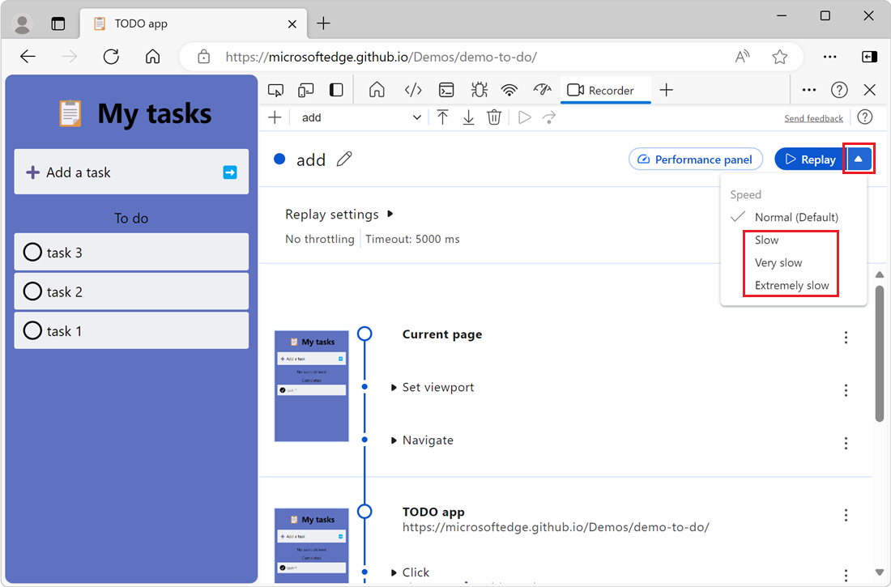
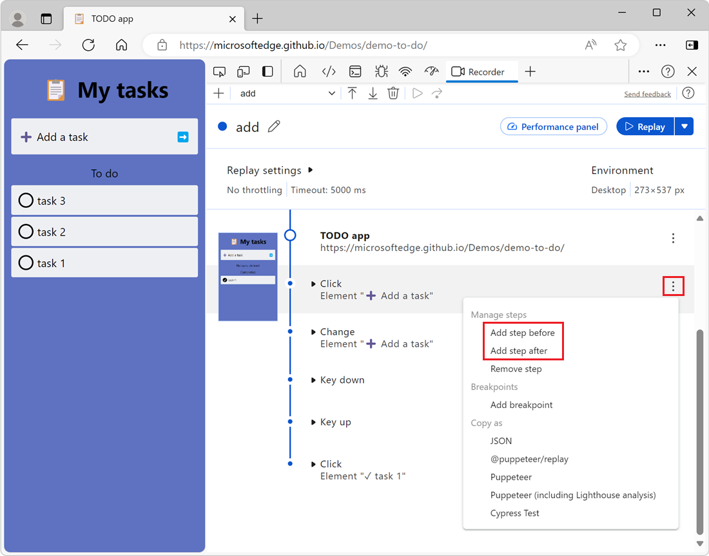
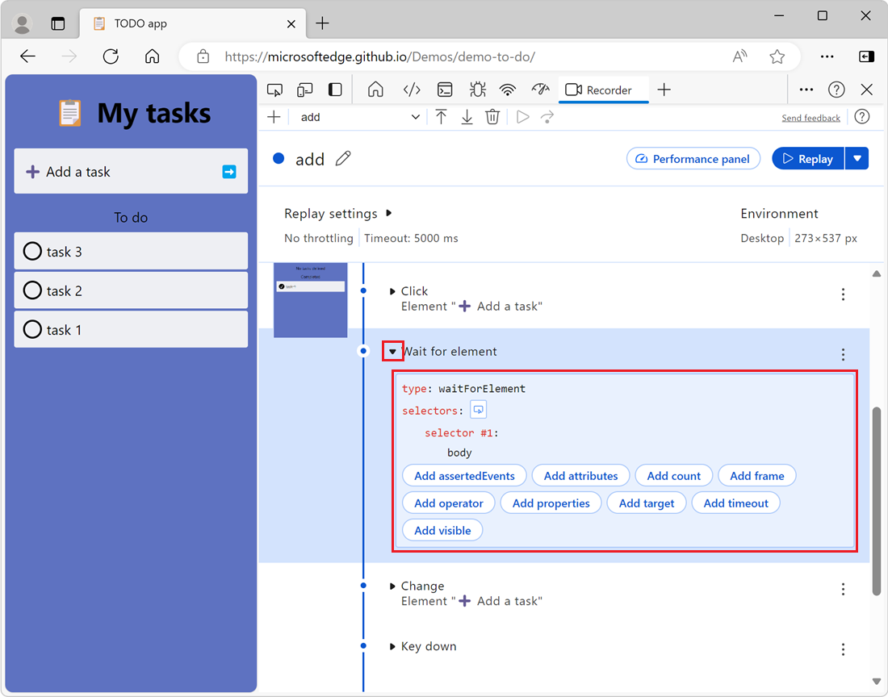
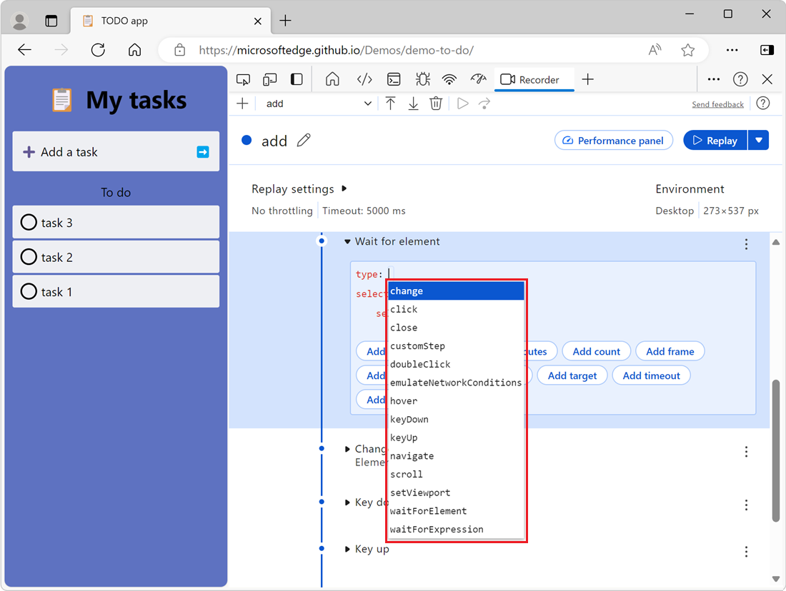
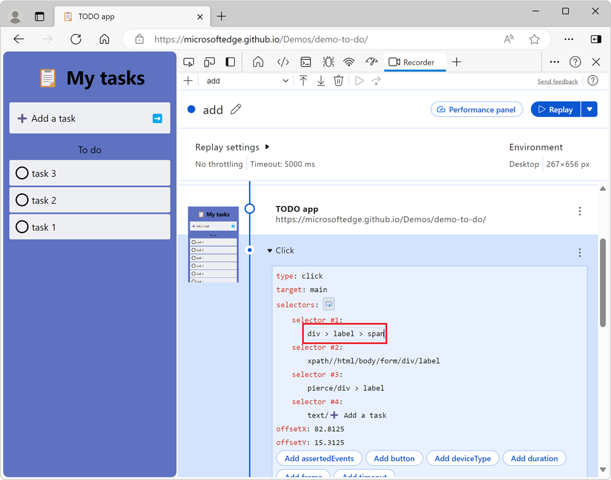

# Record and replay user flows and measure performance

Use the **Recorder** tool to record a series of steps in the browser window or tab where DevTools is opened, and then replay the steps automatically, while optionally also measuring performance.

<!-- ====================================================================== -->
## When to use the Recorder tool

Use the **Recorder** tool when you want to speed up repetitive tasks by automatically replaying a series of user interactions in the browser.

The **Recorder** tool records user interactions, such as mouse clicks, keyboard input, and page navigation events, and lets you replay the interactions automatically. You can also use the **Recorder** tool to measure the runtime performance while replaying the recorded user interactions. The **Recorder** tool lets you record as many user flows as you want, and replay them as many times as you want.

For the rest of this article, we'll use the **Recorder** tool to automate adding tasks to the demo [TODO app](https://microsoftedge.github.io/Demos/demo-to-do/).

<!-- ====================================================================== -->
## Open the Recorder tool

1. Open the [TODO app](https://microsoftedge.github.io/Demos/demo-to-do/) in a new tab or window.

1. To open DevTools, right-click the webpage, and then select **Inspect**.  Or, press **Ctrl+Shift+I** (Windows, Linux) or **Command+Option+I** (macOS).  DevTools opens.

1. In DevTools, on the **Activity Bar**, select the **Recorder** tab.  If that tab isn't visible, click the **More tools** () button, and then select **Recorder**.  The **Recorder** tool opens:

   

<!-- ====================================================================== -->
## Record a user flow

To start recording a new user flow:

1. Click **Create a new recording**.

1. Under **Recording name**, enter a name for the recording, such as "Adding TODO tasks".

1. Click **Start recording** at the bottom of the **Recorder** tool:

   

1. In the rendered webpage, interact with the page. For example, enter "task 1" in the **Add a task** input box, and then press **Enter**. Repeat these steps multiple times.

   A red circle appears next to the recording name, indicating that the recording is in progress. The **Recorder** tool records your interactions and displays them as a list of steps:

   

1. To stop the recording, at the bottom of the list of recorded interactions, click the **End recording** button.

   The recording stops, and the circle next to the recording name turns blue, indicating that the recording is complete:

   

<!-- ====================================================================== -->
## Record other user flows

To record a new user flow, after you've stopped the recording of the previous user flow: 

1. Click the **Create a new recording** () button in the top-left corner of the **Recorder** tool:

   

1. Repeat the steps from [Record a user flow](#record-a-user-flow), above.

<!-- ====================================================================== -->
## Replay a user flow

You can replay user flows either from the list of recorded user flows, or when viewing the details of a given user flow.

* To view the list of recorded user flows, click the dropdown menu that's in the **Recorder** tool toolbar, at the top, and then select **2 recording(s)**. The label might show a different number of recordings, depending on how many recordings you've made.

* To view the details of a given user flow, click the dropdown list that's in the **Recorder** tool toolbar, at the top, and then click the name of a user flow.

<!-- ------------------------------ -->
#### Replay a user flow from the list of recordings

1. Click the **Play recording** button next to a recording:

   

1. Wait while the **Recorder** tool replays the previously recorded user interactions. An animation of the steps that are being replayed appears in the **Recorder** tool:

   

   When the replay is complete, the animation stops, and the **Recorder** tool displays the recording's steps.

<!-- ------------------------------ -->
#### Replay a user flow from a recording

1. Click the **Replay** button in the top-right corner of the **Recorder** tool:

   

1. Wait while the **Recorder** tool replays the previously recorded user interactions. An animation of the steps that are being replayed appears in the **Recorder** tool:

   

   When the replay is complete, the animation stops, and the **Recorder** tool displays the recording's steps.

<!-- ------------------------------ -->
#### Slowly replay a user flow to investigate issues

To see what's happening in the rendered page while the user interactions are being replayed, slow down the replay speed. By default, the **Recorder** tool replays user flows as fast as it can.

To slow down the replay speed:

*  Click the dropdown arrow next to **Replay** in the top-right corner of the **Recorder** tool, and then select a speed from the dropdown menu, such as **Slow**, **Very slow**, or **Extremely slow**:

   

<!-- ------------------------------ -->
#### Pause while replaying a user flow, by using breakpoints

To inspect the rendered webpage at a specific point of the user flow, pause the replay by using a breakpoint.

To add a breakpoint to a user flow:

1. Next to the flow step at which to pause, click the **Open step actions** () button , and then select **Add breakpoint**:

   

1. To start the user flow, click **Replay** in the top-right corner of the **Recorder** tool.

   The replay pauses when it reaches the step that has a breakpoint. The **Continue** and **Execute one step** buttons also become available in the toolbar:

   

1. Click the **Execute one step** button to execute the next step and pause again, or click the **Continue** button to continue the replay until the next breakpoint (or the end of the user flow) is reached.

<!-- ====================================================================== -->
## Measure performance

To measure how fast a website runs while replaying a series of user interactions, use the **Recorder** tool. By recording a user flow once, you can replay the recording many times, while working on improving the runtime performance of the website.

1. To record a new user flow, follow the steps from [Record a user flow](#record-a-user-flow).

1. To replay the user flow while measuring performance, click **Performance panel** in the top-right corner of the **Recorder** tool:

   

1. Wait while the **Recorder** tool replays the previously recorded user interactions.

   The **Performance** tool opens, and displays a recording of the performance of the website while the user interactions were being replayed:

   

<!-- ====================================================================== -->
## Edit the steps of a user flow

After you've recorded a user flow, you can edit the steps of the user flow. For example, you can add new steps, remove existing steps, or edit the details of a step.

<!-- ------------------------------ -->
#### Add a new step

To add a new step to an existing user flow:

1. Click the **Open step actions** () button next to the step before or after which you want to add a new step, and then select **Add step before** or **Add step after**:

   

1. Follow the instructions in [Edit a step](#edit-a-step) below, to edit the details of the new step that you added.  The new step is temporarily named **Wait for element**.

<!-- ------------------------------ -->
#### Edit a step

To edit the details of an existing step:

1. To open the details section of the step you want to edit, click the triangle () button next to the step. The details section of the step opens:

   

1. Edit the details of the step, such as the **type** of step, the **selectors** of the DOM element the step applies to, or the properties of the step.  The various types of steps and their properties are listed in the section below.  Your changes are saved automatically.

<!-- ---------- -->
###### Change the type of step

To change the type of step when editing the details of a step:

1. Click the input box next to **type**. For example, if the step you're editing has the type **waitForElement**, click the input box that contains the value **waitForElement**.

1. Delete the contents of the input box, and then select the new type of step you want to use from the dropdown menu that appears:

   

You can use the following types of steps when editing a step in a user flow.  Each step type has a list of properties that apply to the step.

| Step type | Description | Properties |
|:--- |:--- |:--- |
| `change` | Change the value of a form input field. | **selectors**: Ways to find the element that this step applies to.  **value**: The value to set the form input field to. |
| `click` | Click an element. | **selectors**: Ways to find the element this step applies to.  **offsetX**/**offsetY**: How far from the top left corner of the element to click. |
| `close` | Close the browser window. | None. |
| `doubleClick` | Double-click an element. | **selectors**: Ways to find the element that this step applies to.  **offsetX**/**offsetY**: How far from the top left corner of the element to double-click. |
| `emulateNetworkConditions` | Emulate different network conditions. | **download**/**upload**: The download and upload speeds, in bytes per second.  **latency**: The minimum latency from a request being sent to the response being received, in milliseconds. |
| `hover` | Emulate the pointer hovering over an element. | **selectors**: Ways to find the element that this step applies to. |
| `keyDown` | Press a key down. | **selectors**: Ways to find the element that this step applies to.  **key**: Which key to press. |
| `keyUp` | Release a pressed key. | **selectors**: Ways to find the element that this step applies to.  **key**: Which key to release. |
| `navigate` | Navigate to a different webpage. | **url**: The URL of the page to navigate to. |
| `scroll` | Scroll to a position in the webpage. | **x**/**y**: The optional horizontal and vertical coordinates of the position to scroll to in the page. |
| `setViewport` | Change the viewport size, device pixel ratio, and capabilities. | **width**/**height**: The size of the viewport.  **deviceScaleFactor**: The device pixel ratio.  **isMobile**: Whether the viewport is a mobile device viewport.  **hasTouch**: Whether the viewport supports touch events.  **isLandscape**: Whether the viewport is in a landscape orientation. |
| `waitForElement` | Wait for an element, or for multiple elements, to be present in the webpage. | **selectors**: Ways to find the element that this step applies to. |
| `waitForExpression` | Wait until a JavaScript expression evaluates to `true`. | **expression**: The JavaScript expression to evaluate. |

<!-- ---------- -->
###### Edit the selectors of a step

Many step types have a **selectors** property, which specifies the DOM element that the step applies to.  For example, a `click` step has a **selectors** property to define which element in the page is clicked when that step of the user flow runs.

The **selectors** property is a list of one or more selectors.  Each selector in the list can be a different way to find the element in the page.  The **Recorder** tool tries each selector in the list, in order, until it finds an element in the page that matches the selector.

A selector can be any of the following types:

* A CSS selector, such as `#my-element-with-id` or `.my-class`.
* A XPath selector, prefixed with `xpath/`, such as `xpath//html/body/form/div/label`.
* The text content of the element, prefixed with `text/`, such as `text/Add a task`.

You can edit the selectors of a step by either approach:
* Selecting an element in the rendered webpage.
* Manually add, remove, or modify a selector.

* To edit the selectors by selecting an element in the rendered webpage, click **Select an element in the page to update selectors**, and then click the element in the rendered webpage that you want to select.  The **Recorder** tool updates the list of selectors to match the selected element:

  

* You can manually add, remove, or modify a selector:

  * To add or remove a selector, under **Selectors**, hover over a selector, and then click **Add a selector** or **Remove a selector**:

    

  * To modify the value of a selector, under **Selectors**, click the input box that contains the value of the selector, and then enter the new value for the selector:

    

<!-- ------------------------------ -->
#### Delete a step

To delete a step from an existing user flow:

1. Click the **Open step actions** () button next to the step you want to delete, and then select **Remove step**:

   

<!-- ====================================================================== -->
## Delete a user flow

To delete a previously recorded user flow, when viewing the list of recordings, click **Delete recording** () next to the recording you want to delete:

<!-- ====================================================================== -->
## Export and import user flows as files

To share a user flow with other people, export your recorded user flow as a JSON file.  For example, sharing a user flow can help other people reproduce a bug by running the same set of steps as you.

<!-- ------------------------------ -->
#### Export a user flow as a file

To share a user flow with another person, export the user flow as a JSON file:

1. When viewing the steps of a user flow, click the **Export** () button in the **Recorder** tool toolbar, and then select **JSON**:

   

1. Select a location at which to save the file. The file is saved with the name of the user flow, and the extension `.json`.

<!-- ------------------------------ -->
#### Import a user flow from a file

To import a user flow from a JSON file:

1. In the **Recorder** tool toolbar, click the **Import recording** () button:

   

1. In the file chooser dialog that opens, select a user flow JSON file, and then click the **Open** button.  The user flow is imported, and appears in the list of recordings in the **Recorder** tool.

<!-- ====================================================================== -->
## Export a user flow for test automation

To generate a test script and run it automatically with a test automation framework, export a user flow as a `.js` test script file, as follows:

1. When viewing the steps of a user flow, in the **Recorder** tool toolbar, click the **Export** () button, and then select an export format:

   

   | Export format | Test automation framework |
   |:--- |:--- |
   | `@puppeteer/replay` | Exports the user flow as a test script for the **Replay** library.  See the [puppeteer / replay](https://github.com/puppeteer/replay) repo. |
   | Puppeteer | Exports the user flow as a test script for the Puppeteer test automation framework.  See [Puppeteer](https://pptr.dev). |
   | Puppeteer (including Lighthouse analysis) | Exports the user flow as a test script for the Puppeteer test automation framework, and includes a Lighthouse analysis of the performance of the website. |

   The **Save As** dialog opens.

1. Select a location in which to save the file.  The file is saved with the name of the user flow, and the extension `.js`.
