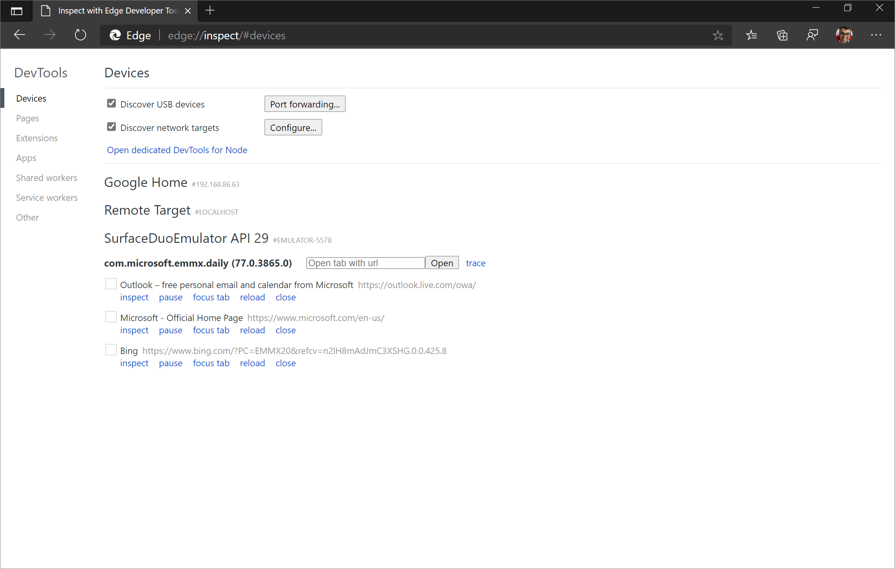
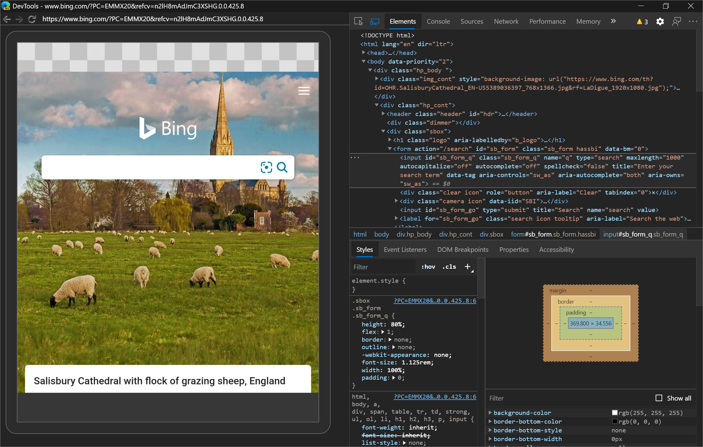

# Remotely debug Surface Duo emulators

In this article, you walk through the process of remotely debugging your web content in the [Microsoft Edge app](https://play.google.com/store/apps/details?id=com.microsoft.emmx) on a Surface Duo emulator from a desktop instance of [Microsoft Edge](https://www.microsoft.com/edge).  For information on debugging on a Surface Duo device, follow our guide for [remote debugging Android devices](index.md).

<!-- ====================================================================== -->
## Before you begin

*  Install the [Surface Duo SDK](https://www.microsoft.com/download/details.aspx?id=100847) before running the [Surface Duo emulator](/dual-screen/android/use-emulator).  See [Get the Surface Duo SDK](/dual-screen/android/get-duo-sdk).

<!-- ====================================================================== -->
## Step 1: Go to edge://inspect

*  Open a desktop instance of [Microsoft Edge](https://www.microsoft.com/edge), and go to `edge://inspect`:

> [!div class="mx-imgBorder"]
> 

If the `edge://inspect` page doesn't recognize the [Surface Duo emulator](/dual-screen/android/use-emulator), restart the emulator.

<!-- ====================================================================== -->
## Step 2: Launch the Surface Duo emulator

*  Launch the [Surface Duo emulator](/dual-screen/android/use-emulator).  The emulator displays two different screens running on the emulator:

<!-- ====================================================================== -->
## Step 3: Load your web content in Microsoft Edge on the Surface Duo emulator

1. On either screen, swipe up on the Favorites Tray of the [Surface Duo emulator](/dual-screen/android/use-emulator) to display the Apps Drawer.

1. Click **Edge** to launch the [Microsoft Edge app](https://play.google.com/store/apps/details?id=com.microsoft.emmx):

   

1. In the Microsoft Edge app, go to the website or app that you want to debug.

<!-- ====================================================================== -->
## Step 4: Debug your web content from the Surface Duo emulator

1. Switch back to the desktop instance of [Microsoft Edge](https://www.microsoft.com/edge).

   The `edge://inspect` page now shows the **SurfaceDuoEmulator** with a list of the open tabs or [PWAs](../../progressive-web-apps-chromium/index.md) that are running on the [Surface Duo emulator](/dual-screen/android/use-emulator):

   

1. From the list of open tabs running on the emulator, click **inspect** on the tab that has the web content to be debugged.  [DevTools](../landing/index.yml) opens in a new window.

1. Click **Toggle Screencast** () to view the web content from your [Surface Duo emulator](/dual-screen/android/use-emulator) in the DevTools window.

You can now use the Microsoft Edge DevTools to debug your web content on the [Surface Duo emulator](/dual-screen/android/use-emulator):

<!-- ------------------------------ -->
#### Troubleshooting

If **SurfaceDuoEmulator** isn't displayed on the `edge://inspect` page, try opening or closing tabs in the [Microsoft Edge app](https://play.google.com/store/apps/details?id=com.microsoft.emmx) on the [Surface Duo Emulator](/dual-screen/android/use-emulator).

For additional troubleshooting steps, see [troubleshooting section for Android devices](index.md#troubleshooting-devtools-isnt-detecting-the-android-device).

<!-- ------------------------------ -->
#### How the hinge impacts the layout of your web content

If you span the [Microsoft Edge app](https://play.google.com/store/apps/details?id=com.microsoft.emmx) across both screens in the emulator, the screencast will reflect the new size of the app but not the hinge.

To understand how the hinge impacts the layout of your web content, use the [Surface Duo emulator](/dual-screen/android/use-emulator) instead of the screencast.

<!-- ====================================================================== -->
## Additional Resources

The web is a great platform for the new class of foldable and dual-screen devices, because you can write your HTML, CSS, and JavaScript once, and have it look great across single-screen, dual-screen, and foldable devices.  See the following additional resources to get started building web content for these new devices.

*  [Surface Duo developer documentation](/dual-screen/index) - Documentation for creating apps on dual-screen devices.

*  [Web Platform Primitives for Enlightened Experiences on Foldable Devices](https://github.com/MicrosoftEdge/MSEdgeExplainers/blob/main/Foldables/explainer.md) - Microsoft Edge web platform explainer for new APIs, to build web experiences on foldable and dual-screen devices.

*  [How to build dual-screen experiences for the website and web apps](https://youtu.be/DXrZWsqXPVc) - Recording of Microsoft 365 Developer Day session.
