<!-- Copyright Kayce Basques and Meggin Kearney

   Licensed under the Apache License, Version 2.0 (the "License");
   you may not use this file except in compliance with the License.
   You may obtain a copy of the License at

       https://www.apache.org/licenses/LICENSE-2.0

   Unless required by applicable law or agreed to in writing, software
   distributed under the License is distributed on an "AS IS" BASIS,
   WITHOUT WARRANTIES OR CONDITIONS OF ANY KIND, either express or implied.
   See the License for the specific language governing permissions and
   limitations under the License. -->
# Speed up JavaScript runtime ("Allocation sampling" profiling type)

To identify expensive functions, use the **Memory** tool:

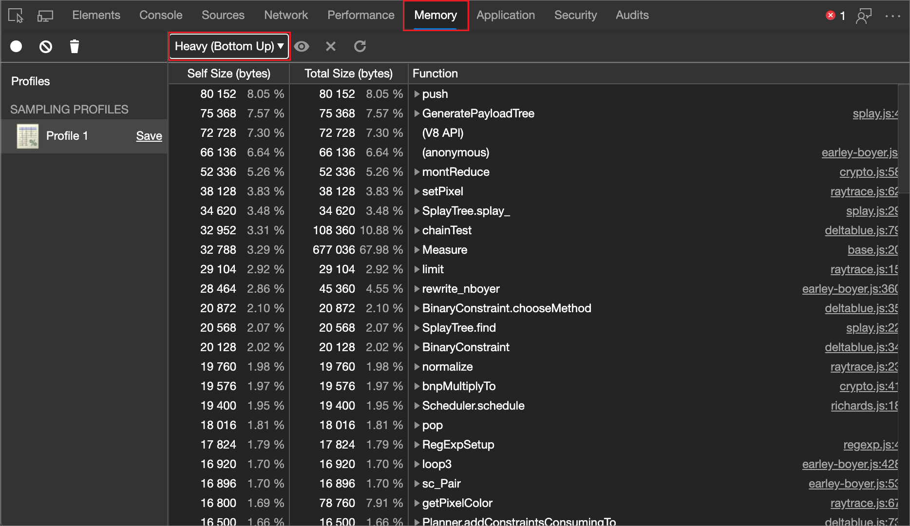

Record exactly which functions were called and how much memory each requires with Allocation Sampling in the **Memory** tool.

Visualize your profiles as a flame chart.

<!-- ====================================================================== -->
## Use the "Allocation sampling" profiling type to view memory allocation by JavaScript function

If you notice jank (interruptions of rendering) in your JavaScript, collect a memory allocation sampling profile, by using the **Allocation sampling** profiling type.  A sampling profile shows which functions allocated the most memory.

To use the **Allocation sampling** profiling type to view memory allocation by JavaScript function:

1. Open a webpage, such as the [Detached Elements demo webpage](https://microsoftedge.github.io/Demos/detached-elements/), in a new window or tab.

1. Right-click the webpage, and then select **Inspect**.

   Or, press **Ctrl+Shift+I** (Windows, Linux) or **Command+Option+I** (macOS).  DevTools opens.

1. In DevTools, in the **Activity Bar**, select the **Memory** () tool:

   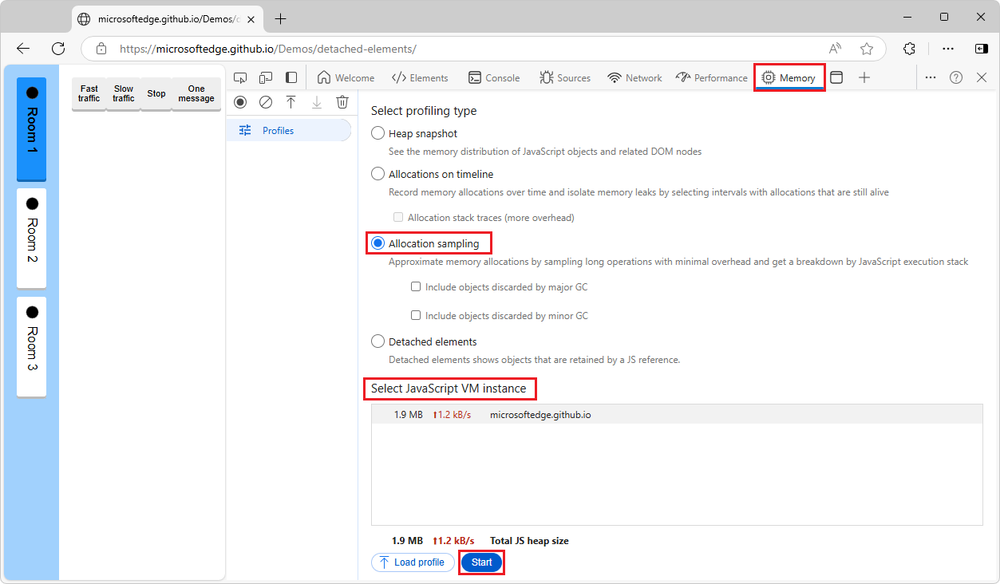

   If the **Memory** tool isn't visible, click the **More tools** () button, and then select **Memory**.

1. Select the **Allocation sampling** option button.

   If the **Allocation sampling** option button isn't shown, because a profile is already displayed, in the upper left, click **Profiles** ().

1. In the **Select JavaScript VM instance** section, if there is a worker on the page, you can select that as the profiling target.

1. At the bottom of the **Memory** tool, click the **Start** button.

1. Interact with the webpage.  For example, click the **Fast traffic** button and then the **Stop** button in the demo webpage.

   Depending on what you are trying to analyze, you can either refresh the page, interact with the page, or just let the page run.

1. In the upper left of the **Memory** tool, click the **Stop heap profiling** () button.

   Or, at the bottom of the **Memory** tool, click the **Stop** button.  A new **Profile** is added in the **Sampling profiles** section in the **Profiles** sidebar:

   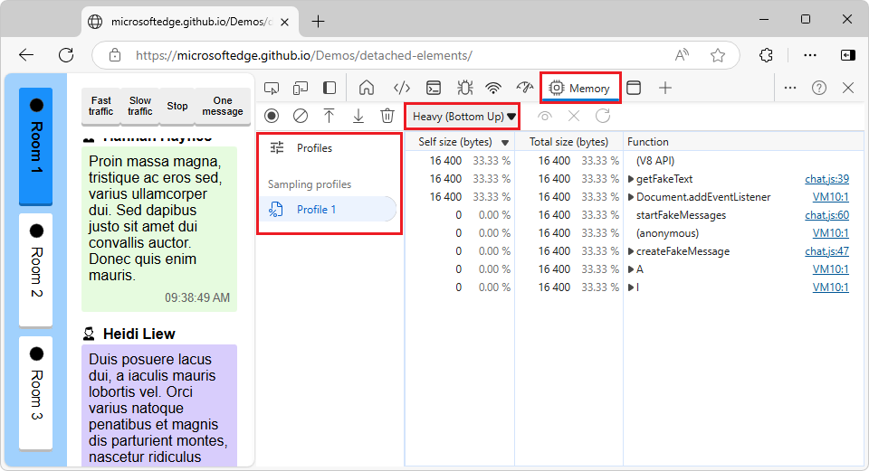

   The sampling profile shows a breakdown of memory allocation by function.  The default view is **Heavy (Bottom Up)**.  You can switch to the **Chart** or **Tree (Top Down)** view, per the section below.

You can also use the [Console Utilities API](../console/utilities.md) to record and group profiles from the command line.

<!-- ====================================================================== -->
## Change the view of a sampling profile

To change the sort order in a memory allocation sampling profile, use the **Profile view mode** dropdown list, which initially says **Heavy (Bottom Up)**:

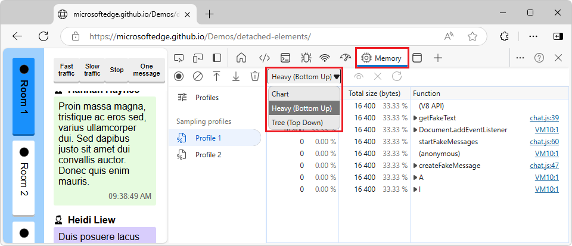

Menuitems:
* **Chart** - Chronological chart of the recording.
* **Heavy (Bottom Up)** - Lists the app's called functions in order of memory allocation, and shows the call path for each function.  The default view.
* **Tree (Top Down)** - Shows the calling structure, starting at the top of the call stack.

<!-- ---------- -->
###### Chart

The **Chart** view mode displays a chronological chart of the recording:

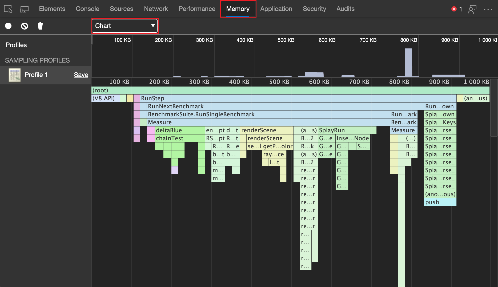

<!-- ---------- -->
###### Heavy (Bottom Up)

The **Heavy (Bottom Up)** view mode lists functions by impact on performance and enables you to examine the calling paths to the functions.  This is the default view:

<!-- ---------- -->
###### Tree (Top Down)

The **Tree (Top Down)** view mode shows an overall picture of the calling structure, starting at the top of the call stack:

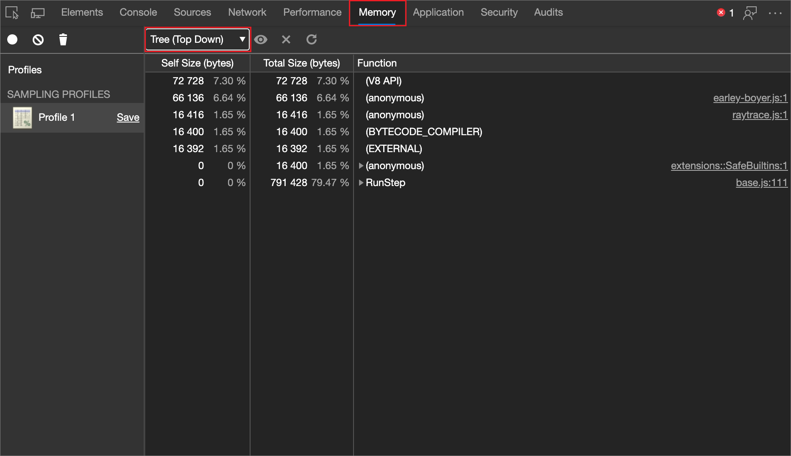

<!-- ------------------------------ -->
#### Exclude functions

When **Heavy (Bottom Up)** or **Tree (Top Down)** is selected (not **Chart**), there are several buttons, that are available (not dimmed) when you select a row:
* **Focus selected function** ()
* **Exclude selected function** ()
* **Restore all functions** ()

To exclude a function from a memory allocation sampling profile, select the sampling profile and then click the **Exclude selected function** () button.  The requesting function (parent) of the excluded function (child) is charged with the allocated memory assigned to the excluded function (child).

Click the **Restore all functions** () button to restore all excluded functions back into the recording.

<!-- ====================================================================== -->
## View a memory allocation sampling profile as a Chart

The **Chart** view provides a visual representation of the Sampling Profile over time.

After you record a memory allocation sampling profile, view the recording as a flame chart.  Select **Chart** in the the **Profile view mode** dropdown list (which initially says **Heavy (Bottom Up)**):

The flame chart is split into two parts:

| index | Part | Description |
| --- |:--- |:--- |
| 1 | Overview | A birds-eye view of the entire recording.  The height of the bars correspond to the depth of the call stack.  So, the higher the bar, the deeper the call stack.  |
| 2 | Call Stacks | This is an in-depth view of the functions that were called during the recording.  The horizontal axis is time and vertical axis is the call stack.  The stacks are organized top-down.  So, the function on top called the one below it, and so on.  |

Functions are colored randomly.  There is no correlation to the colors used in the other panels.  However, functions are always colored the same across invocations, so that you can observe patterns in each runtime.

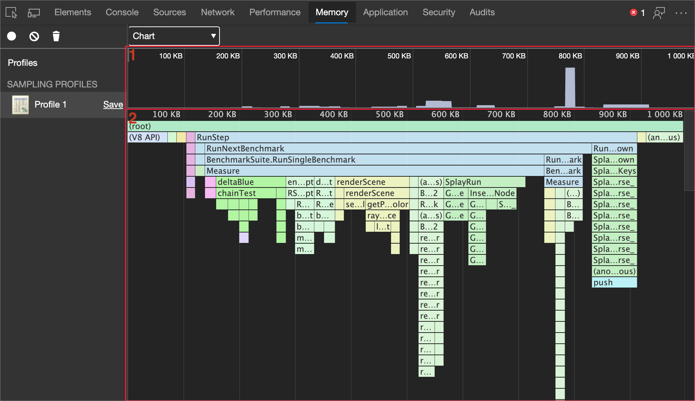

A tall call stack isn't necessarily significant; it might just mean that a lot of functions were called.  But a wide bar means that a function took a long time to complete, so these are candidates for optimization.

<!-- ------------------------------ -->
#### Zoom in on specific parts of recording

To zoom in on particular parts of the call stack, click and drag left and right across the overview.  After you zoom, the call stack automatically displays the portion of the recording that you selected.

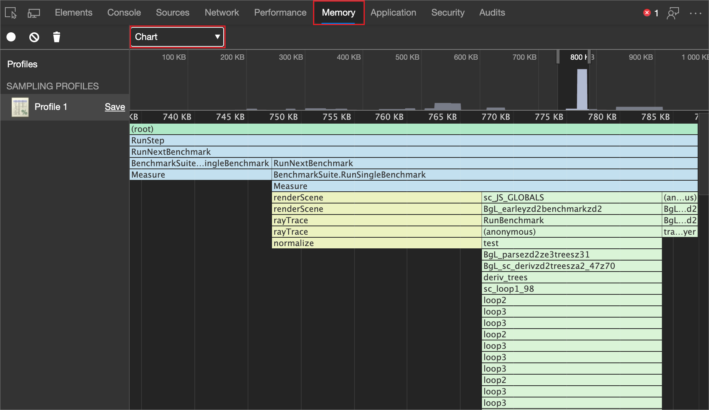

<!-- ------------------------------ -->
#### View function details

Click a function, to view it in the **Sources** tool.

Hover on a function to display the name and timing data:

| Detail | Description |
|:--- |:--- |
| **Name** | The name of the function.  |
| **Self size** | The size of the current invocation of the function, including only the statements in the function.  |
| **Total size** | The size of the current invocation of this function and any functions that it called.  |
| **URL** | The location of the function definition in the form of `base.js:261` where `base.js` is the name of the file where the function is defined and `261` is the line number of the definition.  |
<!--*  **Aggregated self time**.  Aggregate time for all invocations of the function across the recording, not including functions called by this function.  -->
<!--*  **Aggregated total time**.  Aggregate total time for all invocations of the function, including functions called by this function.  -->
<!--*  **Not optimized**.  If the profiler has detected a potential optimization for the function it lists it here.  -->

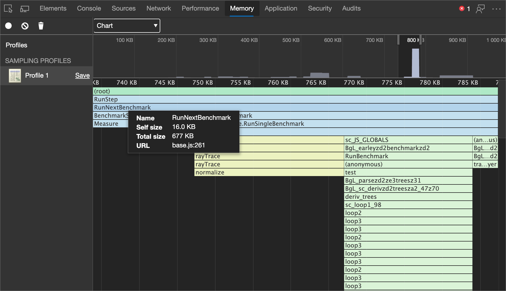

<!-- ====================================================================== -->
## Investigate memory allocation, with reduced garbage ("Include objects" checkboxes)

By default, the **Allocation sampling** profiling type only reports allocations that are still alive at the end of the recording session.  Objects that are created, removed, and then garbage collected (GC'd) aren't displayed in the **Memory** tool when profiling using the **Allocation sampling** or **Allocations on timeline** profiling types.

You can trust the browser to clean up garbage from your code.  However, it is important to consider that GC itself is an expensive operation and multiple GCs can slow down your user's experience of your website or app.  When recording in the **Performance** tool with the **Memory** checkbox turned on, you can see the GC operation happen at the steep cliffs (sudden decreases) in the heap chart:

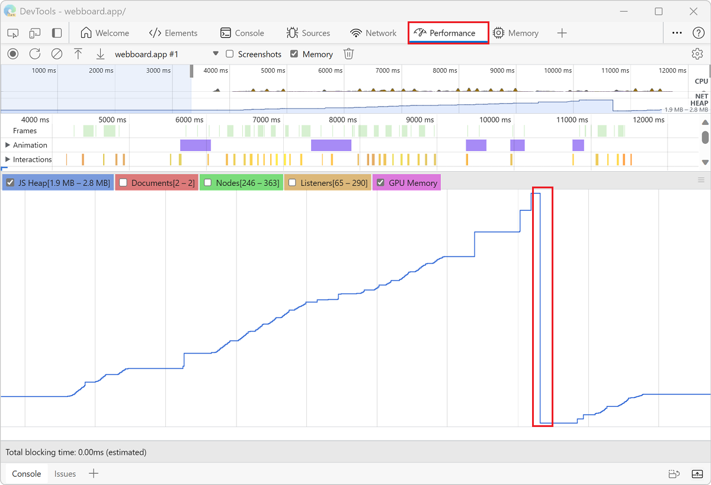

By reducing the amount of garbage your code is creating, you can reduce the cost of each individual GC and the number of GC operations.

<!-- ------------------------------ -->
#### Track objects that are discarded by GC

To track objects that are discarded by garbage collection:

1. In the **Memory** tool, select the **Allocation sampling** option button.

1. Click the **Include objects discarded by major GC** and **Include objects discarded by minor GC** settings.

   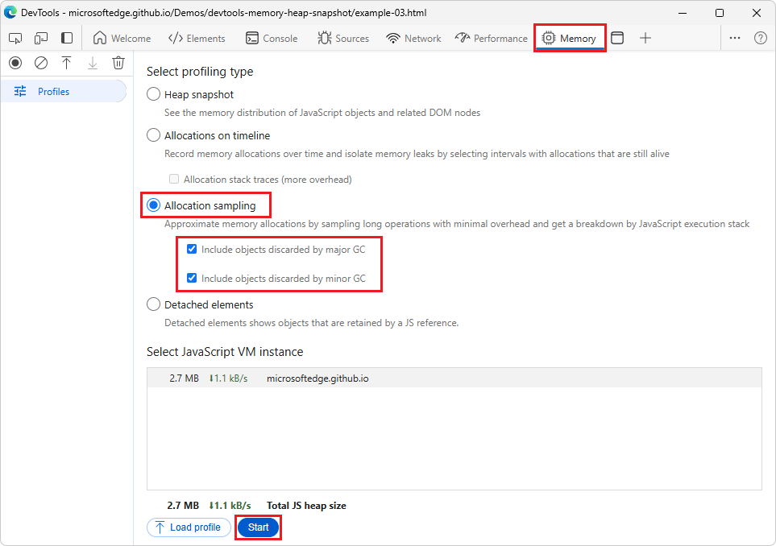

1. Click the **Start** button.

1. On the webpage, perform actions that you want to investigate.

1. Click the **Stop** button when you have finished all of your actions.

DevTools now tracks all of the objects that were GC'd during the recording.  Use these settings to understand how much garbage your website or app is generating.  The data reported by **Allocation sampling** will help you identify the functions that are generating the most garbage.  

If you are investigating objects that were only GC'd during specific major or minor GC operations, configure the settings appropriately to track the operation you care about. To learn more about the differences between major and minor GC, see [Trash talk: the Orinoco garbage collector | V8 JavaScript engine developer blog](https://v8.dev/blog/trash-talk).

<!-- ====================================================================== -->
> [!NOTE]
> Portions of this page are modifications based on work created and [shared by Google](https://developers.google.com/terms/site-policies) and used according to terms described in the [Creative Commons Attribution 4.0 International License](https://creativecommons.org/licenses/by/4.0).
> The original page is found [here](https://developer.chrome.com/docs/devtools/performance)<!-- orig page not found, got redir'd as shown --> and is authored by Kayce Basques and Meggin Kearney.

This work is licensed under a [Creative Commons Attribution 4.0 International License](https://creativecommons.org/licenses/by/4.0).
