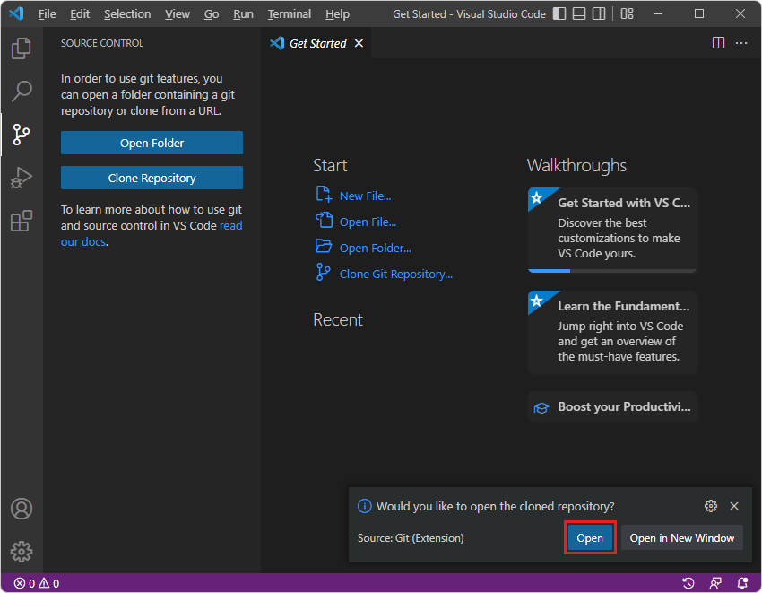
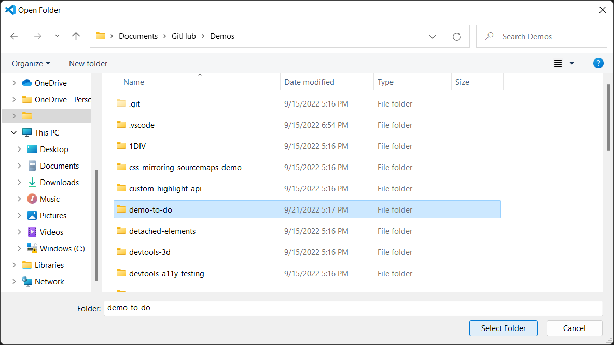
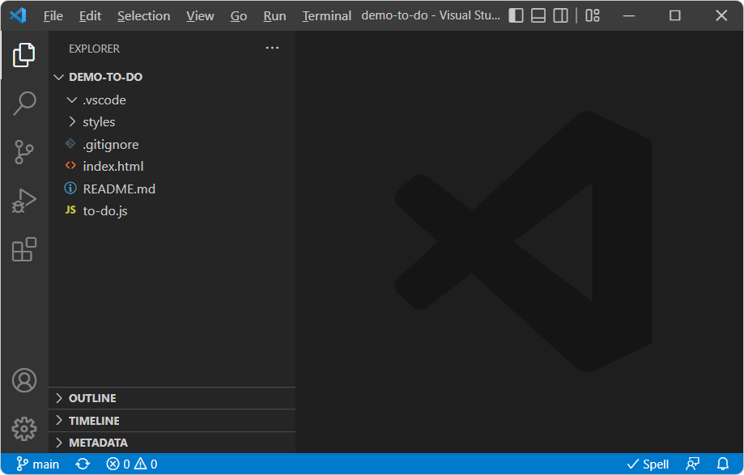

# Sample code for DevTools

Use the [Demos](https://github.com/MicrosoftEdge/Demos#readme) repo to learn how to use Microsoft Edge to develop webpages and web apps.  There are various ways to view, download, and modify these demo webpages, including:
*  DevTools in Microsoft Edge.
*  Visual Studio Code, with optional DevTools.
*  Visual Studio, with optional DevTools.

To view the source code for a rendered demo webpage in DevTools in Microsoft Edge:

1. In a Readme page, click the **Demo** link.  The live page opens in Microsoft Edge.

1. Right-click the demo webpage, and then select **Inspect** to open DevTools.


<!-- ====================================================================== -->
## List of DevTools samples
<!-- 
sync:
https://learn.microsoft.com/microsoft-edge/devtools/sample-code/sample-code#list-of-devtools-samples
https://github.com/MicrosoftEdge/Demos#readme
sync'd July 30, 2025
-->

The following demos demonstrate DevTools features.

| Demo name | Description and docs | Source code & Readme | Live demo page |
|---|---|---|---|
| CSS mirroring sourcemaps | Used for [Update .css files from within the Styles tab (CSS mirror editing)](../../visual-studio-code/microsoft-edge-devtools-extension/css-mirror-editing-styles-tab.md) for the DevTools extension for Visual Studio Code. | [/css-mirroring-sourcemaps-demo/](https://github.com/MicrosoftEdge/Demos/tree/main/css-mirroring-sourcemaps-demo) | n/a |
| To Do app | Simple To Do app with vanilla JavaScript.  Used for various articles in the [Microsoft Edge DevTools documentation](../landing/index.yml). | [/demo-to-do/](https://github.com/MicrosoftEdge/Demos/tree/main/demo-to-do) | [My tasks](https://microsoftedge.github.io/Demos/demo-to-do/) demo |
| Detached DOM elements | Chat-like demo.  Used for [Debug DOM memory leaks ("Detached elements" profiling type)](../memory-problems/dom-leaks-memory-tool-detached-elements.md). | [/detached-elements/](https://github.com/MicrosoftEdge/Demos/tree/main/detached-elements) | [Detached DOM elements](https://microsoftedge.github.io/Demos/detached-elements/) demo |
| 3D View tool | Used for [Navigate webpage layers, z-index, and DOM using the 3D View tool](../3d-view/index.md). | [/devtools-3d/](https://github.com/MicrosoftEdge/Demos/tree/main/devtools-3d) | [3D View tool demo](https://microsoftedge.github.io/Demos/devtools-3d/) |
| Accessibility testing | Used for [Accessibility-testing features](../accessibility/reference.md). | [/devtools-a11y-testing/](https://github.com/MicrosoftEdge/Demos/tree/main/devtools-a11y-testing) | [Animal Shelter](https://microsoftedge.github.io/Demos/devtools-a11y-testing/) demo |
| Warning when animating a CSS property that requires layout | Illustrates the **Issues** and **Elements** tools warning when CSS properties that require layout are animated.  Used for [Edit animation and transition timings with the Easing Editor](../css/reference.md#edit-animation-and-transition-timings-with-the-easing-editor) in _CSS features reference_. | [/devtools-animated-property-issue/](https://github.com/MicrosoftEdge/Demos/tree/main/devtools-animated-property-issue) | [Animated CSS property demo](https://microsoftedge.github.io/Demos/devtools-animated-property-issue/) |
| Console panel demo pages | Used for [Console overview](../console/index.md), [Log messages in the Console tool](../console/console-log.md), and [Fix JavaScript errors reported in the Console](../console/console-debug-javascript.md). | [/devtools-console/](https://github.com/MicrosoftEdge/Demos/tree/main/devtools-console) | [DevTools Console panel demo pages](https://microsoftedge.github.io/Demos/devtools-console/) |
| Interact with the DOM using the Console | Used for [Interact with the DOM using the Console](../console/console-dom-interaction.md). | [/devtools-console-dom-interactions/](https://github.com/MicrosoftEdge/Demos/tree/main/devtools-console-dom-interactions) | [Interact with the DOM using the Console](https://microsoftedge.github.io/Demos/devtools-console-dom-interactions/) demo |
| Contrast bug fix | Used for [Improving contrast in Microsoft Edge DevTools: A bugfix case study](https://blogs.windows.com/msedgedev/2021/06/15/improving-contrast-in-microsoft-edge-devtools-a-bugfix-case-study/). | [/devtools-contrast-bugfix/](https://github.com/MicrosoftEdge/Demos/tree/main/devtools-contrast-bugfix) | [Testing all badges in DevTools for contrast issues](https://microsoftedge.github.io/Demos/devtools-contrast-bugfix/) demo |
| Crash Analyzer tool demo | Used for [Enter a stack trace in the Crash analyzer tool](../crash-analyzer/index.md#enter-a-stack-trace-in-the-crash-analyzer-tool) in _Crash analyzer tool_. | [/devtools-crash-analyzer/](https://github.com/MicrosoftEdge/Demos/tree/main/devtools-crash-analyzer) | [Readme](https://github.com/MicrosoftEdge/Demos/blob/main/devtools-crash-analyzer/README.md) |
| CSS Examples | Used for [Get started viewing and changing CSS](../css/index.md). | [/devtools-css-get-started/](https://github.com/MicrosoftEdge/Demos/tree/main/devtools-css-get-started) | [CSS Examples](https://microsoftedge.github.io/Demos/devtools-css-get-started/) demo |
| DOM Examples | Used for [Get started viewing and changing the DOM](../dom/index.md). | [/devtools-dom-get-started/](https://github.com/MicrosoftEdge/Demos/tree/main/devtools-dom-get-started) | [DOM Examples](https://microsoftedge.github.io/Demos/devtools-dom-get-started/) demo |
| Explain Console errors and warnings in Copilot in Edge | Generates errors in the Console that can then be explained by using Copilot in Edge. | [/devtools-explain-error/](https://github.com/MicrosoftEdge/Demos/tree/main/devtools-explain-error) | [Explain Console errors and warnings in Copilot in Edge](https://microsoftedge.github.io/Demos/devtools-explain-error/) demo |
| Inspect tool | Used for [Analyze pages using the Inspect tool](../css/inspect.md). | [/devtools-inspect/](https://github.com/MicrosoftEdge/Demos/tree/main/devtools-inspect) | [Inspect tool demo](https://microsoftedge.github.io/Demos/devtools-inspect/) |
| Inspect CSS Grid | Used for [Inspect CSS Grid](../css/grid.md). | [/devtools-grid/](https://github.com/MicrosoftEdge/Demos/tree/main/devtools-grid) | [Inspect CSS Grid](https://microsoftedge.github.io/Demos/devtools-grid/) demo |
| Debugging JavaScript that adds two numbers | Used for [Get started debugging JavaScript](../javascript/index.md). | [/devtools-js-get-started/](https://github.com/MicrosoftEdge/Demos/tree/main/devtools-js-get-started) | [Debugging JavaScript with Microsoft Edge DevTools](https://microsoftedge.github.io/Demos/devtools-js-get-started/) demo |
| Memory heap snapshot | Used for [Record heap snapshots using the Memory tool ("Heap snapshot" profiling type)](../memory-problems/heap-snapshots.md). | [/devtools-memory-heap-snapshot/](https://github.com/MicrosoftEdge/Demos/tree/main/devtools-memory-heap-snapshot) | n/a |
| **Performance** tool Activity Tabs | Used for [View activities in a table](../performance/reference.md#view-activities-in-a-table) in _Performance features reference_, about the **Performance** tool's **Bottom-up**, **Call tree**, and **Event log** tabs. | [/devtools-performance-activitytabs/](https://github.com/MicrosoftEdge/Demos/tree/main/devtools-performance-activitytabs) | [Activity Tabs demo](https://microsoftedge.github.io/Demos/devtools-performance-activitytabs/) |
| Sluggish Animation | Used for [Analyze runtime performance (tutorial)](../performance/index.md). | [/devtools-performance-get-started/](https://github.com/MicrosoftEdge/Demos/tree/main/devtools-performance-get-started) | [Sluggish Animation](https://microsoftedge.github.io/Demos/devtools-performance-get-started/) demo |
| postMessage Trace Events | Tests `postMessage` trace events in the **Performance** tool.  Used for [View messages between windows, iframes, and dedicated workers](../performance/reference.md#view-messages-between-windows-iframes-and-dedicated-workers) in _Performance features reference_. | [/devtools-postmessage-perf-timeline/](https://github.com/MicrosoftEdge/Demos/tree/main/devtools-postmessage-perf-timeline) | [postMessage Trace Events demo](https://microsoftedge.github.io/Demos/devtools-postmessage-perf-timeline/) |
| CSS :target pseudo-class | Used for [Support forcing the :target CSS state](../whats-new/2021/01/devtools.md#support-forcing-the-target-css-state) in _What's New in DevTools (Microsoft Edge 89)_. | [/devtools-target-pseudo/](https://github.com/MicrosoftEdge/Demos/tree/main/devtools-target-pseudo) | [CSS :target pseudo-class demo](https://microsoftedge.github.io/Demos/devtools-target-pseudo/) |
| Exploring the universe | Used for [Monitor Core Web Vitals metrics](../performance/overview.md#monitor-core-web-vitals-metrics) in _Performance tool: Analyze your website's performance_. | [/exploring-the-universe/](https://github.com/MicrosoftEdge/Demos/tree/main/exploring-the-universe) | [Exploring the universe](https://microsoftedge.github.io/Demos/exploring-the-universe/) demo |
| Heap Snapshot Visualizer | Used for [Heap Snapshot visualizer extension for DevTools](../whats-new/2023/01/devtools-109.md#heap-snapshot-visualizer-extension-for-devtools) in _What's New in DevTools (Microsoft Edge 109)_. | [/heap-snapshot-visualizer/](https://github.com/MicrosoftEdge/Demos/tree/main/heap-snapshot-visualizer) | n/a |
| JSON dummy data | Simple JSON files.  Used for [View a JSON file or server response with formatting](../../web-platform/json-viewer.md). | [/json-dummy-data/](https://github.com/MicrosoftEdge/Demos/tree/main/json-dummy-data) | [JSON dummy data](https://microsoftedge.github.io/Demos/json-dummy-data/) (Readme) |
| Inspect Network Activity | Used for [Inspect network activity](../network/index.md). | [/network-tutorial/](https://github.com/MicrosoftEdge/Demos/tree/main/network-tutorial) | [Inspect Network Activity demo](https://microsoftedge.github.io/Demos/network-tutorial/) |
| Network tool reference | Used for [Network features reference](../network/reference.md). | [/devtools-network-reference/](https://github.com/MicrosoftEdge/Demos/tree/main/devtools-network-reference) | [Network tool reference demo](https://microsoftedge.github.io/Demos/devtools-network-reference/) |
| Photo gallery | Used for [View your custom data in the performance profile](../performance/extension.md#view-your-custom-data-in-the-performance-profile) in _Customize performance profile with extensibility APIs_, and [The truth about CSS selector performance](https://blogs.windows.com/msedgedev/2023/01/17/the-truth-about-css-selector-performance/). | [/photo-gallery/](https://github.com/MicrosoftEdge/Demos/tree/main/photo-gallery) | [Photo Gallery](https://microsoftedge.github.io/Demos/photo-gallery/) demo |
| Slow Calendar | Simple calendar demo app to test DevTools features such as the **Performance** tool and source map support.  Used for [Added source map support in the Coverage tool](../whats-new/2024/01/devtools-121.md#added-source-map-support-in-the-coverage-tool) in _What's New in DevTools (Microsoft Edge 121)_. | [/slow-calendar/](https://github.com/MicrosoftEdge/Demos/tree/main/slow-calendar) | [Slow Calendar](https://microsoftedge.github.io/Demos/slow-calendar/public/) demo |
| Margie's Travel | Demonstrates how to optimize a webpage's resources to make it load, appear, and be interactive faster.  Used for [Optimize website speed using Lighthouse](../speed/get-started.md). | [/travel-site/](https://github.com/MicrosoftEdge/Demos/tree/main/travel-site) | [Margie's Travel](https://microsoftedge.github.io/Demos/travel-site/) demo |
| Workspaces | Used for [Edit and save files in a workspace (Sources tool Workspace tab)](../workspaces/index.md). | [/workspaces/](https://github.com/MicrosoftEdge/Demos/tree/main/workspaces) | [DevTools Workspaces demo](https://microsoftedge.github.io/Demos/workspaces/) |
| Idle detection | Used for [Emulate idle detector state](../sensors/index.md#emulate-idle-detector-state) in _Emulate device sensors_. | [/idle-detection/](https://github.com/MicrosoftEdge/Demos/tree/main/idle-detection) | [Idle detection demo](https://microsoftedge.github.io/Demos/idle-detection/) |

A few of these samples are shown below.


<!-- ====================================================================== -->
## To Do demo

This simple To Do list webpage is used to demonstrate various DevTools features.  It has an `.html` file, a `.js` file, and `.css` files:


* Rendered page: [TODO app](https://microsoftedge.github.io/Demos/demo-to-do/)

* Source code: [demo-to-do](https://github.com/MicrosoftEdge/Demos/tree/main/demo-to-do)


<!-- ====================================================================== -->
## Demo webpage with accessibility issues

This Animal Shelter demo webpage is useful for exploring various DevTools features, including accessibility testing features.

1. Open the [Demo webpage with accessibility issues](https://MicrosoftEdge.github.io/Demos/devtools-a11y-testing/) in a new window or tab.

1. Right-click anywhere in the rendered webpage and then select **Inspect**.  DevTools opens next to the demo webpage.

   <!-- Or, press **F12**, **Ctrl+Shift+I** (on Windows/Linux), or **Command+Option+I** (on macOS). -->


<!-- ------------------------------ -->
#### Articles

These articles walk you through using this demo webpage:

* [Use the Inspect tool to detect accessibility issues by hovering over the webpage](../accessibility/test-inspect-tool.md) - One of several short articles that are derived from sections of the above article.

* [Accessibility-testing features](../accessibility/reference.md) - A list of accessibility testing features of DevTools, with links to several articles that use the "Demo webpage with accessibility issues".


<!-- ------------------------------ -->
#### Source code repo

This is the source code repo and its directory which stores the files for this demo webpage:

* [MicrosoftEdge/Demos > devtools-a11y-testing](https://github.com/MicrosoftEdge/Demos/tree/main/devtools-a11y-testing) - Contains files including:

   * `index.html` - The demo webpage, including page sections and input forms that send data to the `buttons.js` JavaScript file.  To view the rendered webpage, use the demo webpage link above.

   * `buttons.js` - Contains the JavaScript code that's used by the demo webpage.

   * `styles.css`, `light-theme.css`, and `dark-theme.css` - CSS files that control the presentation of the demo webpage.

   * Image files that are used in the demo webpage.


<!-- ====================================================================== -->
## Demo webpage: Debugging JavaScript with DevTools

This demo webpage is useful for exploring the **Sources** tool, especially the JavaScript debugger.

1. Open the demo webpage [Get started Debugging JavaScript with DevTools](https://MicrosoftEdge.github.io/Demos/devtools-js-get-started/) in a new window or tab.

1. Right-click anywhere in the rendered webpage and then select **Inspect**.  DevTools opens next to the demo webpage.

   <!-- Or, press **F12**, **Ctrl+Shift+I** (on Windows/Linux), or **Command+Option+I** (on macOS). -->


<!-- ------------------------------ -->
#### Articles

These articles or article sections walk you through using this demo webpage:

* [The basic approach to using a debugger](../sources/index.md#the-basic-approach-to-using-a-debugger) in _Sources tool overview_.  This article section briefly walks you through the steps to use the JavaScript debugger in the **Sources** tool, to find the bug in the demo webpage.  To fix the bug, you convert the input strings to numbers before adding them.

* [Get started debugging JavaScript](../javascript/index.md) - A more in-depth walkthrough of using the demo webpage along with the debugger, demonstrating various features of the debugger, and setting different kinds of breakpoints.


<!-- ------------------------------ -->
#### Source code repo

This is the source code repo and its directory which stores the files for this demo webpage:

* [MicrosoftEdge/Demos > devtools-js-get-started](https://github.com/MicrosoftEdge/Demos/tree/main/devtools-js-get-started) - Contains the files:

   *  `README.md` - Contains links to the rendered demo webpage and the in-depth tutorial article about using the demo webpage.

   *  `index.html` - The webpage with an input form that sends data to the JavaScript file, and that displays the result of the JavaScript.

   *  `get-started.js` - The JavaScript file that's used by the form in the demo webpage.


<!-- ====================================================================== -->
## Clone the Edge Demos repo to your drive

The **Microsoft Edge / Demos** repo is useful for following the various DevTools documentation.  You can clone the repo, start a localhost web server within a folder of the cloned repo, and then edit the demo files directly within DevTools, or within an editor such as VS Code.

Cloning the repo is recommended over downloading the repo, so that you can pull updates of the repo and fully participate in the repo.

To clone the **MicrosoftEdge / Demos** repo to your local drive:

1. In a command prompt, enter `git` to check whether git is installed.

1. If not done already, [Download git](https://git-scm.com/downloads) and install it.

1. Go to [MicrosoftEdge / Demos](https://github.com/MicrosoftEdge/Demos) in a new window or tab.

1. Click the **Code** drop-down button, and then click the **Copy url to clipboard** button.

   The URL is copied to the clipboard: `https://github.com/MicrosoftEdge/Demos.git`

   Or, if you have GitHub Desktop installed, click **Open with GitHub Desktop** to clone the repo, and skip the command prompt step below.

1. Open a command prompt, such as git bash.

1. Clone the repo to your local drive, entering the URL string that you copied from the GitHub repo.  If you use a command prompt:

   ```console
   # example location where the repo directory will be added:
   cd ~/GitHub
   cd c:/users/localAccount/GitHub/  # alt format
   git clone https://github.com/MicrosoftEdge/Demos.git
   ```

For details about cloning a repo, see:
* [Cloning a repository](https://docs.github.com/en/repositories/creating-and-managing-repositories/cloning-a-repository) - GitHub docs.

Continue with the next section.


<!-- ------------------------------ -->
#### Clone the Edge Demos repo to your drive by using VS Code

To clone the **MicrosoftEdge / Demos** repo to your local drive:

1. Go to [MicrosoftEdge / Demos](https://github.com/MicrosoftEdge/Demos) in a new window or tab.

1. Click the **Code** dropdown button, and then click **Open with Visual Studio** if it appears.  A list of **Handler Selector** items is offered, one per Visual Studio instance installed.  This option appears only if you're logged in.

   

1. In Visual Studio Code, in the **Activity Bar**, click the **Source Control** () button, and then click the **Clone Repository** button.

1. In the **Provide repository URL** text box, paste the copied URL: **https://github.com/MicrosoftEdge/Demos.git** and then press **Enter**.  A folder selection dialog opens.

   

1. Navigate to your desired path, such as `C:\Users\localAccount\Documents\GitHub` or `Users/username/GitHub`, and then click the **Select Repository Location** button.

1. The message **Cloning git repository** appears, then you're prompted to open the cloned repository.  Click the **Open** button:

   

1. If prompted **Do you trust...**, click the **Yes** button.  Or, click the **No** button and continue with most parts of this walkthrough.

   The **Explorer** tree lists many demos, including **demo-to-do**.

See also:
* [Cloning a repository](https://docs.github.com/en/repositories/creating-and-managing-repositories/cloning-a-repository) - GitHub docs.
* [Clone the WebView2Samples repo](../../webview2/how-to/machine-setup.md#clone-the-webview2samples-repo) in _Set up your Dev environment for WebView2_.


<!-- ------------------------------ -->
#### Tools that support cloning a repo and git commit/pull/push operations

Cloning a repo enables updating your local copy when the repo is updated.  Many tools support cloning and syncing with a GitHub repo, such as:

* git commands at a command prompt such as the "git bash" shell.  This is the main way that's documented here.

* GitHub Desktop.  Integrates well with GitHub repos and pull requests, and with VS Code.

* Visual Studio Code.  In the Activity Bar on the left, click **Source Control**.

* Visual Studio > **Git Changes** tab next to the **Solution Explorer** tab in the lower right.

* The "dot key" version of VS Code within the Edge browser.  At Github.com, when viewing a branch or a pull request (PR), press the period (**.**) key.  In the Activity Bar on the left, click:
  * **Source Control**
  * **GitHub Pull Requests**
  * **GitHub Pull Request**


<!-- ====================================================================== -->
## Download the Demos repo

Cloning the repo is recommended over downloading the repo, so that you can pull updates of the repo and fully participate in the repo.

If you want to just download the Demos repo instead of cloning it:

1. In a new window or tab, go to the [MicrosoftEdge / Demos](https://github.com/MicrosoftEdge/Demos#readme) repo.

1. Click the **Code** dropdown button, and then click **Download ZIP**.

   The `.zip` file is placed in your download directory.  Unzip these webpage source files into a suitable location.

To download a single directory of the Demos repo:

1. Go to [https://download-directory.github.io/](https://download-directory.github.io/) and then paste the URL [https://github.com/MicrosoftEdge/Demos/tree/main/demo-to-do](https://github.com/MicrosoftEdge/Demos/tree/main/demo-to-do).  

   The `.zip` file is placed in your download directory.  Unzip these webpage source files into a suitable location.

See also:
* [Download the WebView2Samples repo](../../webview2/how-to/machine-setup.md#download-the-webview2samples-repo) in _Set up your Dev environment for WebView2_.


<!-- ====================================================================== -->
## Open a demo folder from the Workspace tab in the Sources tool

To use this section, first do [Clone the Edge Demos repo to your drive](#clone-the-edge-demos-repo-to-your-drive), above.

See also:
* [Workspace tutorial (Sources tool Workspace tab)](../workspaces/workspace-tutorial.md)
* [Approaches compared](../../visual-studio-code/microsoft-edge-devtools-extension.md#approaches-compared) in _Microsoft Edge DevTools extension for Visual Studio Code_.  Summarizes and compares several options for editing webpage files.


After cloning (or downloading) the Edge Demos repo:

1. In Microsoft Edge, open a new tab.

1. Right-click the webpage, and then select **Inspect**.  Or, press **Ctrl+Shift+I** (Windows, Linux) or **Command+Option+I** (macOS).  DevTools opens.

1. In DevTools, on the main toolbar, select the **Sources** tab.  If that tab isn't visible, click the **More tabs** () button.

1. In the **Sources** tab, on the left, select the **Workspace** tab, which is grouped with the **Page** tab.  If the **Workspace** tab isn't displayed, click the **More tabs** () button.

1. Click **+ Add folder to workspace**.  A folder selection dialog opens.

1. Select a specific folder, such as **demo-to-do**, or select the **Demos** root folder:

   

1. Above DevTools, your're prompted "DevTools requests full access to (directory)".  Click the **Allow** button:

   


<!-- ====================================================================== -->
## Start the localhost server

If you start the localhost server from a specific demo folder, such as `\Demos\demo-to-do`, and then go to `localhost:8080` (or simply open the local file such as `C:\Users\localAccount\GitHub\Demos\demo-to-do\index.html` in Microsoft Edge), the specific demo immediately is displayed in the browser.  You can then add just the specific demo directory, such as `C:\Users\localAccount\GitHub\Demos\demo-to-do\`, to the **Workspace** tab of the **Sources** tool.  You then have full functionality for using DevTools as an IDE, for that specific demo.

Starting the server from within a specific demo directory:

```bash
$ cd ~/GitHub/Demos/demo-to-do
$ npx http-server
```

Example directory to add to the **Workspace** tab of the **Sources** tool: `C:\Users\localAccount\GitHub\Demos\demo-to-do`

Result of going to `localhost:8080`:


<!-- ------------------------------ -->
#### Starting the localhost server from the Demos directory

If you start the localhost server from within the entire `\Demos\` folder and then go to `localhost:8080`, you can navigate to each demo from within the browser.  You can add the entire cloned `/Demos/` folder to the **Workspace** tab of the **Sources** tool.  You then have full functionality for using DevTools as an IDE.

Starting the server from within the entire `\Demos\` directory:

```bash
$ cd ~/GitHub/Demos
$ cd "C:\Users\localAccount\GitHub\Demos"  # alt syntax
$ npx http-server
```

Example directory to add to the **Workspace** tab of the **Sources** tool: `C:\Users\localAccount\GitHub\Demos`

Result of going to `localhost:8080`:


<!-- ====================================================================== -->
## Opening a local HTML file from File Explorer and editing it in DevTools

To edit files in the **Sources** tool, before doing the steps in this section, you might need to click the **Allow** button to grant read/write access by following the steps in [Open a demo folder from the Workspace tab in the Sources tool](#open-a-demo-folder-from-the-workspace-tab-in-the-sources-tool), above.

1. In File Explorer on Windows, or Finder on macOS, select an HTML file from the local copy of the **Demos** repo, such as `C:\Users\localAccount\Documents\GitHub\Demos\demo-to-do\index.html`.

   The `.html` file is opened and rendered in Microsoft Edge.

   The Address bar displays: **File | C:/Users/localAccount/GitHub/Demos/demo-to-do/index.html**

   Selecting the URL in the Address bar shows the URL format: `file:///C:/Users/localAccount/GitHub/Demos/demo-to-do/index.html`

1. Right-click the rendered webpage, and then select **Inspect**.

   DevTools opens.

1. Select the **Sources** tool, and then select the **Page** tab or the **Workspace** tab.

See also:
* [Edit and save files in a workspace (Sources tool Workspace tab)](../workspaces/index.md) - to open a local folder in the **Sources** tool of DevTools in the browser.


<!-- ------------------------------ -->
#### Opening a local HTML file from the browser's File Open dialog and editing it in DevTools

To open an `.html` file and edit it:

1. In Microsoft Edge, open a new tab, and then press **Ctrl+O** (Windows/Linux) or **Command+O** (macOS).  A file selection dialog opens.

1. Select an HTML file from the local copy of the **Demos** repo, such as `C:\Users\localAccount\Documents\GitHub\Demos\demo-to-do\index.html`.  The `.html` file is opened and rendered in Microsoft Edge.

1. Right-click the webpage, and then select **Inspect**.  Or, press **Ctrl+Shift+I** (Windows, Linux) or **Command+Option+I** (macOS).  DevTools opens.

1. In DevTools, on the main toolbar, select the **Sources** tab.  If that tab isn't visible, click the **More tabs** () button.

1. In DevTools, on the left, select the **Page** tab, and then select the HTML file, such as `index.html` or **(index)**.

1. Press **Esc** to open the **Quick View** panel at the bottom of DevTools.

1. In the **Quick View** toolbar, click the **More Tools** () button, and then select the **Changes** tool.

1. In the middle, editor pane of the **Sources** tool, edit the `.html` file.  For example, in `demo-to-do/index.html` folder, in the `<h1>` heading line, change **My tasks** to **My modified tasks**:

   ```html
   <h1>📋 My modified tasks</h1>
   ```

   If editing isn't enabled, click the **Allow** button to grant read/write access to the folder by doing the steps in [Open a demo folder from the Workspace tab in the Sources tool](#open-a-demo-folder-from-the-workspace-tab-in-the-sources-tool) above.

   The change is displayed in the **Changes** tool in the **Quick View** panel, and an asterisk is added to the file name in the **index.html** tab in the **Sources** tool:

   

1. Press **Ctrl+S** (Windows, Linux) or **Command+S** (macOS) to save the change.  The asterisk is removed from the **index.html** tab in the **Sources** tool.

1. Refresh the page.  The change is displayed in the rendered webpage; for example, the word **modified** is added to the title:

   


<!-- ====================================================================== -->
## Open a demo folder in Visual Studio Code

After cloning (or downloading) the Edge Demos repo:

1. In Visual Studio Code, in the **Activity Bar**, click the **Explorer** () button.  The **Explorer** pane opens.

1. In the **Explorer** pane, click the **Open Folder** button.  The **Open Folder** dialog opens.  Navigate to the `demo-to-do` folder in the Demo repo that you cloned, select the folder or go into it, and then click the **Select Folder** button:

   

   An example of a repo location where the **Demos** repo has been cloned is shown above.  The `demo-to-do` folder of the cloned **Demos** repo opens in the Explorer of Visual Studio Code:

   

Or, you can open the root folder of the Demos repo, to explore all of the demo folders in the **Explorer** pane.


See also:
* [Microsoft Edge DevTools extension for Visual Studio Code](../../visual-studio-code/microsoft-edge-devtools-extension.md) - to open a local folder in Visual Studio Code and use DevTools within Visual Studio Code.


<!-- ====================================================================== -->
## URL patterns for rendered demo webpages and source code

Most of the Readme files in the Demos repo have a link that opens the rendered `.html` file from the GitHub.io server.  Sometimes you have a URL for an HTML source file at GitHub.com, but instead you need to derive the **github.io** server URL to display the rendered file, rather than displaying the code listing of the `.html` source code in the GitHub directory.

To convert from the URL for the source code directory at GitHub.com to the URL for a rendered demo webpage at GitHub.io, the pattern is as follows.

Suppose the URL for the webpage's source code at GitHub.com is:
* `https://github.com/MicrosoftEdge/Demos/tree/main/demo-to-do/`

The key components of that GitHub.com URL are:
* `https://github.com/[org]/[repo]/tree/main/[path]`

In contrast, the desired GitHub.io URL pattern is:
* `https://[org].github.io/[repo]/[path]`

To fill in that GitHub.io URL pattern, in this example:
*  [org] is `MicrosoftEdge`.
*  [repo] is `Demos`.
*  [path] is `demo-to-do`.

Therefore, the resulting GitHub.io server URL for the rendered demo webpage is:
* `https://MicrosoftEdge.github.io/Demos/demo-to-do/`

These URLs aren't case-sensitive.

When you run a localhost server and start it within a cloned repo folder, such as `C:\Users\localAccount\GitHub\Demos\workspaces`, you typically see `localhost:8080` in the browser Address Bar.


<!-- ====================================================================== -->
## See also

Opening and editing files:
* [Edit and save files in a workspace (Sources tool Workspace tab)](../workspaces/index.md) - Use DevTools as an in-browser Integrated Development Environment (IDE).
* [Add a local folder to the workspace, to use DevTools to edit files and save changes to disk](../sources/index.md#add-a-local-folder-to-the-workspace-to-use-devtools-to-edit-files-and-save-changes-to-disk) in _Sources tool overview_.
* [Approaches compared](../../visual-studio-code/microsoft-edge-devtools-extension.md#approaches-compared) in _Microsoft Edge DevTools extension for Visual Studio Code_.  Summarizes and compares several options for editing webpage files.
* [Microsoft Edge IDE integration](../../visual-studio-code/ide-integration.md) - Webpage app development using Visual Studio Code or Visual Studio, including Microsoft Edge DevTools.

Downloading and cloning:
* [Step 5: Clone the Demos repo](../../visual-studio-code/microsoft-edge-devtools-extension/install.md#step-5-clone-the-demos-repo) in _Installing the DevTools extension for Visual Studio Code_.
* [Cloning a repository](https://docs.github.com/en/repositories/creating-and-managing-repositories/cloning-a-repository) - GitHub docs.

Running a local web server:
* [Step 6: Set up a localhost server](../../visual-studio-code/microsoft-edge-devtools-extension/install.md#step-6-set-up-a-localhost-server) in _Installing the DevTools extension for Visual Studio Code_.
