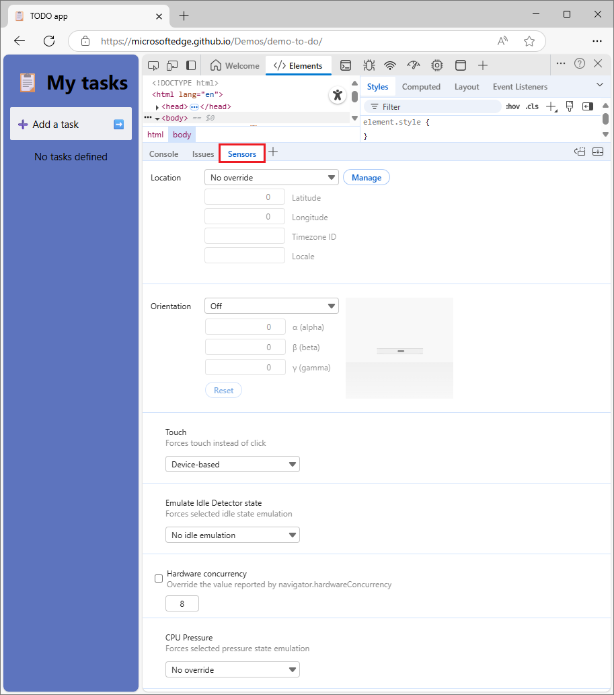
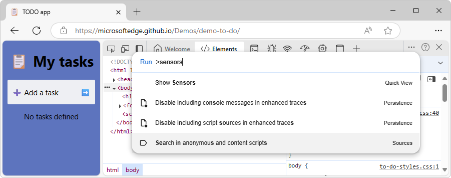
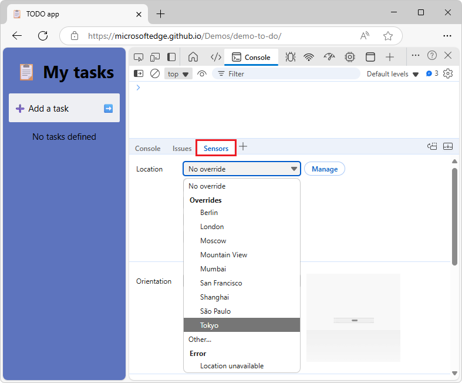
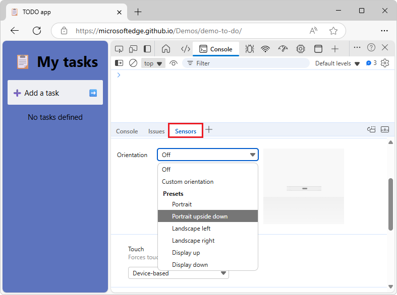
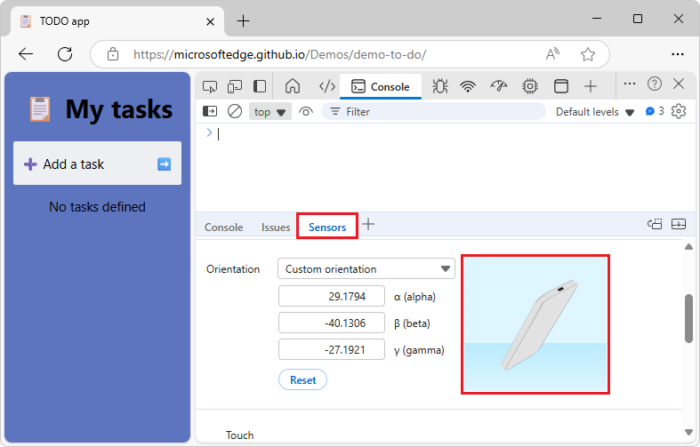
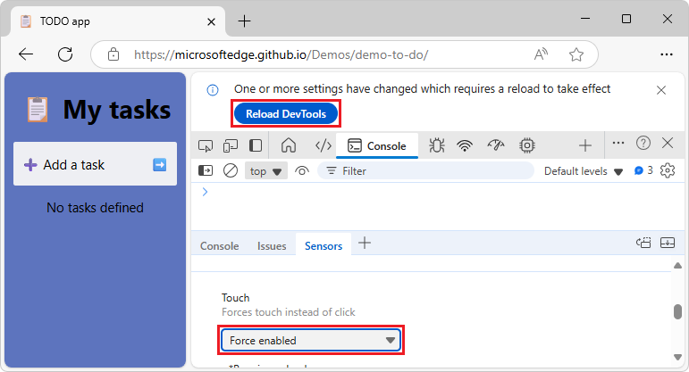
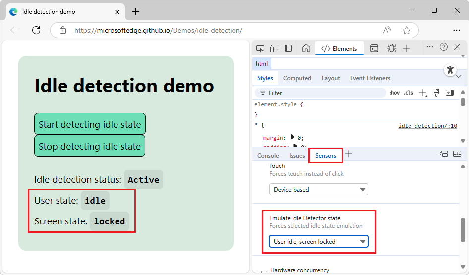
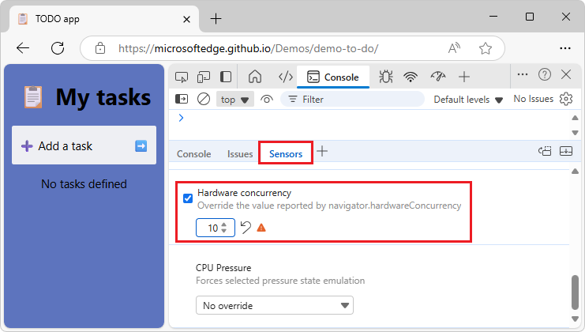
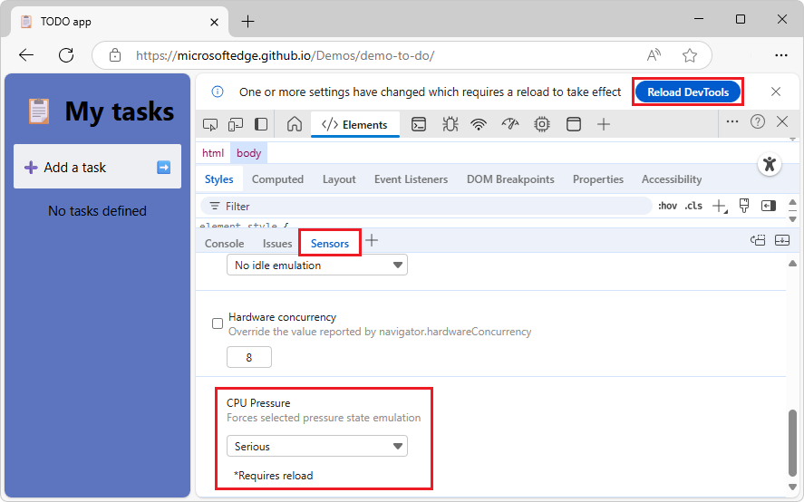

<!-- Copyright Kayce Basques and Sofia Emelianova

   Licensed under the Apache License, Version 2.0 (the "License");
   you may not use this file except in compliance with the License.
   You may obtain a copy of the License at

       https://www.apache.org/licenses/LICENSE-2.0

   Unless required by applicable law or agreed to in writing, software
   distributed under the License is distributed on an "AS IS" BASIS,
   WITHOUT WARRANTIES OR CONDITIONS OF ANY KIND, either express or implied.
   See the License for the specific language governing permissions and
   limitations under the License.  -->
# Emulate device sensors

Use the **Sensors** tool to emulate sensor input of any device.

<!-- ====================================================================== -->
## Overview
<!-- https://developer.chrome.com/docs/devtools/sensors#overview -->

The **Sensors** tool lets you do the following:

* [Override geolocation](#override-geolocation)
* [Simulate device orientation](#simulate-device-orientation)
* [Simulate touch events when clicking](#simulate-touch-events-when-clicking)
* [Emulate idle detector state](#emulate-idle-detector-state)
* [Emulate hardware concurrency](#emulate-hardware-concurrency)
* [Emulate CPU pressure](#emulate-cpu-pressure)

To simulate a viewport of a mobile device and throttle the network and CPU, see [Emulate mobile devices (Device Emulation)](../device-mode/index.md).

<!-- ====================================================================== -->
## Open the Sensors tool
<!-- https://developer.chrome.com/docs/devtools/sensors#open-sensors -->

1. Open a webpage, such as the [TODO app](https://microsoftedge.github.io/Demos/demo-to-do/) demo page, in a new window or tab.

1. Right-click the webpage, and then select **Inspect**.

   DevTools opens.

1. Press **Esc** once or twice, so that the **Quick View** panel is open at the bottom of DevTools.

1. In the **Quick View** panel, click the **More tools** button, and then select **Sensors**.

   The **Sensors** tool opens in the **Quick View** panel at the bottom of DevTools.

<!-- ------------------------------ -->
#### Open the Sensors tool by using the Command Menu
<!-- no heading upstream -->

1. Depending on your operating system, press the following to open the Command Menu:
   * On Windows, Linux, or ChromeOS, **Control+Shift+P**.
   * On MacOS, **Command+Shift+P**.

   

1. Type **sensors**, select **Show Sensors**, and then press **Enter**.

   The **Sensors** tool opens in **Quick View** at the bottom of DevTools.

<!-- ====================================================================== -->
## Override geolocation
<!-- https://developer.chrome.com/docs/devtools/sensors#geolocation -->

Many websites take advantage of user location in order to provide a more relevant experience for their users.  For example, a weather website might show the local forecast for a user's area, once the user has granted the website permission to access their location.  To access a user's geolocation from your website, see [Geolocation API](https://developer.mozilla.org/docs/Web/API/Geolocation_API), at MDN.

If you're building a UI that changes depending on where the user is located, you probably want to make sure that the site behaves correctly in different places around the world.

To override your geolocation, [open the Sensors tool](#open-the-sensors-tool) and, from the **Location** list select one of the following:

* One of the preset cities, like **Tokyo**.
* **Other** to enter custom longitude and latitude coordinates.
* Select **Location unavailable** to see how your site behaves when the user's location is not available.

<!-- ====================================================================== -->
## Simulate device orientation
<!-- https://developer.chrome.com/docs/devtools/sensors#orientation -->

Mobile devices have sensors which can detect their physical orientation.  Websites such as web-based games or mapping applications can make use of the device orientation to provide a better experience.  To learn about how to detect the device orientation, see [Device orientation events](https://developer.mozilla.org/docs/Web/API/Device_orientation_events), at MDN.
    
If you're building a UI that changes depending on the orientation of the user's device, you need to test your UI under different device orientations.
    
To simulate different device orientations, [open the Sensors tool](#open-the-sensors-tool), and then, from the **Orientation** list, select one of the following:

* One of the preset orientations, like **Portrait upside down**:

   

* **Custom orientation**, to provide your own exact orientation.

   After selecting **Custom orientation**, the **alpha**, **beta**, and **gamma** fields are enabled.  To understand how these axes work, see:
   * [DeviceOrientationEvent: alpha property](https://developer.mozilla.org/docs/Web/API/DeviceOrientationEvent/alpha)
   * [DeviceOrientationEvent: beta property](https://developer.mozilla.org/docs/Web/API/DeviceOrientationEvent/beta)
   * [DeviceOrientationEvent: gamma property](https://developer.mozilla.org/docs/Web/API/DeviceOrientationEvent/gamma)

   After selecting **Custom orientation**, you can also set a custom orientation by dragging the **Orientation Model**.  Hold **Shift** before dragging, to rotate along the alpha axis:

   

<!-- ====================================================================== -->
## Simulate touch events when clicking
<!-- https://developer.chrome.com/docs/devtools/sensors#touch -->

To test touch events on your website, even if you're testing on a device without a touch screen:

1. Open a webpage, such as the [TODO app](https://microsoftedge.github.io/Demos/demo-to-do/) demo page, in a new window or tab.

1. Right-click the webpage, and then select **Inspect**.

   DevTools opens.

1. Press **Esc** once or twice, so that the **Quick View** panel is open at the bottom of DevTools.

1. In the **Quick View** panel, click the **More tools** button, and then select **Sensors**.

   The **Sensors** tool opens in the **Quick View** panel at the bottom of DevTools.

1. In the **Sensors** tool, scroll down to the **Touch** dropdown menu, and then select **Force enabled**:

   

1. Click the **Reload DevTools** button at the top of DevTools.

<!-- ====================================================================== -->
## Emulate idle detector state
<!-- https://developer.chrome.com/docs/devtools/sensors#idle -->

The Idle Detection API lets you detect inactive users and react on idle state changes.  With DevTools, you can emulate idle state changes for both the user state and screen state instead of waiting for the actual idle state to change.

To emulate idle states:

1. Open a webpage, such as the [Idle detection demo](https://microsoftedge.github.io/Demos/idle-detection/), in a new window or tab.

1. Right-click the page and then select **Inspect**.

   DevTools opens.

1. Press **Esc** once or twice so that **Quick View** opens at the bottom of DevTools.

1. In the **Quick View** toolbar, click the **More tools** button, and then select **Sensors**.

   The **Sensors** tool opens in the **Quick View** panel.

1. In the demo page, click the **Start detecting idle state** button.

   The first time only, an **Allow** dialog opens.

1. Click the **Allow** button.

   The demo page is granted the idle detection permission.

1. In DevTools, in the **Sensors** tool, scroll down to the **Emulate Idle Detector state** drop-down, and then select an option:

   * **No idle emulation**
   * **User active, screen unlocked**
   * **User active, screen locked**
   * **User idle, screen unlocked**
   * **User idle, screen locked**

   The demo page displays the emulated user and screen states:

   

See also:
* [Idle Detection API](https://developer.mozilla.org/docs/Web/API/Idle_Detection_API) at MDN.
* [Idle detection demo](https://microsoftedge.github.io/Demos/idle-detection/)

<!-- ====================================================================== -->
## Emulate hardware concurrency
<!-- https://developer.chrome.com/docs/devtools/sensors#hardware-concurrency -->

To emulate how your website performs on devices with different numbers of processor cores, you can override the value reported by the [navigator.hardwareConcurrency](https://developer.mozilla.org/docs/Web/API/Navigator/hardwareConcurrency) property.  Some applications use this property to control the degree of parallelism of their application, for example, to control [Emscripten `pthread`](https://emscripten.org/docs/porting/pthreads.html) pool size.

To emulate hardware concurrency:

1. Open a webpage, such as the [TODO app](https://microsoftedge.github.io/Demos/demo-to-do/) demo page, in a new window or tab.

1. Right-click the webpage, and then select **Inspect**.

   DevTools opens.

1. Press **Esc** once or twice, so that the **Quick View** panel is open at the bottom of DevTools.

1. In the **Quick View** panel, click the **More tools** button, and then select **Sensors**.

   The **Sensors** tool opens in the **Quick View** panel at the bottom of DevTools.

1. In the **Sensors** tool, scroll down to the **Hardware concurrency** checkbox, and then select it.

1. In the number input box, enter the number of cores you want to emulate:

   

   Caution: Exceeding the default value may degrade performance.

To revert to the default value, click the **Reset** () button.

<!-- ====================================================================== -->
## Emulate CPU pressure
<!-- https://developer.chrome.com/docs/devtools/sensors#cpu-pressure -->

_CPU or compute pressure_ is a set of reported states that give you an idea of how much workload the system's compute is undergoing, and whether it's near the limit.  This information lets you adapt your real-time application, for example, video conferencing or video game, to take advantage of all the available processing power while keeping the system responsive by adapting the workloads in real time.

The **Sensors** tool lets you emulate the states that can be reported by the [Compute Pressure API](https://developer.mozilla.org/docs/Web/API/Compute_Pressure_API).

To emulate CPU pressure on your website:

1. Open a webpage, such as the [TODO app](https://microsoftedge.github.io/Demos/demo-to-do/) demo page, in a new window or tab.

1. Right-click the webpage, and then select **Inspect**.

   DevTools opens.

1. Press **Esc** once or twice, so that the **Quick View** panel is open at the bottom of DevTools.

1. In the **Quick View** panel, click the **More tools** button, and then select **Sensors**.

   The **Sensors** tool opens in the **Quick View** panel at the bottom of DevTools.

1. In the **Sensors** tool, scroll down to the **CPU pressure** section, and then select one of the [human-readable pressure states](https://developer.mozilla.org/docs/Web/API/Compute_Pressure_API#pressure_states): 

   * **No override**
   * **Nominal**
   * **Fair**
   * **Serious**
   * **Critical**

1. At the top of DevTools, click the **Reload DevTools** button:

   

<!-- ====================================================================== -->
## See also
<!-- all links in article -->

* [Emulate mobile devices (Device Emulation)](../device-mode/index.md)

MDN:
* [Geolocation API](https://developer.mozilla.org/docs/Web/API/Geolocation_API)
* [Device orientation events](https://developer.mozilla.org/docs/Web/API/Device_orientation_events)
   * [DeviceOrientationEvent: alpha property](https://developer.mozilla.org/docs/Web/API/DeviceOrientationEvent/alpha)
   * [DeviceOrientationEvent: beta property](https://developer.mozilla.org/docs/Web/API/DeviceOrientationEvent/beta)
   * [DeviceOrientationEvent: gamma property](https://developer.mozilla.org/docs/Web/API/DeviceOrientationEvent/gamma)
* [Navigator: hardwareConcurrency property](https://developer.mozilla.org/docs/Web/API/Navigator/hardwareConcurrency)
* [Compute Pressure API](https://developer.mozilla.org/docs/Web/API/Compute_Pressure_API)
   * [Pressure states](https://developer.mozilla.org/docs/Web/API/Compute_Pressure_API#pressure_states) in _Compute Pressure API_.

Demos:
* [TODO app](https://microsoftedge.github.io/Demos/demo-to-do/) 
* [Idle detection demo](https://microsoftedge.github.io/Demos/idle-detection/)

Emscripten:
* [Pthreads support](https://emscripten.org/docs/porting/pthreads.html)

<!-- ====================================================================== -->
> [!NOTE]
> Portions of this page are modifications based on work created and [shared by Google](https://developers.google.com/terms/site-policies) and used according to terms described in the [Creative Commons Attribution 4.0 International License](https://creativecommons.org/licenses/by/4.0).
> The original page is found [here](https://developer.chrome.com/docs/devtools/sensors) and is authored by Kayce Basques and Sofia Emelianova.

This work is licensed under a [Creative Commons Attribution 4.0 International License](https://creativecommons.org/licenses/by/4.0).
