<!-- Copyright Kayce Basques

   Licensed under the Apache License, Version 2.0 (the "License");
   you may not use this file except in compliance with the License.
   You may obtain a copy of the License at

       https://www.apache.org/licenses/LICENSE-2.0

   Unless required by applicable law or agreed to in writing, software
   distributed under the License is distributed on an "AS IS" BASIS,
   WITHOUT WARRANTIES OR CONDITIONS OF ANY KIND, either express or implied.
   See the License for the specific language governing permissions and
   limitations under the License.  -->
# Sources tool overview

Use the **Sources** tool to view, modify, and debug front-end JavaScript code, and to inspect the resources that make up the current webpage.

**Detailed contents:**

* [The Navigator, Editor, and Debugger panes](#the-navigator-editor-and-debugger-panes)
* [Using the Navigator pane to select files](#using-the-navigator-pane-to-select-files)
   * [Using the Page tab to explore resources that construct the current webpage](#using-the-page-tab-to-explore-resources-that-construct-the-current-webpage)
      * [Icons in the Page tab](#icons-in-the-page-tab)
      * [Group files by folder or as a flat list](#group-files-by-folder-or-as-a-flat-list)
   * [Add a local folder to the workspace, to use DevTools to edit files and save changes to disk](#add-a-local-folder-to-the-workspace-to-use-devtools-to-edit-files-and-save-changes-to-disk)
   * [Using the Overrides tab to override server files with local files](#using-the-overrides-tab-to-override-server-files-with-local-files)
   * [Using the Content scripts tab for Microsoft Edge extensions](#using-the-content-scripts-tab-for-microsoft-edge-extensions)
   * [Using the Snippets tab to run JavaScript code snippets on any webpage](#using-the-snippets-tab-to-run-javascript-code-snippets-on-any-webpage)
   * [Using the Command Menu to open files](#using-the-command-menu-to-open-files)
* [Using the Editor pane to view or edit files](#using-the-editor-pane-to-view-or-edit-files)
   * [Editing a JavaScript file](#editing-a-javascript-file)
      * [Save and Undo](#save-and-undo)
      * [Find and Replace](#find-and-replace)
      * [Showing the changes you made](#showing-the-changes-you-made)
      * [Changes inside a function take effect](#changes-inside-a-function-take-effect)
   * [Reformatting a minified JavaScript file with pretty-print](#reformatting-a-minified-javascript-file-with-pretty-print)
   * [Mapping minified code to your source code to show readable code](#mapping-minified-code-to-your-source-code-to-show-readable-code)
   * [Transformations from source code to compiled front-end code](#transformations-from-source-code-to-compiled-front-end-code)
   * [Editing CSS](#editing-css)
      * [Editing CSS by using the Styles tab in the Elements tool, when using the Workspace tab of the Sources tool](#editing-css-by-using-the-styles-tab-in-the-elements-tool-when-using-the-workspace-tab-of-the-sources-tool)
      * [Editing CSS in the Page tab or Workspace tab in the Sources tool](#editing-css-in-the-page-tab-or-workspace-tab-in-the-sources-tool)
   * [Editing an HTML file](#editing-an-html-file)
   * [Going to a line number or function](#going-to-a-line-number-or-function)
   * [Quick source tool, to display source files when using a different tool](#quick-source-tool-to-display-source-files-when-using-a-different-tool)
* [Using the Debugger pane to debug JavaScript code](#using-the-debugger-pane-to-debug-javascript-code)
   * [The basic approach to using a debugger](#the-basic-approach-to-using-a-debugger)
   * [Advantages of the debugger's Watch and Scope over console.log](#advantages-of-the-debuggers-watch-and-scope-over-consolelog)
   * [Debug from Visual Studio Code directly](#debug-from-visual-studio-code-directly)
   * [Articles about debugging](#articles-about-debugging)
* [See also](#see-also)


<!-- ====================================================================== -->
## The Navigator, Editor, and Debugger panes

The **Sources** tool has three panes:

| Pane | Actions |
|---|---|
| **Navigator** pane | Navigate among the resources that are returned from the server to construct the current webpage.  Select files, images, and other resources, and view their paths.  Optionally, set up a local Workspace to save changes directly to source files. |
| **Editor** pane | View JavaScript, HTML, CSS, and other files that are returned from the server.  Make experimental edits to JavaScript or CSS.  Your changes are preserved until you refresh the page, or are preserved after page refresh if you save to a local file with Workspaces. When you use Workspaces or Overrides, you can edit HTML files as well. |
| **Debugger** pane | Use the JavaScript Debugger to set breakpoints, pause running JavaScript, and step through the code, including any edits you have made, while watching any JavaScript expressions you specify.  Watch and manually change the values of variables that are in-scope for the current line of code. |

The following figure shows the **Navigator** pane highlighted with a red box in the upper left corner of DevTools, the **Editor** pane highlighted in the upper right, and the **Debugger** pane highlighted on the bottom.  On the far left side is the main part of the browser window, showing the rendered webpage grayed-out because the debugger is paused on a breakpoint:

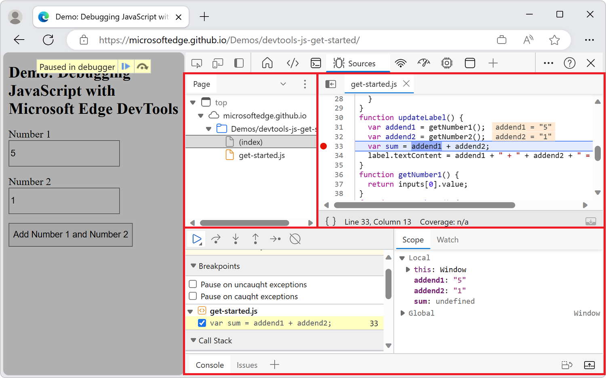

When DevTools is wide, the **Debugger** pane is placed on the right, and includes **Scope** and **Watch**:

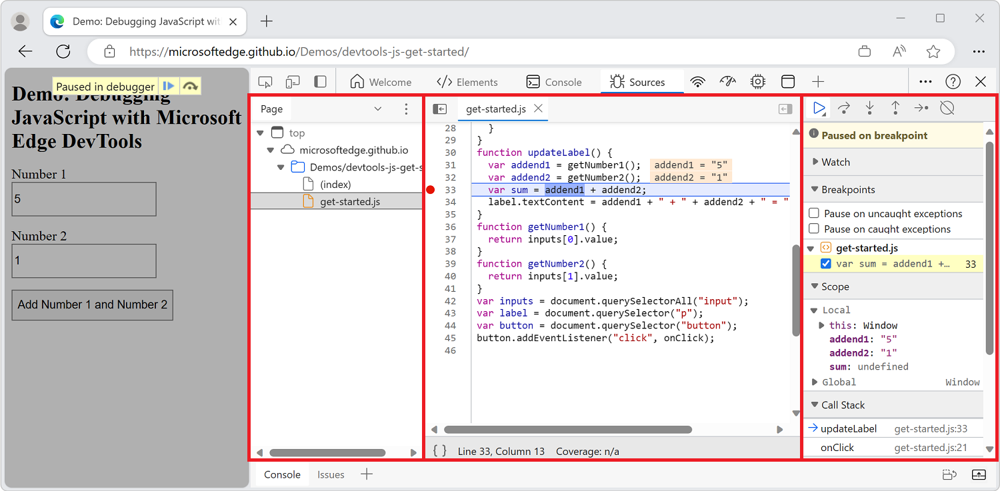

To maximize the size of the Sources tool, undock DevTools into a separate window, and optionally move the DevTools window to a separate monitor.  See [Change DevTools placement (Undock, Dock to bottom, Dock to left)](../customize/placement.md).

To load the debugging demo webpage that's shown above, see [The basic approach to using a debugger](#the-basic-approach-to-using-a-debugger), below.


<!-- ====================================================================== -->
## Using the Navigator pane to select files

Use the **Navigator** pane (on the left) to navigate among the resources that are returned from the server to construct the current webpage.  Select files, images, and other resources, and view their paths.

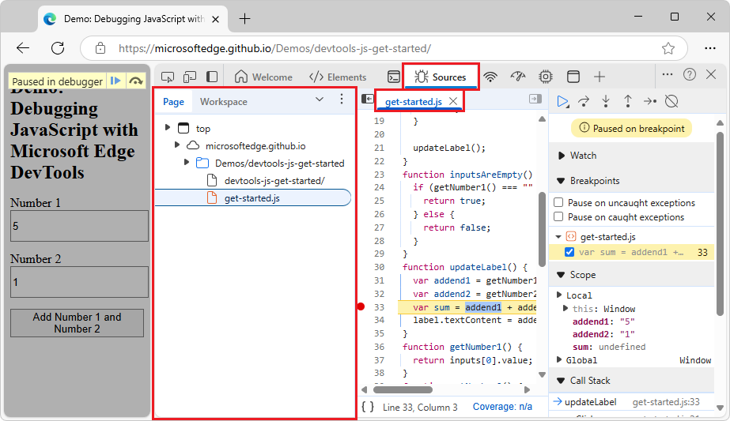
<!--
per section [The basic approach to using a debugger](#the-basic-approach-to-using-a-debugger) below:
1. Go to https://microsoftedge.github.io/Demos/devtools-js-get-started/
1. Show DevTools.
1. Select the Sources tool.
1. In the Page tab, click get-started.js.
1. Click to the left of line 33 to set a breakpoint.
1. In the demo page, in the **Number 1** text box, enter 5.
1. In the demo page, in the **Number 2** text box, enter 1.
1. In the demo page, click the button **Add Number 1 and Number 2**.
-->

The Navigator pane contains the following tabs:

| Tab | Description | Docs |
|---|---|
| **Page** | View the resources that the browser downloaded from the server or file system, inspect their content, and debug code. | [Using the Page tab to explore resources that construct the current webpage](#using-the-page-tab-to-explore-resources-that-construct-the-current-webpage) |
| **Workspace** | View and edit local files in DevTools, to use DevTools as an Integrated Development Environment (IDE) within the browser. | [Add a local folder to the workspace, to use DevTools to edit files and save changes to disk](#add-a-local-folder-to-the-workspace-to-use-devtools-to-edit-files-and-save-changes-to-disk) |
| **Overrides** | Experiment with changes to a webpage, and keep the changes after you refresh the webpage, without mapping your changes to the source code of the webpage. | [Using the Overrides tab to override server files with local files](#using-the-overrides-tab-to-override-server-files-with-local-files) |
| **Content scripts** | View content scripts that were loaded by a Microsoft Edge extension. | [Using the Content scripts tab for Microsoft Edge extensions](#using-the-content-scripts-tab-for-microsoft-edge-extensions) |
| **Snippets** | Create and save JavaScript code snippets, so that you can easily run a snippet of JavaScript on any webpage. | [Using the Snippets tab to run JavaScript code snippets on any page](#using-the-snippets-tab-to-run-javascript-code-snippets-on-any-webpage) |

To access any hidden tabs of the Navigator pane, click the **More tabs** () button.

Details are below.  Also below: [Using the Command Menu to open files](#using-the-command-menu-to-open-files).


<!-- ------------------------------ -->
#### Using the Page tab to explore resources that construct the current webpage

The **Page** tab in the **Sources** tool displays the resources that the current webpage uses, such as the webpage's HTML document, JavaScript files, CSS files, or images.  The resources displayed in the **Page** tab are organized in a tree that matches the file system or server path from which they were downloaded.

Use the **Page** tab to view the resources that the browser downloaded from the server or file system, inspect their content, and debug code.

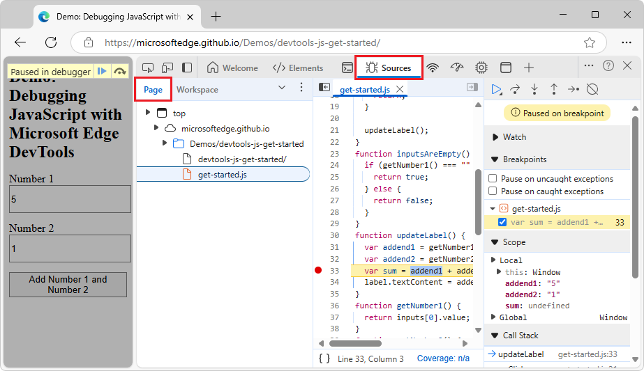
<!--
per section [The basic approach to using a debugger](#the-basic-approach-to-using-a-debugger) below:
1. Go to https://microsoftedge.github.io/Demos/devtools-js-get-started/
1. Show DevTools.
1. Select the Sources tool.
1. In the Page tab, click get-started.js.
1. Click to the left of line 33 to set a breakpoint.
1. In the demo page, in the **Number 1** text box, enter 5.
1. In the demo page, in the **Number 2** text box, enter 1.
1. In the demo page, click the button **Add Number 1 and Number 2**.
-->

To display a file in the **Editor** pane, select a file in the **Page** tab.  For an image, a preview of the image is displayed.

To display the URL or path for a resource, hover over the resource.

To load a file into a new tab of the browser, or to display other actions, right-click on the file name.


<!-- ---------- -->
###### Icons in the Page tab

The **Page** tab uses the following icons:
*  The **window** icon, along with the label `top`, represents the main document frame, which is an [HTML frame](https://w3.org/TR/html401/present/frames.html): 
*  The **cloud** icon represents an [origin](https://html.spec.whatwg.org/multipage/origin.html#origin): 
*  The **folder** icon represents a directory: 
*  The **page** icon represents a resource: 


<!-- ---------- -->
###### Group files by folder or as a flat list

The **Page** tab displays files or resources grouped by server and directory, or as a flat list.

To change how resources are grouped:

1. Next to the tabs on the Navigator pane (on the left), click the **...** (**More options**) button.  A menu appears.
1. Select or clear the **Group by folder** option.


<!-- ------------------------------ -->
#### Add a local folder to the workspace, to use DevTools to edit files and save changes to disk

Use the **Workspace** tab in the **Sources** tool to view and edit local files in DevTools.  The **Workspace** tab is useful when used in conjunction with a local web server as you can then load your local website in Edge, and edit its source files in DevTools.

When you add a folder to the **Workspace** tab, the files and subfolders in that folder are displayed in the tab, and you can open files to view and edit them. 

The **Workspace** tab does not show the resources that the browser downloaded to display the webpage; the **Workspace** tab only shows the folders and files that are inside the local folders that you added.

Throughout DevTools, a green "mapped" dot appears on a file for which DevTools was able to find a mapping between the workspace file and the webpage resource.  For example, if the page uses a stylesheet called `styles.css` and the workspace has a file called `styles.css`, DevTools maps the files to each other and displays a green "mapped" dot.

The green "mapped" dot indicates that changes you make to webpage resources will be saved.  For example, when you make a change inside the **Styles** tab of the **Elements** tool, you're editing the webpage stylesheet (not the file).  If the CSS file name that's shown in the **Styles** tab has a green "mapped" dot, that stylesheet has been mapped to a file in your workspace, and your changes won't be lost.

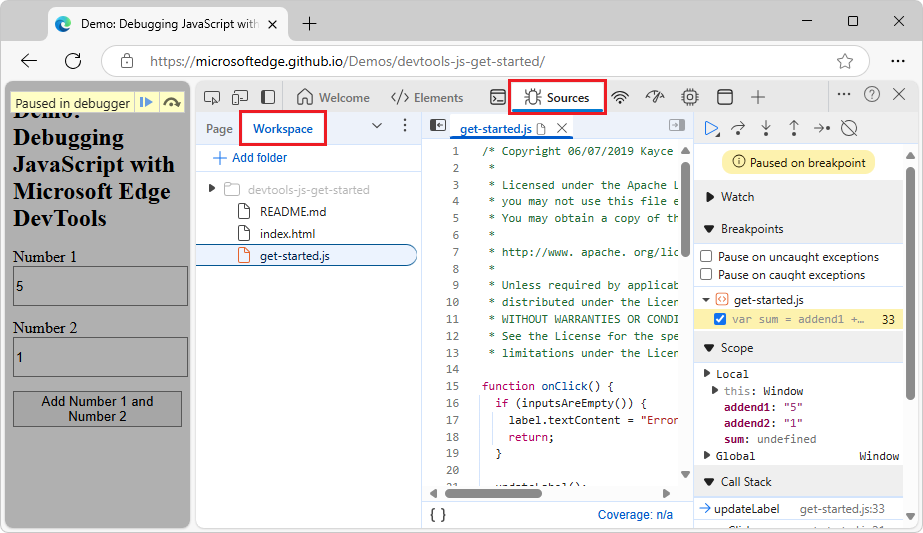
<!-- updating png:
per section [The basic approach to using a debugger](#the-basic-approach-to-using-a-debugger) below:
1. [Clone the Demos repo](../sample-code/sample-code.md#clone-the-demos-repo) in _Sample code for DevTools_.
1. Go to https://microsoftedge.github.io/Demos/devtools-js-get-started/
1. Show DevTools.
1. Select the Sources tool.
1. In the Workspace tab, click **Add folder**.
1. Nav to eg C:\Users\localAccount\GitHub\Demos\devtools-js-get-started
1. Click Allow button.
1. In the Workspace tab, click get-started.js.
1. Click to the left of line 33 to set a breakpoint.
1. In the demo page, in the **Number 1** text box, enter 5.
1. In the demo page, in the **Number 2** text box, enter 1.
1. In the demo page, click the button **Add Number 1 and Number 2**.
-->

By default, when you edit a file in the **Sources** tool, your changes are discarded when you refresh the webpage.  The **Sources** tool works with a copy of the front-end resources that are returned by the web server.  When you modify these front-end files that are returned by the server, the changes don't persist, because you didn't change the source files.  You need to also apply your edits in your actual source code, and then re-deploy to the server.

In contrast, when you use a Workspace, changes that you make to your front-end code are preserved when you refresh the webpage.  With a Workspace, when you edit the front-end code that's returned by the server, the Sources tool also applies your edits to your local source code.  Then for other users to see your changes, you only need to redeploy your changed source files to the server.

Workspaces work well when the JavaScript code that's returned by the server is the same as your local JavaScript source code.  Workspaces don't work as well when your workflow involves transformations on your source code, such as minification or [TypeScript](https://www.typescriptlang.org) compilation.

See also:
* [Edit and save files in a workspace (Sources tool Workspace tab)](../workspaces/index.md)
* [Open a demo folder from the Workspace tab in the Sources tool](../../devtools/samples/index.md#open-a-demo-folder-from-the-workspace-tab-in-the-sources-tool) in _Sample code for DevTools_.


<!-- ------------------------------ -->
#### Using the Overrides tab to override server files with local files

Use the **Overrides** tab in the **Sources** tool to override any response from a webserver with local files.  The **Overrides** tab is useful to make temporary changes to individual files, such as a CSS file, on any website.  Use **Overrides** when you want to experiment with changes to a webpage, and you need to keep the changes after you refresh the webpage, but you don't care about mapping your changes to the source code of the webpage.

To start using the **Overrides** tab, create a new folder on your file system, and then select that folder in the **Overrides** tab.  From then on, any changes that you make in the **Styles** tab of the **Elements** tool, or in the **Page** tab of the **Sources** tool, are saved in the new folder.  DevTools uses the local files to override the matching server responses.

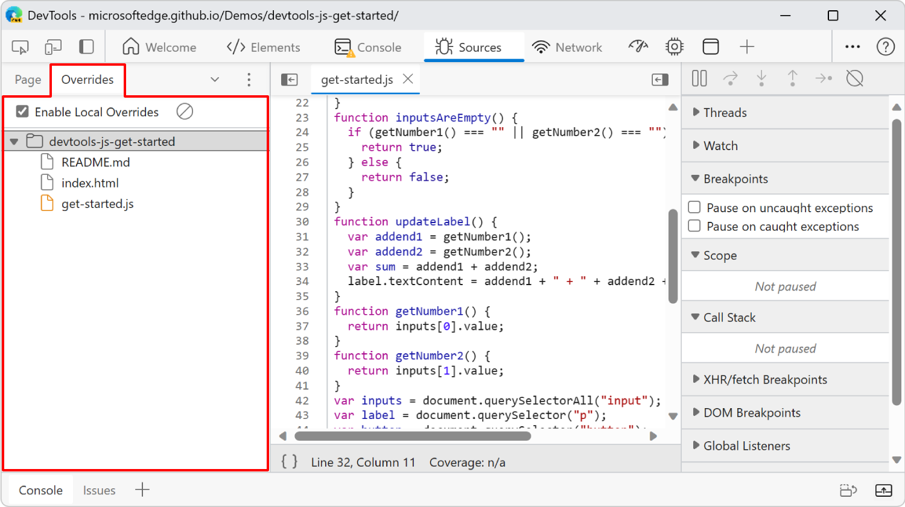

<!-- todo: no purple dot shown
A file that overrides a file that is returned by the server is indicated by a purple dot next to the file name, throughout DevTools.
-->

See also:
* [Override webpage resources with local copies (Overrides tab)](../javascript/overrides.md)
* [Map the processed code to your original source code, for debugging](../javascript/source-maps.md)
* [Sources tool keyboard shortcuts](../shortcuts/index.md#sources-tool-keyboard-shortcuts) in _Keyboard shortcuts_


<!-- ------------------------------ -->
#### Using the Content scripts tab for Microsoft Edge extensions

Use the **Content scripts** tab of the **Navigator** pane to view any content scripts<!-- todo: define --> that were loaded by a Microsoft Edge extension that you installed.

<!-- A _content script_ is a __. -->

<!-- todo: define _content script_, like in
* [Using the Content scripts tab for Microsoft Edge extensions](../../sources/index.md#using-the-content-scripts-tab-for-microsoft-edge-extensions) in _Sources tool overview_.
* [Content scripts](https://developer.chrome.com/docs/extensions/develop/concepts/content-scripts) in Chrome Extensions docs.
https://developer.chrome.com/docs/devtools/settings/ignore-list
-->


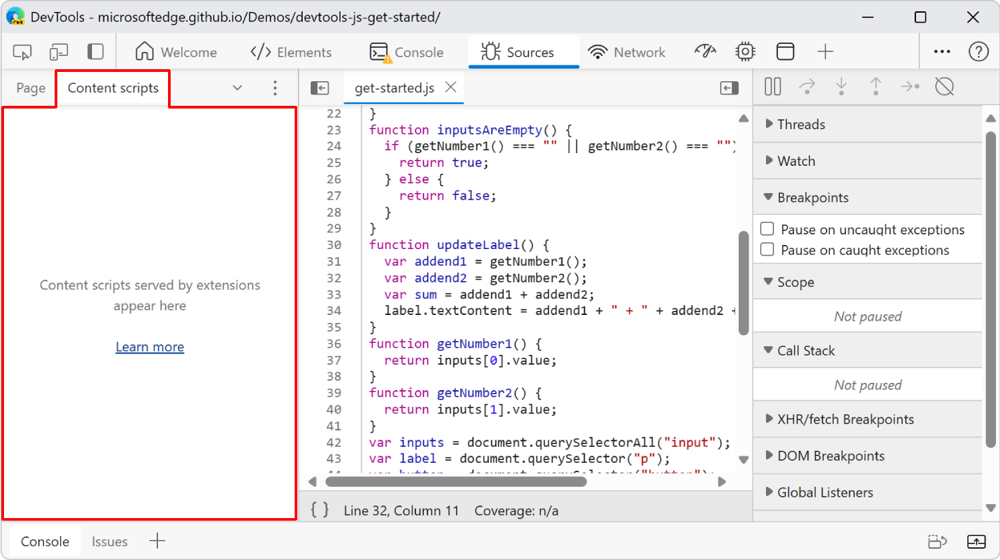

When the debugger steps into code that you don't recognize, you might want to add that code to the **Ignore List**, to avoid stepping into that code. See [Add content scripts to the Ignore List](../javascript/guides/mark-content-scripts-library-code.md).

See also:
* [Content scripts](https://developer.mozilla.org/docs/Mozilla/Add-ons/WebExtensions/Content_scripts)
* [Sample: Picture inserter using content script](../../extensions/samples/picture-inserter-content-script.md)


<!-- ------------------------------ -->
#### Using the Snippets tab to run JavaScript code snippets on any webpage

Use the **Snippets** tab of the **Navigator** pane to create and save JavaScript code snippets, so that you can easily run these snippets on any webpage.

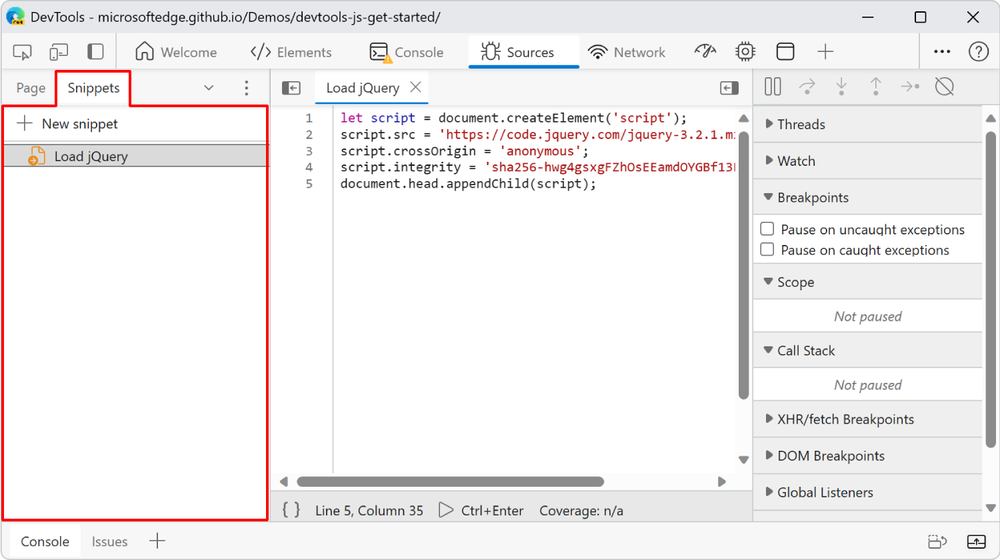

For example, suppose you frequently enter the following code in the **Console**, to insert the jQuery library into a page so that you can run jQuery commands from the **Console**:

```javascript
let script = document.createElement('script');
script.src = 'https://code.jquery.com/jquery-3.2.1.min.js';
script.crossOrigin = 'anonymous';
script.integrity = 'sha256-hwg4gsxgFZhOsEEamdOYGBf13FyQuiTwlAQgxVSNgt4=';
document.head.appendChild(script);
```

Instead, you can save this code in a **Snippet** and then easily run it whenever you need to.  When you press **Ctrl+S** (Windows, Linux) or **Command+S** (macOS), DevTools saves the **Snippet** to your file system.

There are multiple ways to run a Snippet:
*  In the **Navigator** pane, select the **Snippets** tab, and then select the snippets file to open it.  Then at the bottom of the Editor pane, click the **Run** () button.
*  When DevTools has focus, press **Ctrl+P** (Windows, Linux) or **Command+P** (macOS) to open the [Command Menu](../command-menu/index.md), and then type **!**.

Snippets are similar to bookmarklets.

See also:
* [Run snippets of JavaScript on any webpage](../javascript/snippets.md)


<!-- ------------------------------ -->
#### Using the Command Menu to open files

To open a file, in addition to using the **Navigator** pane within the **Sources** tool, you can use the **Command Menu** from anywhere within DevTools.

*  From anywhere in DevTools, press **Ctrl+P** on Windows/Linux or **Command+P** on macOS.  The **Command Menu** appears, and lists all the resources that are in the tabs of the **Navigator** pane of the **Sources** tool.
*  Or, next to the tabs of the **Navigator** pane in the **Sources** tool, click the **More options** (**...**) button, and then select **Open File**.

To display and pick from a list of all .js files, type **.js**.

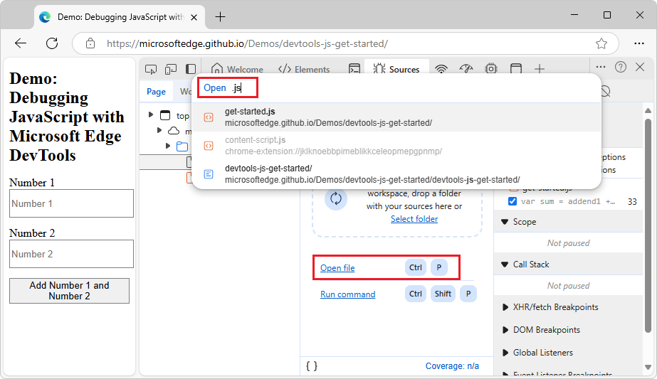
<!-- https://microsoftedge.github.io/Demos/devtools-js-get-started/ -->

If you type **?**, the **Command Menu** shows several commands, including **... Open file**.  If you press **Backspace** to clear the **Command Menu**, a list of files is shown.

For more information, see [Run commands with the Microsoft Edge DevTools Command Menu](../command-menu/index.md).


<!-- ====================================================================== -->
## Using the Editor pane to view or edit files

Use the **Editor** pane to view or edit files, including JavaScript, HTML, CSS, and image files.  The **Editor** pane displays the content of whatever file you selected in any of the **Navigator** pane tabs:
* **Page**
* **Workspace**
* **Overrides**
* **Content scripts**
* **Snippets**

For example, the **Editor** pane can show:
* The content of a **Snippet**.
* The content of a **Workspace** file that's not actually used in your front-end code (because **Workspace** lets you edit the content of any folder you want).

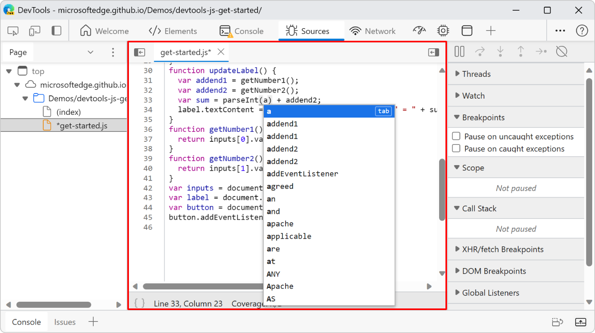

The **Editor** pane has the following level of support for various file types:

| File Type | Supported Actions |
|---|---|
| JavaScript | View, edit, and debug. |
| CSS | View and edit. |
| HTML | View and edit. |
| Images | View. |

By default, edits are discarded when you refresh the webpage.  For information about how to save the changes to your file system, see [Add a local folder to the workspace, to use DevTools to edit files and save changes to disk](#add-a-local-folder-to-the-workspace-to-use-devtools-to-edit-files-and-save-changes-to-disk), above.

The following subsections cover the Editor pane:
* [Editing a JavaScript file](#editing-a-javascript-file)
* [Reformatting a minified JavaScript file with pretty-print](#reformatting-a-minified-javascript-file-with-pretty-print)
* [Mapping minified code to your source code to show readable code](#mapping-minified-code-to-your-source-code-to-show-readable-code)
* [Transformations from source code to compiled front-end code](#transformations-from-source-code-to-compiled-front-end-code)
* [Editing CSS in the Page tab or Workspace tab in the Sources tool](#editing-css-in-the-page-tab-or-workspace-tab-in-the-sources-tool)
* [Editing an HTML file](#editing-an-html-file)
* [Going to a line number or function](#going-to-a-line-number-or-function)
* [Quick source tool, to display source files when using a different tool](#quick-source-tool-to-display-source-files-when-using-a-different-tool)

See also:
* [Open a demo folder from the Workspace tab in the Sources tool](../../devtools/samples/index.md#open-a-demo-folder-from-the-workspace-tab-in-the-sources-tool) in _Sample code for DevTools_.


<!-- ------------------------------ -->
#### Editing a JavaScript file

To edit a JavaScript file in DevTools, use the **Editor** pane, within the **Sources** tool.

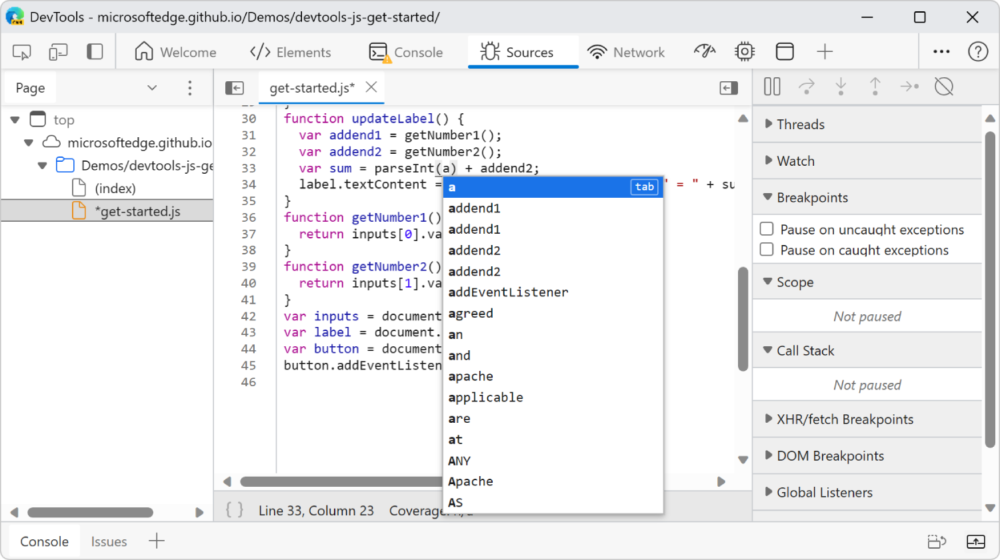

To load a file into the Editor pane, use the **Page** tab in the **Navigator** pane (on the left).  Or use the **Command Menu**, as follows: in the upper right of DevTools, select **Customize and control DevTools** (**...**) and then select **Open File**.

See also:
* [Open a demo folder from the Workspace tab in the Sources tool](../../devtools/samples/index.md#open-a-demo-folder-from-the-workspace-tab-in-the-sources-tool) in _Sample code for DevTools_.


<!-- ---------- -->
###### Save and Undo

For JavaScript changes to take effect, press **Ctrl+S** (Windows, Linux) or **Command+S** (macOS).

If you change a file, an asterisk appears next to the file name.
*  To save changes, press **Ctrl+S** on Windows/Linux or **Command+S** on macOS.
*  To undo a change, press **Ctrl+Z** on Windows/Linux or **Command+Z** on macOS.

By default, your edits are discarded when you refresh the webpage.  For more information about how to save the changes in your local file system, see [Edit and save files in a workspace (Sources tool Workspace tab)](../workspaces/index.md).


<!-- ---------- -->
###### Find and Replace

To find text in the current file, select the **Editor** pane to give it focus, and then press **Ctrl+F** on Windows/Linux, or **Command+F** on macOS.

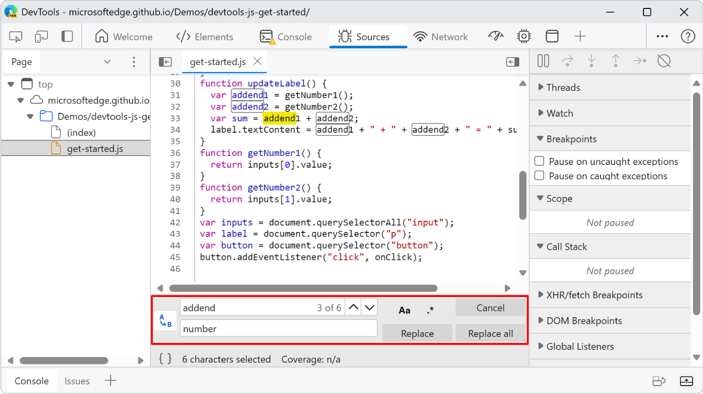

To find and replace text, select the **Replace** (**A-\>B**) button to the left of the **Find** text box. The **Replace** (**A-\>B**) button appears when viewing an editable file.


<!-- ---------- -->
###### Showing the changes you made

When you define a Workspace, changes to JavaScript are saved, and are visible in the **Changes** tool.

To review the changes that you made to a file, right-click in the **Editor** pane and then select **Local Modifications**.

The **Quick View** panel opens at the bottom of DevTools, showing your changes within the **Changes** tab.

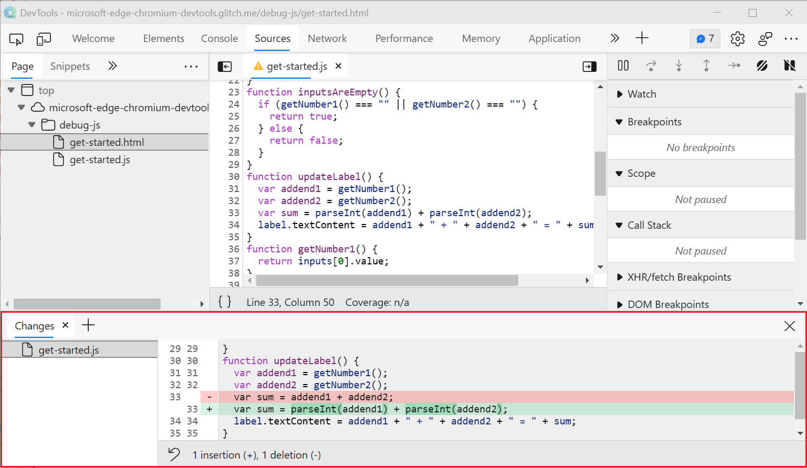

See also:
* [Track changes to files using the Changes tool](../changes/changes-tool.md)
* [Display or edit source files using the Quick source tool](../quick-source/quick-source-tool.md)


<!-- ---------- -->
###### Changes inside a function take effect

When you define a Workspace, changes inside a JavaScript function body take effect.

DevTools doesn't re-run a script, so the only JavaScript changes that take effect are changes that you make within functions.  For example, in the following figure, we added the following code to the JavaScript that is returned by the server:
*  We added the statement `console.log('A')` outside of any function.
*  We added the statement `console.log('B')` inside an `onClick` function.
We then saved the changes, entered numbers into the form, and then selected the form button to send the form.

After submitting the form, `console.log('A')`, which is at global scope, doesn't run, but `console.log('B')`, inside an `onClick` function, does run, outputting `B` to the **Console**:

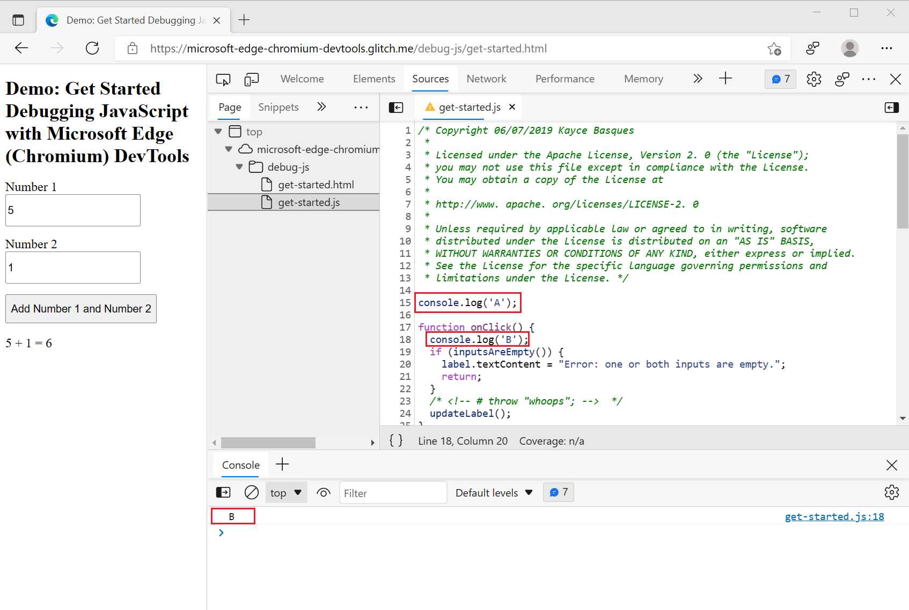


<!-- ------------------------------ -->
#### Reformatting a minified JavaScript file with pretty-print

Minified files are automatically reformatted when you open them in the Editor pane.

To revert the file to its original minified state, click the **Pretty print** button (), which is shown as braces, at the bottom of the Editor pane. 

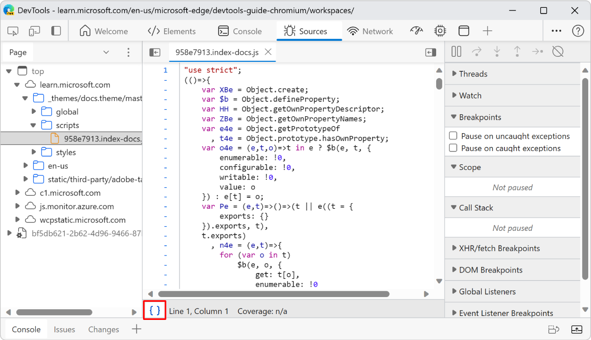

For more information, see [Reformat a minified JavaScript file with pretty-print](../javascript/reference.md#reformat-a-minified-javascript-file-with-pretty-print).


<!-- ------------------------------ -->
#### Mapping minified code to your source code to show readable code

Source maps from pre-processors cause DevTools to load your original JavaScript source files in addition to your minified, transformed JavaScript files that are returned by the server.  You then view your original source files while you set breakpoints and step through code.  Meanwhile, Microsoft Edge is actually running your minified code.

In the **Editor** pane, if you right-click a JavaScript file and then select **Add source map**, a popup box appears, with a **Source map URL** text box and an **Add** button.

The source-mapping approach keeps your front-end code human-readable and debuggable even after you combine, minify, or compile it.
For more information, see [Map the processed code to your original source code, for debugging](../javascript/source-maps.md).


<!-- ------------------------------ -->
#### Transformations from source code to compiled front-end code

If you use a framework that transforms your JavaScript files, such as React, your local source JavaScript might be different than the front-end JavaScript that's returned by the server.  Workspaces aren't supported in this scenario, but source code mapping is supported in this scenario.

In a development environment, your server might include your source maps and your original `.ts` or `.jsx` files for React.  The **Sources** tool displays these files, but doesn't allow you to edit these files.  When you set breakpoints and use the debugger, DevTools displays your original `.ts` or `.jsx` files, but actually steps-through the minified version of your JavaScript files.

In this scenario, the **Sources** tool is useful for inspecting and stepping-through the transformed, front-end JavaScript that's returned from the server.  Use the debugger to define Watch expressions, and use the Console to enter JavaScript expressions to manipulate data that's in-scope.


<!-- ------------------------------ -->
#### Editing CSS

There are two places to edit CSS rules and their properties in DevTools:

* In the **Styles** tab in the **Elements** tool, edit CSS properties through user interface controls.

* In the **Page** tab or **Workspace** tab in the **Sources** tool, use the text editor to edit a CSS file.


<!-- ---------- -->
###### Editing CSS by using the Styles tab in the Elements tool, when using the Workspace tab of the Sources tool

See also:
* [Limitations of the workspace feature with transformed source code](../workspaces/index.md#limitations-of-the-workspace-feature-with-transformed-source-code)


<!-- ---------- -->
###### Editing CSS in the Page tab or Workspace tab in the Sources tool

The **Page** or **Workspace** tab in the **Sources** tool supports directly editing a CSS file.  For example, if you edit the CSS file from the tutorial [Edit and save files in a workspace (Sources tool Workspace tab)](../workspaces/index.md) to match the style rule below, the `H1` element in the upper left of the rendered webpage changes to green:

```css
h1 {
  color: green;
}
```

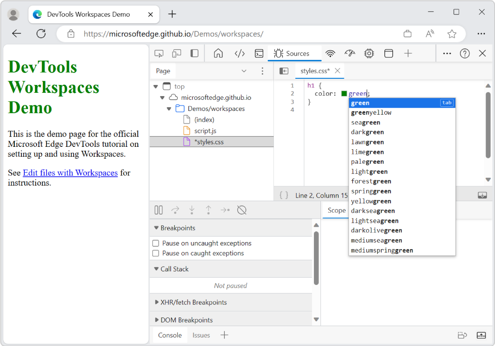

CSS changes take effect immediately; you don't need to manually save the changes.

See also:
* [Get started viewing and changing CSS](../css/index.md).
* [Edit CSS font styles and settings in the Styles pane](../inspect-styles/edit-fonts.md)
* [Sources tool keyboard shortcuts](../shortcuts/index.md#sources-tool-keyboard-shortcuts) in _Keyboard shortcuts_
* [Open a demo folder from the Workspace tab in the Sources tool](../../devtools/samples/index.md#open-a-demo-folder-from-the-workspace-tab-in-the-sources-tool) in _Sample code for DevTools_.


<!-- ------------------------------ -->
#### Editing an HTML file

There are two ways to edit HTML in DevTools:
*  In the **Elements** tool, you work with one HTML element at a time, through user interface controls.
*  In the **Sources** tool, you use a text editor.

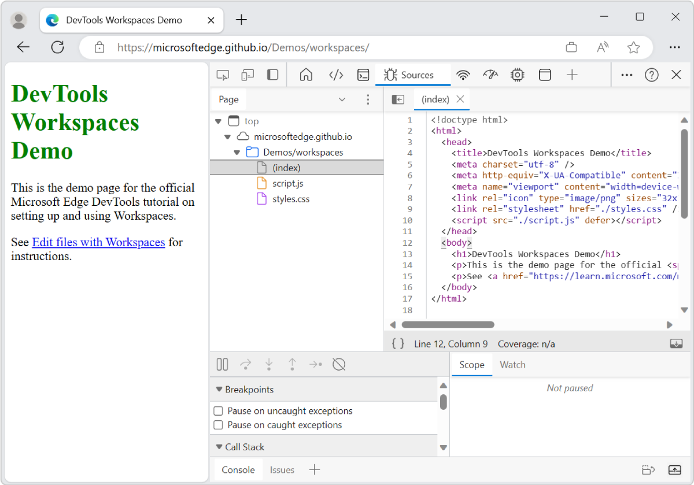

Unlike a JavaScript or CSS file, an HTML file that is returned by the web server cannot be directly edited in the Sources tool.  To edit an HTML file using the Editor of the Sources tool, the HTML file must be in a Workspace or on the **Overrides** tab.  See these subsections of the current article:
* [Add a local folder to the workspace, to use DevTools to edit files and save changes to disk](#add-a-local-folder-to-the-workspace-to-use-devtools-to-edit-files-and-save-changes-to-disk)
* [Using the Overrides tab to override server files with local files](#using-the-overrides-tab-to-override-server-files-with-local-files)

To save changes, press **Ctrl+S** on Windows/Linux or **Command+S** on macOS.  An edited file is marked by an asterisk.

To find text, press **Ctrl+F** on Windows/Linux or **Command+F** on macOS.

To undo an edit, press **Ctrl+Z** on Windows/Linux or **Command+Z** on macOS.

To view other commands while editing an HTML file, in the Editor pane, right-click the HTML file.

See also:
* [Open a demo folder from the Workspace tab in the Sources tool](../../devtools/samples/index.md#open-a-demo-folder-from-the-workspace-tab-in-the-sources-tool) in _Sample code for DevTools_.


<!-- ------------------------------ -->
#### Going to a line number or function

To go to a line number or symbol (such as a function name) in the file which is open in the Editor pane, you can use the **Command Menu**, rather than scrolling through the file.

1.  In the **Navigator** pane, select the ellipses (...) (**More options**), and then select **Open File**.  The **Command Menu** appears.
1.  Type one of the following characters:

| Character | Command name | Purpose |
|---|---|---|
| \: | **Go to line** | Go to a line number. |
| \@ | **Go to symbol** | Go to a function.  When you type **@**, the **Command Menu** lists the functions that are found in the JavaScript file which is open in the Editor pane. |

For more information, see [Run commands with the Microsoft Edge DevTools Command Menu](../command-menu/index.md).


<!-- ------------------------------ -->
#### Quick source tool, to display source files when using a different tool

The main place to view source files in the DevTools is within the **Sources** tool.  But sometimes you need to access other tools, such as **Elements** or **Console**, while viewing or editing your source files.  You use the **Quick source** tool in the [Quick View](../customize/index.md#quick-view) panel at the bottom of DevTools.

To use the **Quick source** tool:

1. In the **Activity Bar** at the top of DevTools, select a tool other than the **Sources** tool, such as the **Elements** tool.

1. Press **Ctrl+Shift+P** (Windows, Linux) or **Command+Shift+P** (macOS).  The **Command Menu** opens.

1. Type **quick**, and then select **Show Quick source**.

   The **Quick View** panel opens at the bottom of DevTools, with the **Quick source** tool selected.  The **Quick source** tool displays the same files that are open in the **Sources** tool, within a compact version of the DevTools code editor.

1. Press **Ctrl+P** (Windows, Linux) or **Command+P** (macOS) to open the **Open File** dialog.

See also:
* [Display or edit source files using the Quick source tool](../quick-source/quick-source-tool.md)
* [Track changes to files using the Changes tool](../changes/changes-tool.md)


<!-- ====================================================================== -->
## Using the Debugger pane to debug JavaScript code

Use the JavaScript debugger to step through the JavaScript code that's returned by the server.
The debugger includes the **Debugger** pane, along with breakpoints that you set on lines of code in the **Editor** pane.

With the debugger, you step through the code, while watching any JavaScript expressions you specify.  Watch and manually change variable values, and automatically show which variables are in-scope for the current statement.

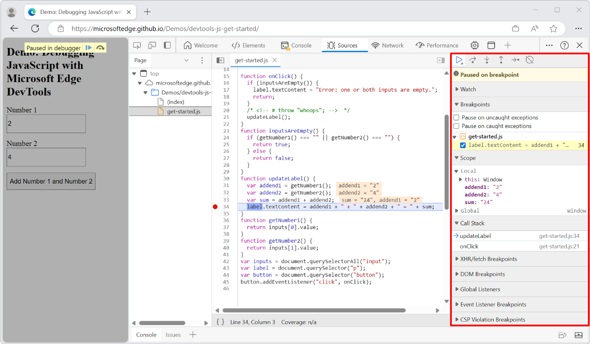

The debugger supports standard debugging actions, such as:
*  Setting breakpoints, to pause code.
*  Stepping through code.
*  Viewing and editing properties and variables.
*  Watching the values of JavaScript expressions.
*  Viewing the call stack (the sequence of function calls so far).

The debugger in DevTools is designed to look, feel, and work like [the debugger in Visual Studio Code](https://code.visualstudio.com/docs/editor/debugging) and [the debugger in Visual Studio](/visualstudio/debugger/navigating-through-code-with-the-debugger).

The following subsections cover debugging:
* [The basic approach to using a debugger](#the-basic-approach-to-using-a-debugger)
* [Advantages of the debugger's Watch and Scope over console.log](#advantages-of-the-debuggers-watch-and-scope-over-consolelog)
* [Debug from Visual Studio Code directly](#debug-from-visual-studio-code-directly)
* [Articles about debugging](#articles-about-debugging)


<!-- ------------------------------ -->
#### The basic approach to using a debugger

To troubleshoot JavaScript code, you can insert `console.log()` statements in your code.  Another, more powerful approach is to use the debugger of Microsoft Edge DevTools.  Using a debugger can actually be simpler than `console.log()`, once you're familiar with the debugger approach.

To use a debugger on a webpage, you typically set a breakpoint and then send a form from the webpage, as follows:

1. Open the [Debugging JavaScript with Microsoft Edge DevTools](https://microsoftedge.github.io/Demos/devtools-js-get-started/) webpage in a new window or tab.

   <!-- You can view the source code for the demo page at the [MicrosoftEdge/Demos > devtools-js-get-started](https://github.com/MicrosoftEdge/Demos/tree/main/devtools-js-get-started) repo folder. -->

1. Right-click anywhere in the webpage, and then select **Inspect**.  Or, press **F12**.  The **DevTools** window opens, next to the demo webpage.

1. In DevTools, select the **Sources** tab.

1. In the **Navigator** pane (on the left), select the **Page** tab, and then select the JavaScript file, such as `get-started.js`.

1. In the **Editor** pane, select a line number near a suspect line of code, to set a breakpoint on that line.  In the figure below, a breakpoint is set on the line `var sum = addend1 + addend2;`.

1. In the webpage, enter values and submit the form.  For example, enter numbers, such as **5** and **1**, then click the button **Add Number 1 and Number 2**.

    The debugger runs the JavaScript code and then pauses at the breakpoint.  The debugger is now in Paused mode, so you can inspect the values of the properties that are in-scope, and step through the code.

   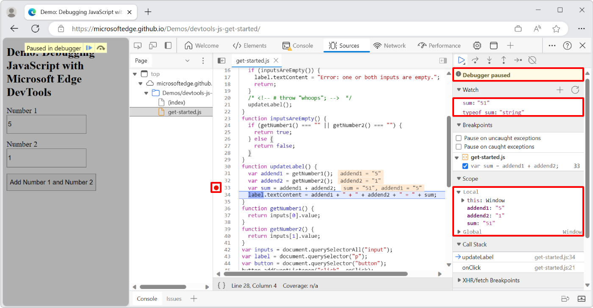

    In the above figure, we added the Watch expressions `sum` and `typeof sum`, and stepped two lines past the breakpoint.

1. Examine the values in the **Scope** pane, which shows all variables or properties that are in-scope for the current breakpoint, and their values.

   At this point, you could add expressions in the **Watch** pane.  These expressions are the same expressions that you would write within a `console.log` statement to debug your code.

   To run JavaScript commands to manipulate data in the current context, you use the **Console**.  If you want to open the Console in the **Quick View** panel at the bottom of DevTools, press **Esc**.

1. Step through the code by using the controls at the top of the **Debugger** pane, such as **Step** (**F9**).

    The bug in this demo is that you need to first convert the input data from strings to numbers.

1.  To fix the bug, refresh the page to reset the webpage form, and then change the line:

    ```javascript
    var sum = addend1 + addend2;
    ```

    to:

    ```javascript
    var sum = parseInt(addend1) + parseInt(addend2);
    ```

1.  Press **Ctrl+S** (Windows, Linux) or **Command+S** (macOS) to save the change in the local cached file.

1.  Enter **5** and **1** into the webpage and then click the **Add** button.  Now **Scope** > **Local** > **sum:** is the number 6, instead of the string "51".


See also:
* [Sources tool keyboard shortcuts](../shortcuts/index.md#sources-tool-keyboard-shortcuts) in _Keyboard shortcuts_
* [Get started debugging JavaScript](../javascript/index.md) - a tutorial using an existing, simple webpage that contains a few form controls.


<!-- ------------------------------ -->
#### Advantages of the debugger's Watch and Scope over console.log

These three approaches are equivalent:

*  Temporarily adding the statements `console.log(sum)` and `console.log(typeof sum)` in the code, where `sum` is in-scope.

*  Issuing the statements `sum` and `console.log(typeof sum)` in the **Console** pane of the DevTools, when the debugger is paused where `sum` is in-scope.

*  Setting the **Watch** expressions `sum` and `typeof sum` in the **Debugger** pane.

When the variable `sum` is in-scope, `sum` and its value are automatically shown in the **Scope** section of the **Debugger** pane, and are also overlaid in the Editor pane where `sum` is calculated.  So you probably wouldn't need to define a Watch expression for `sum`.

The debugger gives a richer, more flexible display and environment than a `console.log` statement.  For example, in the debugger, as you step through the code, you can display and change the values of all currently defined properties and variables.  You can also issue JavaScript statements in the **Console**, such as to change values in an array that's in-scope.  (To show the Console, press **Esc**.)

Breakpoints and Watch expressions are preserved when you refresh the webpage.


<!-- ------------------------------ -->
#### Debug from Visual Studio Code directly

To use the more full-featured debugger of Visual Studio Code instead of the DevTools debugger, use the **Microsoft Edge DevTools** extension for Visual Studio Code.

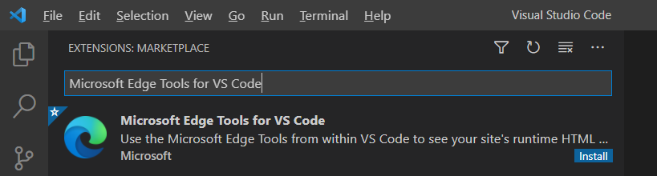

This extension provides access to the **Elements** and **Network** tools of Microsoft Edge DevTools, from within Microsoft Visual Studio Code.

For more information, see [Visual Studio Code for web development](../../visual-studio-code/index.md) and the GitHub Readme page, [Microsoft Edge Developer Tools for Visual Studio Code](https://github.com/microsoft/vscode-edge-devtools).


<!-- ------------------------------ -->
#### Articles about debugging

The following articles cover the **Debugger** pane and breakpoints:

* [Get started debugging JavaScript](../javascript/index.md) - A tutorial (with screen captures), using an existing, simple project.

* [JavaScript debugging features](../javascript/reference.md) - How to use the debugger to set breakpoints, step through code, view and modify variable values, watch JavaScript expressions, and view the call stack.

* [Pause your code with breakpoints](../javascript/breakpoints.md) - How to set basic and specialized breakpoints in the debugger.


<!-- ====================================================================== -->
## See also

* [Open a demo folder from the Workspace tab in the Sources tool](../../devtools/samples/index.md#open-a-demo-folder-from-the-workspace-tab-in-the-sources-tool) in _Sample code for DevTools_.
* [Sources tool keyboard shortcuts](../shortcuts/index.md#sources-tool-keyboard-shortcuts) in _Keyboard shortcuts_.
* [Display or edit source files using the Quick source tool](../quick-source/quick-source-tool.md)
* [Track changes to files using the Changes tool](../changes/changes-tool.md)


<!-- ====================================================================== -->
> [!NOTE]
> Portions of this page are modifications based on work created and [shared by Google](https://developers.google.com/terms/site-policies) and used according to terms described in the [Creative Commons Attribution 4.0 International License](https://creativecommons.org/licenses/by/4.0).
> The original page is found [here](https://developer.chrome.com/docs/devtools/sources) and is authored by Kayce Basques.

[](https://creativecommons.org/licenses/by/4.0)
This work is licensed under a [Creative Commons Attribution 4.0 International License](https://creativecommons.org/licenses/by/4.0).
