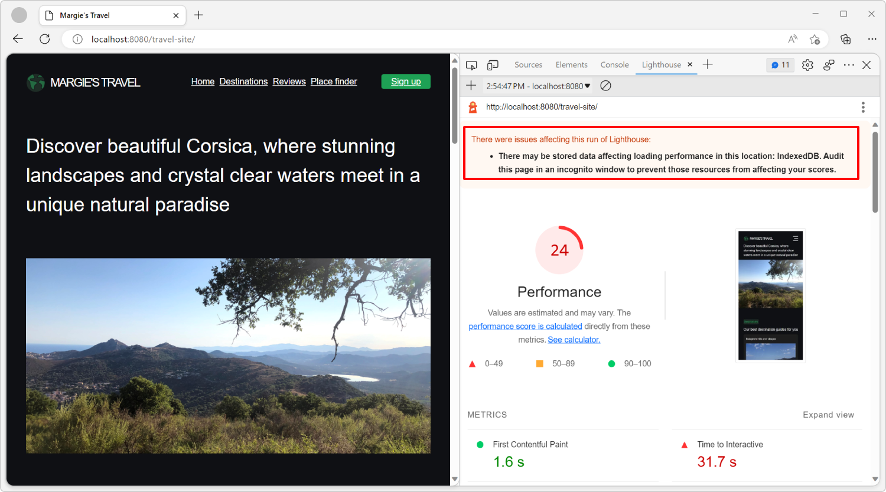
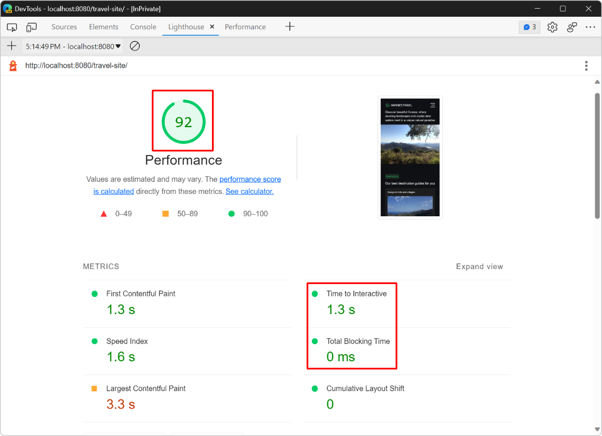

<!-- Copyright Kayce Basques

   Licensed under the Apache License, Version 2.0 (the "License");
   you may not use this file except in compliance with the License.
   You may obtain a copy of the License at

       https://www.apache.org/licenses/LICENSE-2.0

   Unless required by applicable law or agreed to in writing, software
   distributed under the License is distributed on an "AS IS" BASIS,
   WITHOUT WARRANTIES OR CONDITIONS OF ANY KIND, either express or implied.
   See the License for the specific language governing permissions and
   limitations under the License.  -->
# Optimize website speed using Lighthouse
<!-- Lighthouse: Optimize website speed  https://developer.chrome.com/docs/devtools/lighthouse -->
<!-- https://developer.chrome.com/docs/devtools/lighthouse#goal_of_tutorial -->

This tutorial teaches you how to use **Lighthouse** and other tools in DevTools to find ways to make your websites load faster.

The **Lighthouse** tool provides links to content that's hosted on third-party websites.  Microsoft isn't responsible for and has no control over the content of these sites and any data that may be collected.


<!-- ====================================================================== -->
## Prerequisites
<!-- https://developer.chrome.com/docs/devtools/lighthouse#prerequisites -->

* Install [Visual Studio Code](https://code.visualstudio.com) to edit source code.

* Install [Node.js](https://nodejs.org) to use it as a local web server.


<!-- ====================================================================== -->
## Introduction
<!-- https://developer.chrome.com/docs/devtools/lighthouse#intro -->

In this tutorial, you improve the performance of [Margie's travel](https://microsoftedge.github.io/Demos/travel-site/), a fictitious travel website that contains travel images, text descriptions, a few JavaScript-based user interactions, and an interactive map.

The source files for the website are at [MicrosoftEdge / Demos > travel-site](https://github.com/MicrosoftEdge/Demos/tree/main/travel-site). 


<!-- next two sections are reverse order vs upstream -->
<!-- ====================================================================== -->
## Step 1: Set up the website locally
<!-- Set up  https://developer.chrome.com/docs/devtools/lighthouse#setup -->

First, set up the website locally, so that you can make changes to it later:

1. Get the website's source code locally: [Clone the Edge Demos repo to your drive](../samples/index.md#clone-the-edge-demos-repo-to-your-drive) in _Sample code for DevTools_.

1. Open the folder you just downloaded or cloned in Visual Studio Code.

1. In Visual Studio Code, select **View** > **Terminal**.  Or, press **Ctrl+\`**.

   Visual Studio Code displays the source files in the **Explorer** sidebar, and displays the **Terminal**:

   

1. In the terminal, type `npx http-server` to start a local web server.

    This local web server will be stopped when you close Visual Studio Code.

1. In Microsoft Edge, go to `http://localhost:8080/travel-site` to open the website:

   


<!-- ====================================================================== -->
## Step 2: Audit the site
<!-- https://developer.chrome.com/docs/devtools/lighthouse#audit -->

Whenever you set out to improve the load performance of a site, always start with an audit.

The audit has two important functions:

*  It creates a **baseline** for you to measure subsequent changes against.

*  It gives you **actionable tips** on what changes improve performance the most.


<!-- ------------------------------ -->
#### Establish a baseline
<!-- https://developer.chrome.com/docs/devtools/lighthouse#baseline -->

The baseline is a record of how the site performed before you made any performance improvements.

1. In Microsoft Edge, open DevTools by right-clicking the webpage, and then selecting **Inspect**.  Or, press **Ctrl+Shift+I** (Windows, Linux) or **Command+Option+I** (macOS).

1. In DevTools, on the main toolbar, select the **Lighthouse** tab.  If that tab isn't visible, click the **More tabs** () button, or else the **More Tools** () button.

1. Select the **Performance** category, and clear all the other categories. For now, keep the other default options. The options are:

   *  **Mode**: To run tests during the load of the webpage, set this option to **Navigation (default)**. To run tests during a period of time, set the option to **Timespan**. To run tests on the webpage as it appears now, set the option to **Snapshot**.

   *  **Device**: To simulate a mobile user agent string and a mobile viewport, set this option to **Mobile**.  To test the webpage without any simulation, set this option to **Desktop**.

   *  **Categories**: this option allows you to run only a subset of the tests available in **Lighthouse**.

1. Click **Analyze page load**:

    

1. After 10 to 30 seconds, a report of the performance of the site appears:

   


<!-- ------------------------------ -->
#### Handling report errors
<!-- https://developer.chrome.com/docs/devtools/lighthouse#errors -->

If the **Lighthouse** report shows errors, try running **Lighthouse** again from an **InPrivate** window, with no other tabs open. Running **Lighthouse** from an **InPrivate** window ensures that the auditing process runs without interference.



To open an **InPrivate** window:

1. Click the **Settings and more** (**...**) button in the Microsoft Edge toolbar (above the DevTools toolbar).

1. Click **New InPrivate window**.

1. Establish a new baseline in **Lighthouse**:

   


<!-- ------------------------------ -->
#### Understand your report
<!-- https://developer.chrome.com/docs/devtools/lighthouse#report -->


<!-- ---------- -->
###### Overall performance score

The number at the top of your report is the overall performance score for the webpage.  Later, as you make changes to the code, the number displayed should increase.  A higher score means better performance.


<!-- ---------- -->
###### Metrics
<!-- https://developer.chrome.com/docs/devtools/lighthouse#metrics -->

The **Metrics** section provides quantitative measurements of the performance of the webpage:


Each metric provides insight into a different aspect of the performance.  For example:

*  **First Contentful Paint** indicates when content first appears on the screen.  This is an important milestone in the user's perception of the page load.
*  **Time To Interactive** marks the point at which the rendered page is ready to handle user interactions.

Click **Expand view** to display a description for each metric.  Then click **Learn More** to read documentation about it:


<!-- ---------- -->
###### Screenshots
<!-- https://developer.chrome.com/docs/devtools/lighthouse#screenshots -->

Below the **Metrics** section is a collection of screenshots that show you how the page looked while it was loading:


<!-- ---------- -->
###### Opportunities
<!-- https://developer.chrome.com/docs/devtools/lighthouse#opportunities -->

The **Opportunities** section provides specific tips on how to improve the load performance of this particular webpage:


Click an opportunity to display more information about it, and then click **Learn more** to read about why an opportunity is important, and specific recommendations on how to fix it:


<!-- ---------- -->
###### Diagnostics
<!-- https://developer.chrome.com/docs/devtools/lighthouse#diagnostics -->

The **Diagnostics** section provides more information about factors that contribute to the load time of the page:


<!-- ---------- -->
###### Passed audits
<!-- https://developer.chrome.com/docs/devtools/lighthouse#passed-audits -->

The **Passed audits** section shows you what the site is doing correctly.  Click **Show** to expand the section:


<!-- ====================================================================== -->
## Step 3: Experiment
<!-- Step 2: Experiment  https://developer.chrome.com/docs/devtools/lighthouse#experiment -->

The **Opportunities** section of your report gives you tips on how to improve the performance of the webpage.  In this section, you implement the recommended changes to the code base, auditing the site again after each change to measure how that change affects site speed.


<!-- ------------------------------ -->
<!-- #### Enable text compression -->
<!-- https://developer.chrome.com/docs/devtools/lighthouse#compression -->

<!-- todo: add this section? 2025/09/24 -->


<!-- ---------- -->
<!-- ###### Text compression in the real world -->
<!-- https://developer.chrome.com/docs/devtools/lighthouse#real-world-compression -->

<!-- todo: add this section? 2025/09/24 -->


<!-- ------------------------------ -->
#### Resize images
<!-- https://developer.chrome.com/docs/devtools/lighthouse#images -->

Your report indicates that serving appropriately sized images is one of the top opportunities for improving the performance of the page.  Resizing images helps reduce the size of the network payload.  If your user is viewing your images on a mobile device screen that is 500 pixels wide, there's really no point in sending a 1500-pixel-wide image.  Ideally, you send a 500-pixel-wide image, at most.

In the **Opportunities** section of your report, click **Properly size images** to display which images to resize. **Lighthouse** lists four `.jpg` files that you can resize to improve load time:


Before resizing these images, verify the amount of data the server must send to the browser to display these images:

1. Open the **Network** tool.

    If the tool is empty, refresh the page.

1. In the **Filter** text box, type `.jpg` to filter the list of requests and only show the four images.

    To learn more about filtering requests in the **Network** tool, see [Filter requests](../network/reference.md#filter-requests) in _Network features reference_.

1. Check the bottom toolbar in the **Network** tool to verify the amount of data transferred because of the images:

    

    The bottom toolbar shows that the four images contribute 16.4 MB of the total 17.3 MB of data transferred for this webpage.

Next, resize the images and run a new audit:

1. In Visual Studio Code, open the `/travel-site/assets/img/optimized/` folder in the **Explorer**, which contains a copy of the four images that are displayed on the webpage, but already optimized for you. These images are 1000 pixels wide, and they use the more optimized `.webp` format.

    Resizing images depends on your operating system. For example, to resize images on Windows, you can use **PowerToys**. To learn more, see [Image Resizer utility](/windows/powertoys/image-resizer).

1. Open the `/travel-site/index.html` file and replace the four image paths as follows:

    * Replace the four instances of `assets/img/` in the file with `assets/img/optimized`.

    * Replace the four instances of `.jpg` in the file with `.webp`.

1. In **Lighthouse**, click **Run an audit** () to go back to the main **Lighthouse** page without losing your baseline report.

1. Click **Analyze page load** again to see how the change affects load performance:

    

Your score increased from 18 to 26. To verify how much data you saved, use the **Network** tool like you did before:


Now, the images on the webpage only require transferring 360 KB of data, instead of 16.4 MB.


<!-- ---------- -->
###### Automatically resize images
<!-- Resizing images in the real world  https://developer.chrome.com/docs/devtools/lighthouse#real-world-resizing -->

For a small app, doing a one-off resize like this might be good enough. But for a large app, consider these strategies for managing images:

*  Automatically resize images during your build process.

*  Create multiple sizes of each image during the build process and then use `srcset` in your code.  At runtime, the browser takes care of choosing which size is best for the device.

*  Use an image CDN that lets you dynamically resize an image when you request it.

*  At least, optimize each image.  This can often create huge savings.

   _Optimization_ means running an image through a program that reduces the size of the image file.

See also:
* [Using responsive images in HTML](https://developer.mozilla.org/docs/Web/HTML/Guides/Responsive_images) at MDN.
* [HTMLImageElement: srcset property](https://developer.mozilla.org/docs/Web/API/HTMLImageElement/srcset) at MDN.


<!-- ------------------------------ -->
#### Reduce unused JavaScript
<!-- not in upstream -->

Your latest **Lighthouse** report says that the webpage contains unused JavaScript code and that loading this code only when required would decrease the amount of data transferred when the page loads.

Click **Reduce unused JavaScript** to reveal the JavaScript files that contain the most unused code:


The reported JavaScript files are from the `www.bing.com` domain, which means the unused code comes from the Bing Map component used on the webpage. Scroll down on the **Margie's travel** demo website to see the map:


To confirm the amount of unused code and possibly find other resources that are unused, use the **Coverage** tool:

1. In DevTools, press **Ctrl+Shift+P** (Windows, Linux) or **Command+Shift+P** (macOS) to open the **Command Menu**, start typing `Coverage`, and then select **Show Coverage** in the list.

    

1. In the **Coverage** tool, click **Start instrumenting coverage and refresh the page** (). The **Coverage** tool provides an overview of how much of the JavaScript and CSS code that's loaded on the page was actually run.

    

The coverage report confirms that the Bing Map dependencies contain code that's unused when the page loads. The map on the demo website isn't visible when the page first loads. There's a good opportunity to improve performance by loading the Bing Map only when that section of the page becomes visible to users.

Use the Intersection Observer API to detect when the map becomes visible to the user. The Intersection Observer API provides a way to observe changes in the intersection of a target element (the map, in this case) with the webpage's viewport. To learn more, see [Intersection Observer API](https://developer.mozilla.org/docs/Web/API/Intersection_Observer_API) at MDN.

1. In Visual Studio Code, open the `/travel-site/index.html` file and scroll down to the bottom of the file. The Bing Map API is loaded by using a `<script>` tag:

    

    Below this line is another line that's responsible for configuring and loading the map in the right place: `<script src="assets/map.js"></script>`

1. Delete these two lines and add this new line instead: `<script src="assets/map-on-demand.js"></script>`.

    

1. Open the `/travel-site/assets/map-on-demand.js` file in Visual Studio Code and read through the code to understand how it loads and initializes the Bing Map component. Here is a snippet from that code along with a description of how it works:

    ```javascript
    const MAP_CONTAINER_EL = document.querySelector('.place-discover-map');

    const mapElIntersectionObserver = new IntersectionObserver(loadMapOnDemand);
    mapElIntersectionObserver.observe(MAP_CONTAINER_EL);
 
    let map = null;
   
    function loadMapOnDemand(entries) {
       if (map) {
         return;
       }
   
       if (!entries.some(entry => entry.isIntersecting)) {
         return;
       }
   
       const script = document.createElement('script');
       script.type = 'text/javascript';
       script.src = 'https://www.bing.com/api/maps/mapcontrol?callback=GetMap&key=Ap_eazGgpq5468v9MXr7Wu0zh30LQActgaT-tI_QxZQSm-Bd5qJxVKs_2B7NsqR4';
       document.body.appendChild(script);
    }

    function GetMap() { /* ... */ }
    ```

    The code initializes the `mapElIntersectionObserver` variable to a new `IntersectionObserver` object. This observer then starts observing the `MAP_CONTAINER_EL` element, which is the element on the page that's meant to contain the map.

    As the user scrolls, the observer's `loadMapOnDemand` callback function runs. This function doesn't do anything when the map already exists, or if the map container element doesn't intersect the current viewport.

    If the user scrolls to a point where the map container element becomes visible in the viewport, and if the map isn't initialized yet, the code creates a new `script` element, sets its `src` attribute to the Bing Map API, and inserts the `script` into the page.

    The rest of the `map-on-demand.js` file is the same as the `map.js` file. As soon as the Bing Map API loads, the `GetMap` function runs. `GetMap` configures and displays the map in the container element.

1. Save your changes in Visual Studio Code, then refresh the webpage in Microsoft Edge, and run a new audit in the **Lighthouse** tool to see how your changes affect the load performance:

    

    Your **Lighthouse** score is now at 31, which is an improvement from before, but there are more things to optimize.


<!-- ------------------------------ -->
#### Eliminate render-blocking resources
<!-- https://developer.chrome.com/docs/devtools/lighthouse#render -->

The next opportunity displayed in the **Opportunities** section of the **Lighthouse** tool is related to eliminating render-blocking resources.

A render-blocking resource is an external JavaScript or CSS file that the browser must download, parse, and run before it displays the page. The more render-blocking resources need to be processed when a webpage loads, the longer the webpage needs, to start appearing in the browser. Try to only run the core CSS and JavaScript code that's required to display the initial state of the page properly.

The first task, then, is to find code that you don't need to run on page load.

1. Click **Eliminate render-blocking resources** to display the resources that are blocking:

   

    **Lighthouse** displays a list of the stylesheets that the demo webpage uses, such as: `base.css`, `home.css`, and `map.css`.

1. Open the **Coverage** tool again: press **Ctrl+Shift+P** (Windows, Linux) or **Command+Shift+P** (macOS), type **Coverage**, and then select **Show Coverage**.

1. Click **Start instrumenting coverage and refresh the page** () to display the coverage report, and then type `css` in the **URL filter** field to only display the CSS files:

   

    The report shows that the `contact-form.css` and `gallery.css` files aren't used at all. They both have 100% unused bytes.

1. Click the `contact-form.css` file in the report.  DevTools opens the file in the **Sources** tool.  If a line of code ran, a blue bar appears next to it.  A red bar means the line of code didn't run, and is definitely not needed on load of the webpage.

   

   Only red bars are displayed in this source file, which means that the webpage doesn't need this file at all. 

Now, remove the references to these files from the code:

1. In Visual Studio Code, open the `/travel-site/index.html` file.

1. Near the top of the file, find the list of `<link>` tags that load the stylesheets on the page.

1. Delete the two lines of code that load the `contact-form.css` and `gallery.css` files:

    

1. Save your changes in Visual Studio Code, then refresh the webpage in Microsoft Edge, and run a new audit in the **Lighthouse** tool again to see how your changes affect the load performance.


<!-- ---------- -->
###### Automatically remove non-critical CSS
<!-- Optimizing the Critical Rendering Path in the real-world  https://developer.chrome.com/docs/devtools/lighthouse#crp -->

In the previous step, your score improved slightly, but **Lighthouse** still flags other CSS files as blocking the initial render of the page.

The webpage uses the remaining CSS files so you can't remove them. However, it's possible to split them in two groups:

* Critical CSS code that needs to block the rendering of the webpage because it visually impacts the style and layout of the part of the webpage that users see when it loads.

    For example, the title on the webpage uses the `header h1` CSS rule in the `/travel-site/assets/base.css` file.

* Non-critical CSS code that's used to render parts of the page that aren't visible when the page loads.

    For example, the `/travel-site/assets/desktop.css` file is only needed when the viewport is larger than `665px`.

To automatically split your CSS code this way, you can use the _Critical_ tool. To learn more, see the [Critical project repo](https://github.com/addyosmani/critical).

You can then load your non-critical CSS code in a way that doesn't block the initial render of the page.

It's also good to minify your CSS code and remove unneeded whitespace characters and comments.  See [Minify CSS](https://developer.chrome.com/docs/lighthouse/performance/unminified-css)<!-- chrome link ok, it's from Lighthouse docs --> at developer.chrome.com.

See also:
* [CSS performance optimization](https://developer.mozilla.org/docs/Learn_web_development/Extensions/Performance/CSS) at MDN.


<!-- ------------------------------ -->
#### Reduce layout shift by setting explicit width and height on images
<!-- not in upstream -->

In your **Lighthouse** report, the **Diagnostics** section suggests defining explicit `width` and `height` for image elements. Click on **Image elements do not have explicit width and height**  to display more information:


The report says that the image at the top of the webpage doesn't have explicit `width` and `height` attributes, which can cause layout shifts.

Layout shifts occur when portions of a webpage initially appear in one place but then move to another position during the load of the page. For example, when an image loads, the browser doesn't know how much space to reserve for it until the image is fully loaded.

To prevent layout shifts caused by loading images on a webpage, do either of the following:

* Define each image's `width` and `height` attributes in the HTML code.
* Reserve the space in CSS by using the `aspect-ratio` CSS property.

See also:
* [Rendering strategy: preventing jank when loading images](https://developer.mozilla.org/docs/Learn_web_development/Extensions/Performance/Multimedia#rendering_strategy_preventing_jank_when_loading_images/) in _Multimedia: Images_ at MDN.
* [: The Image Embed element](https://developer.mozilla.org/docs/Web/HTML/Reference/Elements/img) at MDN.

In the following steps, you use the `aspect-ratio` CSS property to avoid layout shifts:

1. In Visual Studio Code, open the `/travel-site/assets/home.css` file, and then search for the CSS rule that has the `.hero-image img` selector.

1. Modify the CSS rule so it looks like this:

    ```css
    .hero-image img {
      width: calc(100% + 2 * var(--main-margin));
      position: relative;
      left: calc(-1 * var(--main-margin));
      aspect-ratio: 1.5;
      object-fit: cover;
    }
    ```

    Before this change, the CSS rule already contained a `width` property, so the browser knew how much horizontal space to reserve for the image. By adding the `aspect-ratio` property, you also tell the browser how much vertical space to reserve. By adding the `object-fit` property, you avoid distorting the image if its CSS dimensions don't match the actual image file's dimensions.

1. Open the `/travel-site/assets/desktop.css` file, and then search for the CSS rule that has the same `.hero-image img` selector.

    The `desktop.css` file is used only when the viewport is larger than `665px`, for when the webpage is displayed on a large screen, for example when used on a laptop computer.

1. Modify the CSS rule so it looks like this:

    ```css
    .hero-image img {
        width: 100%;
        position: static;
        aspect-ratio: 2.5;
        object-fit: cover;
    }
    ```

    This time, the CSS rule already had a `width` and `object-fit` defined. But instead of defining a `max-height` for the image, you use the `aspect-ratio` property to make sure the browser knows exactly how much space to reserve for the image on desktop devices.

1. Save your changes in Visual Studio Code, then refresh the webpage in Microsoft Edge, and run a new audit in the **Lighthouse** tool to see how your changes affect the load performance:

    Your score is now up to 37, but more importantly the **Cumulative Layout Shift** score is down to 0, indicating that there are no more shifts in the layout as the page loads.

    


<!-- ------------------------------ -->
#### Do less work in the main thread
<!-- Do less main thread work  https://developer.chrome.com/docs/devtools/lighthouse#main -->

Your latest report shows high **Time to Interactive** and **Total Blocking Time** metric values, which means that there's still something on the webpage that takes a long time to run and prevents the page from being usable for several seconds.

Scroll down to the **Diagnostics** section which says to **Minimize main-thread work** and **Reduce JavaScript execution time**. The main thread is where the browser does most of the work that's needed to display a page, such as:

* Parsing and running HTML.
* Parsing and applying CSS to DOM elements. 
* Running JavaScript.

In this case, it looks like the biggest bottleneck is that the page runs too much JavaScript code on page load.

Use the **Performance** tool to analyze what work the main thread is doing while the page loads, and find ways to defer or remove unnecessary work:

1. Open the **Performance** tool.

1. In the **Performance** tool, click **Start profiling and reload the page** (), and then click **Stop** once the page has fully loaded.

    DevTools displays a visualization of all the work that the browser performed in order to load the page. This visualization is referred to as the _trace_:

    

The trace shows activity chronologically, from left to right. The CPU and NET charts at the top give you an overview of CPU and network activity. The light brown area in the CPU chart corresponds to a period of time when the browser was busy with scripting activity. This area is a clue that you may be able to speed up page load by doing less JavaScript work.


Investigate the trace to find ways to do less JavaScript work.

The **Main** section shows a chronological log of main thread activity, from left to right.  The y-axis (top to bottom) shows why events occurred.

For example, in the following figure, the browser spends most of the time in a **Parse HTML** event. As long as this event runs, the webpage isn't entirely displayed. This event caused a long **Evaluate Script** event, which corresponds to when the browser executes JavaScript code. The **Evaluate Script** event caused an `(anonymous)` function to run, which caused the `initRatings` function to run:


Optimize the `initRatings` function to make the page load faster:

1. In Visual Studio Code, open the `/travel-site/assets/rating.js` file and read through the code.

    The code in this file is responsible for displaying five customer reviews on the webpage.  Each review has a rating consisting of several stars, a quote, and an author.  These reviews come from a server-side API used in the `getRatings` function.  The `initRatings` function creates DOM elements in the page for each review.

1. In the `initRatings` function, find a way to make the JavaScript code faster.

    This webpage is just a demo, and a `for` loop was introduced to slow down the code.  In practice, there are many ways for a JavaScript file like this one to cause slow page loads, such as:

    * Accessing the DOM too frequently.
    * Running heavy computation tasks.
    * Using large JavaScript libraries or frameworks.

1. Delete the `for` loop at the beginning of the `initRatings` function, save your changes, and reload the page in Microsoft Edge.

1. Run a new audit in the **Lighthouse** tool to see how your changes affect the load performance:

    

    * Your score went up to 92.
    * The **Time to interactive** metric went down to 1.3 seconds.
    * The **Total Blocking Time** metric went down to 0 seconds.

To learn more about how to analyze page performance, see [Performance features reference)](../performance/reference.md).


<!-- ---------- -->
###### Doing less work in the main thread, in the real world
<!-- Doing less main thread work in the real world  https://developer.chrome.com/docs/devtools/lighthouse#real-world-main-thread -->

The **Performance** tool is the most common way to understand what activity your webpage does as it loads, and to find ways to remove unnecessary activity.

If you prefer an approach that feels more like `console.log()`, the [User Timing API](https://developer.mozilla.org/docs/Web/API/User_Timing_API) enables you to arbitrarily mark up certain phases of your app lifecycle, in order to track how long each of those phases takes.

Webpages often load slowly when they use JavaScript for generating most of their user interfaces.  To improve your webpage's performance, consider moving the code that creates your webpage's user interface to the server side, and delivering that code to the browser as HTML and CSS.


<!-- ====================================================================== -->
## Summary
<!-- https://developer.chrome.com/docs/devtools/lighthouse#summary -->

* Whenever you set out to optimize the load performance of a site, always start with an audit.  The audit establishes a baseline, and gives you tips on how to improve.

* Make one change at a time, and audit the webpage after each change in order to display how that isolated change affects performance.


<!-- ====================================================================== -->
> [!NOTE]
> Portions of this page are modifications based on work created and [shared by Google](https://developers.google.com/terms/site-policies) and used according to terms described in the [Creative Commons Attribution 4.0 International License](https://creativecommons.org/licenses/by/4.0).
> The original page is found [here](https://developer.chrome.com/docs/devtools/lighthouse) and is authored by Kayce Basques.

[](https://creativecommons.org/licenses/by/4.0)
This work is licensed under a [Creative Commons Attribution 4.0 International License](https://creativecommons.org/licenses/by/4.0).
