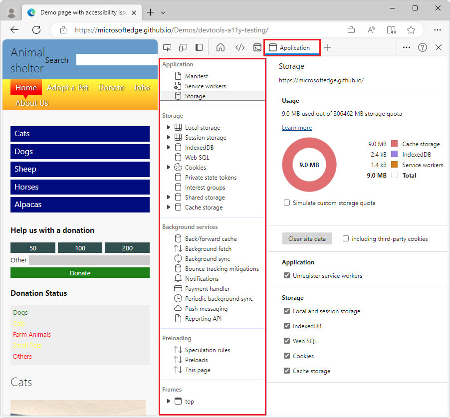
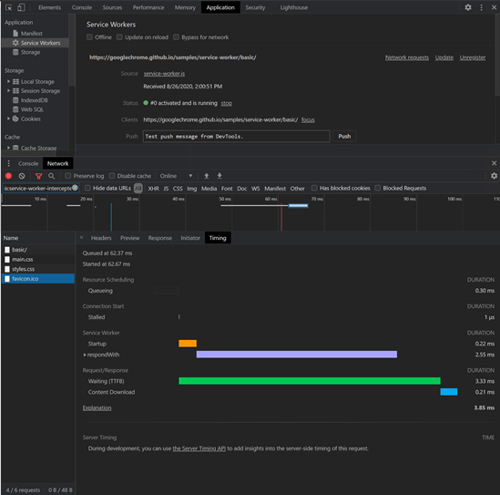

# Application tool, to manage storage

Use the **Application** tool to manage storage for web app pages, including manifest, service workers, local storage, cookies, cache storage, and background services.

The **Application** tool has the following pages, listed on the left:

* Application
   * Manifest
   * Service workers
   * Storage

* Storage
   * Local storage
   * Session storage
   * IndexedDB
   * Web SQL
   * Cookies
   * Private state tokens
   * Interest groups
   * Shared storage
   * Cache storage

* Background services
   * Back/forward cache
   * Background fetch
   * Background sync
   * Bounce tracking mitigations
   * Notifications
   * Payment handler
   * Periodic background sync
   * Push messaging
   * Reporting API

* Preloading
   * Speculation rules
   * Preloads
   * This page

* Frames 
   * top

To interpret the **Storage** > **Usage** section in the **Application** tool, see [Quota usage](../progressive-web-apps/index.md#quota-usage) in _Debug a Progressive Web App (PWA)_.

<!-- ====================================================================== -->
## Service worker update timeline

The **Application** tool helps you work with service workers and the network requests that pass through each service worker.

For example, the following tasks are supported:<!-- todo: how? where? -->

* Debug based on service worker timelines.<!-- todo: how? where? -->
    * The start of a request and duration of the bootstrap.
    * Update to service worker registration.<!-- todo: how? where? -->
    * The runtime of a request using the [fetch event](https://developer.mozilla.org/docs/Web/API/FetchEvent) handler.
    * The runtime of all fetch events for loading a client.
* Explore the runtime details of fetch event handlers, install event handlers, and activate event handlers.<!-- todo: how? where? -->
* Step into and out of fetch event handler with page script information, in the **Sources** tool.

Features for working on service workers are in the following tools:

* The **Network** tool:

   * Select a network request that runs through a service worker and access the corresponding timeline of the service worker in the **Timing** tool<!-- todo: what is the Timing tool, how to nav to it, how to use it? --> within the **Network** tool.  See [Service workers](../network/reference.md#service-workers) in _Network features reference_.

* The **Application** tool:

   * To debug a service worker, use the **Service workers** page in the **Application** tool.

* The **Sources** tool:

   * Access page script information when stepping into fetch event handlers.  See [Viewing stack information for a service worker](../sources/index.md#viewing-stack-information-for-a-service-worker) in _Sources tool overview_.

<!-- ------------------------------ -->
#### Timeline

A timeline in the **Application** tool reflects the update lifecycle of the service worker.  This timeline displays the installation and activation events.

Each of the events have a corresponding dropdown arrow to give you more details.

See also:
* [Viewing stack information for a service worker](../sources/index.md#viewing-stack-information-for-a-service-worker) in _Sources tool overview_.
* [Service workers](../network/reference.md#service-workers) in _Network features reference_.
* [Service Worker API](https://developer.mozilla.org/docs/Web/API/Service_Worker_API) - at MDN, about service workers.
