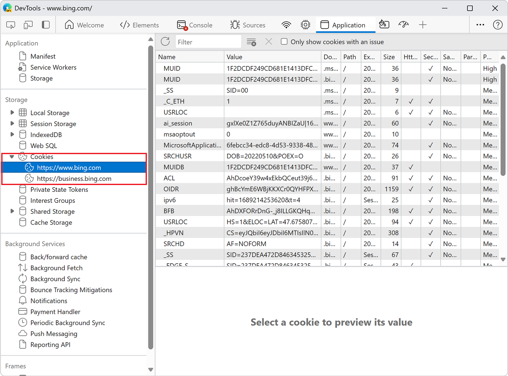

<!-- Copyright Kayce Basques

   Licensed under the Apache License, Version 2.0 (the "License");
   you may not use this file except in compliance with the License.
   You may obtain a copy of the License at

       https://www.apache.org/licenses/LICENSE-2.0

   Unless required by applicable law or agreed to in writing, software
   distributed under the License is distributed on an "AS IS" BASIS,
   WITHOUT WARRANTIES OR CONDITIONS OF ANY KIND, either express or implied.
   See the License for the specific language governing permissions and
   limitations under the License.  -->
# View, edit, and delete cookies
<!-- https://learn.microsoft.com/microsoft-edge/devtools/storage/cookies -->
<!-- https://developer.chrome.com/docs/devtools/application/cookies -->

_HTTP cookies_ are used to manage user sessions, store user personalization preferences, and track user behavior.  Use the **Cookies** pane of the **Application** tool to view, edit, and delete the HTTP cookies for a webpage.

See [Using HTTP cookies](https://developer.mozilla.org/docs/Web/HTTP/Cookies).

<!-- ====================================================================== -->
## Open the Cookies pane
<!-- https://developer.chrome.com/docs/devtools/application/cookies#open -->

1. Go to a webpage, such [Bing.com](https://www.bing.com).

1. Right-click the webpage, and then select **Inpsect**.

   DevTools opens.

1. In the **Activity Bar**, select the **Application** () tool.

1. In the outline on the left, in the **Storage** section, expand **Cookies**, then select an origin, such as `https://www.bing.com`:

   

<!-- ====================================================================== -->
## Fields
<!-- https://developer.chrome.com/docs/devtools/application/cookies#fields -->

The **Cookies** table contains the following fields:

*  **Name**.  The name of the cookie.

*  **Value**.  The value of the cookie.

*  **Domain**.  The hosts that are allowed to receive the cookie.  See [Scope of cookies](https://developer.mozilla.org/docs/Web/HTTP/Cookies#Scope_of_cookies).

*  **Path**.  The URL that must exist in the requested URL in order to send the `Cookie` header.  See [Scope of cookies](https://developer.mozilla.org/docs/Web/HTTP/Cookies#Scope_of_cookies).

*  **Expires / Max-Age**.  The expiration date or maximum age of the cookie.  See [Permanent cookies](https://developer.mozilla.org/docs/Web/HTTP/Cookies#Permanent_cookies).  For [session cookies](https://developer.mozilla.org/docs/Web/HTTP/Cookies#Session_cookies) this value is always `Session`.

*  **Size**.  The size, in bytes, of the cookie.

*  **HttpOnly**.  If `true`, this field indicates that the cookie should only be used over HTTP, and JavaScript modification isn't allowed.  See [HttpOnly cookies](https://developer.mozilla.org/docs/Web/HTTP/Cookies#Secure_and_HttpOnly_cookies).

*  **Secure**.  If `true`, this field indicates that the cookie must be sent to the server only over a secure, HTTPS connection.  See [Secure cookies](https://developer.mozilla.org/docs/Web/HTTP/Cookies#Secure_and_HttpOnly_cookies).

*  **SameSite**.  Contains `strict` or `lax` if the cookie is using the experimental [Samesite](https://developer.mozilla.org/docs/Web/HTTP/Cookies#SameSite_cookies) attribute.

*  **SameParty**. This attribute provides web developers a means to annotate cookies that are allowed to be set or sent in same-party, cross-site contexts. 

*  **Partition Key**. The _partition key_ of a cookie only exists when the cookie is set in partitioned storage and corresponds to the top-level site where the cookie was initially created. See [Cookies Having Independent Partitioned State (CHIPS)](https://developer.mozilla.org/docs/Web/Privacy/Guides/Privacy_sandbox/Partitioned_cookies) at MDN.

*  **Priority**.  Contains `low`, `medium` (default), or `high` if the cookie is using the deprecated [Cookie Priority](https://bugs.chromium.org/p/chromium/issues/detail?id=232693) attribute.

<!-- ====================================================================== -->
## Filter cookies
<!-- https://developer.chrome.com/docs/devtools/application/cookies#filter -->

To filter cookies by **Name** or **Value**, use the **Filter** text box:

Filtering by other fields isn't supported.  Filter is case-insensitive.

<!-- ====================================================================== -->
## Add a cookie
<!-- https://developer.chrome.com/docs/devtools/application/cookies#add-cookie -->

To add an arbitrary cookie:

1. [Open the Cookies pane](#open-the-cookies-pane), as described above.

1. In the empty row at the bottom of the table, double-click the **Name** column, enter a name for the cookie, and then press **Enter**.

1. In the **Value** column of that row, enter a value for the cookie, and then press **Enter**.

DevTools populates other required fields automatically.  You can edit them as described next.

<!-- ====================================================================== -->
## Edit a cookie
<!-- https://developer.chrome.com/docs/devtools/application/cookies#edit -->

The **Name**, **Value**, **Domain**, **Path**, and **Expires / Max-Age** fields are editable.  Double-click a field to edit it:

<!-- ====================================================================== -->
## Delete cookies
<!-- https://developer.chrome.com/docs/devtools/application/cookies#delete -->

To delete a specific cookie, click a cookie and then click **Delete Selected** ():

To delete all cookies, click **Clear all cookies** ():

<!-- ====================================================================== -->
## Identify and inspect third-party cookies
<!-- https://developer.chrome.com/docs/devtools/application/cookies#3pc -->

Third-party cookies are those set by a site that's different from the current top-level page.  Third-party cookies have the `SameSite=None` attribute.

DevTools lists such cookies in **Application** > **Storage** > **Cookies** and shows a () icon next to them.  Hover over the icon to see a tooltip, and click the tooltip to go to the **Issues** panel for more information.

<!--  -->

You can also find third-party cookies in [Network > click request > Cookies]<!-- https://developer.chrome.com/docs/devtools/network/reference#cookies -->.

<!--  -->

The **Network** panel [highlights cookies with issues](https://developer.chrome.com/docs/devtools/network/reference#show-blocked-cookies) and shows a warning () icon next to cookies affected where [third-party cookies are not available](https://privacysandbox.google.com/cookies).

<!-- ====================================================================== -->
> [!NOTE]
> Portions of this page are modifications based on work created and [shared by Google](https://developers.google.com/terms/site-policies) and used according to terms described in the [Creative Commons Attribution 4.0 International License](https://creativecommons.org/licenses/by/4.0).
> The original page is found [here](https://developer.chrome.com/docs/devtools/application/cookies) and is authored by Kayce Basques.

This work is licensed under a [Creative Commons Attribution 4.0 International License](https://creativecommons.org/licenses/by/4.0).
