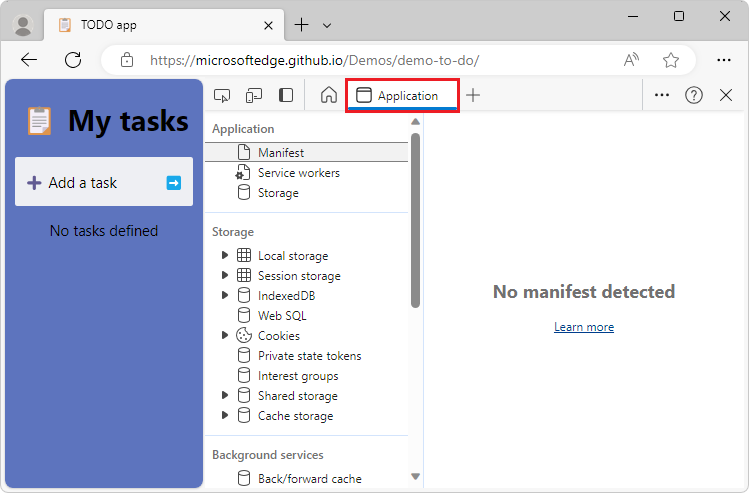
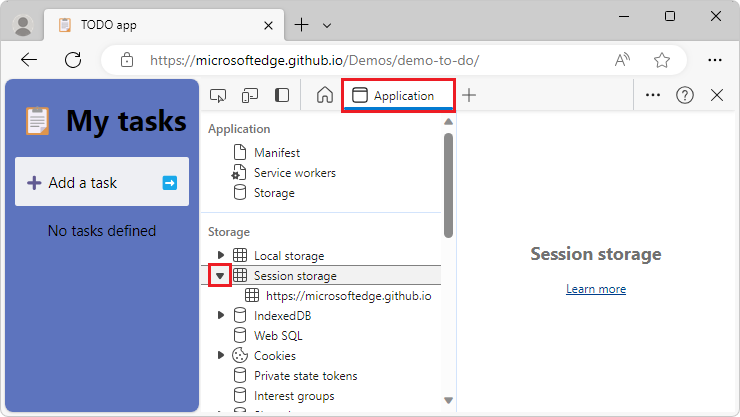
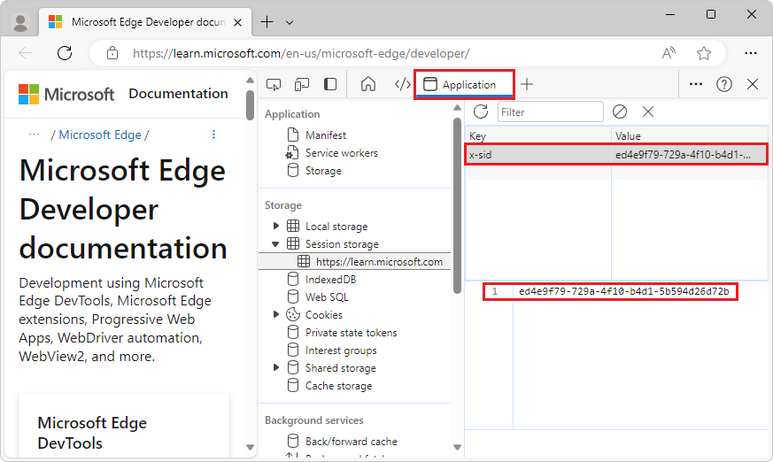
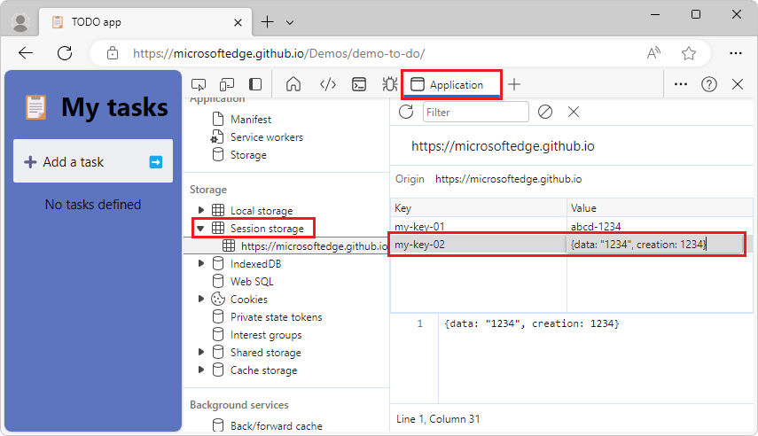
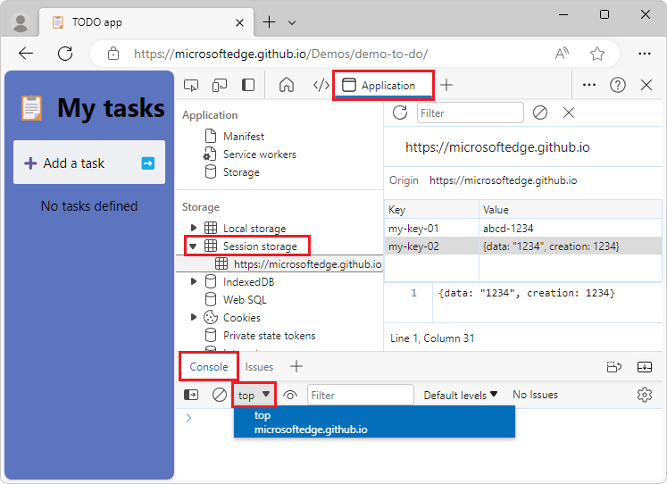
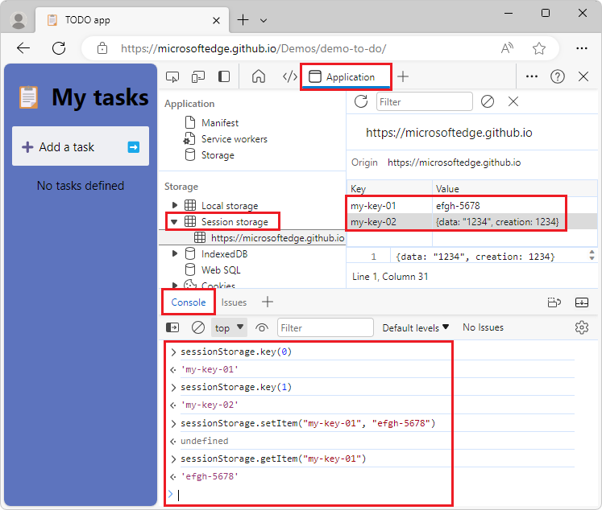

<!-- Copyright Kayce Basques

   Licensed under the Apache License, Version 2.0 (the "License");
   you may not use this file except in compliance with the License.
   You may obtain a copy of the License at

       https://www.apache.org/licenses/LICENSE-2.0

   Unless required by applicable law or agreed to in writing, software
   distributed under the License is distributed on an "AS IS" BASIS,
   WITHOUT WARRANTIES OR CONDITIONS OF ANY KIND, either express or implied.
   See the License for the specific language governing permissions and
   limitations under the License.  -->
# View and edit session storage

To view, edit, and delete [sessionStorage](https://developer.mozilla.org/docs/Web/API/Window/sessionStorage) key-value pairs, use the **Application** tool.


<!-- ====================================================================== -->
## View sessionStorage keys and values

To view the `sessionStorage` key-value pairs of a domain:

1. In DevTools, click the **Application** tab to open the **Application** tool.  The **Manifest** panel is shown by default:

   

1. In the **Storage** section on the left, expand **Session storage**:

   

1. In the **Session storage** on the left, select a domain.  The domain's key-value pairs are listed in the upper right:

   

1. Select a row of the key-value table.  The value for the selected key is displayed below the key-value table:

   


<!-- ====================================================================== -->
## Create a new sessionStorage key-value pair

To add a new key/value pair for session storage:

1. In DevTools, in the **Application** tool, in the **Storage** section on the left, expand **Session storage**, and then select a domain.  For details, see [View sessionStorage keys and values](#view-sessionstorage-keys-and-values), above.

1. In the **Key/Value** table on the right, double-click an empty key/value row, to enter editing mode.

1. In the **Key** field of the row, enter a key.

1. In the **Value** field of the row, enter a value for the key.

1. Press **Enter**, or click an empty area.  The value is then also displayed below the key/value table:

   


<!-- ====================================================================== -->
## Edit sessionStorage keys or values

To edit a key/value pair for session storage:

1. In DevTools, in the **Application** tool, in the **Storage** section on the left, expand **Session storage**, and then select a domain.  For details, see [View sessionStorage keys and values](#view-sessionstorage-keys-and-values), above.

1. In the **Key/Value** table on the right, double-click a cell in the **Key** or **Value** column to edit that key or value:

   


<!-- ====================================================================== -->
## Delete sessionStorage key-value pairs

To delete a key/value pair for session storage:

1. In DevTools, in the **Application** tool, in the **Storage** section on the left, expand **Session storage**, and then select a domain.  For details, see [View sessionStorage keys and values](#view-sessionstorage-keys-and-values), above.

1. In the **Key/Value** table on the right, select a key-value pair to highlight it.

1. Press `Delete`, or click the **Delete Selected** () button, or right-click the row and then select **Delete**.


<!-- ====================================================================== -->
## Delete all sessionStorage key-value pairs for a domain

To delete all key/value pairs for session storage for a domain:

1. In DevTools, in the **Application** tool, in the **Storage** section on the left, expand **Session storage**, and then select a domain.  For details, see [View sessionStorage keys and values](#view-sessionstorage-keys-and-values), above.

1. Click the **Clear All** () button.


<!-- ====================================================================== -->
## Interact with sessionStorage from the Console

You can run JavaScript expressions and statements in the **Console**, and the **Console** has access to the JavaScript contexts of the page, including for `sessionStorage`.

To interact with `sessionStorage` by using the **Console**:

1. In DevTools, select the **Console** tool.  For example, press **Esc** to display the **Quick View** panel, which always includes a **Console** tab.

1. If you want to access the `sessionStorage` key-value pairs of a domain other than the page you're on, use the **JavaScript contexts** menu to change the JavaScript context of the **Console**:

   

   In this scenario, there would be multiple domains listed below **top**.

1. Enter `sessionStorage` JavaScript expressions in the **Console**:

   

   The above screenshot shows the following JavaScript expressions, and the resulting output:

   ```js
   > sessionStorage.key(0)
   <· 'my-key-01'
   > sessionStorage.key(1)
   <· 'my-key-02'
   > sessionStorage.setItem("my-key-01", "efgh-5678")
   <· undefined
   > sessionStorage.getItem("my-key-01")
   <· 'efgh-5678'
   ```

   When you enter JavaScript assignment expressions by using the **Console**, the **Key/Value** pair table is updated.


<!-- ====================================================================== -->
> [!NOTE]
> Portions of this page are modifications based on work created and [shared by Google](https://developers.google.com/terms/site-policies) and used according to terms described in the [Creative Commons Attribution 4.0 International License](https://creativecommons.org/licenses/by/4.0).
> The original page is found [here](https://developer.chrome.com/docs/devtools/storage/sessionstorage/) and is authored by Kayce Basques.

[](https://creativecommons.org/licenses/by/4.0)
This work is licensed under a [Creative Commons Attribution 4.0 International License](https://creativecommons.org/licenses/by/4.0).
