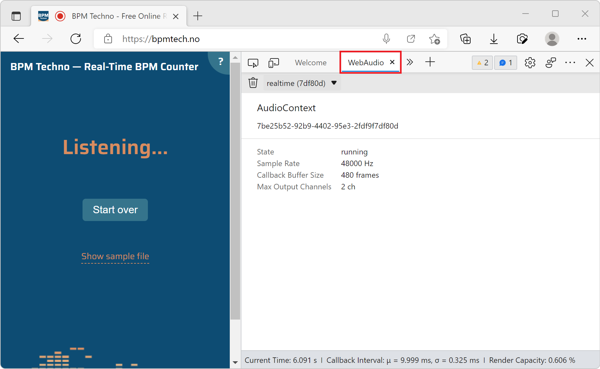

# WebAudio tool

Use the **WebAudio** tool to monitor the graph of **WebAudio** nodes that get created when a webpage uses the WebAudio API.

To open the **WebAudio** tool:

1. To open DevTools, right-click the webpage, and then select **Inspect**.  Or, press **Ctrl+Shift+I** (Windows, Linux) or **Command+Option+I** (macOS).  DevTools opens.

1. In DevTools, on the main toolbar, click the **More Tools** () button, and then select **WebAudio**.

1. Go to a webpage that uses the WebAudio API, such as [https://bpmtech.no](https://bpmtech.no).

   Data about the page is displayed:

   

<!-- https://webaudio.github.io/demo-list/ -->
