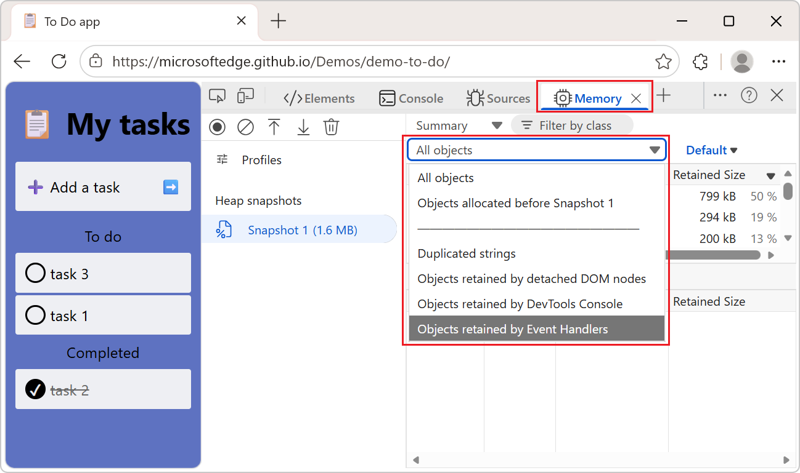

# What's new in DevTools (Microsoft Edge 143)

These are the latest features in the Stable release of Microsoft Edge DevTools.

<!-- ====================================================================== -->
## View objects retained by event handlers in the Memory tool

<!-- Subtitle: Use the new heap snapshot filter to show objects retained by event handlers.-->

In the **Memory tool**, to identify heap snapshot objects that are retained by event handlers, in the **Filter** dropdown list, use the new **Objects retained by event handlers** list item.

For example:

1. Go to [To do app](https://microsoftedge.github.io/Demos/demo-to-do/) in a new tab or window.

1. Right-click the webpage, and then select **Inspect**.

   DevTools opens.

1. Select the **Memory** () tool.

1. Click the **Take snapshot** button.

1. In the **Filter** dropdown list, instead of **All objects**, select **Objects retained by event handlers**:

   

   The list of objects in the table becomes shorter.

The **Objects retained by event handlers** filter makes it easier to debug memory leaks that are related to event listeners, such as when a component calls `addEventListener`, but doesn't call `removeEventListener` afterwards.

See also:
* [Fix memory problems](../memory-problems/index.md) - DevTools **Memory** tool.

<!-- ====================================================================== -->
## Updated performance trace export options

<!-- Subtitle: Export and share performance traces with annotations, resource content, and source maps.-->

When you export a performance trace, you can choose to include:
* Annotations.
* Resource content (HTML, CSS, and JavaScript content).
* Script source maps.

You can also choose whether the trace file is compressed. 

Exporting a trace that includes this additional data is useful when sharing traces with others for debugging.

See also:
* [Share a performance trace with more data](../performance/share-performance-traces.md)
* [Improved trace sharing](https://developer.chrome.com/blog/new-in-devtools-143#trace-sharing)

<!-- ====================================================================== -->
## Activity Bar always displays horizontally

<!-- Subtitle: Starting with Microsoft Edge 144, the vertical Activity Bar will no longer be supported.-->

Upcoming change:

Starting with Microsoft Edge 144, the **Activity Bar** will always be displayed horizontally, at the top of the DevTools window.  Displaying the **Activity Bar** vertically will no longer be supported.

<!-- ====================================================================== -->
## Announcements from the Chromium project

Microsoft Edge 143 also includes the following updates from the Chromium project:

* [Support for @starting-style](https://developer.chrome.com/blog/new-in-devtools-143#starting-style)
* [Editor widget for display: masonry](https://developer.chrome.com/blog/new-in-devtools-143#masonry)

<!-- ====================================================================== -->
## See also

* [What's new in Microsoft Edge DevTools](./whats-new.md)
* [Release notes for Microsoft Edge web platform](../../web-platform/release-notes/index.md)
