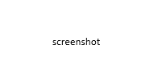

# What's new in DevTools (Microsoft Edge 146)

These are the latest features in the Stable release of Microsoft Edge DevTools.

<!-- ====================================================================== -->
## Feature 1

<!-- Subtitle: todo.-->

lead-in

See also:
* [todo]

<!-- ====================================================================== -->
## Feature 2

<!-- Subtitle: todo.-->

lead-in

See also:
* [todo]

<!-- ====================================================================== -->
## Feature 3

<!-- Subtitle: todo.-->

lead-in

See also:
* [todo]

<!-- ====================================================================== -->
## Announcements from the Chromium project
<!-- https://developer.chrome.com/blog/new-in-devtools-146 -->

Microsoft Edge 146 also includes the following updates from the Chromium project:

* [DevTools MCP server updates](https://developer.chrome.com/blog/new-in-devtools-146#mcp-server)
* [Preserve Console history edits](https://developer.chrome.com/blog/new-in-devtools-146#console-history)
* [Improved support for Adopted Style Sheets](https://developer.chrome.com/blog/new-in-devtools-146#adopted-stylesheets)
* [Dense grid layout support](https://developer.chrome.com/blog/new-in-devtools-146#grid-dense)
* [Streamlined privacy debugging](https://developer.chrome.com/blog/new-in-devtools-146#privacy)
* [Miscellaneous highlights](https://developer.chrome.com/blog/new-in-devtools-146#miscellaneous_highlights)
* [Accessibility announcements](https://developer.chrome.com/blog/new-in-devtools-146#accessibility_announcements)

<!-- ====================================================================== -->
## See also

* [What's new in Microsoft Edge DevTools](./whats-new.md)
* [Release notes for Microsoft Edge web platform](../../web-platform/release-notes/index.md)
