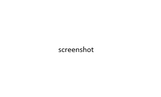

# What's new in DevTools (Microsoft Edge 149)
<!-- todo: desc yaml field -->

These are the latest features in the Stable release of Microsoft Edge DevTools.

<!-- ====================================================================== -->
## Feature 1

<!-- Subtitle: .-->

desc

<!-- ====================================================================== -->
## Feature 2

<!-- Subtitle: .-->

desc

<!-- ====================================================================== -->
## Feature 3

<!-- Subtitle: .-->

desc

<!-- ====================================================================== -->
## Announcements from the Chromium project
<!-- https://developer.chrome.com/blog/new-in-devtools-149 -->

Microsoft Edge 149 also includes the following updates from the Chromium project:

* [DevTools for agents](https://developer.chrome.com/blog/new-in-devtools-149#agents)
* [AI assistance](https://developer.chrome.com/blog/new-in-devtools-149#ai-assistance)
* [WebMCP](https://developer.chrome.com/blog/new-in-devtools-149#webmcp)
* [Code completion for CSS](https://developer.chrome.com/blog/new-in-devtools-149#css-code-completion)
* [APCA color contrast guidelines promoted to stable](https://developer.chrome.com/blog/new-in-devtools-149#apca)
* [Dynamic Device Mode user agent](https://developer.chrome.com/blog/new-in-devtools-149#device-mode-user-agent)
* [Other highlights](https://developer.chrome.com/blog/new-in-devtools-149#misc)
<!-- todo: maybe remove some links -->

<!-- ====================================================================== -->
## See also

* [What's new in Microsoft Edge DevTools](./index.md)
* [Release notes for Microsoft Edge web platform](../../web-platform/release-notes/index.md)
