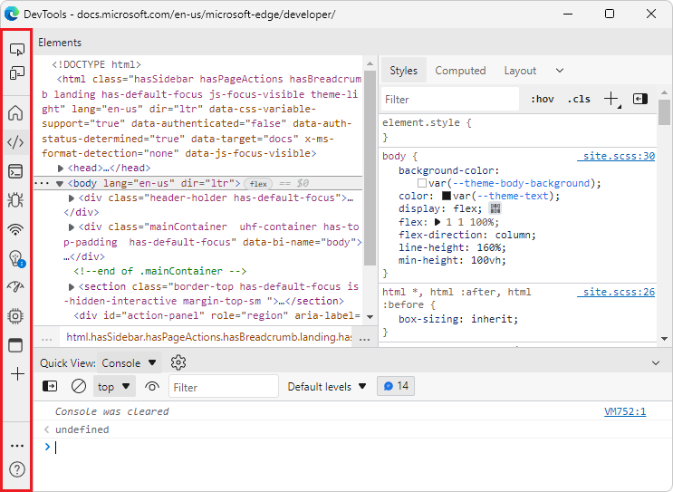

# What's New in DevTools (Microsoft Edge 97)

These are the latest features in the Stable release of Microsoft Edge DevTools.

<!-- ------------------------------ -->
#### Video: Microsoft Edge | What's New in DevTools 97

<!-- ====================================================================== -->
## Introducing the Detached Elements tool

<!-- Title: Check out the new Detached Elements tool -->
<!-- Subtitle: The new Detached Elements tool is now available by default in Microsoft Edge 97. -->

March 2025 update: The **Detached Elements** tool has been removed.  To debug DOM memory leaks, use the **Detached elements** profiling type in the **Memory** tool.

A DOM node is considered _detached_ when it's no longer attached to any element of the DOM, but is still being retained in memory by Microsoft Edge.  The browser cannot garbage-collect the detached element, because some JavaScript object is still referencing the element, even though the element is no longer on the page or is no longer a part of the DOM.

The new **Detached Elements** feature finds all of the detached elements on your page and displays them.  You can expand and collapse a detached element to see the parent and child nodes that are also being retained.  You can trigger the browser's garbage collection by clicking the **Collect garbage** icon, and then confirm that you have a memory leak when a detached element cannot be garbage-collected.  To jump into the JavaScript code that's referencing the detached element, click the **Analyze** button to take a heap snapshot.

The **Detached Elements** feature was initially available as an experiment in [Microsoft Edge version 93](../../2021/07/devtools.md#debug-dom-node-memory-leaks-with-the-new-detached-elements-tool).  The feature is now available by default in Microsoft Edge version 97.

<!--  -->
<!-- image too wide to be crisp inline; solution would be undock devtools then 1 or 2 images in series (DevTools then browser).  right-click works, but reverting to lightbox for now -->

See also:
* [Tools for investigating detached elements](../../../memory-problems/index.md#tools-for-investigating-detached-elements) in _Fix memory problems_.
* [Debug DOM memory leaks ("Detached elements" profiling type)](../../../memory-problems/dom-leaks-memory-tool-detached-elements.md)
* [Debug memory leaks with the Microsoft Edge Detached Elements tool](../../../../dev-videos/index.md#debug-memory-leaks-with-the-microsoft-edge-detached-elements-tool) in _Videos about web development with Microsoft Edge_.

<!-- ====================================================================== -->
## Microsoft Edge DevTools extension for Visual Studio Code

For general information about this extension, see [Microsoft Edge DevTools extension for Visual Studio Code](../../../../visual-studio-code/microsoft-edge-devtools-extension.md).

<!-- ------------------------------ -->
#### Screencast enhancements, deprecation warnings, and new launch options for Microsoft Edge

<!-- Title: Screeencast improvements and launch options for Microsoft Edge in the Visual Studio Code extension -->
<!-- Subtitle: The correct list of emulated devices is shown for the screeencast, the correct device emulation is displayed, and there are now launch arguments for the browser. -->

The current version of the Microsoft Edge DevTools extension for Visual Studio Code fixes several issues that were reported by the community:

*  The list of emulated devices in the screencast is now the same as the list of emulated devices in the browser.

*  Device emulation now adds the correct user agent string, to trigger the correct display.

*  You now get a warning when you use a deprecated launch version of Microsoft Edge, indicating that you'd miss out on features.

*  You can now provide arguments for the launched browser instance, in case you need to have a special setup:

<!-- no See also needed -->

<!-- ====================================================================== -->
## Improvements and bug fixes for Focus Mode

<!-- Title: Have you tried Focus Mode? -->
<!-- Subtitle: To de-clutter and simplify the DevTools interface to focus on debugging web apps, enable Focus Mode in DevTools settings. -->

Thanks to your early feedback, we've continued to make improvements and bug fixes on the new Focus Mode interface for Microsoft Edge DevTools.  Focus Mode is a new UI option that allows you to dock tools at the top or side of the DevTools window, and removes clutter from the toolbar:

When using Focus Mode, all the same tools and custom themes are available as in the existing DevTools UI.  Try Focus Mode for yourself by enabling the **Focus Mode** experiment in DevTools **Settings** > **Experiments**.

<!-- ====================================================================== -->
## 3D View tool supports changing color themes in DevTools

<!-- Title: 3D View better integrates with different themes in DevTools -->
<!-- Subtitle: The 3D View tool now works when you select a different color theme in DevTools. -->

In previous versions of Microsoft Edge, changing the theme in DevTools and then opening the 3D View tool resulted in a blank panel.  This issue has now been fixed, in Microsoft Edge 97:

See also:
* [Navigate webpage layers, z-index, and DOM using the 3D View tool](../../../3d-view/index.md)

<!-- ====================================================================== -->
## Announcements from the Chromium project

Microsoft Edge version 97 also includes the following updates from the Chromium project:

* [Refresh device list in Device Mode](https://developer.chrome.com/blog/new-in-devtools-97/#device)
* [Autocomplete with Edit as HTML](https://developer.chrome.com/blog/new-in-devtools-97/#code-completion)<!-- todo: developer.chrome.com ok? -->
* [Improved code debugging experience](https://developer.chrome.com/blog/new-in-devtools-97/#debugging)

<!-- > [!NOTE]
> Portions of this page are modifications based on work created and [shared by Google](https://developers.google.com/terms/site-policies) and used according to terms described in the [Creative Commons Attribution 4.0 International License](https://creativecommons.org/licenses/by/4.0).
> The original page for announcements from the Chromium project is [What's New in DevTools (Chrome 97)](https://developer.chrome.com/blog/new-in-devtools-97) and is authored by Jecelyn Yeen.

This work is licensed under a [Creative Commons Attribution 4.0 International License](https://creativecommons.org/licenses/by/4.0). -->

<!-- ====================================================================== -->
## See also

* [What's New in Microsoft Edge DevTools](../../whats-new.md)
* [Release notes for Microsoft Edge web platform](../../../../web-platform/release-notes/index.md)
