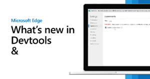

# What's new in DevTools (Microsoft Edge 124)

These are the latest features in the Stable release of Microsoft Edge DevTools.

<!-- ------------------------------ 
todo video
#### Video: What's new in DevTools 115-125

[]
-->

<!-- ====================================================================== -->
## postMessage events and handlers are distinguished from other events

<!-- Subtitle: Easily investigate performance issues related to posting messages across various threads in applications.  -->

<!-- 2025/02/18: changed from "Timeline: Show postMessage dispatch and handling flows" -->

The new experiment **Performance panel: show postMessage dispatch and handling flows** improves the **Performance** tool's **Main** section to help you quickly identify `postMessage` events and handlers, by distinguishing events that are triggered by the `postMessage` method from other events that are displayed in the **Performance** tool.  This experiment helps you investigate performance issues that are related to posting messages across various threads of an application, to view messages between windows, iframes, and dedicated workers.

Without this experiment, events that are triggered by dispatching and handling messages between threads of an application appear as generic scripting function-call events.  With this experiment enabled:
* `postMessage` dispatch events appear as **Schedule postMessage**.
* `postMessage` handler events appear as **On Message**:

This experiment helps you investigate when a `postMessage` call occurred, and how long the message was queued before the `postMessage` handler starts.  The dispatch events are linked to handler events by initiator arrows that appear when you click on either type of event:

To use this feature, in DevTools, select **Customize and control DevTools** () > **Settings** > **Experiments**, select the checkbox **Performance panel: show postMessage dispatch and handling flows**, click the **Close** (X) button, and then click the **Reload DevTools** button.

See also:
* [View messages between windows, iframes, and dedicated workers](../../../performance/reference.md#view-messages-between-windows-iframes-and-dedicated-workers) in _Performance features reference_.
* [postMessage Trace Events demo (rendered)](https://microsoftedge.github.io/Demos/devtools-postmessage-perf-timeline/)
* [postMessage Trace Events demo (source code)](https://github.com/MicrosoftEdge/Demos/tree/main/devtools-postmessage-perf-timeline)

<!-- ====================================================================== -->
## Move a tab left or right in the Activity bar by right-clicking it

<!-- Subtitle: Move the tabs in the Activity bar left or right by using the tab's right-click menu. -->

Before Microsoft Edge 124, you could rearrange the tabs in the **Activity Bar** only by dragging them.  This can be difficult for users who are using input devices such as a trackball or head pointer.  Now, you can also move a tab left or right by right-clicking the tab and then selecting **Move left** or **Move right**:

See also:
* [Pin and rearrange tools in the Activity Bar](../../../overview.md#pin-and-rearrange-tools-in-the-activity-bar) in _Overview of DevTools_.

<!-- ====================================================================== -->
## Network tab shows a warning icon when using overrides or throttling

<!-- Subtitle: The warning icon on the Network tab when overrides or throttling is enabled has been restored. -->

Recent releases stopped showing a warning icon in the **Network** tool's tab when using overrides or throttling.  This issue has been fixed.  When you enable local overrides in the **Sources** tool, the **Network** tab now displays a warning icon:

Also, when you turn on throttling in the **Network** tool, the **Network** tab now displays a warning icon:

See also:
* [Override webpage resources with local copies (Overrides tab)](../../../javascript/overrides.md)
* [Emulate slow network connections](../../../network/reference.md#emulate-slow-network-connections) in _Network features reference_.

<!-- ====================================================================== -->
## Announcements from the Chromium project

Microsoft Edge 124 also includes the following updates from the Chromium project:

* [New Autofill panel](https://developer.chrome.com/blog/new-in-devtools-124#autofill)
* [Enhanced network throttling for WebRTC](https://developer.chrome.com/blog/new-in-devtools-124#throttling)
* [Scroll-driven animations support in the Animations panel](https://developer.chrome.com/blog/new-in-devtools-124#animations)
* [Improved CSS nesting support in Elements > Styles](https://developer.chrome.com/blog/new-in-devtools-124#nested-css)
* [Enhanced Performance panel](https://developer.chrome.com/blog/new-in-devtools-124#perf)
   * [Hide functions and their children in the flame chart](https://developer.chrome.com/blog/new-in-devtools-124#hide-func)
   * [Arrows from selected initiators to events they initiated](https://developer.chrome.com/blog/new-in-devtools-124#event-initiators)
* [Tooltips for special categories in Memory > Heap snapshots](https://developer.chrome.com/blog/new-in-devtools-124#heap)
* [Application > Storage updates](https://developer.chrome.com/blog/new-in-devtools-124#storage)
   * [Bytes used for shared storage](https://developer.chrome.com/blog/new-in-devtools-124#shared-storage-bytes)
   * [Web SQL is fully deprecated](https://developer.chrome.com/blog/new-in-devtools-124#web-sql)
* [Coverage panel improvements](https://developer.chrome.com/blog/new-in-devtools-124#coverage)
* [JavaScript Profiler deprecation: Phase four, final](https://developer.chrome.com/blog/new-in-devtools-124#js-profiler)

<!-- ====================================================================== -->
<!-- uncomment if content is copied from developer.chrome.com to this page -->

<!-- > [!NOTE]
> Portions of this page are modifications based on work created and [shared by Google](https://developers.google.com/terms/site-policies) and used according to terms described in the [Creative Commons Attribution 4.0 International License](https://creativecommons.org/licenses/by/4.0).
> The original page for announcements from the Chromium project is [What's New in DevTools (Chrome 124)](https://developer.chrome.com/blog/new-in-devtools-124) and is authored by Sofia Emelianova. -->

<!-- ====================================================================== -->
<!-- uncomment if content is copied from developer.chrome.com to this page -->

<!-- 
This work is licensed under a [Creative Commons Attribution 4.0 International License](https://creativecommons.org/licenses/by/4.0). -->

<!-- ====================================================================== -->
## See also

* [What's New in Microsoft Edge DevTools](../../whats-new.md)
* [Release notes for Microsoft Edge web platform](../../../../web-platform/release-notes/index.md)
