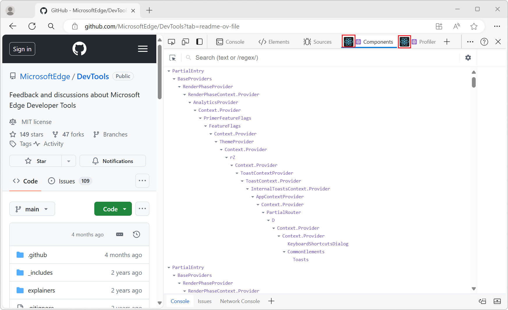

# What's New in DevTools (Microsoft Edge 126)

These are the latest features in the Stable release of Microsoft Edge DevTools.

<!-- ====================================================================== -->
## Icons for browser extensions are displayed instead of blank squares

<!-- Subtitle: The DevTools extensions that you install will display their icons so they're easily identifiable in the Activity Bar.-->

In the DevTools **Activity Bar** in previous versions of Microsoft Edge, there was a bug where the tab for some browser extensions was missing an icon.  For example, when the React extension was activated, the icon for the extension in the **Activity Bar** was displayed as a grey box.

<!-- todo: add screenshot if can get one from Stable 124 -->

This issue has been fixed; icons for browser extensions are correctly displayed in the **Activity Bar**.

<!-- ====================================================================== -->
## The DevTools UI in Chinese has changed back to the original font

<!-- Subtitle: When using the DevTools UI in Chinese, the font has been updated back to the previous font that users are familiar with. -->

In recent versions of Microsoft Edge, when the DevTools UI language was set to Chinese, a new default font was displayed.  Per user feedback, the default font has been changed back to the familiar font.

<!-- ====================================================================== -->
## Announcements from the Chromium project

Microsoft Edge 126 also includes the following updates from the Chromium project:

* [Performance panel improvements](https://developer.chrome.com/blog/new-in-devtools-126#perf)
   * [Move and hide tracks with updated track configuration mode](https://developer.chrome.com/blog/new-in-devtools-126#track-config)
   * [Ignore scripts in the flame chart](https://developer.chrome.com/blog/new-in-devtools-126#perf-ignore)
   * [Throttle down the CPU by 20 times](https://developer.chrome.com/blog/new-in-devtools-126#throttle-20x)
* [Paste entire header strings to override them](https://developer.chrome.com/blog/new-in-devtools-126#overrides)
* [Find excessive memory usage with new filters in heap snapshots](https://developer.chrome.com/blog/new-in-devtools-126#heap-filters)
* [Inspect storage buckets in Application > Storage](https://developer.chrome.com/blog/new-in-devtools-126#storage-buckets)
* [Disable self-XSS warnings with a command-line flag](https://developer.chrome.com/blog/new-in-devtools-126#self-xss-flag)

<!-- ====================================================================== -->
<!-- uncomment if content is copied from developer.chrome.com to this page -->

<!-- > [!NOTE]
> Portions of this page are modifications based on work created and [shared by Google](https://developers.google.com/terms/site-policies) and used according to terms described in the [Creative Commons Attribution 4.0 International License](https://creativecommons.org/licenses/by/4.0).
> The original page for announcements from the Chromium project is [What's New in DevTools (Chrome 126)](https://developer.chrome.com/blog/new-in-devtools-126) and is authored by Sofia Emelianova. -->

<!-- ====================================================================== -->
<!-- uncomment if content is copied from developer.chrome.com to this page -->

<!-- 
This work is licensed under a [Creative Commons Attribution 4.0 International License](https://creativecommons.org/licenses/by/4.0). -->

<!-- ====================================================================== -->
## See also

* [What's New in Microsoft Edge DevTools](../../whats-new.md)
* [Release notes for Microsoft Edge web platform](../../../../web-platform/release-notes/index.md)
