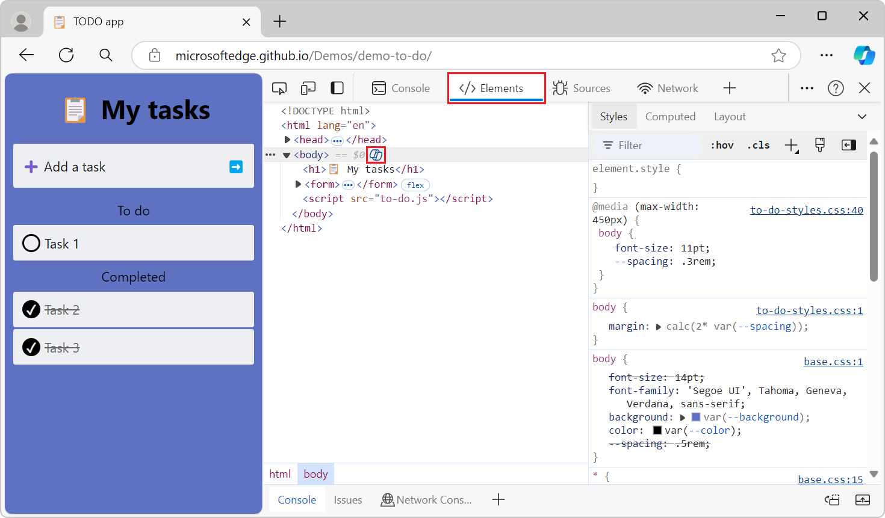

# What's New in DevTools (Microsoft Edge 127)

These are the latest features in the Stable release of Microsoft Edge DevTools.

<!-- ====================================================================== -->
## Use Copilot to explain HTML and CSS in the Elements tool

<!-- Subtitle: Enable the "Enable CSS Copilot" experiment to ask Copilot about elements and styles. -->

You can use Copilot in the Microsoft Edge Sidebar to explain HTML elements and CSS styles to help you better understand a particular element or style rule that's displayed in the **Elements** tool.  When the experiment is enabled, you can ask Copilot about an element or style rule by clicking the **Copilot** button next to it and then asking follow-up questions.

To enable this experiment, go to DevTools > **Customize and control DevTools (...)** > **Settings** > **Experiments**, and then select the **Enable CSS Copilot** checkbox.  This experiment is not available when the Sidebar is turned off.

See also:
* [Enable CSS Copilot](../../../experimental-features/index.md#enable-css-copilot) in _Experimental features in Microsoft Edge DevTools_.
<!-- todo: link to doc about this feature
* 
-->

<!-- ====================================================================== -->
## Announcements from the Chromium project

Microsoft Edge 127 also includes the following updates from the Chromium project:

* [Inspect CSS anchor positioning in the Elements panel](https://developer.chrome.com/blog/new-in-devtools-127#elements-links)
* [Sources panel improvements](https://developer.chrome.com/blog/new-in-devtools-127#sources)
   * [Enhanced 'Never Pause Here'](https://developer.chrome.com/blog/new-in-devtools-127#never-pause-here)
   * [New scroll snap event listeners](https://developer.chrome.com/blog/new-in-devtools-127#snap-event-listeners)
* [Network panel improvements](https://developer.chrome.com/blog/new-in-devtools-127#network)
   * [Updated network throttling presets](https://developer.chrome.com/blog/new-in-devtools-127#network-throttling-presets)
   * [Service worker information in custom fields of the HAR format](https://developer.chrome.com/blog/new-in-devtools-127#har)
* [Send and receive WebSocket events in the Performance panel](https://developer.chrome.com/blog/new-in-devtools-127#perf-websocket)

<!-- ====================================================================== -->
<!-- uncomment if content is copied from developer.chrome.com to this page -->

<!-- > [!NOTE]
> Portions of this page are modifications based on work created and [shared by Google](https://developers.google.com/terms/site-policies) and used according to terms described in the [Creative Commons Attribution 4.0 International License](https://creativecommons.org/licenses/by/4.0).
> The original page for announcements from the Chromium project is [What's New in DevTools (Chrome 127)](https://developer.chrome.com/blog/new-in-devtools-127) and is authored by Sofia Emelianova. -->

<!-- ====================================================================== -->
<!-- uncomment if content is copied from developer.chrome.com to this page -->

<!-- 
This work is licensed under a [Creative Commons Attribution 4.0 International License](https://creativecommons.org/licenses/by/4.0). -->

<!-- ====================================================================== -->
## See also

* [What's New in Microsoft Edge DevTools](../../whats-new.md)
* [Release notes for Microsoft Edge web platform](../../../../web-platform/release-notes/index.md)
