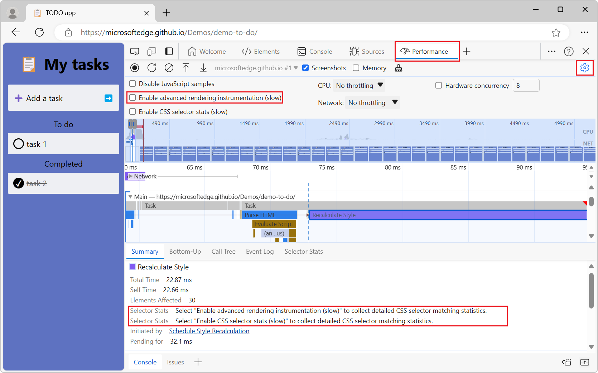
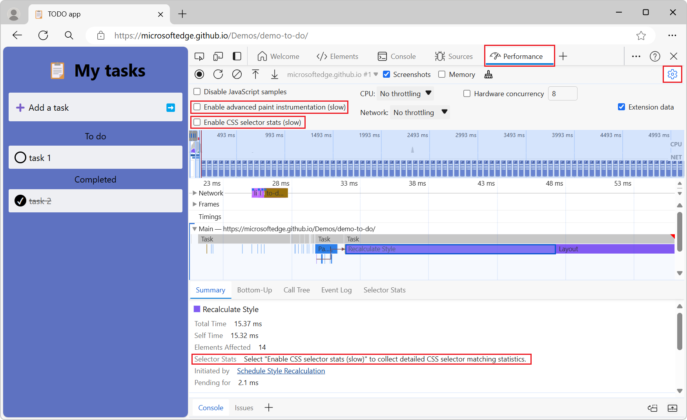
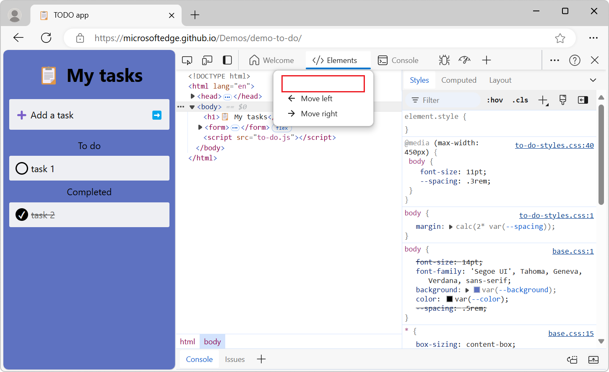

# What's New in DevTools (Microsoft Edge 128)

These are the latest features in the Stable release of Microsoft Edge DevTools.

<!-- ====================================================================== -->
## Updated labels for CSS selector stats

<!-- Subtitle: Use the "Enable CSS selector stats" checkbox instead of "Enable advanced paint instrumentation (slow)" to capture CSS selector statistics for Recalculate Style events -->

In the **Performance** tool, the duplicate **Selector Stats** label has been removed from the `Recalculate Style` event details.

The **Enable advanced rendering instrumentation (slow)** checkbox has been renamed to **Enable advanced paint instrumentation (slow)**.  Selecting this checkbox now only turns on paint instrumentation, and no longer turns on CSS selector stats as well.  To enable gathering CSS selector stats, in the **Performance** tool, select the **Capture settings** () button, and then select the **Enable CSS selector stats (slow)** checkbox.

Before:

After:

See also:
* [Enable advanced paint instrumentation](../../../performance/reference.md#enable-advanced-paint-instrumentation) in _Performance features reference_.
* [Analyze CSS selector performance during Recalculate Style events](../../../performance/selector-stats.md)

<!-- ====================================================================== -->
## Fixed whitespace in Activity Bar right-click menus

<!-- Subtitle: Header titles in the top of the Activity Bar's right-click menus have been restored. -->

In recent versions of Microsoft Edge, some context menus in the **Activity Bar** displayed empty whitespace in the header area at the top:

The top of each context menu now shows the title again:

<!-- ====================================================================== -->
## Heap snapshot improvements

<!-- Subtitle: Heap snapshots are generated faster, HTML elements are grouped by tag name, shallow sizes show fewer internal objects, and numeric values are always shown. -->

In the **Memory** tool, there are several improvements for heap snapshots:

* Generating heap snapshots is now faster.

* HTML elements are grouped by tag name, such as `<body>`, `
`, or ``.

* Shallow sizes now match JavaScript semantics better, by showing fewer internal objects (unless you select the [Show option to expose internals in heap snapshots](../../../experimental-features/index.md#show-option-to-expose-internals-in-heap-snapshots) experiment checkbox and then, before taking a snapshot, select the **Expose internals (includes additional implementation-specific details)** checkbox).

* The **Include numerical values in capture** checkbox (shown before you take a heap snapshot) has been removed, and heap snapshots now always show numeric values.

See also:
* [Record heap snapshots using the Memory tool ("Heap snapshot" profiling type)](../../../memory-problems/heap-snapshots.md)

<!-- ====================================================================== -->
## View WebSocket message activities in the Performance tool

<!-- Subtitle: WebSocket activities were added to the Network track in the Performance tool to help correlate JavaScript activity with WebSocket messages. -->

WebSocket activities have been added to the **Network** track in the **Performance** tool, to help correlate JavaScript activity with WebSocket messages.  This can help identify whether latency issues are coming from the client's parsing of a message, or from the server's response.

See also:
* [Analyze runtime performance (tutorial)](../../../performance/index.md)

<!-- ====================================================================== -->
## Announcements from the Chromium project

Microsoft Edge 128 also includes the following updates from the Chromium project:

* [Performance panel updates](https://developer.chrome.com/blog/new-in-devtools-128#perf)
   * [Enhanced Network track](https://developer.chrome.com/blog/new-in-devtools-128#perf-network)
   * [Customized performance data with extensibility API](https://developer.chrome.com/blog/new-in-devtools-128#perf-extension)
   * [Details in the Timings track](https://developer.chrome.com/blog/new-in-devtools-128#timings-details)
* [Copy all listed requests in the Network panel](https://developer.chrome.com/blog/new-in-devtools-128#copy-all-listed)
* [Faster heap snapshots with named HTML tags and less clutter](https://developer.chrome.com/blog/new-in-devtools-128#heap-snapshots)
* [Open Animations panel to capture animations and edit @keyframes live](https://developer.chrome.com/blog/new-in-devtools-128#animations)

<!-- ====================================================================== -->
<!-- uncomment if content is copied from developer.chrome.com to this page -->

<!-- > [!NOTE]
> Portions of this page are modifications based on work created and [shared by Google](https://developers.google.com/terms/site-policies) and used according to terms described in the [Creative Commons Attribution 4.0 International License](https://creativecommons.org/licenses/by/4.0).
> The original page for announcements from the Chromium project is [What's New in DevTools (Chrome 128)](https://developer.chrome.com/blog/new-in-devtools-128) and is authored by Sofia Emelianova. -->

<!-- ====================================================================== -->
<!-- uncomment if content is copied from developer.chrome.com to this page -->

<!-- 
This work is licensed under a [Creative Commons Attribution 4.0 International License](https://creativecommons.org/licenses/by/4.0). -->

<!-- ====================================================================== -->
## See also

* [What's New in Microsoft Edge DevTools](../../whats-new.md)
* [Release notes for Microsoft Edge web platform](../../../../web-platform/release-notes/index.md)
