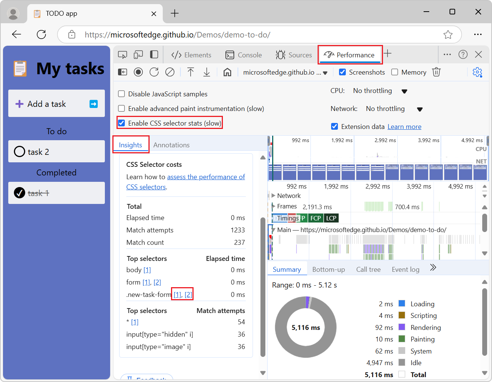

# What's New in DevTools (Microsoft Edge 132)

These are the latest features in the Stable release of Microsoft Edge DevTools.

<!-- ====================================================================== -->
## CSS selector costs now include links in the Insights sidebar

<!-- Subtitle: Selectors have clickable links to their stylesheet in the Insights sidebar. -->

The left sidebar in the **Performance** tool displays the costs of CSS selectors in the **Insights** tab when the **Enable CSS selector stats (slow)** checkbox is enabled.  Now, the selectors have links to the stylesheets that contain them.

Some selectors might have more than one link when they are defined in multiple locations in a stylesheet or defined in multiple stylesheets.  For example, two links will be shown as **[1], [2]**. Selectors from user agent stylesheets or dynamically created stylesheets won't have links. 

See also:
* [View CSS selector costs in the Performance tool sidebar](../../2024/11/devtools-131.md#view-css-selector-costs-in-the-performance-tool-sidebar) in _What's New in DevTools (Microsoft Edge 131)_.

<!-- ====================================================================== -->
## Move a tab left or right in the Quick View toolbar by right-clicking it

<!-- Subtitle: Move the tabs in the Quick View toolbar left or right by using the tab's right-click menu. -->

Previously, you could rearrange the tabs in **Quick View** only by dragging them.  This can be difficult for users who are using input devices such as a trackball or head pointer.  Now, you can also move a tab left or right by right-clicking the tab and then selecting **Move left** or **Move right**:

See also:
* [Pin and rearrange tools in the Activity Bar](../../../overview.md#pin-and-rearrange-tools-in-the-activity-bar) in _Overview of DevTools_.

<!-- ====================================================================== -->
## Heap snapshot objects are categorized by constructor names and source locations in the Memory tool

<!-- JS objects are grouped by their names and sources in the Memory tool.-->

Before, when JavaScript objects in the heap snapshot Summary view were grouped by the names of their constructors, it was possible for distinct constructors to have the same name, meaning unrelated objects could end up in the same group.

Now, JS objects are grouped together based on their constructor names and source locations.

See also:
* [Record heap snapshots using the Memory tool ("Heap snapshot" profiling type)](../../../memory-problems/heap-snapshots.md)

<!-- ====================================================================== -->
## Announcements from the Chromium project

Microsoft Edge 132 also includes the following updates from the Chromium project:

* [Manage extension storage in Application > Storage](https://developer.chrome.com/blog/new-in-devtools-132#extension-storage)
* [Performance improvements](https://developer.chrome.com/blog/new-in-devtools-132#perf)
   * [Interaction phases in live metrics](https://developer.chrome.com/blog/new-in-devtools-132#interaction-phases)
   * [Render blocking information in the Summary tab](https://developer.chrome.com/blog/new-in-devtools-132#render-blocking)
   * [Support for scheduler.postTask events and their initiator arrows](https://developer.chrome.com/blog/new-in-devtools-132#initiators)
* [Animations panel and Elements > Styles tab improvements](https://developer.chrome.com/blog/new-in-devtools-132#animations)
   * [Jump from Elements > Styles to Animations](https://developer.chrome.com/blog/new-in-devtools-132#animations-link)
   * [Real-time updates in Computed tab](https://developer.chrome.com/blog/new-in-devtools-132#computed)
* [Compute pressure emulation in Sensors](https://developer.chrome.com/blog/new-in-devtools-132#compute-pressure)
* [JS objects with the same name grouped by source in the Memory panel](https://developer.chrome.com/blog/new-in-devtools-132#memory)
* [A new look for settings](https://developer.chrome.com/blog/new-in-devtools-132#settings)
* [Performance insights panel is deprecated and removed from DevTools](https://developer.chrome.com/blog/new-in-devtools-132#perf-insights)

<!-- ====================================================================== -->
<!-- uncomment if content is copied from developer.chrome.com to this page -->

<!-- > [!NOTE]
> Portions of this page are modifications based on work created and [shared by Google](https://developers.google.com/terms/site-policies) and used according to terms described in the [Creative Commons Attribution 4.0 International License](https://creativecommons.org/licenses/by/4.0).
> The original page for announcements from the Chromium project is [What's New in DevTools (Chrome 132)](https://developer.chrome.com/blog/new-in-devtools-132) and is authored by Sofia Emelianova. -->

<!-- ====================================================================== -->
<!-- uncomment if content is copied from developer.chrome.com to this page -->

<!-- 
This work is licensed under a [Creative Commons Attribution 4.0 International License](https://creativecommons.org/licenses/by/4.0). -->

<!-- ====================================================================== -->
## See also

* [What's New in Microsoft Edge DevTools](../../whats-new.md)
* [Release notes for Microsoft Edge web platform](../../../../web-platform/release-notes/index.md)
