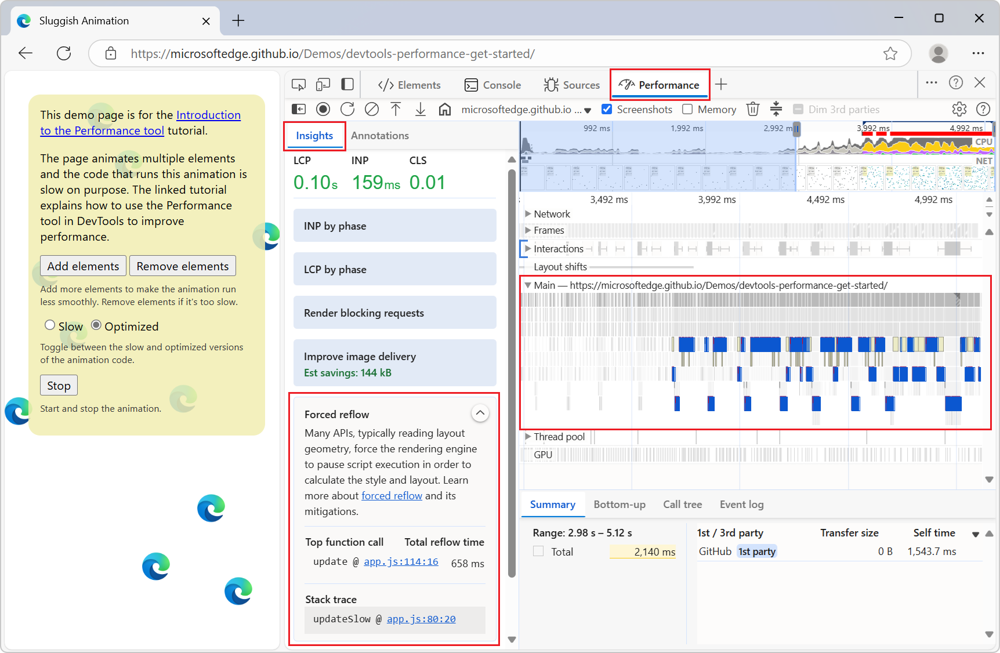
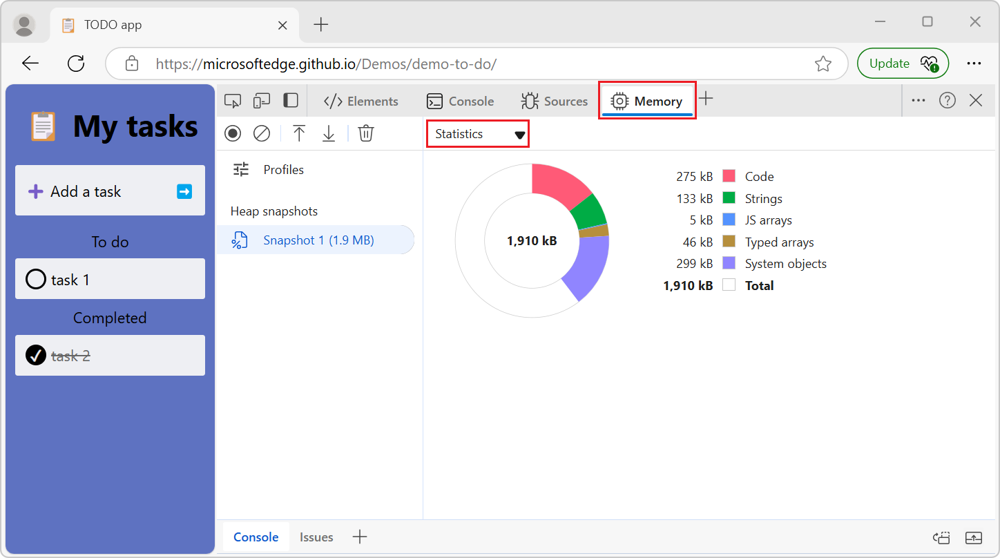
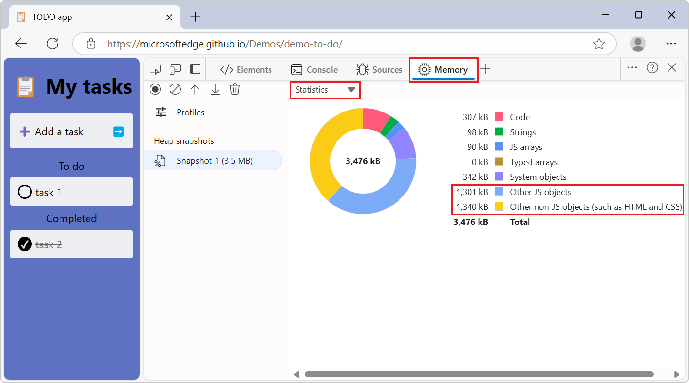
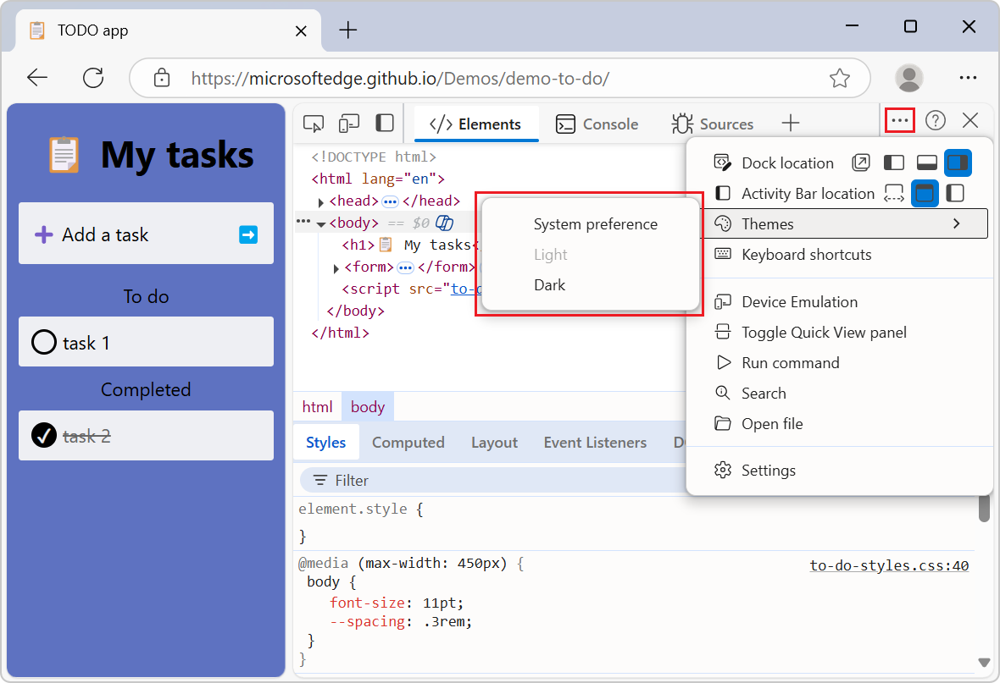

# What's New in DevTools (Microsoft Edge 134)

These are the latest features in the Stable release of Microsoft Edge DevTools.

<!-- ====================================================================== -->
## Forced reflow in the Performance Insights sidebar

<!-- Subtitle: View the top function call and its total reflow time in your performance trace. -->

The **Performance Insights** sidebar includes a new section called **Forced Reflow**.  This insight highlights the most time-consuming function call, showing its total reflow time and related stack traces.  By clicking on this insight, you can see the function call and its stack trace highlighted in the **Main** frame:

<!-- ====================================================================== -->
## Heap snapshot statistics account for every byte  

<!-- Subtitle: View a memory allocation pie chart of your heap snapshot under Statistics-->

Previously, when you took a heap snapshot in the **Memory** tool, the **Statistics** pie chart didn't show every byte that's in the categories, resulting in blank parts of the chart:

To fix this, two new catch-all categories have been added, to account for the rest of the bytes in the heap snapshot:
* **Other JS objects**
* **Other non-JS objects (such as HTML and CSS)**

<!-- ====================================================================== -->
## Simplified DevTools Themes menu

<!-- Subtitle: Change the DevTools theme by clicking Customize and control DevTools > Themes, and then select Light or Dark. -->

The theme options have been simplified by removing the redundant nesting options.  When you go to **Customize and control DevTools** > **Themes**, the options have been simplified to **System preference**, **Light**, and **Dark**:

<!-- ====================================================================== -->
## Announcements from the Chromium project
<!-- https://developer.chrome.com/blog/new-in-devtools-134 -->

Microsoft Edge 134 also includes the following updates from the Chromium project:

* [Privacy and security panel](https://developer.chrome.com/blog/new-in-devtools-134#privacy-and-security)
* [Performance panel improvements](https://developer.chrome.com/blog/new-in-devtools-134#perf)
   * [Calibrated CPU throttling presets](https://developer.chrome.com/blog/new-in-devtools-134#calibrated-cpu-throttling)
   * [First- and third-party highlighting in Performance](https://developer.chrome.com/blog/new-in-devtools-134#perf-third-party)
   * ['Optimize DOM size' insight](https://developer.chrome.com/blog/new-in-devtools-134#dom-size)
   * [Extend the performance trace with console.timeStamp](https://developer.chrome.com/blog/new-in-devtools-134#console-timestamp)
* [Elements panel improvements](https://developer.chrome.com/blog/new-in-devtools-134#elements)
   * [Support for :open pseudo-class and various pseudo-elements](https://developer.chrome.com/blog/new-in-devtools-134#pseudo)
* [Copy all console messages](https://developer.chrome.com/blog/new-in-devtools-134#copy-console)
* [Byte units in the Memory panel](https://developer.chrome.com/blog/new-in-devtools-134#byte-units)

<!-- ====================================================================== -->
## See also

* [What's New in Microsoft Edge DevTools](../../whats-new.md)
* [Release notes for Microsoft Edge web platform](../../../../web-platform/release-notes/index.md)
