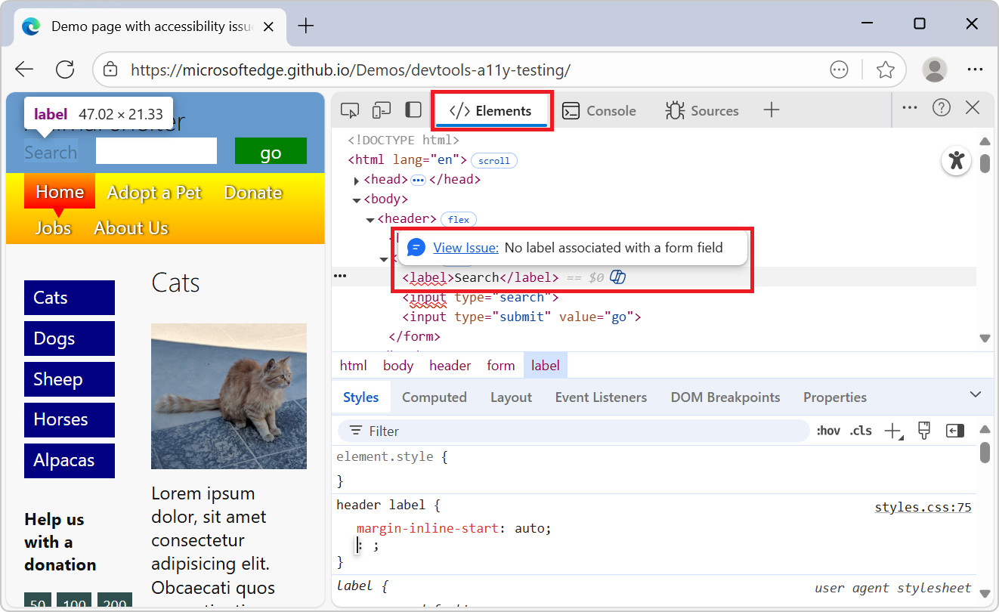

# What's New in DevTools (Microsoft Edge 136)

These are the latest features in the Stable release of Microsoft Edge DevTools.

<!-- ====================================================================== -->
## DOM tree in Elements tool highlights semantic errors

<!-- Subtitle: DOM elements with semantic errors are highlighted with a wavy line and a tooltip with a link. -->

You can now easily identify semantic issues in the DOM tree of the **Elements** tool, such as: 
* An invalid descendant of `<select>`.
* Mismatched ARIA definitions.
* Missing ARIA attributes.

Each DOM node that has a semantic issue displays a red wavy line, and has a tooltip with details about the specific issue and a link to the entry in the **Issues** tool:

<!-- ====================================================================== -->
## Announcements from the Chromium project

Microsoft Edge 136 also includes the following updates from the Chromium project:

* [Performance panel improvements](https://developer.chrome.com/blog/new-in-devtools-136#perf)
   * [New performance insights](https://developer.chrome.com/blog/new-in-devtools-136#perf-insights)
   * [Click to highlight](https://developer.chrome.com/blog/new-in-devtools-136#click-to-highlight)
   * [Server timings in Summary of network requests](https://developer.chrome.com/blog/new-in-devtools-136#server-timings)
* [Filter cookies in 'Privacy and security'](https://developer.chrome.com/blog/new-in-devtools-136#cookies-filter)
* [Sizes in kB units in tables across panels](https://developer.chrome.com/blog/new-in-devtools-136#kb-units)
* [Autocomplete supports corner-shape and corner-*- shape in Elements > Styles](https://developer.chrome.com/blog/new-in-devtools-136#corner-shape-autocomplete)

<!-- ====================================================================== -->
## See also

* [What's New in Microsoft Edge DevTools](../../whats-new.md)
* [Release notes for Microsoft Edge web platform](../../../../web-platform/release-notes/index.md)
