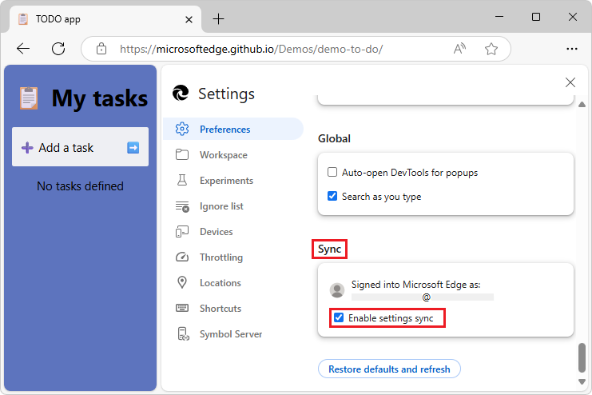

# What's New in DevTools (Microsoft Edge 137)

These are the latest features in the Stable release of Microsoft Edge DevTools.

<!-- ====================================================================== -->
## Sync your DevTools settings between devices

<!-- Subtitle: Enable settings sync lets you sync your DevTools settings across devices. -->

You can now easily sync your DevTools settings across multiple devices by using your signed-in Microsoft Edge profile.  This ensures that your preferences remain consistent, and makes it easier to work across different devices without needing to reconfigure the same settings.

To enable DevTools **Settings** sync:

1. In DevTools, select **Customize and control DevTools** () > **Settings** ().

   DevTools **Settings** appears, with the **Preferences** page selected.

1. Scroll down to the **Sync** section at the bottom, and then select the **Enable settings sync** checkbox:

   

   Your signed-in Microsoft Edge profile is displayed.

1. In DevTools **Settings**, click the **Close** () button. 

<!-- ====================================================================== -->
## Announcements from the Chromium project

Microsoft Edge 137 also includes the following updates from the Chromium project:

* [Connect a workspace folder and save changes back to your source files](https://developer.chrome.com/blog/new-in-devtools-137#workspace)
* [New insights in the Performance panel](https://developer.chrome.com/blog/new-in-devtools-137#new-perf-insights)
   * [Duplicated JavaScript](https://developer.chrome.com/blog/new-in-devtools-137#duplicated-js)
   * [Legacy JavaScript](https://developer.chrome.com/blog/new-in-devtools-137#legacy-js)
* [Speculations now support rule tags](https://developer.chrome.com/blog/new-in-devtools-137#speculation-rule-tags)

<!-- ====================================================================== -->
## See also

* [What's New in Microsoft Edge DevTools](../../whats-new.md)
* [Release notes for Microsoft Edge web platform](../../../../web-platform/release-notes/index.md)
