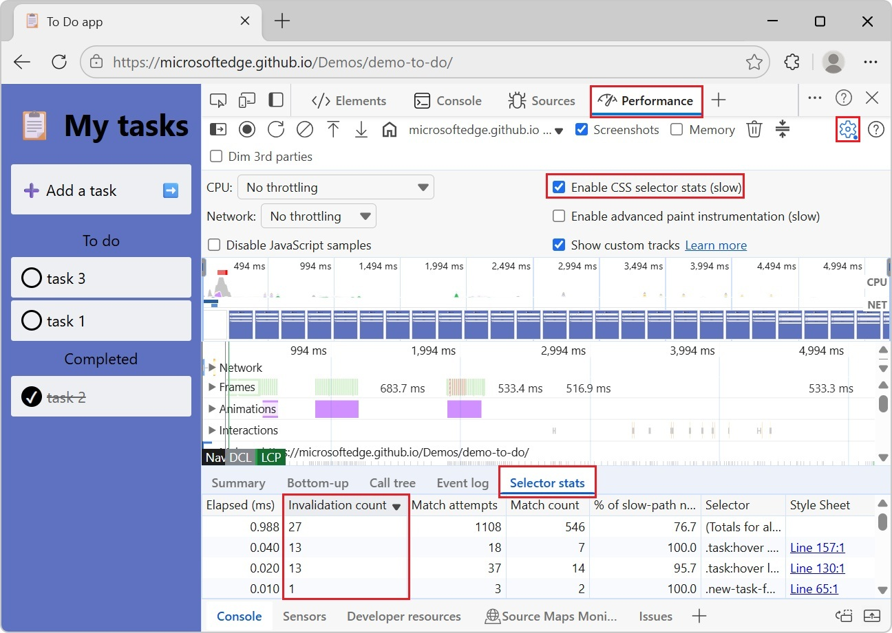

# What's New in DevTools (Microsoft Edge 140)

These are the latest features in the Stable release of Microsoft Edge DevTools.

<!-- ====================================================================== -->
## Invalidation count in CSS selector stats

<!-- Subtitle: Identify expensive selectors with the new column in CSS selector stats (Performance tool) to reduce costly style recalculations. -->

In the **Performance** tool, the CSS **Selector stats** table has a new column: **Invalidation count**.  The **Invalidation count** column shows an aggregated count of DOM nodes that are matched by a selector that were invalidated and had their style recalculated.  A node can be invalidated multiple times and by multiple selectors.

During a recalculate style event, the browser may invalidate many DOM nodes depending on the selector.  Inefficient selectors can impact your webpage's performance.  If you have high style-recalculation costs, that might be caused by over-invalidation.  You can use this new insight to identify selectors that have a high invalidation count, and reduce over-invalidation by refining your CSS style rules.

See also:
* [Analyze CSS selector performance during Recalculate Style events](../../../performance/selector-stats.md)

<!-- ====================================================================== -->
## Announcements from the Chromium project
<!-- https://developer.chrome.com/blog/new-in-devtools-140 -->

Microsoft Edge 140 also includes the following updates from the Chromium project:

* [Emulate the 'Save-Data' header in 'Network conditions'](https://developer.chrome.com/blog/new-in-devtools-140#save-data)
* [See the Baseline status in a CSS property tooltip](https://developer.chrome.com/blog/new-in-devtools-140#baseline-tooltip)
* [Override form factors in user agent client hints](https://developer.chrome.com/blog/new-in-devtools-140#form-factors)

<!-- ====================================================================== -->
## See also

* [What's New in Microsoft Edge DevTools](../../whats-new.md)
* [Release notes for Microsoft Edge web platform](../../../../web-platform/release-notes/index.md)
