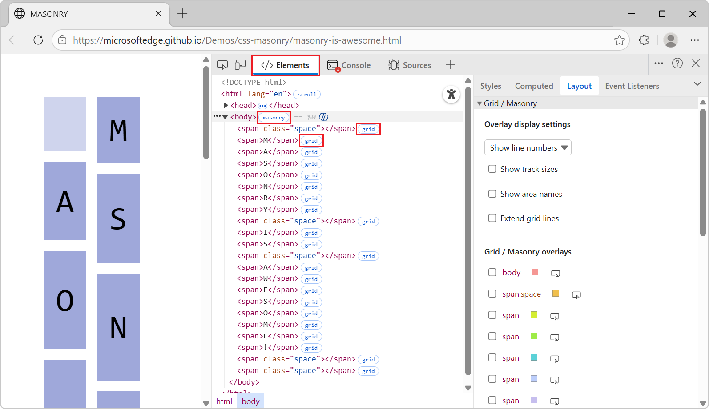

# What's New in DevTools (Microsoft Edge 141)

These are the latest features in the Stable release of Microsoft Edge DevTools.

<!-- ====================================================================== -->
## CSS masonry layout support in the Elements tool

<!-- Subtitle: Inspect masonry layout in the Layout tab and adorners in the DOM tree. -->

CSS masonry layout is supported in the **Layout** tab of the **Elements** tool.  Masonry layout elements are displayed alongside grid layout elements:

In the **Overlay display settings** section, you can control whether to display:
* Line numbers or line names.
* Track sizes.
* Area names.

The **masonry** adorner appears next to elements in the DOM tree, similar to the **grid** or **flex** adorners:

See also:
* [Inspect CSS Grid](/microsoft-edge/devtools/css/grid)
* [CSS Masonry demos](https://github.com/MicrosoftEdge/Demos/tree/main/css-masonry)
* [Brick by brick: Help us build CSS Masonry](https://developer.chrome.com/blog/masonry-update) - Blog post.
* [Elements > Layout tab adds masonry layout support](https://developer.chrome.com/blog/new-in-devtools-141#masonry) - Chromium What's New.

<!-- ====================================================================== -->
## Announcements from the Chromium project

Microsoft Edge 141 also includes the following updates from the Chromium project:

* [Persisted track configuration in the Performance panel](https://developer.chrome.com/blog/new-in-devtools-141#persisted-track-config)
* [Filter IP protected network requests](https://developer.chrome.com/blog/new-in-devtools-141#ipp)
* [Elements > Layout tab adds masonry layout support](https://developer.chrome.com/blog/new-in-devtools-141#masonry)

<!-- ====================================================================== -->
## See also

* [What's New in Microsoft Edge DevTools](../../whats-new.md)
* [Release notes for Microsoft Edge web platform](../../../../web-platform/release-notes/index.md)
