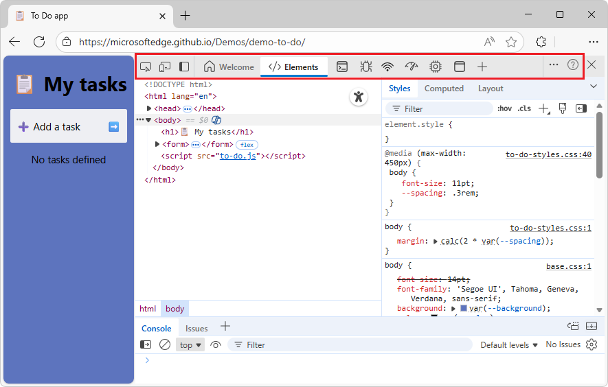

# What's New in DevTools (Microsoft Edge 142)

These are the latest features in the Stable release of Microsoft Edge DevTools.

<!-- ====================================================================== -->
## Activity Bar will only appear horizontally in Edge 144

<!-- Subtitle: Starting with Microsoft Edge 144, the vertical Activity Bar will no longer be supported.-->

Upcoming change:

Starting with Microsoft Edge 144, the **Activity Bar** will always be displayed horizontally, at the top of the DevTools window.  Displaying the **Activity Bar** vertically will no longer be supported.

<!-- ====================================================================== -->
## Announcements from the Chromium project

Microsoft Edge 142 also includes the following updates from the Chromium project:

* [Miscellaneous highlights](https://developer.chrome.com/blog/new-in-devtools-142#misc)

<!-- ====================================================================== -->
## See also

* [What's New in Microsoft Edge DevTools](../../whats-new.md)
* [Release notes for Microsoft Edge web platform](../../../../web-platform/release-notes/index.md)
