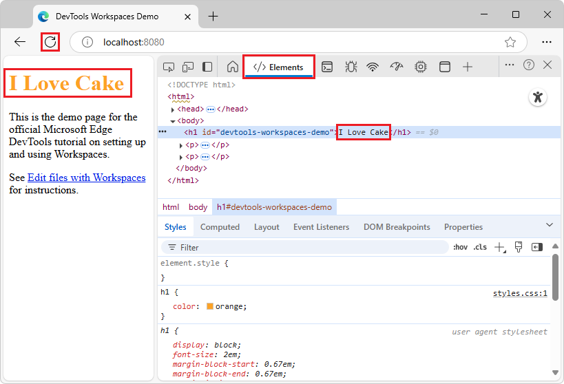

<!-- Copyright Kayce Basques

   Licensed under the Apache License, Version 2.0 (the "License");
   you may not use this file except in compliance with the License.
   You may obtain a copy of the License at

       https://www.apache.org/licenses/LICENSE-2.0

   Unless required by applicable law or agreed to in writing, software
   distributed under the License is distributed on an "AS IS" BASIS,
   WITHOUT WARRANTIES OR CONDITIONS OF ANY KIND, either express or implied.
   See the License for the specific language governing permissions and
   limitations under the License.  -->
# Edit and save files in a workspace (Sources tool Workspace tab)
<!-- https://developer.chrome.com/docs/devtools/workspaces -->

You can use DevTools as an in-browser Integrated Development Environment (IDE).  To save edits to webpage source files, add the source code folder of the webpage in the **Workspace** tab of the **Sources** tool.  You can then edit and save HTML, CSS, and JS files in the **Sources** tool's editor (or in the **Quick source** tool in the **Quick View** panel at the bottom of DevTools).

You can create, copy, rename, and delete source files from within the **Workspace** tab.

Use the **Workspace** tab in the **Sources** tool to display and edit the contents of a folder on your computer from within the **Sources** tool.  The changes that you make to the files in a workspace are saved to your computer.

The typical way to set up a workspace is to set it up to display the source files of your website's frontend code.  This way, you use DevTools both to inspect your website, and to make changes to its source files.  This way, the changes that you make are saved on your computer, rather than lost when you refresh the page.

See also:
* [Workspace tutorial (Sources tool Workspace tab)](./workspace-tutorial.md)

<!-- ====================================================================== -->
## Overview of the DevTools workspace feature
<!-- Overview  https://developer.chrome.com/docs/devtools/workspaces#overview -->

A DevTools _workspace_ lets you view your website's source code that's on your computer, and make changes to it, from the **Sources** tool, so that changes are retained across refreshes of the page.

Here's a typical scenario for using a workspace:

1. Have the source code for your website on your computer.

1. Run a local web server (such as `npx http-server`) from the source code directory, so that the site is accessible at a local development URL such as `http://localhost:8080`.

1. Open `http://localhost:8080` in Microsoft Edge.

1. Use the **Sources** tool's **Workspace** tab in DevTools to change the source code of your website, including the CSS, HTML, and JavaScript files.

1. Reload your webpage to see the changes.

  Your website might use a build system which you need to run before you can see the changes.  Web developers often use a build system that watches for saved changes in the source code files.  When you save a change to a source code file, the build system builds those changes and then automatically refreshes the page in the browser.

  If you use such an automated build system, when you make a change to a source file in the **Sources** tool and save it, you automatically see those changes applied to the rendered web page.

<!-- ====================================================================== -->
## Limitations of the workspace feature with transformed source code
<!-- Limitations  https://developer.chrome.com/docs/devtools/workspaces#limitations -->

If you're using a modern framework, it might transform your source code from a format that's easy to maintain into a format that's optimized to run as quickly as possible.  The **Workspace** tab in the **Sources** tool is usually able to map the optimized code back to the original source code, by using [source maps](https://blog.teamtreehouse.com/introduction-source-maps) for JavaScript and CSS.  However, there's a lot of variation in how each framework uses source maps.

DevTools doesn't support every framework variation.  If you run into issues while using workspaces with your framework of choice, or you identify framework-specific steps that are needed, please reach out to use by opening an issue on the [MicrosoftEdge/DevTools](https://github.com/MicrosoftEdge/DevTools/issues) repository.

<!-- ====================================================================== -->
## Editing CSS by using the Styles tab in the Elements tool, when using the Workspace tab of the Sources tool

If you use a workspace, in some cases you can edit CSS in the **Styles** tab in the **Elements** tool and have the changes saved to the mapped file on disk:

* Edits that you make in the **Styles** tab in the **Elements** tool _are_ saved to the CSS file on disk, if DevTools has mapped a style sheet on the webpage and the file in the workspace, such as by a source map, or by matching content.

   If you use an automatic build system framework, changes are saved to your source file if DevTools was able to map the style sheet to the workspace file, by using a source map.

   Depending on the automated build system or framework that you use, DevTools may be able to save changes to disk, if there's no build step, or there's a build step and a source map.  The **Styles** tab is mapped to the CSS file on disk, and so edits in the **Styles** tab are saved to disk.

* Edits that you make in the **Styles** tab in the **Elements** tool are _not_ saved to the CSS file on disk, if the stylesheet isn't mapped to a workspace file.  Editing CSS in the **Styles** tab of the **Elements** tool will lose changes; the changes aren't saved to disk.

If you are using a **Workspace**, edit the CSS in the **Sources** tool (not in the **Elements** tool), because the source files that you edit might be built or compiled by a build script before being served by your local server.
When you edit in the **Elements** tool, you might be editing the compiled-and-built version of the file, not the source file.

When you use a **Workspace**:
1. Edit the file in the **Sources** tool.
1. Save the change.
1. Build again.  Some build systems do this automatically, when they detect a change.
1. Reload the page.  Some servers do this automatically when they detect a change.

<!-- ------------------------------ -->
#### Limitations of the Elements tool's Styles tab
<!-- todo: merge with above -->

Using the **Elements** tool's **Styles** tab might not always work for every scenario.  Suppose your project uses a framework or pre-processor to write CSS, where you don't directly write CSS, but you write the equivalent of CSS by using a different language and a different file structure.  Such a project might use a build system which then translates, compiles, and combines the CSS-like code into something that the browser can understand.

Such a project might generate source maps, so that DevTools allows you to see and edit your source files in the **Elements** tool's **Styles** tab.  But in some cases, that might not work, or the project might not use source maps.

When that happens, any changes you make in the **Elements** tool's **Styles** tab are not saved to the workspace files.  In that case, edit your source files in the **Sources** tool instead.  In the above scenario, the files that use a different language are visible in the **Workspace** tab of the **Sources** tool, and you can edit the source files there.

Then, behind the scenes, any saved changes need to be re-built and compiled (which may happen automatically), and then the changes are visible in the rendered web page after a page refresh (which may happen automatically).

<!-- ====================================================================== -->
## Related feature: Local Overrides
<!-- https://developer.chrome.com/docs/devtools/workspaces#overrides -->

**Local overrides** is a DevTools feature that's similar to a workspace.  You can use an override when you want to experiment with changes to a webpage, and you need to display the changes across webpage loads, but you don't care about mapping your changes to the source code of the webpage.

**Local Overrides** saves the changes you make to a webpage in a folder of your choice, and organizes them in a folder structure that matches the URL of overridden resources.

The **Overrides** feature stores a copy of the webpage resources that you edit in DevTools.  When you refresh the page, Microsoft Edge loads the local modified copy of files instead of the files on the server.

See also:
* [Override webpage resources with local copies (Overrides tab)](../javascript/overrides.md)

<!-- ====================================================================== -->
## Elements tool DOM tree edits are lost after refresh
<!-- #### Try changing HTML from the Elements panel -->
<!-- https://developer.chrome.com/docs/devtools/workspaces#elements -->

To make changes to an HTML source file, you need to use the **Sources** tool's **Workspace** tab, instead of the **Elements** tool.

Limitations of **Elements** tool > DOM tree edits:

In the **Elements** tool, it's possible to change the DOM representation of the HTML document, which the browser engine constructed when it loaded the page.  However, changes to the DOM can't be mapped back to HTML source files.  You can make changes to the HTML content using the DOM tree in the **Elements** tool, but your changes to the DOM tree aren't saved to disk, and only affect the current browser session.

See also:
* [Editing CSS by using the Styles tab in the Elements tool, when using the Workspace tab of the Sources tool](#editing-css-by-using-the-styles-tab-in-the-elements-tool-when-using-the-workspace-tab-of-the-sources-tool), above.

Limitations of the **Sources** tool > **Page** tab:

The **Page** tab of the **Sources** tool doesn't allow you to save changes to the file system.
* An HTML file that's opened via the **Page** tab can't be edited.
* A CSS or JS file that's opened via the **Page** tab can be edited, but the edits are not preserved across refreshes of the webpage.

The following steps demonstrate that edits in the **Elements** tool DOM tree aren't preserved across page refreshes:

1. Set up the Workspaces demo as described in [Workspace tutorial (Sources tool Workspace tab)](./workspace-tutorial.md).

1. In DevTools, select the **Elements** (`</>`) tool.

1. In the DOM tree, in the `<h1>` element, select the text string `DevTools Workspaces Demo`, delete it, type the text string `I Love Cake`, and then press **Enter**.  The rendered webpage shows the new heading text, **I Love Cake**:

   

1. Select the **Sources** tool, right-click `index.html`, and then select **Open in containing folder**.

   File Explorer or Finder opens.

1. Open the `index.html` file that's in your `/Demos/workspace/` directory in a text editor, such as Visual Studio Code.  The change that you just made doesn't appear; the heading still reads "DevTools Workspaces Demo", instead of "I Love Cake".

1. In the browser, refresh the demo page.

   The page reverts to the original heading, "DevTools Workspaces Demo", because the DOM tree with your edit was discarded, and the DOM was re-created from the unchanged `index.html` file that's in your `/Demos/workspace/` directory.

<!-- ------------------------------ -->
#### Why DOM tree edits aren't saved
<!-- https://developer.chrome.com/docs/devtools/workspaces#why -->

Changing the DOM tree in the **Elements**, per the above section, doesn't work.

* The tree of nodes that you see on the **Elements** tool represents the page's DOM.

* To display a page, a browser fetches HTML over the network, parses the HTML, and then converts it into a tree of DOM nodes.

* If the page has any JavaScript, that JavaScript may add, delete, or change DOM nodes. CSS can change the DOM, too, via the `content` property.

* The browser eventually uses the DOM to determine what content it should present to browser users.

* Therefore, the final state of the page that users see may be very different from the HTML that the browser fetched.

* This makes it difficult for DevTools to resolve where a change made in the **Elements** tool should be saved, because the DOM is affected by HTML, JavaScript, and CSS.

In short, the DOM tree, which the browser engine constructed, is different from the HTML document that was downloaded from the server.

<!-- ====================================================================== -->
## Making the green "mapped" dots appear on files
<!-- heading not in upstream -->

If green "mapped" dots stop appearing on files in DevTools, such as in the **Workspace** tab; or if the **Changes** tool doesn't show expected changes:

* With DevTools displayed, long-click or right-click the **Refresh** button in Microsoft Edge, and then select **Hard refresh** (**Ctrl+Shift+R**).

  A green "mapped" dot next to a file in DevTools indicates that DevTools has established a mapping between a network resource of the page that's received from the web server, and the local source file in your `/Demos/workspace/` directory.  The new file that you add in DevTools must be returned by the server, to be indicated as mapped.

If you add a new `.js` file in the workspace and you want a green "sync" circle to appear on the added `.js` file, and have the file represented in the **Changes** tool:

1. Reference the added `.js` file in the HTML file, such as the line `` within the `<body>` tag.

1. Make sure there's code in the `.js` file, such as the line `console.log('hello from test.js');`.

1. Press **Ctrl+S** (Windows, Linux) or **Command+S** (macOS).  Your change is saved, and the asterisk disappears.

1. With DevTools displayed, long-click or right-click the **Refresh** button in Microsoft Edge, and then select **Hard refresh** (**Ctrl+Shift+R**).

See also:
* [Track changes to files using the Changes tool](../changes/changes-tool.md)

<!-- ====================================================================== -->
## See also

* [Workspace tutorial (Sources tool Workspace tab)](./workspace-tutorial.md)
* [Open a demo folder from the Workspace tab in the Sources tool](../../devtools/samples/index.md#open-a-demo-folder-from-the-workspace-tab-in-the-sources-tool) in _Sample code for DevTools_.
* [Track changes to files using the Changes tool](../changes/changes-tool.md)
* [Display or edit source files using the Quick source tool](../quick-source/quick-source-tool.md)

<!-- ====================================================================== -->
> [!NOTE]
> Portions of this page are modifications based on work created and [shared by Google](https://developers.google.com/terms/site-policies) and used according to terms described in the [Creative Commons Attribution 4.0 International License](https://creativecommons.org/licenses/by/4.0).
> The original page is found [here](https://developer.chrome.com/docs/devtools/workspaces/) and is authored by Kayce Basques.

This work is licensed under a [Creative Commons Attribution 4.0 International License](https://creativecommons.org/licenses/by/4.0).
