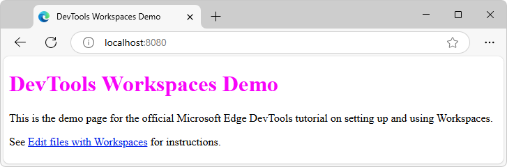
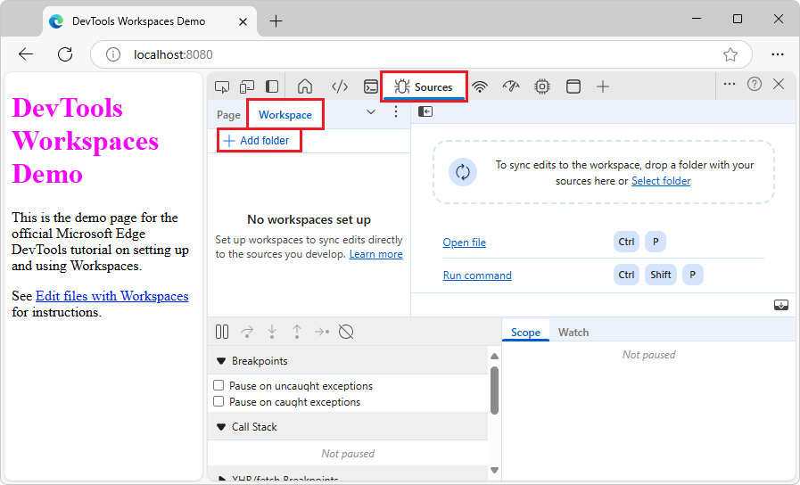
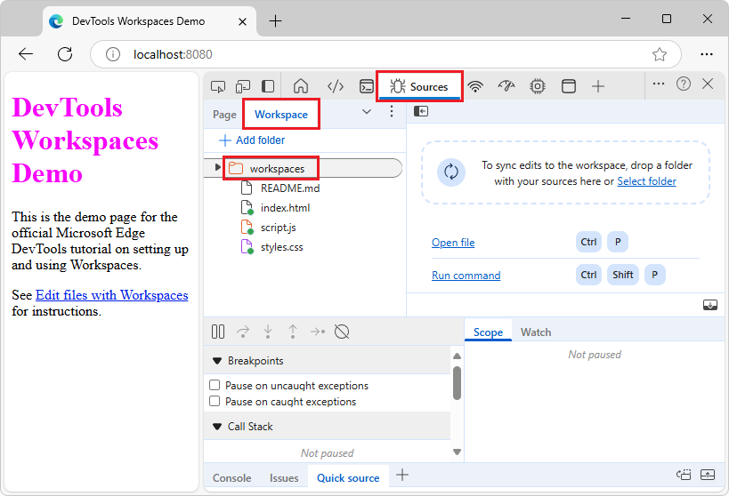
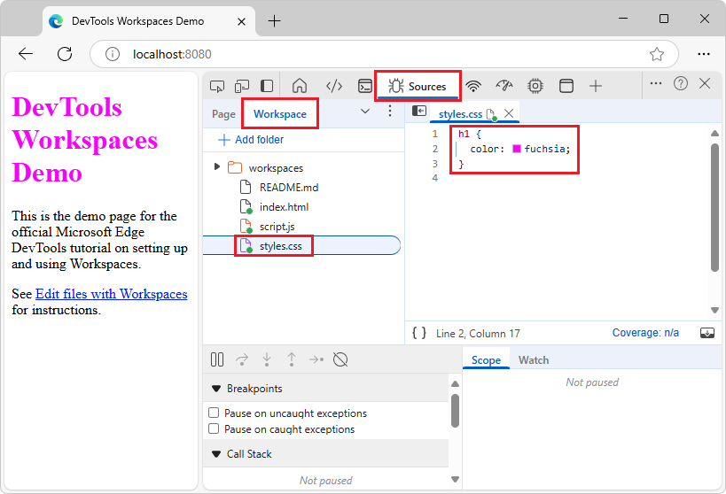
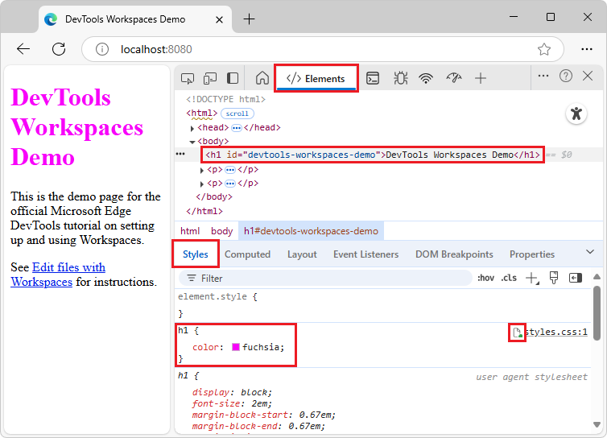
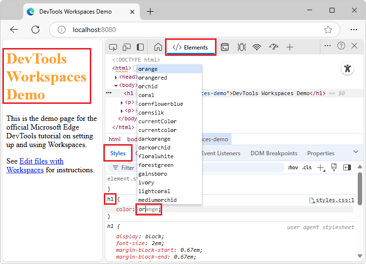
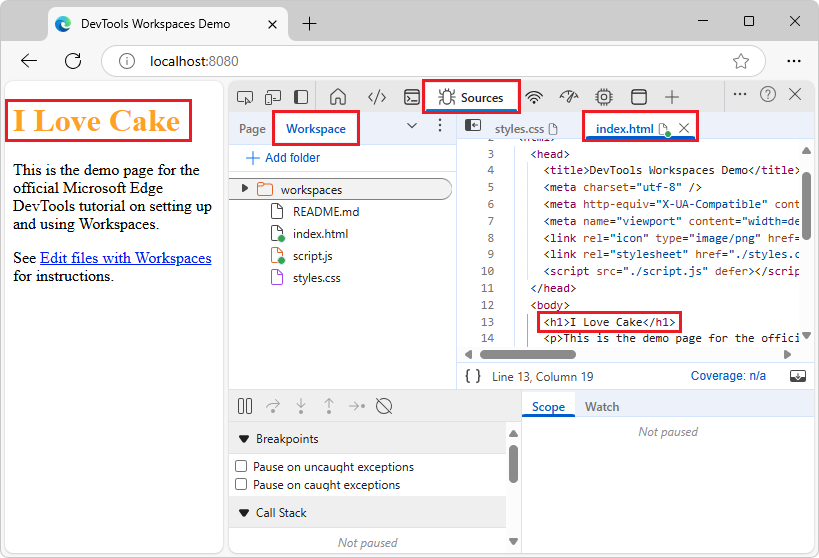
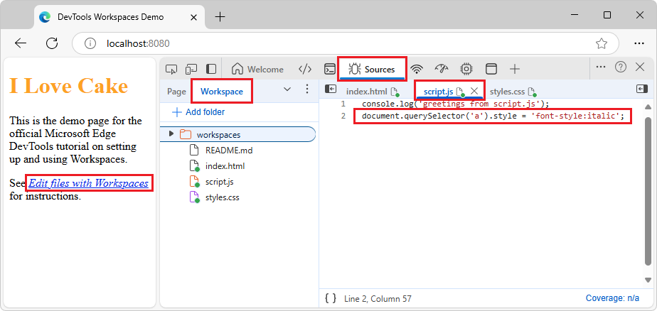
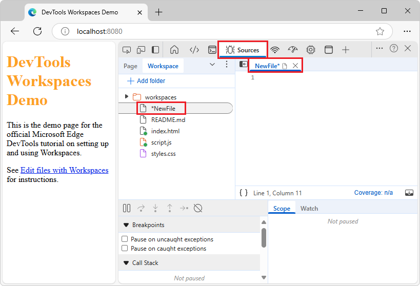
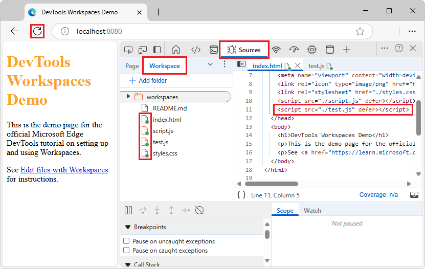

<!-- Copyright Kayce Basques

   Licensed under the Apache License, Version 2.0 (the "License");
   you may not use this file except in compliance with the License.
   You may obtain a copy of the License at

       https://www.apache.org/licenses/LICENSE-2.0

   Unless required by applicable law or agreed to in writing, software
   distributed under the License is distributed on an "AS IS" BASIS,
   WITHOUT WARRANTIES OR CONDITIONS OF ANY KIND, either express or implied.
   See the License for the specific language governing permissions and
   limitations under the License.  -->
# Workspace tutorial (Sources tool Workspace tab)

Use the following steps to use DevTools as an IDE, such as making webpage edits in the **Sources** tool's **Workspace** tab, saving changes to the source files on disk. 

You can read or follow these steps that show how to set up and using a workspace in DevTools.  After you set up a workspace, the changes that you make to the files in the workspace, by using DevTools, are saved on your local computer.


<!-- ====================================================================== -->
## Step 1: Clone the Edge Demos repo to your local drive
<!-- https://developer.chrome.com/docs/devtools/workspaces/#setup -->
<!-- Set up the demo  https://developer.chrome.com/docs/devtools/workspaces#demo -->

First, you set up a local directory that contains the source files for the webpage, such as the Workspaces demo webpage.

Clone the **MicrosoftEdge / Demos** repo to your local drive, including the `/workspaces/` demo folder, as follows:

1. If not done already, [Download git](https://git-scm.com/downloads) and install it.

1. Go to [MicrosoftEdge / Demos](https://github.com/MicrosoftEdge/Demos) in a new window or tab.

1. Click the **Code** drop-down button, and then click the **Copy url to clipboard** button.

   The URL is copied to the clipboard: `https://github.com/MicrosoftEdge/Demos.git`

   Or, if you have GitHub Desktop installed, click **Open with GitHub Desktop** to clone the repo, and skip the command prompt step below.

   Or, you can use Visual Studio Code's **Source Control** pane to clone the repo, and skip the command prompt step below.

1. Open a command prompt, such as git bash.

1. Clone the repo to your local drive, entering the URL string that you copied from the GitHub repo.  If you use the git bash command prompt:

   ```console
   # Example location where the repo directory will be added:
   cd ~/GitHub
   git clone https://github.com/MicrosoftEdge/Demos.git
   ```

For details about cloning a repo, see:
* [Cloning a repository](https://docs.github.com/en/repositories/creating-and-managing-repositories/cloning-a-repository) - GitHub docs.

Continue with the next section.


<!-- ====================================================================== -->
## Step 2: Start the localhost server in the webpage source files directory
<!-- Edge heading only -->

1. If not done already, install an up-to-date version of Node.js and npm from [Node.js](https://nodejs.org).

   See also:
   * [Install Node.js and Node Package Manager (npm)](../../visual-studio-code/microsoft-edge-devtools-extension/install.md#step-4-install-nodejs-and-node-package-manager-npm) in _Installing the DevTools extension for Visual Studio Code_.

1. Go to a command prompt, such as the git bash shell, or the Terminal pane in Microsoft Visual Studio Code.

1. Change to the `Demos` repo directory's `workspaces` directory:

   ```console
   cd ~/GitHub/Demos/workspaces
   pwd
   ```

   A directory for use with the **Sources** tool's **Workspace** tab can have any name.  This demo directory is named `/workspaces/`.

1. Create a working branch named "test" and switch to it (to avoid altering the demo's files in the "main" branch):

   ```console
   git checkout -b test
   ```

   That's equivalent to:

   ```console
   git branch test
   git switch test
   ```

1. Run one of the following commands, to start the web server:

   ```bash
   # Node.js option
   npx http-server
   ```

   For more information and options, see [Start the server (npx http-server)](../../visual-studio-code/microsoft-edge-devtools-extension/install.md#start-the-server-npx-http-server) in _Installing the DevTools extension for Visual Studio Code_.

   ``` bash
   # Python 2 option
   cd ~/GitHub/demos/workspaces
   python -m SimpleHTTPServer
   ```
  
   ``` bash
   # Python 3 option
   cd ~/GitHub/demos/workspaces
   python -m http.server
   ```

1. Open a tab in Microsoft Edge, and go to the locally hosted version of the site.  You typically access it by going to`localhost:8080`:

   

   Another common equivalent URL is `http://0.0.0.0:8080`.  The default port number for the Python server option is `8000`.  The exact [port number](https://wikipedia.org/wiki/Port_(computer_networking)#Use_in_URLs) might be different.

   The **DevTools Workspaces Demo** webpage opens.

   (The link in the latest demo might say either "Edit file with workspaces" or "Edit and save files in a workspace (Sources tool Workspace tab)".)

See also:
* [Running a simple local HTTP server](https://developer.mozilla.org/docs/Learn/Common_questions/set_up_a_local_testing_server#running_a_simple_local_http_server) in _How do you set up a local testing server?_ at MDN - shows Python.
<!--
* [Set up a localhost server](../../visual-studio-code/microsoft-edge-devtools-extension/install.md#step-6-set-up-a-localhost-server) in _Installing the DevTools extension for Visual Studio Code_.  How to run a local HTTP web server by using Node.js. -->

Continue with the next section.


<!-- ====================================================================== -->
## Step 3: Add a Workspace folder in the Sources tool
<!-- Set up DevTools  https://developer.chrome.com/docs/devtools/workspaces#devtools -->

<!-- the always-available way -->
Next, define a Workspace in DevTools:

1. Right-click the locally hosted **DevTools Workspaces Demo** webpage and then select **Inspect**.  Or, press **Ctrl+Shift+J** (Windows, Linux) or **Command+Option+J** (macOS).

   DevTools opens.

1. Click the **Sources** () tab.

1. In the **Navigator** pane (on the left), click the **Workspace** tab (which is grouped with the **Page** tab):

   

1. Click **Add folder** button.

   The **Select Folder** dialog opens.

1. Go to the cloned `/Demos/workspace/` directory that you created.  For example, in the **Folder:** text box, enter the path, such as `C:\Users\localAccount\GitHub\Demos\workspaces\`.

1. Click the **Select Folder** button.

   DevTools prompts you whether to grant DevTools full access to your `/workspaces/` directory.

1. Click the **Allow** button, to give DevTools permission to read and write to the directory.

   In the **Workspace** tab are page icons that have a green "mapped" dot, for `index.html`, `script.js`, and `styles.css`. <!--(The two-way arrow colors are mapped to `.html`, `.js`, and `.css` file types.)-->  The green "mapped" dot indicates that DevTools has established a mapping between a network resource of the page that's received from the web server, and the local source file in your `/Demos/workspace/` directory:

   

Continue with the next section.


<!-- ====================================================================== -->
## Step 4: Save a CSS change to disk (via Elements tool Styles tab)
<!-- https://developer.chrome.com/docs/devtools/workspaces/#css -->

Next, you edit CSS and save changes to the source file.  We here use the **Elements** tool's **Styles** tab, assisted by its user interface controls, though we could directly edit the CSS file in the **Sources** tool's **Workspace** tab's file editor.

To make a change in the CSS file and save it to disk by using the **Elements** tool's **Styles** tab:

1. In the **Sources** tool, in the **Workspace** tab (grouped with the **Page** tab), select `styles.css` to open it in the editor pane.  The `color` property of the `h1` element is set to `fuchsia`:

   

1. Select the **Elements** () tool; then in the DOM tree, expand the `<body>` element; and then select the `<h1>` element.

   The **Styles** pane displays the CSS rules that are applied to the `<h1>` element.  The **mapped file** () icon next to `styles.css:1` is a page with a green "mapped" dot.  The green "mapped" dot means that any changes that you make to this CSS rule are mapped to `styles.css` in your `/Demos/workspace/` directory:

   

1. Change the value of the `color` property of the `<h1>` element to orange.  To do this, select the `<h1>` element in the **DOM Tree**.  In the CSS rule for `h1`, click `fuchsia`, start typing **orange**, and then select **orange** from the color list:

   

1. Select the **Sources** tool, right-click `styles.css`, and then select **Open in containing folder**.

   File Explorer or Finder opens.

1. Open the copy of `styles.css` that's in your `/Demos/workspace/` directory in a text editor, such as Visual Studio Code.  The `color` property is now set to the new color, which is orange in this example.  The change was not only made in the copy of the file returned from the web server; the change was also made in your mapped file in your `/Demos/workspace/` workspace directory.

1. Refresh the page.

The color of the `<h1>` element is still set to the new color.  The change remains across a refresh, because when you made the change, DevTools saved the change to disk.  When you refreshed the page, your local server served the modified copy of the file from disk.

**Tip:** You can also change the color by clicking the fucshia-colored swatch to open the color picker to pick a new color. The HEX value for the color you pick is the color name.

Continue with the next section.


<!-- ====================================================================== -->
## Step 5: Save an HTML change to disk (via Sources tool Workspace tab)
<!-- https://developer.chrome.com/docs/devtools/workspaces/#html -->
<!-- Change HTML from the Sources panel  https://developer.chrome.com/docs/devtools/workspaces#sources -->
<!-- resequenced to start with the recommended way -->

Next, edit HTML and save changes to the source file.  To save changes to the webpage HTML file, add the source code folder in the **Sources** tool's **Workspace** tab, and then edit the HTML in the **Sources** tool.  (Changes aren't made to the source file by merely changing the HTML in the DOM tree in the **Elements** tool.)

The DevTools **Workspace** tab is similar to using an editor to edit the HTML source file, but enables editing the HTML source file directly within DevTools.

1. Continuing from above, in DevTools, click the **Sources** () tab.

1. In the **Navigator** pane on the left, in the **Workspace** tab (grouped with the **Page** tab), select `index.html`.

   The **index.html** tab opens in the **Sources** tool.

1. In the the `<h1>` tag, replace "DevTools Workspaces Demo" with "I Love Cake".

   An asterisk appears next to `index.html`.

1. Press **Ctrl+S** (Windows, Linux) or **Command+S** (macOS).

   Your change is saved, and the asterisk disappears.

   You made the change in the file listing, rather than in the DOM tree in the **Elements** tool.

1. Refresh the page.  The heading in the rendered page changes to "I Love Cake", because that string was saved in `index.html` in your mapped `/Demos/workspace/` directory:

   

1. In the **Sources** tool, right-click `index.html`, and then select **Open in containing folder**.

   File Explorer or Finder opens.

1. Open the copy of `index.html` that's in your `/Demos/workspace/` directory in a text editor, such as Visual Studio Code.

   The `<h1>` element contains the new text, "I Love Cake", because you made the change using the **Sources** tool's editor to edit `index.html` and then saved the change, and that file was mapped in a workspace (the **Workspace** tab), indicated by a green "mapped" dot on the file's icon.

   Many developers don't write HTML directly, but instead use approaches such as:
   * A server-side language, such as Java, Python, or PHP.
   * A site generator, such as Eleventy.
   * A client-side framework that uses JavaScript code.
   * A markup language other than HTML, such as Markdown.

   This means that in practice, few developers change HTML files in the **Workspace** tab.  Most devs produce HTML files by using a different type of source file, such as a React component JS source file, and then rebuild and reload (which may happen automatically).

1. Long-click or right-click the **Refresh** button in Microsoft Edge, and then select **Hard refresh** (**Ctrl+Shift+R**).

   In the **Workspace** tab, green "mapped" dots appear on all the HTML, CSS, and JS files.

Continue with the next section.


<!-- ====================================================================== -->
## Step 6: Save a JavaScript change to disk
<!-- https://developer.chrome.com/docs/devtools/workspaces/#js
don't doc Quick source tool here
-->

Continuing from above, next, you'll edit the Workspace demo's JavaScript file and save changes to the source file.  To save edits to a JavaScript source file, you can use DevTools like an IDE, after adding the source code folder in the **Workspace** tab of the **Sources** tool.  You can then edit and save the JavaScript file in the **Sources** tool's editor.

In the rendered demo webpage, to style the **Edit and save files in a workspace (Sources tool Workspace tab)** hyperlink with italics:

1. In DevTools, select the **Sources** tool, and then select the **Workspace** tab, which is grouped with the **Page** tab.

1. In the **Workspace** tab, select `script.js`.

   `script.js` opens in a tab within the editor pane of the **Sources** tool.

1. In the editor pane, add the following code to the bottom of **script.js**:

   ```javascript
   document.querySelector('a').style = 'font-style:italic';
   ```

   An asterisk appears on the `script.js` tab.

1. Press **Ctrl+S** (Windows, Linux) or **Command+S** (macOS).

   `script.js` is saved, and the asterisk is removed from the `script.js` tab.

1. Refresh the page.

1. If there's no longer a green "mapped" dot on the HTML, JS, or CSS file, long-click or right-click the **Refresh** button in Microsoft Edge, and then select **Hard refresh** (**Ctrl+Shift+R**).

   The **Edit files with Workspaces** (or **Edit and save files in a workspace (Sources tool Workspace tab)**) hyperlink on the page is now italicized:

   

Continue with the next section.


<!-- ====================================================================== -->
## Step 7: Add a .js file using DevTools
<!-- section not in upstream -->

1. In the **Sources** tool, in the **Workspace** tab, right-click the `/workspaces/` folder, and then select the **New file** menuitem.

   A file named `NewFile` is added:

   

1. Right-click `NewFile` in the **Workspace** tab and then select **Rename**.

1. Rename the file to `test.js`.

1. In `test.js`, add the line: `console.log('hello from test.js');`

1. In the **Sources** tool, in the **Workspace** tab, select `index.html`.

1. In `index.html`, below the line `<script src="./script.js" defer></script>`, add the line: `<script src="./test.js" defer></script>`

1. Press **Ctrl+S** (Windows, Linux) or **Command+S** (macOS).

   `index.html` is saved.

1. Long-click or right-click the **Refresh** button in Microsoft Edge, and then select **Hard refresh** (**Ctrl+Shift+R**).

   In the **Workspace** tab, green "mapped" dots appear on all the HTML, CSS, and JS files:

   

This completes the tutorial.

If you want to revert the edits in your `/workspace/` folder, you can use git commands at a command prompt, or use GitHub Desktop, to revert the changes in the current branch, such as "main" or "test".


<!-- ====================================================================== -->
## See also
<!-- https://developer.chrome.com/docs/devtools/workspaces#next-steps -->

* [Edit and save files in a workspace (Sources tool Workspace tab)](index.md)
* [Get started viewing and changing CSS](../css/index.md)
* [Get started debugging JavaScript](../javascript/index.md)


<!-- ====================================================================== -->
> [!NOTE]
> Portions of this page are modifications based on work created and [shared by Google](https://developers.google.com/terms/site-policies) and used according to terms described in the [Creative Commons Attribution 4.0 International License](https://creativecommons.org/licenses/by/4.0).
> The original page is found [here](https://developer.chrome.com/docs/devtools/workspaces/) and is authored by Kayce Basques.

[](https://creativecommons.org/licenses/by/4.0)
This work is licensed under a [Creative Commons Attribution 4.0 International License](https://creativecommons.org/licenses/by/4.0).
