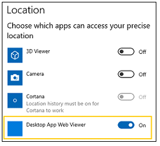

# Microsoft Edge Developer Guide  

> [!TIP]
> We've [partnered](https://blogs.windows.com/msedgedev/2017/10/18/documenting-web-together-mdn-web-docs/) with other browsers and the web community in adopting [MDN Web Docs](https://developer.mozilla.org/) as the definitive place for useful, unbiased, browser-agnostic documentation for current and emerging standards-based web technologies.  You can find details about EdgeHTML API support directly in each page of the [MDN web reference library](https://developer.mozilla.org/docs/Web).  Visit Microsoft Edge's [Platform status](https://developer.microsoft.com/microsoft-edge/platform/status/?q=edge%3AShipped%20edge%3APrefixed%20edge%3A'Preview%20Release) for the latest features supported in Microsoft Edge.  

## What's new in EdgeHTML 18  

EdgeHTML 18 includes the following new and updated features shipped in the current release of the Microsoft Edge platform, as of the [Windows 10 October 2018 Update](/windows/uwp/whats-new/windows-10-build-17763) \(10/2018, Build 17763\).  For changes in specific [Windows Insider](https://insider.windows.com) Preview builds, see the [Microsoft Edge Changelog](https://developer.microsoft.com/microsoft-edge/platform/changelog) and [What's New in EdgeHTML](./whats-new.md).  

Here's the permalink for the following list of changes: [https://docs.microsoft.com/microsoft-edge/dev-guide](#new-apis-in-edgehtml-18).  

## New and updated features  

### Autoplay policies  

With the Windows 10 October 2018 Update, Microsoft Edge provides customers with the ability to personalize their browsing preferences on websites that autoplay media with sound in order to minimize distractions on the web and conserve bandwidth.  Users can customize media behavior with both global and per-site autoplay controls.  Additionally, Microsoft Edge automatically suppresses autoplay of media in background tabs.  

Check out the [Autoplay policies](./browser-features/autoplay-policies.md) guide for details and best practices to ensure a good user experience with media hosted on your site.  

### Chakra improvements  

EdgeHTML 18 includes updates to the Chakra JavaScript engine to support new ES and WASM features in addition to performance and interoperability improvements.  Check out the [ChakraCore 1.11 Release Notes](https://github.com/Microsoft/ChakraCore/wiki/Roadmap#chakracore-111) for details.  

### CSS updates  

We've made further progress on our experimental [CSS Masking](https://developer.mozilla.org/docs/Web/CSS/CSS_Masking) implementation \(behind the *Enable CSS Masking* flag\) with added support for [mask-composite](https://developer.mozilla.org/docs/Web/CSS/mask-composite), [mask-position](https://developer.mozilla.org/docs/Web/CSS/mask-position), and [mask-repeat](https://developer.mozilla.org/docs/Web/CSS/mask-repeat).  For site compatibility, Microsoft Edge also supports the following *-webkit-* properties: -webkit-mask, -webkit-mask-composite, -webkit-mask-image, -webkit-mask-position, -webkit-mask-position-x, -webkit-mask-position-y, -webkit-mask-repeat, -webkit-mask-size.  

Additionally, Microsoft Edge now has support for [overflow-wrap](https://developer.mozilla.org/docs/Web/CSS/overflow-wrap) and partial support for [overscroll-behavior](https://developer.mozilla.org/docs/Web/CSS/overscroll-behavior) \(`auto` and `contain` values\).  

### Developer Tools  

The latest update to Microsoft Edge DevTools adds a number of conveniences both to the UI and under the hood, including new dedicated panels for Service Workers and Storage, source file search tools in the Debugger, and new Edge DevTools Protocol domains for style/layout debugging and console APIs.  

[DevTools in the latest Windows 10 update (EdgeHTML 18)](./whats-new.md) has all the details.  

### Listening to your feedback  

We listen to your feedback and have implemented support for several requested APIs in EdgeHTML 18, including the [DataTransfer.setDragImage()](https://developer.mozilla.org/docs/Web/API/DataTransfer/setDragImage) method used to set a custom image when dragging and dropping, and [secureConnectionStart](https://developer.mozilla.org/docs/Web/API/PerformanceResourceTiming/secureConnectionStart), a property of the Performance Resource Timing API, which can be used for returning a timestamp immediately before the browser starts the handshake process to secure the current connection.  

In addition, no one likes enumerating the attributes collection, so we've added support for [Element.getAttributeNames](https://developer.mozilla.org/docs/Web/API/Element/getAttributeNames) to return the attribute names of the element as an Array of strings, as well as, [Element.toggleAttribute](https://developer.mozilla.org/docs/Web/API/Element/toggleAttribute) to toggle a boolean attribute \(removing if present and adding if not\).  

### Progressive Web Apps  

#### Lifetime background script  

Windows 10 JavaScript apps \(web apps running in a `WWAHost.exe` process\) now support an optional per-application background script that starts before any views are activated and runs for the duration of the process.  With this, you can monitor and modify navigations, track state across navigations, monitor navigation errors, and run code before views are activated.  

When specified as the [StartPage](/uwp/schemas/appxpackage/appxmanifestschema2010-v2/element-application) in your [app manifest](/uwp/schemas/appxpackage/appx-package-manifest), each of the app's views \(windows\) are exposed to the script as instances of the new [WebUIView](/uwp/api/windows.ui.webui.webuiview) class, providing the same events, properties, and methods as a general \(Win32\) [WebView](/uwp/api/windows.web.ui.iwebviewcontrol).  Your script can listen for the [NewWebUIViewCreated](/uwp/api/windows.ui.webui.newwebuiviewcreatedeventargs) event to intercept control of the navigation for a new view:  

```javascript
Windows.UI.WebUI.WebUIApplication.addEventListener("newwebuiviewcreated", newWebUIViewCreatedEventHandler);
```  

 Any app activation with the background script as the `StartPage` will rely on the script itself for navigation.  

#### Text scaling  

The Windows 10 October 2018 Update introduces the [Make text bigger](/windows/uwp/design/input/text-scaling#user-experience) setting for improved end-user accessibility, and PWAs installed on Windows \(in addition UWP and most desktop apps\) now support this feature automatically.  For PWAs and WebView controls, text scale works the same way as DPI scaling.  If a user changes both text scale and DPI scale, the result is the product of the two.  

 For design guidance, check out the [Text scaling](/windows/uwp/design/input/text-scaling) UWP guide on *Windows Dev Center*.  

### Service Worker updates  

For a refresher on what Service Workers are and how they work, check out the [Service Worker API](https://developer.mozilla.org/docs/Web/API/Service_Worker_API) summary written by our partners over at MDN.  There were several updates to Microsoft Edge supporting Service Workers in EdgeHTML 18.  The `fetchEvent` enables the Service Worker to use [preloadResponse](https://developer.mozilla.org/docs/Web/API/FetchEvent) to promise a response, and the [resultingClientId](https://developer.mozilla.org/docs/Web/API/FetchEvent/clientId) to return the ID of the Client that the current service worker is controlling.  
The [NavigationPreloadManager](https://developer.mozilla.org/docs/Web/API/NavigationPreloadManager) interface provides methods for managing the preloading of resources, allowing you to make a request in parallel while a service worker is booting-up, avoiding any time delay.  Check out the [newly supported API properties](#new-apis-in-edgehtml-18) for the list of Service Worker preload methods and properties.  

### Web Authentication  

Microsoft Edge now includes [unprefixed support for the new Web Authentication API](https://blogs.windows.com/msedgedev/2018/07/30/introducing-web-authentication-microsoft-edge) \(aka [WebAuthN](https://w3c.github.io/webauthn)\).  Web Authentication provides an open, scalable, and interoperable solution to simplify authentication, enabling better and more secure user experiences by replacing passwords with stronger hardware-bound credentials.  The implementation in Microsoft Edge allows the use of [Windows Hello](https://www.microsoft.com/windows/windows-hello) enabling users to sign in with their face, fingerprint, or PIN, in addition to [external authenticators](https://fidoalliance.org) like FIDO2 Security Keys or FIDO U2F Security Keys, to securely authenticate to websites.  

For more information, head over to the blog post [Introducing Web Authentication in Microsoft Edge](https://blogs.windows.com/msedgedev/2018/07/30/introducing-web-authentication-microsoft-edge).  

### WebDriver  

WebDriver is now a [Windows Feature on Demand](https://docs.microsoft.com/windows-hardware/manufacture/desktop/features-on-demand-v2--capabilities) \(FoD\) making it easier than ever to automate testing in Microsoft Edge and get the right version for your device.  You will no longer need to match the build/branch/flavor manually when installing WebDriver, your [WebDriver](https://www.w3.org/TR/webdriver) will automatically update to match any new Windows 10 updates.  

You can install WebDriver by turning on Developer Mode, or install it as a standalone by going to **Settings** > **Apps** > **Apps & features** > **Manage optional features**.  For more information, check out the [WebDriver announcement on the Windows Blog site](https://blogs.windows.com/msedgedev/2018/06/14/webdriver-w3c-recommendation-feature-on-demand).  

### Web Notification properties  

Four new properties are now supported for web notifications:  [actions](https://developer.mozilla.org/docs/Web/API/notification/actions), [badge](https://developer.mozilla.org/docs/Web/API/notification/badge), [image](https://developer.mozilla.org/docs/Web/API/notification/image), and  `maxActions`, improving our ability to create notifications on the web that are compatible with existing notification systems, while remaining platform-independent.  

### WebView  

#### Service workers  

[Service workers](https://developer.mozilla.org/docs/Web/API/Service_Worker_API) are now supported in the WebView control, in addition to the Microsoft Edge browser and Windows 10 JavaScript apps.  All flavors of the Microsoft Edge webview \([PWA](/microsoft-edge/hosting/webview), [UWP](/uwp/api/Windows.UI.Xaml.Controls.WebView), [Win32](/windows/communitytoolkit/controls/wpf-winforms/webview)\) support service workers, however please be aware that the [Push API](https://developer.mozilla.org/docs/Web/API/Push_API) is not yet available for the UWP and Win32 versions.  

x64 app architectures require Neutral \(Any CPU\) or x64 packages, as service workers are not supported in WoW64 processes.  \(To conserve disk space, the WoW version of the required DLLs are not natively included in Windows.\)  

#### Win32 WebView updates  

The EdgeHTML [WebViewControl](/windows/communitytoolkit/controls/wpf-winforms/webview) for Windows desktop \(Win32\) apps has been updated with several new features, including the ability to inject script upon page load before any other scripts on the page are run \([AddInitializeScript](/uwp/api/windows.web.ui.interop.webviewcontrol.addinitializescript)\) and know when a particular WebViewControl receives or loses focus \([GotFocus](/uwp/api/windows.web.ui.interop.webviewcontrol.gotfocus)/[LostFocus](/uwp/api/windows.web.ui.interop.webviewcontrol.lostfocus)\).  

Additionally, you can now create a new WebViewControl as the opened window from [window.open](https://developer.mozilla.org/docs/Web/API/Window/open).  The [NewWindowRequested](/uwp/api/windows.web.ui.iwebviewcontrol.newwindowrequested) event still notifies an app when script inside the WebViewControl calls window.open as it always has, but with EdgeHTML 18 its [NewWindowRequestedEventArgs](/uwp/api/windows.web.ui.webviewcontrolnewwindowrequestedeventargs) include the ability to take a deferral \([GetDeferral](/uwp/api/windows.web.ui.webviewcontrolnewwindowrequestedeventargs.getdeferral)\) in order to set a new WebViewControl \([NewWindow](/uwp/api/windows.web.ui.webviewcontrolnewwindowrequestedeventargs.newwindow)\) as the target for the window.open:  

```csharp
WebViewControlProcess wvProc;
WebViewControl webView;

void OnWebViewControlNewWindowRequested(WebViewControl sender, WebViewControlNewWindowRequestedEventArgs args)
{

    if (args.Uri.Domain == "mydomain.com")
    {
        using deferral = args.GetDeferral();
        args.NewWindow = await wvProc.CreateWebViewControlAsync(
            parentWindow, targetWebViewBounds);
        deferral.Complete();
    }
    else
    {
        // Prevent WebView from launching in the default browser.
        args.Handled = true;
    }
}

String htmlContent = "<html><script>window.open('http://mydomain.com')</script><body></body></html>";

webView.NavigateToString(htmlContent);
```  

Lastly, power users might notice the apppearance of the Desktop App Web Viewer \(previously named Win32WebViewHost\), an internal system app representing the Win32 WebView, in the following places:  

*   In the Windows 10 Action Center.  The source of these notifications should be understood as from a WebView hosted from a Win32 app.  
*   In the device access settings UI \(`Settings` > `Privacy` > `Camera/Location/Microphone`\).  Disabling any of these settings denies access from all WebViews hosted in Win32 apps.  

  

## Deprecated features  

### XSS Filter now retired  

With EdgeHTML 18, we are retiring the XSS filter in Microsoft Edge.  Our customers remain protected thanks to modern standards like [Content Security Policy (CSP)](https://developer.mozilla.org/docs/Web/HTTP/CSP), which provide more powerful, performant, and secure mechanisms to protect against content injection attacks, with high compatibility across modern browsers.  

## New APIs in EdgeHTML 18  

Check out the full list of new APIs in EdgeHTML 18.  They are listed in the format of [interface name].[api name].  

> [!NOTE] 
> Although the following APIs are exposed in the DOM, the end-to-end behavior of some might still be in development and hidden behind an experimental flag.  Refer to  [Microsoft Edge platform status](https://developer.microsoft.com/microsoft-edge/platform/status/) for the official word on feature support.  

<iframe height='580' scrolling='no' title='New APIs in EdgeHTML 18' src='//codepen.io/MSEdgeDev/embed/5d7be9404d82575162b486e79d0dd58f
/?height=608&theme-id=23401&default-tab=result&embed-version=2' frameborder='no' allowtransparency='true' allowfullscreen='true' style='width: 100%;'>See the Pen <a href='https://codepen.io/MSEdgeDev/pen/5d7be9404d82575162b486e79d0dd58f'>New APIs in EdgeHTML 18</a> by MSEdgeDev (<a href='https://codepen.io/MSEdgeDev'>@MSEdgeDev</a>) on <a href='https://codepen.io'>CodePen</a>.</iframe>  

## Previous EdgeHTML releases  

[EdgeHTML 13 / Windows build 10586 (11/2015)](./whats-new/edgehtml-13.md)  

[EdgeHTML 14 / Windows build 14393 (8/2016)](./whats-new/edgehtml-14.md)  

[EdgeHTML 15 / Windows build 15063 (4/2017)](./whats-new/edgehtml-15.md)  

[EdgeHTML 16 / Windows build 16299 (10/2017)](./whats-new/edgehtml-16.md)  

[EdgeHTML 17 / Windows build 17134 (04/2018)](https://aka.ms/devguide_edgehtml_17)  
