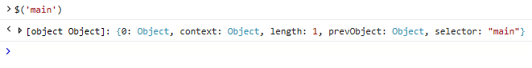
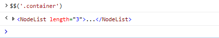
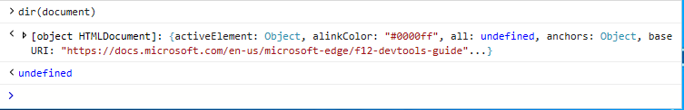

# Console command line

Use the Console command line to view and change values on a page and execute debug code on the fly, all while taking advantage of Visual Studio [*IntelliSense*](/visualstudio/ide/javascript-intellisense) auto code completion. 

Simply enter any valid JavaScript at the command line prompt and press `Enter` to execute. For multi-line input use `Shift+Enter` to add a line-break. Use the `Up` and `Down` arrow keys to navigate through previous console commands you entered during the current  DevTools session. In addition to standard JavaScript and the [Console API](./console-api.md), the Console also supports the following commands for:

 - [Selecting DOM objects](#dom-selectors)
 - [Inspecting object properties](#object-inspection)
 - [Finding all the event listeners on a given object](#event-listeners)

Script entered in the command line executes in the [global scope](/scripting/javascript/advanced/variable-scope-javascript) of the currently selected window, unless the page is paused at a breakpoint. Console commands entered while the page is paused will execute in the [local scope](/scripting/javascript/advanced/variable-scope-javascript) of the current function within the call stack.

The Console has a **Target** execution context drop-down just above the Console output area. The default selection is the top-level document, **_top**. Any iframes in the document or running extensions will also appear as options, allowing you to alternately run commands within those scopes.

## DOM selectors
These console selectors provide simple shorthands for quickly accessing objects within the DOM:

### $(*CSS selector string*)
Returns the first element within the document matching the specified [CSS selector](https://developer.mozilla.org/docs/Learn/CSS/Introduction_to_CSS/Selectors)  (or comma-separated group of selectors) string. Shorthand for [document.querySelector()](https://developer.mozilla.org/docs/Web/API/Document/querySelector).

Example: Open the console and type `$('#main')` to return the div object with `id='main'` on this page.

### $$(*CSS selector string*)
Returns an array of elements within the document matching the specified [CSS selector](https://developer.mozilla.org/docs/Learn/CSS/Introduction_to_CSS/Selectors)  (or comma-separated group of selectors) string. Shorthand for [document.querySelectorAll()](https://developer.mozilla.org/docs/Web/API/Document/querySelectorAll).

Example: Open the console and type `$$('.container')` to return all the div objects with `class='container'` on this page.

### $0, $1, $2,...
Returns the last elements selected in the [**Elements**](../elements.md) panel, where `$0` represents the currently selected item, `$1` was the selected item before that, and so on.

Example: Open  DevTools to the **Elements** tab, press `CTRL + B` to activate the **Select element** tool and click some area on this page with your mouse. Now open the Console and type `$0` to return the element you just clicked.

### $x(*XPath expression*)
Returns an array of elements matched by the specified [XPath](https://developer.mozilla.org/docs/Introduction_to_using_XPath_in_JavaScript) expression. 

Example: Open the console and type `$x('//script[@defer]')` to return all the `<script>` elements on this page that contain a `defer` attribute.

## Object inspection

These commands provide quick ways to inspect the properties of an object. The specified object must either be defined in the global namespace or the current scope of the debugger.

### dir(*object*)
Returns a tree view list of properties for the specified object.

Example: Open the console and type `dir(document)` to see the object properties for the document object representing this page.

### keys(*object*)
Returns an array of property names attached to the specified object.

Example: Open the console and type `keys(window)` to return all of the properties defined on the global window object.

### values(*object*)
Returns an array of property values attached to the specified object.

Example: Open the console and type `values(window)` to return the values of all the properties (keys) defined on the global window object.

## Event listeners

This command allows you to inspect the event listeners registered to a given object. The specified object must either be defined in the global namespace or the current scope of the  debugger.

### getEventListeners(*object*)
Returns an object containing a key for each registered event type on the given object. The value of each key is an array of event listeners and their related info. 

Example: Open the console and type `getEventListeners(document)` to see all the event listeners registered on the document object of this page.

