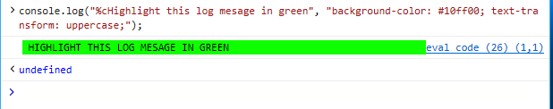

# Console API

The *Console API* provides command-line and programmatic access to the  DevTools Console through the global `console` object, allowing you to:

 - [Log custom messages](#logging-custom-messages) from you code
 - [Inspect objects and elements](#inspecting-objects-and-elements) and log their information
 - [Test and measure your code](#testing-and-measuring) by setting assertions, timers and counters
 - [Take snapshots of the heap](#taking-heap-snapshots) to assess the memory consumption of your running code and identify memory leaks
 - [Trace your callstacks](#tracing-callstacks) to understand where your code is being called from 
 - [Organize your log output](#organizing-log-output) to streamline your debugging

The following are the commands and formatting parameters currently supported by Microsoft Edge. They work similarly on major browsers.

## Logging custom messages

Your code can send several types of custom messages to the console, including:

Message type  | &nbsp;   |
:------------------- | :------ |
[**error()**](https://developer.mozilla.org/docs/Web/API/Console/error) and [**exception()**](https://developer.mozilla.org/docs/Web/API/Console/error)| Critical errors and failures
[**warn()**](https://developer.mozilla.org/docs/Web/API/Console/warn) | Possible errors or unexpected behavior 
[**info()**](https://developer.mozilla.org/docs/Web/API/Console/info) | Useful, but non-critical information
[**log()**](https://developer.mozilla.org/docs/Web/API/Console/log) and [**debug()**](https://developer.mozilla.org/docs/Web/API/Console/log) | General debugging (without generating a system alert icon in the console)

   
You can group and filter these along with the other messages generated from Microsoft Edge from the  Console panel. All custom message methods require a string (message) parameter and optional format substitution parameters. Microsoft Edge supports the following formatting options:

Format parameter | &nbsp;
:------------------- | :--- |
**%b** | Binary
**%c** | Inline CSS style (see example below)
**%d**, **%i** | Integer 
**%f** | Float  
**%s** | String 
**%x** | Hexadecimal 
**%e** | Exponent 

For example, here's how you would include string and integer variables in your log message:

```javascript
var myText = 'pieces';
var myVal = 5;
console.log("The number of %s is %d.", myText, myVal);
```

>`The number of pieces is 5.`

And here's how you might add a green highlight effect to a log message with inline CSS (`%c`):

```javascript
console.log("%cHighlight this log message in green", "background-color: #10ff00; text-transform: uppercase;");
```



## Inspecting objects and elements

Inspectable objects appear in the console in a collapsed tree view with expandable nodes. The console detects whether you are sending a DOM node (like a div) or a JavaScript object (like an event) and displays them as the detected type automatically.

You can also force a specific output:

Command | &nbsp;
:------------------- | :--- |
[**dir()**](https://developer.mozilla.org/docs/Web/API/Console/dir) | Displays as inspectable JavaScript object
[**dirxml()**](https://developer.mozilla.org/docs/Web/API/Console/dirxml) | Displays as inspectable DOM node

For example, try opening the console and compare the following outputs for the `<div id='main'>` element on this page:

```javascript
console.dir(document.querySelector('#main'));
console.dirxml(document.querySelector('#main'));
```


### Selecting an element in the **Elements** panel

You can select an element within the HTML tree context of the page directly from the console for immediate layout and style debugging.

Command | &nbsp;
:------------------- | :--- |
**select()** | Switches to the **Elements** panel and sets focus to the specified element.

For example, if you open the console on this page and type:

```javascript
console.select(document.querySelector("body"));
```

The DevTools will switch to the **Elements** panel (if its not already the current) and set focus in the [*HTML tree view*](../elements.md#html-tree-view) to the specified element.


## Testing and measuring

### Testing your code

Add Console API test assertions to your code for unit testing and debugging your code as it runs in the browser.

Command | &nbsp;
:------------ | :-------------
[**assert()**](https://developer.mozilla.org/docs/Web/API/Console/assert) | Logs a console error message if the provided expression evaluates to *false*.

In addition to the logical expression you supply as the testable assertion, you can add an optional message and formatting parameters as you would use with other [custom console messages](#logging-custom-messages). For example:

```javascript
var x = 26.8;
console.assert(x < 25, 'The value of x is %f (it is NOT less than %i)', x, 25);
```


### Counting executions in your code

You can set counters in your code to keep track of how many times the surrounding code gets executed. Setting counters can help ensure your code is running as expected and assist you in diagnosing performance bottlenecks.

Command | &nbsp;
:------------ | :-------------
[**count()**](https://developer.mozilla.org/docs/Web/API/Console/count) | Increments and logs the number of times *count()* for the given label has been executed.
[**countReset()**](https://developer.mozilla.org/docs/Web/API/Console/countReset) | Resets the count to zero for the given counter label.

For example, executing the following lines in console:

```javascript
console.count('My Counter');
console.count('My Counter');
console.countReset('My Counter');
console.count('My Counter');
```

 . . . will result in:
> My Counter: 1

### Timing your code

Instrument your code with labeled timers to measure how long it takes to complete a given operation.

Command | &nbsp;
:------------ | :-------------
[**time()**](https://developer.mozilla.org/docs/Web/API/Console/time) | Starts a timer with the given label.
[**timeEnd()**](https://developer.mozilla.org/docs/Web/API/Console/timeEnd) | Ends the timer with the given label and reports the time elapsed (in milliseconds).
[**timeStamp()**](https://developer.mozilla.org/docs/Web/API/Console/timeStamp) | Reports the current system time (in milliseconds).

For example, try executing the following lines in console:

```javascript
console.time('My Timer');
console.timeEnd('My Timer');
```

### Taking heap snapshots

Take snapshots of the heap to assess the memory consumption of your running code and identify memory leaks.

Command | &nbsp;
:------------ | :-------------
**takeHeapSnapshot()** | Captures details about the current JavaScript heap and its allocated objects.

The  DevTools [memory profiler](../memory.md#toolbar) must be running in order to take heap snapshots. Each snapshot will appear as a tile in the [*Snapshot summary*](../memory.md#snapshot-summary) of the [**Memory**](../memory.md) panel for further inspection.

## Tracing callstacks

Understanding where your code is being called from, what code is running, and how long that execution takes can be useful in analyzing slowness or unexpected behavior. A stack trace shows you the execution path your code took to reach it, from the trace request upward through the path. 

Command | &nbsp;
:------------ | :-------------
[**trace()**](https://developer.mozilla.org/docs/Web/API/Console/trace) | Outputs a trace of the current script execution callstack.

For example, running the following code in the console:

```javascript
function a(){
  c();
}
function b(){
  c();
}
function c(){
  console.trace()
}
function d(){
  b();
}

a();
d();
```

. . . will output the following stack traces:
> console.trace() at c (eval code:8:3) at a (eval code:2:3) at eval code (eval code:14:1)
> 
> console.trace() at c (eval code:8:3) at b (eval code:5:3) at d (eval code:11:3) at eval code (eval code:15:1)

## Organizing log output

To simply clear all previous console output, use *console.clear()* (or `CTRL + L`). This does not clear the backstack of your console command history (you can still traverse it with the up and down arrow keys).

Command | &nbsp;
:------------ | :-------------
[**clear()**](https://developer.mozilla.org/docs/Web/API/Console/clear) | Clears all previous console output.

If your code outputs a lot of console messages, you can visually organize them into nested blocks with the following commands:

 Command | &nbsp;
:------------ | :-------------
[**group()**](https://developer.mozilla.org/docs/Web/API/Console/group) | Starts a new level of nesting for console output with the specified (optional) label.
[**groupCollapsed()**](https://developer.mozilla.org/docs/Web/API/Console/groupCollapsed) | Starts a new level of nesting for console output with the specified (optional) label, however the grouping control is collapsed by default and must be expanded (by clicking on the arrow control) to display the child output.
[**groupEnd()**](https://developer.mozilla.org/docs/Web/API/Console/groupEnd) | Ends the nesting group for the specified label.

For example, try entering the following commands in the console:

```javascript
console.groupCollapsed('Group 1');
console.log('In Group 1');
console.groupCollapsed('Group 1.1');
console.log('In Group 1.1');
console.groupEnd('Group 1.1');
console.groupEnd('Group 1');
console.log('No longer in a group');
```

. . . and then expand the *Group 1* and *Group 1.1* controls to see how the log comments are nested:


Sometimes its easier to visualize a JavaScript object or array in tabular form, rather than a flat list. For that, you can use the *console.table()* command:

Command | &nbsp;
:------------ | :-------------
[**table()**](https://developer.mozilla.org/docs/Web/API/Console/table) | Outputs the supplied array or object to the console in tabular form.

For example, the following object array:

```javascript
var orders = [{'Size':'XL', 'Quantity':1},{'Size':'M', 'Quantity':3}, {'Size':'L', 'Quantity':2}];
console.table(orders);
```

. . . will render as this table in the console:


