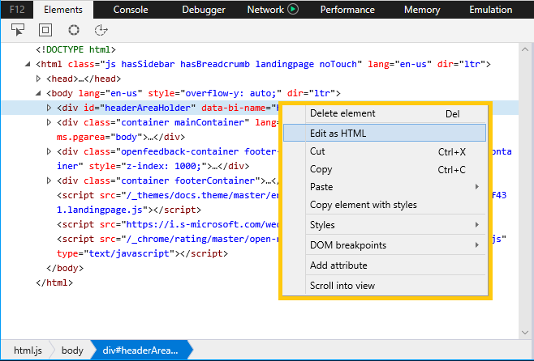
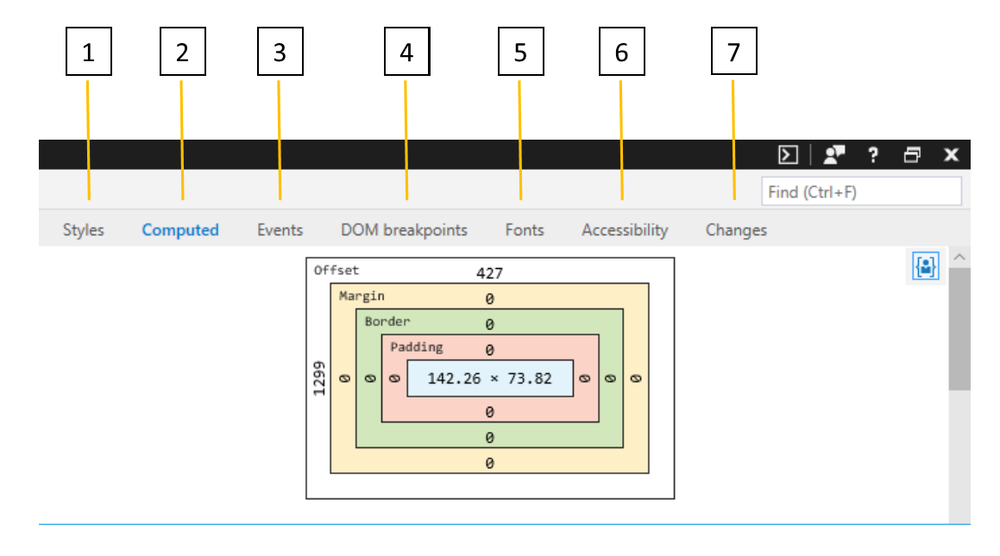

# Elements

The **Elements** panel helps you to:

* [Identify and edit elements in the HTML tree](#html-tree-view) of the current page
* [Inspect and modify CSS](./elements/styles.md) on the page, including pseudo-states and pseudo-elements
* [Understand the CSS layout and style cascade](./elements/computed.md) happening on the page
* [Track down rogue event handlers](./elements/events.md) so you can debug them
* [Set debugging breakpoints for unexpected visual changes](./elements/dom-breakpoints.md) to jump into the code causing them
* [Get detailed information about the fonts used on the page](./elements/fonts.md) and where they're loading from
* [View your page from a screen reader's point of view](./elements/accessibility.md) to verify and test accessibility 
* [Review a running diff of the CSS changes](./elements/changes.md) you make as you debug the UI of your page

## HTML tree view

1. Use the **Select element** (`Ctrl+B`) tool to locate an element in the **HTML tree view** by clicking on it in the page.

2. Use the **Element highlighting** (`Ctrl+Shift+L`) tool to locate an element on the page by hovering over it in the **HTML tree view**.

3. Open the **Color picker** (`Ctrl+K`) tool to see a list of the colors in use on the current page. Clicking on a color on the list will provide further details (Hue, Saturation, Lightness, Alpha). The *Color picker* also opens when you click on the colored square next to a color value in the **Styles** pane, allowing you to edit the color of a page element and immediately see the results.

4. The **Accessibility tree** (`Ctrl+Shift+A`) button will open the [Accessibility tree](./elements/accessibility.md) pane showing the structure of your page as it would appear to an assistive technology, such as the [Windows Narrator](https://support.microsoft.com/help/22798/windows-10-narrator-get-started) screenreader.

5. You can also **Find** (`Ctrl+F`) an element in the HTML tree view by searching for its tag name, attributes, or text content.

### Editing elements

You can edit an element by right-clicking on it within the HTML tree view and selecting **Edit as HTML** from the context menu. The context menu also provides options to delete, cut, copy, paste, set CSS pseudo-classes (*:active*, *:focus*, *:hover*, *:visited*) and add attributes. Another way to edit an attribute and/or its value is to double-click it from the HTML tree view.

> [!NOTE]
> Editing the HTML tree does not affect the underlying source markup. Refreshing the page will revert your changes and render only the layout determined by the page source. You can **Copy** your modified HTML to the clipboard by right-clicking the desired element (or the global `html` element, if you want the entire page) to open up the context menu. (**Cut** and **Paste** options are also available).

From the [Styles](./elements/styles.md) pane you can also add/delete/edit CSS pseudo-states and pseudo-elements.

## Tool Panes

Once you have selected a page element of interest, you can use the tool panes to further inspect its different styles and accessibility properties, view its event listeners, and set DOM mutation breakpoints.

1. [**Styles**](./elements/styles.md): Currently applied styles organized by stylesheet

2. [**Computed**](./elements/computed.md): Currently applied styles organized by CSS attributes

3. [**Events**](./elements/events.md): Event listeners registered on the current element and ancestor elements

4. [**DOM breakpoints**](./elements/dom-breakpoints.md): DOM Mutation Breakpoints 

5. [**Fonts**](./elements/fonts.md): Currently applied fonts for a selected element

6. [**Accessibility**](./elements/accessibility.md):  Accessibility properties

7. [**Changes**](./elements/changes.md): CSS changes made during diagnostic session  

## Shortcuts

| Action               | Shortcut               |
|:---------------------|:-----------------------|
| Elements panel       | `Ctrl` + `1`           |
| Element highlighting | `Ctrl` + `Shift` + `L` |
| Select element       | `Ctrl` + `B`           |
| Color picker         | `Ctrl` + `K`           |
| Accessibility tree   | `Ctrl` + `Shift` + `A` |
