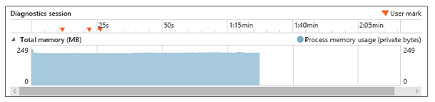
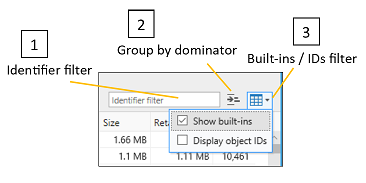

# Memory

Use the **Memory** panel to measure your use of system resources and compare heap snapshots at different states of code execution. With it, you can:

- [Graph the memory consumption of your page in real time](#memory-usage-timeline) and take snapshots of the heap
- [Identify potential memory issues](#snapshot-summary) in your code, such as retained objects not attached to the DOM
- [Review memory usage data](#snapshot-details) by object type, instance count, size, and references to help isolate issues
- [Apply snapshot data filters](#filters) to reduce the noise of non-actionable information
- [Identify the memory cost of a specific object](#object-references) and the references keeping it alive
- [Diff the heap at different phases of your investigation](#snapshot-comparison) to track down the source of memory leaks and other problems

## Toolbar

1. **Start/Stop profiling session (Ctrl+E)**: Turning on the profiler enables you to track memory usage and take snapshots of the heap.
2. **Import profiling session (Ctrl+O)**: Load a saved  DevTools memory diagnostic session.
3. **Export profiling session (Ctrl+S)**: Save the current diagnostic session to disk.
4. **Take heap snapshot (Ctrl+Shift+T)**: Record current memory allocations for a given point of time.

## Memory usage timeline

Memory problems can be a major culprit of performance issues, causing your page to become increasingly unresponsive and laggy over time.

The first step to analyzing the memory usage of your page is to [start a profiling session](#toolbar) in order to take before/after snapshots of the heap as you repro the steps causing memory bloat or a suspected memory leak.

When you start the memory profiler, you will see a process memory graph that allows you to observe the overall private working set (the amount of memory consumed by the page) over time. The memory graph shows you a live view of the tab's process memory, which includes private bytes, native memory, and the JavaScript heap. 

 The graph gives you an indication of the memory trend for the page which enables you to judge when it is appropriate to [take a heap snapshot](#toolbar) for later comparison, such as when you see periods of unexpected memory retention.

### Performance.mark()

You can add custom **User marks** to the timeline to help identify  key events during the course of your analysis session by calling the [`Performance.mark()`](https://developer.mozilla.org/docs/Web/API/Performance/mark) method from within your code or the  DevTools [**Console**](./console.md).

### Console.takeheapSnapshot()

Sometimes you need to take snapshots at very specific points in time, such as immediately before a large mutation of the DOM. In these cases,you can take snapshots programmatically with [`Console.takeHeapSnapshot()`](./console/console-api.md#taking-heap-snapshots).

## Snapshot summary

[Taking a snapshot](#toolbar) will generate a summary tile that indicates the size of the JavaScript heap at the time the snapshot was taken, along with the number of objects allocated and a screenshot of the page. You can continue to take snapshots at any time as you run through the user scenario requiring analysis. The snapshots generate additional tiles, each of which indicates the difference in JavaScript memory from the previous snapshot.

Clicking on the values in the summary tile will switch to the pane showing [details of the snapshot data](#snapshot-details). Potential [memory issues are indicated](#snapshot-details) with a blue informational ("i") icon.

## Snapshot details

The data in the *Snapshot* pane shows the objects created by your page along with any memory allocated by JavaScript frameworks you may be consuming.

The three tabs represent different views of the data:

#### Types

Shows the instance count and total size of objects on the heap, grouped by object type. By default, these are sorted by instance count.

When you select an object in the upper *Types* pane, the [Object references](#object-references) table in the lower pane will list all the objects that point to that object.

#### Roots

Shows a hierarchical view of child references to describe how objects are rooted to the global object, thus preventing them from being garbage-collected.

By default, the child nodes are sorted by the retained size column, with the largest at the top.

#### Dominators

Shows a list of objects on the heap that have exclusive references to other objects. Dominators are sorted by retained size to indicate the objects consuming the most memory that are potentially easiest to free.

Here's how to interpret the columns in the *Types, Roots* and *Dominators* views:

Column | Description
:------------ | :-------------
Identifier(s) | Name that best identifies the object. For example, for HTML elements the snapshot details show the ID attribute value, if one is used.
Type | Object type (for example, *HTMLDivElement*).
Size | Object size, not including the size of any referenced objects.
Retained size | Object size plus the size of all child objects that have no other parents. For practical purposes, this is the amount of memory retained by the object, so if you delete the object you reclaim the specified amount of memory.
Count | Number of object instances. This value appears only in the Types view.

When you select an object in the upper *Dominators* pane, the [Object references](#object-references) table in the lower pane will list all the objects that point to that object.

### Filters

You can further adjust data in the table with the following:

1. **Identifier filter**: Filter out data by searching for a particular object identifier
2. **Group by dominator**: Only objects with *exclusive* references to other objects are shown in the top-level view of objects (this is the default view in the *Dominators* tab).
3. **Built-ins / IDs filter**: By default, [JavaScript built-in objects](https://developer.mozilla.org/docs/Web/JavaScript/Reference/Global_Objects) are included in the list. Listing object IDs can be useful if there are multiple anonymous objects which need to be differentiated.

The *Types, Roots* and *Dominators* views each has its own filter, so the filter isn't preserved when you switch to another view.

### Object references

In the [**Types**](#types) and [**Dominators**](#dominators) views, the lower pane contains an **Object references** list that displays shared references. When you choose an object in the upper pane, this list displays all objects that point to that object--in other words, the objects that are keeping the selected object alive.

Circular references are shown with an asterisk (*) and informational tooltip, and cannot be expanded. Otherwise, they would prevent you from walking up the reference tree and identifying objects that are retaining memory.

To quickly identify equivalent objects, tick the [*Display object IDs*](#filters) filter option to display object IDs next to object names in the *Identifier(s)* column. Objects that have the same ID are shared references.

### Snapshot comparison

Clicking on a [snapshot comparison tab](#snapshot-details) or comparison link on the [snapshot summary tile](#snapshot-summary)  will show a diff of information between the two snapshots. In the comparison pane, the *Dominators, Types* and *Roots* views provide the same [*snapshot details*](#snapshot-details) you would see for a single snapshots, with these additional values:

Column | Description
:------------ | :-------------
Size diff. | Difference between the size of the object in the current snapshot and its size in the previous snapshot, not including the size of any referenced objects.
Retained size diff. | Difference between the retained size of the object in the current snapshot and its retained size in the previous snapshot. The retained size includes the object size plus the size of all its child objects that have no other parents. For practical purposes, the retained size is the amount of memory retained by the object, so if you delete the object you reclaim the specified amount of memory.

You can use the **Scope** dropdown to filter differential info between snapshots:

- <strong>Objects left over from Snapshot #<number></strong>: Shows the diff between the objects added to the heap and removed from the heap from the baseline snapshot to the previous snapshot. For example, if the snapshot summary shows <em>+205 / -195</em> in the object count, this filter will show you the ten objects that were added but not removed.

- <strong>Objects added between Snapshot #<number> and #<number></strong>: Shows all objects added to the heap from the previous snapshot.

- <strong>All objects in Snapshot #<number></strong>: Shows all objects on the heap (in other words, an <em>unfiltered</em> view).

By default, the *Show non-matching references* filter is applied to the comparison view to indicate object references that don't match the current Scope filter. You can turn it off from the dropdown menu:

## Shortcuts

 Action | Shortcut
:------------ | :-------------
Start / Stop profiling session  | `Ctrl` + `E`
Import profiling session | `Ctrl` + `O`
Export profiling session | `Ctrl` + `S`
Take heap snapshot | `Ctrl` + `Shift` + `T`

## Known Issues

### An error occurred while starting the profiling session

If you see this error message: **An error occurred while starting the profiling session** in the Memory tool, follow these steps for a workaround.

1. Press `Windows Key` + `R`.

2. In the Run dialog, enter **services.msc**.

3. Locate the **Microsoft (R) Diagnostics Hub Standard Collector Service** and right-click it.

4. Restart the **Microsoft (R) Diagnostics Hub Standard Collector Service**.

5. Close the Microsoft Edge Developer Tools and the tab. Open a new tab, navigate to your page, and press `F12`.

6. You should now be able to begin profiling. 

Still running into problems? Please send us your feedback using the **Send feedback** icon! 

