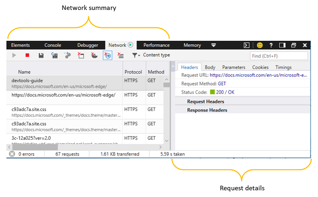
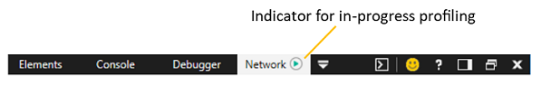
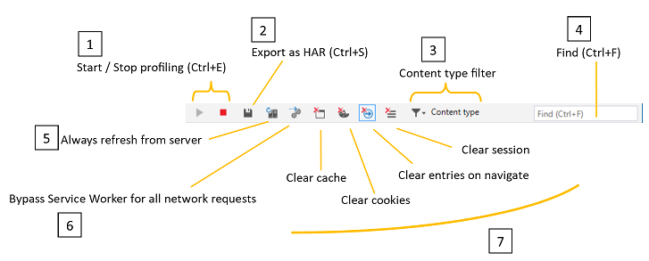

# Network

Use the **Network** panel to monitor, inspect and profile the requests and responses sent over the wire. With it, you can:

 - [Browse a record of all the resource requests](#network-summary) made by the page
 - [Measure the load time of your site](#summary-bar) for new and returning users 
 - [Inspect the headers, message bodies, parameters, and cookies](#request-details) exchanged between your page and the network
 - [Identify the network events causing bottlenecks](#timings) in the load time of your site

## Network summary

When you open  DevTools, network profiling is turned on by default. All the network traffic from your active browser tab is recorded in the network summary list, even while you are working in a different  DevTools panel than *Network*.

### Toolbar

The toolbar provides controls for profiling and filtering the network activity of your page. 

1. **Start / Stop profiling session**: By default, network profiling is turned on, and network traffic will be logged in the [**Network profiler**](#network-request-list) list. You can turn off network capture with the **Stop** (`Ctrl+E`) button.

2. **Export as HAR**: You can save the current network profiling session (`Ctrl+S`) as a JSON-formatted [HTTP Archive (HAR)](https://dvcs.w3.org/hg/webperf/raw-file/tip/specs/HAR/Overview.html) file. 

3. **Content type filter**: Filter the network request list by specific content requests (*Documents, Style sheets, Images, Scripts, Media, Fonts, XHR, Other*). By default all content types are shown.

4. **Find**: Filter (`Ctrl+F`) the network request list by entry names (resource paths) containing a specified search string.

5. **Always refresh from server**: Depressing this button will force page resources to load from the network rather than the browser cache. You can refresh the page from  network a single time by pressing `Ctrl+F5`.

6. **Bypass Service Worker for all network requests**: Disable your registered service workers as network proxies. 

7. Clear buttons

   - **Clear cache**: Removes all resources stored in the browser cache (and emulates a first-time experience loading the page).
   - **Clear cookies**: Removes all cookies for the given domain (and emulates a first-time experience of the site).
   - **Clear entries on navigate**: Recorded traffic is cleared upon page navigation. This is turned on by default.
   - **Clear session**: Clears all network request entries from the **Network summary** list.

### Network request list

All network traffic is recorded to a list (until cleared upon navigation, manually cleared, or  DevTools are closed). Clicking on any entry will open a more [detailed view of the request](#request-details).

The network request list includes the following info: 

Column | Description 
:------------ | :------------- 
**Name** | Name and URL path of the request
**Protocol** |  Type of protocol for the request (such as *HTTPS, HTTP/2*)
**Method** |    [HTTP method](https://developer.mozilla.org/docs/Web/HTTP/Methods) used for the request
**Result** |    [HTTP response status](https://developer.mozilla.org/docs/Web/HTTP/Status)  code
**Content type** |  Type of media requested ([MIME type](https://en.wikipedia.org/wiki/Media_type))
**Received** | Size of the response as delivered by the server (not calculated for cached responses)
**Time** |  Time to load the server response (not calculated for cached responses)
**Initiator** | Subsystem responsible for initiating the request (such as *Parser, Redirect, Script, Other*)
**Timeline** | Visual timeline for the network events of the request (such as *Stalled, Resolving(DNS), Connecting(TCP), SSL, Sending, Waiting(TTFB), Downloading*). Hovering over the chart provides the more granular breakdown of network [network timings](#timings)).

### Summary bar

The bar at the bottom of **Network** panel summarizes the total number of HTTP network errors, requests, data transfered, and load times during the network profiling session (i.e., since  DevTools were opened and recording network traffic).

**Elapsed time** means the time between the start of the profiling session and when the last resource was downloaded from the network. Resources fetched from the browser cache do not accrue time to this number. 

**DOM load time** means the time between the start of the profiling session and when the [DOMContentLoaded](https://developer.mozilla.org/docs/Web/Events/DOMContentLoaded) event was fired to indicate that the structure of the page document has been loaded and parsed (though not necessarily any stylesheets, images or subframes).

**Page load time** time means the time between the start of the profiling session and when the [load](https://developer.mozilla.org/docs/Web/Events/load) event was fired to indicate that the page document (and all its resources) has been fully loaded.

## Request details

Clicking on any entry in the [**Network summary**](#network-summary) list will open the [**Request details**](#request-details) pane with further information in each of the following tabs.

### Headers
Displays the [HTTP headers](https://developer.mozilla.org/docs/Web/HTTP/Headers) sent to and received from the server. Right-click on any header entry to copy it (`Ctrl+C`) to the clipboard. You can also multi-select entries by holding down the `Shift` key or select all (`Ctrl+A`).

### Body
Displays the body data (if available) of the request and response payloads.

Image content is displayed with dimensions and size data.

Text content appears in a (read-only) editor with options to format minified content with **Pretty print** and/or **Word wrap** for easier readability.

### Parameters
Displays query string parameters for GET requests. While the parameters of POST requests are sent in the headers, GET requests include them in the URL. They're broken out here for easier reading.

Right-click on any row to copy it (`Ctrl+C`) to the clipboard. You can also multi-select entries by holding down the `Shift` key or select all (`Ctrl+A`).

### Cookies
Displays cookies that are sent or received as key/value pairs.

Right-click on any row to copy it (`Ctrl+C`) to the clipboard. You can also multi-select entries by holding down the `Shift` key or select all (`Ctrl+A`).

You can clear the stored cookies for the given domain from the [Toolbar](#network-summary) (**Clear cookies** button). 

### Timings

The **Timings** tab provides a timeline of network events involved in the loading of the selected resource. This is similar to the information found in the *Timeline* column of the [Network request list](#network-request-list), but also includes the events leading up to the request being sent over the wire, such as time spent waiting (*Stalled*) in the request queue, DNS resolution, and establishing the TCP connection. 

Redirections to/from other resources are noted, and clicking on the link will set focus to that resource in the network [request details](#request details) pane.

Resouces loaded from the cache are not affected by network latency, so no network *Timings* chart will display.

Here are the different network events you might see for a given resource, in chronological order:

#### Stalled

Time spent waiting for an available network connection in the request queue. For HTTP 1.0/1.1, Microsoft Edge allows a maximum of six (6) simultaneous TCP connections per hostname. 

#### Resolving (DNS)

Time spent looking up the IP address for the hostname of the resource in the DNS ([Domain Name System](https://en.wikipedia.org/wiki/Domain_Name_System)).

#### Connecting (TCP)

Time spent establishing the TCP ([Transmission Control Protocol](https://en.wikipedia.org/wiki/Transmission_Control_Protocol)) connection.

#### SSL

Time spent negotiating a SSL ([Secure Sockets Layer](https://en.wikipedia.org/wiki/Transport_Layer_Security))  connection with the [proxy server](https://en.wikipedia.org/wiki/Proxy_server) for the host.

#### Sending

Time spent sending the resource request.

#### Waiting (TTFB)

Time spent waiting for the first byte of the response from the host server ("time to first byte", or *TTFB*).

#### Downloading

Time spent reading the response from the server.

## Shortcuts

| Action                         | Shortcut     |
|:-------------------------------|:-------------|
| Start / Stop profiling session | `Ctrl` + `E` |
| Export as HAR                  | `Ctrl` + `S` |
| Find                           | `Ctrl` + `F` |
| Copy                           | `Ctrl` + `C` |

## Known Issues

### The network collection agent failed to start.

If you see this error message: **The network collection agent failed to start** in the Network tool, follow these steps for a workaround.

1. Press `Windows Key` + `R`.

2. In the Run dialog, enter **services.msc**.

3. Locate the **Microsoft (R) Diagnostics Hub Standard Collector Service** and right-click it.

4. Restart the **Microsoft (R) Diagnostics Hub Standard Collector Service**.

5. Close the Microsoft Edge Developer Tools and the tab. Open a new tab, navigate to your page, and press `F12`.

6. You should now see a Play badge next to **Network** and the network requests for your webpage.

Still running into problems? Please send us your feedback using the **Send feedback** icon! 

### The network collection agent failed to stop.

If you see this error message: **The network collection agent failed to stop** in the Network tool, follow these steps for a workaround.

1. Press `Windows Key` + `R`.

2. In the Run dialog, enter **services.msc**.

3. Locate the **Microsoft (R) Diagnostics Hub Standard Collector Service** and right-click it.

4. Restart the **Microsoft (R) Diagnostics Hub Standard Collector Service**.

5. Close the Microsoft Edge Developer Tools and the tab. Open a new tab, navigate to your page, and press `F12`.

6. You should now see a Play badge next to **Network** and the network requests for your webpage.

Still running into problems? Please send us your feedback using the **Send feedback** icon! 

