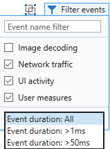

# Performance

The **Performance** panel offers tools for profiling and analyzing the responsiveness of your UI during the course of user interaction. With it, you can:

 - [Measure execution times](#recording-a-profile) of the various components of your page 
 - [Drill down to where you're spending the most CPU cycles](#timeline-ruler) to run your page and the resulting visual effect for your users
 - [Get a step-by-step breakdown of the processes](#timeline-details) consuming page execution time 
 - [Walk your JavaScript call stacks](#javascript-call-stacks) to identify costly operations, such as those requiring layout recalculations 

## Recording a profile

The first step to analyzing the performance of your page is to capture a profile as you perform a particular user scenario, such as the repro steps of a performance bug you're trying to fix, or a typical use case you want to optimize for a better user experience. 

### Toolbar

Use the **Start** / **Stop** buttons on the toolbar (or `Ctrl+E`) to initiate and conclude your performance trace. A green indicator will apear on the **Performance** tab to indicate a recording is in progress. 

A performance report will generate upon stopping the profile. You can choose to save it to disk (`Ctrl+S`) and reload (`Ctrl+O`) in  DevTools at a later time.  DevTools diagnostic sessions are saved with the *.diagsession* extension.

Here are some things to keep in mind when recording a profile:

- Perform the fewest actions you need to capture the scenario you're trying to analyze. Extraneous actions with the page will produce extra data and clutter your results.

- The profiler will automatically mark major app lifecycle events in the report, such as page navigation, [DOMContentLoaded](https://developer.mozilla.org/docs/Web/Events/DOMContentLoaded), and page [load](https://developer.mozilla.org/docs/Web/Events/load). You can add custom markers by calling the [Performance.mark()](https://developer.mozilla.org/docs/Web/API/Performance/mark) method from within your code or the console. 

- If initial page load times are important to your analysis, make sure to clear your browser cache (from the [Network](./network.md) panel) to ensure all page resources are loading from the network.

- Sometimes it helps to record multiple sessions and/or sample the same scenario across different machines to better understand the performance issue in the wild.

## Timeline ruler

The timeline works as a sliding ruler. Use it to limit the scope of the report to the particular timeframe (or span of events) of interest. Drag the black **slide controls** to limit the time range you wish to investigate and filter out extraneous profiling data from the [Timeline](#timeline-details) and [JavaScript call stacks](#javascript-call-stacks) reports in the lower *Details pane*. 

You will see two types of markers on the ruler:

 - **App lifecycle marks** on the timeline (such as page navigation, [DOMContentLoaded](https://developer.mozilla.org/docs/Web/Events/DOMContentLoaded), and page [load](https://developer.mozilla.org/docs/Web/Events/load)) are automatically logged as you record a profile.

 - **User marks** are custom markers you can choose to add  with calls to the [Performance.mark()](https://developer.mozilla.org/docs/Web/API/Performance/mark) method from within your code or the  DevTools [**Console**](./console.md). You can group *start* and *end* marks together as a single, named measure with the [Performance.measure()](https://developer.mozilla.org/docs/Web/API/Performance/measure) method. 

Once you have selected a time range, you can further **Zoom in** from the toolbar, or **Reset zoom** and **Clear selection** to return to the full view of the performance trace (with no time range selected). These controls are also available from the right-click context menu.

### CPU utilization

The **CPU utilization %** timeline graph describes the processing resources consumed by the various browser subsystems required to run the page, broken out by category:

#### Loading
Indicates time spent retrieving app resources and parsing HTML and CSS. This can include network requests. The following associated events are logged in the [Timeline](#timeline-details):

Event | Description
:------------ | :-------------
CssParsing  | New CSS content was encountered that needed to be parsed.
HtmlParsing | New HTML content was encountered that needed to be parsed into nodes and inserted into the DOM.
HttpRequest | A remote resource was encountered in the DOM or an XMLHttpRequest was created that required an HTTP request to be made.
HtmlSpeculativeDownloading | The page's HTML content was being searched for required resources so that the HTTP requests for them could be scheduled as quickly as possible.

#### Scripting
Indicates time spent parsing and executing JavaScript. This includes DOM events, timers, script evaluation, and animation frame callbacks. The following associated events are logged in the [Timeline](#timeline-details):

Event | Description
:------------ | :-------------
DomEvent | An event was fired on a DOM object.
EvaluatingScript | A new `<script>` element was encountered in the DOM and needed to be parsed and executed.
EventHandler | A registered event listener was triggered in response to a DOM event being fired.
Frame | While a new frame was being prepared a registered callback was triggered so that it could contribute visual changes.
Measure | An app-specific scenario was measured using the `performance.measure()` method.
MediaQueryListener | A registered media query was invalidated which resulted in the execution of its associated listener(s).
MutationObserver | One or more observed DOM elements were modified which resulted in the execution of a MutationObserver's associated callback.
TimerFired | A scheduled timer elapsed which resulted in the execution of its associated callback.
WindowsRuntimeAsyncCallback | An async operation was completed by a Windows Runtime object which triggered a `Promise` callback.
WindowsRuntimeEvent | An event was fired on a Windows Runtime object which triggered a registered listener.

#### GC
Indicates time spent collecting memory for objects that are no longer in use. The following associated events are logged in the [Timeline](#timeline-details):

Event | Description
:------------ | :-------------
GarbageCollection | The JavaScript runtime audited the app's current memory usage in order to determine which objects aren't being referenced anymore and could therefore be collected.

#### Styling
Indicates time spent calculating element presentation and layout. The following associated events are logged in the [Timeline](#timeline-details):

Event | Description
:------------ | :-------------
AlignedBeat | Pending visual changes that were made to the DOM were processed so that the app's display could be updated.
CssCalculation | Changes were made to the DOM or new CSS content was added, requiring the style properties of all affected elements to be recalculated.
Layout | Changes were made to the DOM that required the size and/or position of all affected elements to be computed.

#### Rendering
Indicates time spent in painting the screen. The following associated events are logged in the [Timeline](#timeline-details):

Event | Description
:------------ | :-------------
Paint | Visual changes were made to the DOM that required all affected portions of the page to be redrawn.
RenderLayer | Visual changes were made to an independently rendered fragment of the DOM (called a layer) which required its respective portion of the page to be redrawn.

#### Image decoding
Indicates time spent decompressing and decoding images. The following associated events are logged in the [Timeline](#timeline-details):

Event | Description
:------------ | :-------------
ImageDecoded | An image was included into the DOM and needed be to decompressed from its original format into a bitmap.

### Visual throughput

The **Visual throughput (FPS)** graph shows the estimated *frames per second* (FPS) during the course of the profiling scenario, where 60 FPS is the ideal display rate. Dips in the frame rate indicate performance bottlenecks and a frame rate of zero means that frames are getting dropped entirely.

## Timeline details

Use the lowermost details pane to get the full breakdown of what happened on the page. The **Timeline details** tab provides a breakdown of events that occurred within the various browser subsystems.

1. **Event list sort control**

    Use the **Sort by** dropdown control to toggle the [Event list](#event-list) order between *Start time* or *Duration (inclusive*). This also changes the view of the [Selected timeline details](#selected-timeline-details).

2. **Group events by frame**

    Use the **Group top level events by frames** toggle to group top-level events (*HTML parsing, Layout, DOM event,* etc.) into their corresponding unit of work (or "frame") during periods of time where animations/visual updates were occurring. The frames are treated like other events, so they can be sorted/filtered and provide an *Inclusive time* summary when clicked in the [Event list](#event-list).

3. **Event list filter controls**

    Use the **Filter events** menu to configure the types of events shown in the [timeline details](#timeline-details). 

     

    The following filters are available:

   - **Image decoding**: Show events which occurred on a background thread (e.g. Image decoding, GC). 
   - **Network traffic**: Show HTTP requests which were network-bound.
   - **UI activity**: Show events which occurred on the UI thread and/or render thread (e.g. DOM event handlers, Layout).
   - **User measures**: Show custom events which indicate calls to the performance.measure() method.

     You can further filter top-level events by their inclusive duration.

### Event list

The *Event list* gives you a chronological list of [browser subsystem events](#cpu-utilization) that occurred during the selected span of time. 

Click on any entry to populate the **Selected event details** chart for that item. Entries with nested events / functions will show their **inclusive** (time spent executing the function *and* any other functions it called) and **exclusive** (time spent only within the body of the calling function itself) times displayed in the chart.

Right-click on any entry to open the context menu to filter the timeline to only that event and view the source code responsible for the event in the [**Debugger**](./debugger.md) (or [**Elements**](./elements.md) panel, if applicable).

### Selected timeline details

The *Selected timeline details* provides a detailed bar graph of inclusive/exclusive event times during the selected time span. When you sort by *Duration (inclusive)* using the **Event list sort control**, the longest running events will visually stand out in this chart. 

### Selected event details

This report provides further information about the selected event, including *Start time*, the executing thread type (for example, *Download*, *UI*, *Render*), and other contextual details specific to the specific event type. For example, *Event listener* types provide debugger links to the *Callback function* and *Scheduling call stack*.

## JavaScript call stacks

The **JavaScript call stacks** tab provides CPU usage information and timings for the script functions that ran during the selected time range:

 Column | Description
:------------ | :-------------
Function name | Name of browser or user-defined function.
Inclusive CPU (%) | Percentage of selected CPU activity in this function and in functions called by this function.
Exclusive CPU (%) | Percentage of selected CPU activity in this function, excluding activity in functions called by this function.
Inclusive CPU (ms) | CPU time spent executing code in this function and in functions called by this function.
Exclusive CPU (ms) | CPU time spent executing code in this function, excluding time in functions called by this function.
URL | URL(s) where stack frame occurred. Function calls originating from the browser (standards-based web APIs) are labeled as *[DOM]*.

## Shortcuts

| Action                         | Shortcut     |
|:-------------------------------|:-------------|
| Start / Stop profiling session | `Ctrl` + `E` |
| Import profiling session       | `Ctrl` + `O` |
| Export profiling session       | `Ctrl` + `S` |

## Known Issues

### An error occurred while starting the profiling session

If you see this error message: **An error occurred while starting the profiling session** in the Performance tool, follow these steps for a workaround.

1. Press `Windows Key` + `R`.

2. In the Run dialog, enter **services.msc**.

3. Locate the **Microsoft (R) Diagnostics Hub Standard Collector Service** and right-click it.

4. Restart the **Microsoft (R) Diagnostics Hub Standard Collector Service**.

5. Close the Microsoft Edge Developer Tools and the tab. Open a new tab, navigate to your page, and press `F12`.

6. You should now be able to begin profiling.

Still running into problems? Please send us your feedback using the **Send feedback** icon! 

### An error occurred while stopping the profiling session.

If you see this error message: **An error occurred while stopping the profiling session** in the Performance tool, follow these steps for a workaround.

1. Press `Windows Key` + `R`.

2. In the Run dialog, enter **services.msc**.

3. Locate the **Microsoft (R) Diagnostics Hub Standard Collector Service** and right-click it.

4. Restart the **Microsoft (R) Diagnostics Hub Standard Collector Service**.

5. Close the Microsoft Edge Developer Tools and the tab. Open a new tab, navigate to your page, and press `F12`.

6. You should now be able to begin profiling.

Still running into problems? Please send us your feedback using the **Send feedback** icon! 

