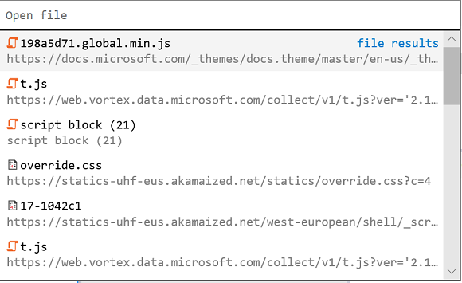

# DevTools in the latest Windows 10 update (EdgeHTML 18)

The latest update to Microsoft Edge DevTools adds a number of conveniences both to the UI and under the hood, including new dedicated panels for [*Service Workers*](#service-workers-panel) and [*Storage*](#storage-panel), source [file search](#source-file-search-tools) tools in the Debugger, and new [Edge DevTools Protocol domains](#edge-devtools-protocol-updates) for style/layout debugging and console APIs.

Here are the latest Microsoft Edge DevTools features available now in the [Windows 10 October 2018 Update](/windows/uwp/whats-new/windows-10-build-17763) ([EdgeHTML 18](https://aka.ms/devguide_edgehtml_18)). In addition to all this, we’ve also fixed a number of accessibility, reliability, and performance bugs to improve fundamentals!

## DevTools app

We've updated the standalone [Microsoft Edge DevTools Preview app](./index.md#microsoft-store-app). The latest release includes remote debugging access to core funtionality in the [**Debugger**](./debugger.md), [**Elements**](./elements.md) (for read-only operations), and [**Console**](./console.md) panels.

## Service Workers panel

There's now a dedicated [**Service Workers**](./service-workers.md) panel for inspecting, managing, and debugging your site's service workers. This provides the same functionality as was previously in the *Debugger* panel (now with a less-crowded UI!).

## Storage panel

We've also moved all the local storage inspectors (*Local and Sesion Storage, IndexedDB, Cookies, Cache*) previously in the *Debugger* to their own dedicated [**Storage**](./storage.md) panel.

## Source file search tools

The [**Debugger**](./debugger.md) now has a [source file search](./debugger.md#file-search) pane. Open it with the *Find in files* command (`Ctrl`+`Shift`+`F`) when you have a specific string of code you're trying to find in the source. The toolbar provides different search options, including regular expressions. 

You can also quickly open any loaded source file with the *Open file* (`Ctrl`+`P`) command.

## Edge DevTools Protocol updates

[Version 0.2](../devtools-protocol/0.2/index.md) of the DevTools Protocol provides new domains for style and layout (read-only) debugging and console APIs, in addition to the core script debugging functionality introduced in [Version 0.1](../devtools-protocol/0.1/index.md). In the Edge DevTools UI, this translates to functionality available in the [**Elements**](../devtools-guide/elements.md) (for read-only operations), [**Console**](../devtools-guide/console.md) and [**Debugger**](../devtools-guide/debugger.md) panels.
