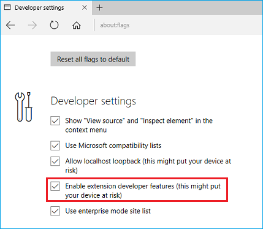
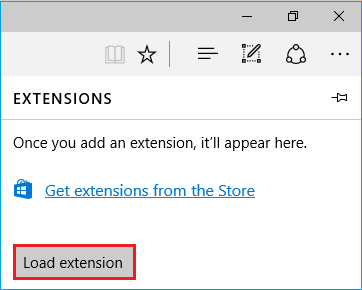
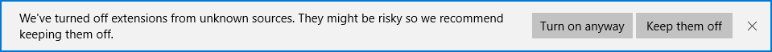
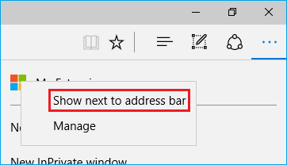
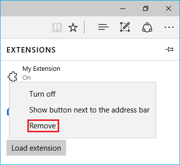

# Adding, moving, and removing extensions for Microsoft Edge  

[!INCLUDE [deprecation-note](../includes/deprecation-note.md)]  

Microsoft Edge support for extensions was introduced in the **Windows 10 Anniversary Update**.  If you're developing a Microsoft Edge extension and want to load it up, or if you already have and now want to remove it, check out the steps below.  
Also included are details on how to change your extension icon's location in the browser.  

## Adding an extension  

1.  Open Microsoft Edge and type `about:flags` into the address bar.  
1.  Select the **Enable extension developer features** checkbox.  
    
      
    
    > [!NOTE]
    > If you don't have the Windows 10 Anniversary Update or later, this option will not be available.  
    
1.  Select **More (...)** to open the menu.  
    
      
    
1.  Select **Extensions** from the menu.  
    
1.  Select the **Load extension** button.  
    
      
    
1.  Navigate to your extension's folder and select the  **Select folder** button.  
    
      
    
    > [!NOTE]
    > If you encounter an error message when loading your extension, refer to the [troubleshooting](../troubleshooting.md) page for guidance.  
    
**You're all set! You should now see the extension listed in Microsoft Edge's extension pane.**  

  

> [!NOTE]
> Unsigned extensions are automatically turned off on subsequent launches of Microsoft Edge.  When the browser enters an idle state \(after approximately 10 seconds of inactivity\) you will see the following notification at the bottom of the window.   To turn on the unsigned extensions, click **Turn on anyway**.  

## Moving the extension button  

Depending on your extension's settings, it could appear in the **More (...)** menu.  

  

If you want to move the button out of this menu for easier access:  

1.  Right-click the extension button.  
1.  Select **Show button next to address bar**.  
    
      
    
Alternatively, you may do this from the extensions details page:  

1.  Click on the extension button.  
1.  Toggle **Show button next to address bar** to on.  
    
      
    
> [!NOTE]
> You can always move the button back to the **More (...)** menu by right-clicking it and unselecting **Show next to address bar** or by going to the extension details page and toggling **Show button next to address bar** to off.  

## Removing an extension  

1.  Open Microsoft Edge.  
1.  Select **More (...)** to open the menu.  
1.  Select **Extensions** from the menu.  
1.  Right-click the extension you want to remove and select **Remove**, or select the extension and click the **Remove** button.  
    
      
    
**The extension should disappear from the list in Microsoft Edge.**  
