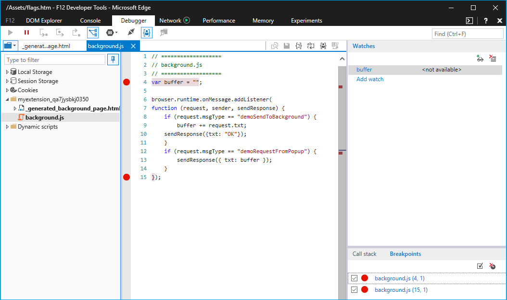
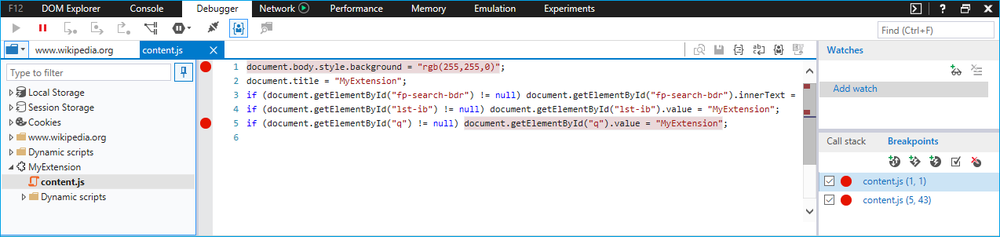
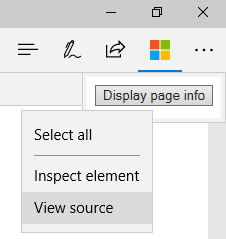
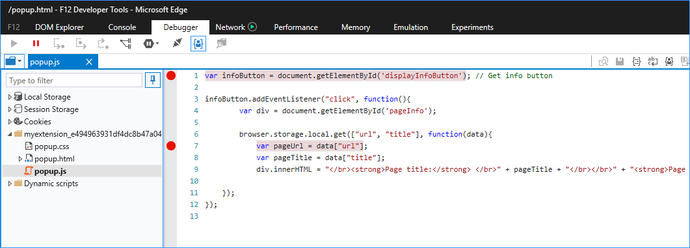
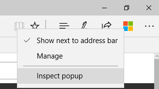

# Debugging extensions  

[!INCLUDE [deprecation-note](../includes/deprecation-note.md)]  

You can debug your extensions in Microsoft Edge by using F12 Developer Tools.  

The following video goes through a buggy Microsoft Edge extension, walking though each debugging scenario and fixing it up along the way.  See the step-by-step instructions below for more info.  

> [!VIDEO https://channel9.msdn.com/Blogs/One-Dev-Minute/Debugging-Microsoft-Edge-Extensions/player]  

> [!NOTE]
> In order to take advantage of extension debugging with F12, you must first turn on developer features in about:flags.  See [Adding and removing extensions](./adding-and-removing-extensions.md) for details on how to do this.  

## Background script debugging  

To start debugging the background script of your extension:  

1.  Click on **More (...)** followed by **Extensions** to go into the extension pane.  
    
      
    
1.  Click on the extension that you want to debug.  
1.  Click on the **Background page** link to bring up F12 for the background process.  
    
      
    
1.  Select the **Debugger** tab in F12.  
1.  Navigate to and select your extension's background script.  
1.  Place breakpoints for debugging by clicking to the left of the source code line number.  
    
      
    
1.  Select the **Console** tab and execute the `location.reload()` command.  This will re-execute the background script, allowing you to step through your code.  
    
      
    
## Content script debugging  

To start debugging the content script of your extension:  

1.  Launch F12 by either navigating to the **More (...)** button and selecting **F12 Developer Tools** or by pressing `F12` on your keyboard.  
1.  Navigate to and select your extension's content script.  Content scripts for extensions currently running will be depicted by a different folder for each extension.  
    
    > [!NOTE]
    > Only running content scripts will appear.  
    
1.  Place breakpoints for debugging by clicking to the left of the source code line number.  
    
      
    
1.  Refresh the browser tab to begin stepping though your code.  
    
## Extension page debugging  

There are two methods that can be used for accessing the source code of your extension page for debugging.  One method applies to a variety of pages while the other only works for popup pages.  

### Debugging any extension page  

The following method works for all extension pages like the options page and popups:  

1.  Right-click on the background of your page.  
1.  Select **View source**.  
    
      
    
1.  Once F12 opens, place breakpoints within the file you want to debug.  
    
      
    
1.  Select the **Console** tab and execute the command `location.reload()`.  This will re-execute the page script, allowing you to step through your code.  
    
      
    
### Debugging a popup extension page  

While the method for debugging extension pages also applies to popup extension pages, the following steps outline another way to debug your popup:  

1.  Right-click your extension's icon.  
1.  Select **Inspect popup**.  
    
      
    
1.  Follow steps 3 and 4 above for placing breakpoints and reloading the popup.  
    