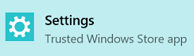

# Internationalization  

[!INCLUDE [deprecation-note](../includes/deprecation-note.md)]  

In order to make your extension accessible to a variety of different people, it is important to develop with other countries in mind. Microsoft Edge extensions allows you to add different language strings to your extensions so that their language can easily be changed.

For more information on internationalizing your extension, check out MDN's [Internationalization guide](https://developer.mozilla.org/Add-ons/WebExtensions/Internationalization).

## Testing languages

To test your language strings, you first need to set the Windows display language to the language that you want to test for.

Follow the steps below to change the Windows display language:

1. Open the Settings app.

   
2. Select "Time & language".
3. Select "Region & language".
4. Select "+ Add a language" to add the language to the list of possible languages.
5. Choose the language from the "Languages" list that you want to test.
6. Select the "Set as default" button (you may need to restart your PC).
7. Open Microsoft Edge and verify that the strings defined for the locale appear as expected.

By using the [NavigatorLanguage.language](https://developer.mozilla.org/docs/Web/API/NavigatorLanguage/language) property, you can verify that the language Microsoft Edge has determined to be the Windows display language is correct.

Click the button in the CodePen below to see the display language of your browser.

<iframe height='300' scrolling='no' title='Get locale' src='//codepen.io/MSEdgeDev/embed/VaRWwR/?height=300&theme-id=23761&default-tab=result&embed-version=2&editable=true' frameborder='no' allowtransparency='true' allowfullscreen='true' style='width: 100%;'>See the Pen <a href='https://codepen.io/MSEdgeDev/pen/VaRWwR/'>Get locale</a>by MSEdgeDev (<a href='http://codepen.io/MSEdgeDev'>@MSEdgeDev</a>) on <a href='http://codepen.io'>CodePen</a>.
</iframe>
