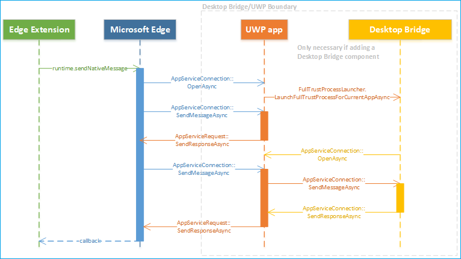
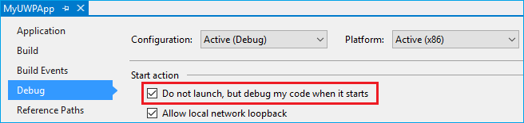

# Native messaging in Microsoft Edge  

[!INCLUDE [deprecation-note](../includes/deprecation-note.md)]  

## Native messaging architecture overview  

With the Windows 10 Creators Update, Microsoft Edge extensions are able to use native messaging to communicate with a companion Universal Windows Platform \(UWP\) app.  At a high level, Microsoft Edge extensions use the same APIs for native messaging as Chrome and Firefox extensions.  However, the native messaging host will need to be implemented using the Universal Windows Platform.  

> [!NOTE]
> The method outlined below \(connecting to a UWP app via AppService\) is the only supported mechanism for enabling communication between Microsoft Edge extensions and native components.  Please see the [Adding a Desktop Bridge component](#adding-a-desktop-bridge-component) section of this guide for more information on how to enable communication with legacy Win32 components.  

The native messaging architecture in Microsoft Edge leverages the existing [`AppService`](/uwp/api/Windows.ApplicationModel.AppService?view=winrt-19041&preserve-view=true) API as the underlying inter-process communication \(IPC\) infrastructure.  UWP apps use the `AppService` API to communicate with one another.  Because of this, Microsoft Edge extensions are now able to communicate with UWP apps.  

  

### When and when not to use native messaging  

Native messaging adds a whole new layer to your extension.  By implementing a UWP companion app for your extension, the following possibilities become available to you:  

*   Synchronize data \(for example credentials\) with a companion UWP app.  
*   Implement stronger encryption/decryption algorithms not available in web APIs.  
*   Access resources that are not accessible through web APIs, for example hardware or USB devices  

There are a few instances where native messaging should not be used due to security or policy restrictions:  

*   Modifying user settings in either Microsoft Edge or Windows, for example changing the default browser or search provider.  
*   Actions that violate Microsoft Store policies for both apps and extensions.  
*   Transferring data to remote endpoint via native message host.  
*   Allowing other apps to download content that changes extension behavior.  

## Demos  

To get a feel for what an Microsoft Edge native messaging extension that has both a companion UWP app and a Desktop Bridge looks like, check out the [SecureInput](https://github.com/MicrosoftEdge/MicrosoftEdge-Extensions-Demos/tree/master/SecureInput) and [DigitalSigning (C++)](https://github.com/MicrosoftEdge/MicrosoftEdge-Extensions-Demos/tree/master/DigitalSigning) examples on GitHub.  

### How it works  

The Microsoft Edge extension component of the sample uses its content script to detect when a user is typing in information that should be encrypted.  The extension communicates this to the Desktop Bridge component via native messaging.  When the user is ready to submit the data, the extension will return an encrypted value back to the website.  

> [!NOTE]
> This sample will only work on a webpage that uses custom events to communicate with the content script of the extension.  The sample folder includes a [.html file](https://github.com/MicrosoftEdge/MicrosoftEdge-Extensions-Demos/blob/master/SecureInput/SecureInput.html) to test the extension with.  

In this example, the UWP app is used to pass responses from the Desktop Bridge to Microsoft Edge, which then gets sent to the Microsoft Edge extension via callback.  While this example has the native messaging host run in the main app, it is also able to run as a background task.  Switching between the two requires editing the background script of the extension, changing the string within `port = browser.runtime.connectNative("NativeMessagingHostInProcessService");` to `"NativeMessagingHostOutOfProcess"`.  

## Chrome vs Microsoft Edge implementation  

While Chrome goes the route of using message passing APIs for their extensions to communicate with apps, Microsoft Edge utilizes the [`AppService`](/uwp/api/Windows.ApplicationModel.AppService?view=winrt-19041&preserve-view=true) API which now enables Microsoft Edge extensions and UWP apps to communicate.  

This section details the differences between how Chrome and Microsoft Edge handle native messaging implementation.  

### Registration and host manifest  

In order for your app to be recognized by your extension as a native messaging host, it will need to be registered.  

For [Chrome native messaging](https://developer.chrome.com/extensions/nativeMessaging) host registration, your app needs to install a manifest file anywhere in the Windows file system that defines the native messaging host configuration.  

The following JSON is an example of settings for the config file:  

```json
{
   "name": "com.my_company.my_application",
   "description": "My Application",
   "path": "C:\\ProgramFiles\\MyApplication\\chrome_native_messaging_host.exe",
   "type": "stdio",
   "allowed_origins": [
      "chrome-extension://knldjmfmopnpolahpmmgbagdohdnhkik/"
    ]
}
```  

To install this file, the app would need to:  

1.  Register the manifest file in a predefined location in the registry that defines the host configuration:  
    *   `HKEY_LOCAL_MACHINE\SOFTWARE\Google\Chrome\NativeMessagingHosts\com.my_company.my_application`  
        
        or  
    *   `HKEY_CURRENT_USER\SOFTWARE\Google\Chrome\NativeMessagingHosts\com.my_company.my_application`  
        
1.  Set the default value of that key to the full path to the manifest file, for example `[HKEY_CURRENT_USER\Software\Google\Chrome\NativeMessagingHosts\com.my_company.my_application] @="C:\\path\\to\\nmh-manifest.json"`  

For Microsoft Edge, in order to register an [`AppService`](/uwp/api/Windows.ApplicationModel.AppService?view=winrt-19041&preserve-view=true) \(native messaging host\) you must include the UWP companion app in the same package as your extension and specify the [AppService extension](/windows/uwp/launch-resume/how-to-create-and-consume-an-app-service) in the `Package.appxmanifest` file of your project.  The `EntryPoint` and `Name` attributes may be configured by you:  

```xml
...
<Applications>    
    <Application Id="App"         
        <Extensions>        
            <uap:Extension Category="windows.appService" EntryPoint="MyAppService.Inventory">          
            <uap:AppService Name="com.microsoft.inventory"/>        
            </uap:Extension>      
        </Extensions>      
        ...   
    </Application>
</Applications>
```  

You also need to set which extensions are allowed to connect to the service.  Because Microsoft Edge does not have an equivalent `"allowed_origins"` manifest property in its AppxManifest, this will need to be determined and enforced at runtime by your UWP app.  Since Microsoft Edge establishes the connection on behalf of the extension, the app looks up the Package Family Name of the caller to determine if extension is being connected by Microsoft Edge to control or authenticate the caller.  For example   

```csharp
protected async override void
OnBackgroundActivated(BackgroundActivatedEventArgs args)
{
    IBackgroundTaskInstance taskInstance = args.TaskInstance;
    if (taskInstance.TriggerDetails is AppServiceTriggerDetails)
    {
        AppServiceTriggerDetails appService = taskInstance.TriggerDetails as AppServiceTriggerDetails;
        if (appService.CallerPackageFamilyName == EdgePFN)
        {
            // Establish the connection
        }
        else
        {
            // Reject the connection
        }
    }
}
```  

### Message sending  

For an app and an extension to communicate with one another, messages need to be sent to and from them.  

Chrome extensions initiate a message using the [`runtime.sendNativeMessage`](https://developer.mozilla.org/Add-ons/WebExtensions/API/runtime/sendNativeMessage) API to deliver a message to the native host using a non-persistent channel.  

```javascript
chrome.runtime.sendNativeMessage(string application, object message, function responseCallback)
```  

The first parameter is the name of the native host, which Chrome looks up in the registry for the manifest.  The manifest specifies the .exe that Chrome will launch in a sandbox, and the message is sent using std i/o.  
Extensions also establish a persistent channel using the `runtime.connectNative` API, which takes the name of the native host as the only parameter.  

Microsoft Edge uses the same construct as the native messaging API in Chrome to allow Microsoft Edge extensions to specify which app service to connect to.  The first parameter in `runtime.sendNativeMessage` specifies the app service name.  In the [Registration and host manifest](#registration-and-host-manifest) section, this is `"com.microsoft.inventory"`.  The Microsoft Edge extension platform restricts the native messaging host to being a UWP app that is packaged in the same AppX as the extension.  This mitigates any security risks associated with malicious attacks that try to connect Microsoft Edge with another Package Family Name by tampering with manifest entries.  

This means that Microsoft Edge will use the same Package Family Name as the extension, in addition to the `AppService` name specified in the API, to uniquely identify the provider of the app service.  

> [!NOTE]
> This will not be easily converted by the [Microsoft Edge Extension Toolkit](./porting-chrome-extensions.md).  Any extensions that specifies the `"nativeMessaging"` permission will be flagged as requiring manual conversion for this component.  

### Communication protocol  

Communication protocol for native messaging determines how messages are formatted before sending.  

Chrome starts each native messaging host in a separate process and communicates with it using standard input and standard output.  The same format is used to send messages in both directions: each message is serialized using JSON, UTF-8 encoded and is preceded with 32-bit message length in native byte order.  

For Microsoft Edge, the background task/main app that implements the app service will be started by the platform.  On startup, the `Run` method of the background task is invoked:  

```csharp
public void Run(IBackgroundTaskInstance taskInstance)    
{
    this.backgroundTaskDeferral = taskInstance.GetDeferral();
    // Get a deferral so that the service is not stopped and ended.
    taskInstance.Canceled += OnTaskCanceled;
    // Associate a cancellation handler with the background task.
    // Retrieve the app service connection and set up a listener for incoming app service requests.
    var details = taskInstance.TriggerDetails as AppServiceTriggerDetails;
    appServiceconnection = details.AppServiceConnection;
    appServiceconnection.RequestReceived += OnRequestReceived;
}
```  

When your extension sends a message to your UWP app, the [`onRequestReceived`](/uwp/api/Windows.ApplicationModel.AppService.AppServiceConnection?view=winrt-19041&preserve-view=true) event will be raised.  This JSON formatted message will then be stringified into the first KeyValue pair of a [`ValueSet`](/uwp/api/Windows.Foundation.Collections.ValueSet?view=winrt-19041&preserve-view=true) object.  :  

```csharp
private async void OnRequestReceived(
AppServiceConnection sender,
AppServiceRequestReceivedEventArgs args)
{
    ...
}
```  

When your UWP app sends a response back to your extension, a [`KeyValuePair`](/dotnet/api/system.collections.generic.keyvaluepair-2?view=netcore-3.1&preserve-view=true) will be added to the `ValueSet` object.  The `Key` property will be ignored by Microsoft Edge, but the `Value` property will contain a valid JSON string.  

### Callback  

For callbacks, Chrome uses [`runtime.sendNativeMessage`](https://developer.mozilla.org/Add-ons/WebExtensions/API/runtime/sendNativeMessage) which allows a callback function to handle any asynchronous response from sending a message.  

Microsoft Edge uses the [`SendResponseAsync`](/uwp/api/Windows.ApplicationModel.AppService.AppServiceRequest?view=winrt-19041&preserve-view=true) method  of the [`AppServiceRequest`](/uwp/api/Windows.ApplicationModel.AppService.AppServiceRequest?view=winrt-19041&preserve-view=true) object to let the app send a [`ValueSet`](/uwp/api/Windows.Foundation.Collections.ValueSet?view=winrt-19041&preserve-view=true) object back to the extension.  

### Message size limit  

Messages that are sent back and forth between an extension and an app have different message size limitations in place for Chrome and Microsoft Edge.  

Chrome has the following message size limitations:  

*   Single message limit from native messaging host:  1 MB  
*   Single message limit sent to native messaging host:  4 GB  

For Microsoft Edge, while `AppService` has no limit on message size \(dependent on memory\), Microsoft Edge protects itself against misbehaving native apps by imposing the following message size limits:  

*   Single message limit from UWP app to extension: 1 MB  
*   Single message limit from extension to UWP app: 100 MB  

### Native messaging connections  

There are two types of connections for native messaging; persistent and non-persistent.  
A **persistent** connection is a connection that is kept running until the port is destroyed.  A **non-persistent** connection is a connection that is opened for one message at a time and closes after delivery.  

#### Persistent  

For Chrome, a persistent connection is made by creating a messaging port using [`runtime.connectNative`](https://developer.mozilla.org/Add-ons/WebExtensions/API/runtime/connectNative).  Once the port is made, Chrome starts a native messaging host process that keeps running until the port it destroyed.  

For Microsoft Edge, once a messaging port is created using `runtime.connectNative`, Microsoft Edge starts the [`AppServiceConnection`](/uwp/api/Windows.ApplicationModel.AppService.AppServiceConnection?view=winrt-19041&preserve-view=true) and keeps it running until the port is destroyed.  The following snippet shows how a persistent connection is established from within a UWP app.  

```csharp
this.inventoryService = new AppServiceConnection();  
// Here, we use the app service name provided via the runtime.connectNative API  
this.inventoryService.AppServiceName = "com.microsoft.inventory";  
// Use the same Package Family Name as the extension package
this.inventoryService.PackageFamilyName = "replace with the Package Family Name";  
var status = await
this.inventoryService.OpenAsync();
```  

#### Non-persistent  

When a message is sent using [`runtime.sendNativeMessage`](https://developer.mozilla.org/Add-ons/WebExtensions/API/runtime/sendNativeMessage) in Chrome, without creating a messaging port, Chrome starts a new native messaging host process for each message.  The first message generated by the host process is handled as a response to the original request, and all other messages after it are ignored.  

Microsoft Edge stops and ends the connection after every response to each message has been received.  The following snippet shows a non-persistent connection that is established with `AppServiceConnection` that will then be terminated within the UWP app after a request has been received and stored as an [`AppServiceResponse`](/uwp/api/Windows.ApplicationModel.AppService.AppServiceResponse?view=winrt-19041&preserve-view=true).  

```csharp
using (var connection = new AppServiceConnection())
{    
    //Set up a new app service connection
    connection.AppServiceName = "com.microsoft.randomnumbergenerator";
    connection.PackageFamilyName = "Microsoft.SDKSamples.AppServicesProvider.CS_8wekyb3d8bbwe";
    AppServiceConnectionStatus status = await connection.OpenAsync();
    AppServiceResponse response = await connection.SendMessageAsync(inputs);
}
```  

### Permission  

In order to enable native messaging use with your extension, for both Chrome and Microsoft Edge you must declare the `"nativeMessaging"` permission in you `manifest.json` file.  

## App services  

This section details the impact app services has on Microsoft Edge native messaging performance and memory.  

### Performance  

App services are "sponsored" by the foreground app that calls them which for native messaging purposes is Microsoft Edge.  This means that app services can run as long as Microsoft Edge is running.  

In regards to latency, app services use named pipes that, after initial connection, allow two apps to directly communicate.  This method of communication produces low latency.  Devices with slow CPUs will experience some initial latency after starting up the process that hosts the app service \(~80ms to startup the background task on some devices\).  After start-up, performance on slow CPU devices should be good.  

### Memory  

The memory allocated to an app service is taken out of the quota allocated to Microsoft Edge.  This means that if Microsoft Edge starts too many app services there is a possibility that they could run out of memory.  The usual background task memory caps are enforced on app services.  For instance, on a 512MB device an app service background task can be no larger than 16MB.  This number goes up as the devices scale up.  

## Creating an extension with native messaging  

In order to test native messaging, your extension needs a Package Family Name.  Microsoft Edge uses this to determine the native message host identity, which means your extension should be packaged.  

To create your extension with native messaging in Visual Studio:  

1.  Create a UWP project in Visual Studio.  
1.  [Add `AppService` to your UWP app](/windows/uwp/launch-resume/how-to-create-and-consume-an-app-service).  
    *   You can optionally [configure `AppService` to be hosted in the main app](/windows/uwp/launch-resume/convert-app-service-in-process) instead of as a background task at this point.  
1.  Build and test your UWP project.  
    *   You can optionally add a [Desktop Bridge component](#adding-a-desktop-bridge-component).  
1.  Create a Microsoft Edge extension that uses native messaging to communicate with the UWP companion app.  The extension files can be added into a folder named `Extension` in the UWP project.  All of the files underneath this folder, including subfolders, need to have their properties configured such that `Build Action=Content` and `Copy to Output Directory=Copy Always`.  Make sure `manifest.json` is also configured with these properties.  
1.  Modify the `package.manifest.xml` file in the project to include extension metadata and convert it to a headless app by adding `AppListEntry="none"`:  
    
    ```xml
    <Package
    xmlns="http://schemas.microsoft.com/appx/manifest/foundation/windows10" 
    xmlns:rescap="http://schemas.microsoft.com/appx/manifest/foundation/windows10/restrictedcapabilities" 
    xmlns:mp="http://schemas.microsoft.com/appx/2014/phone/manifest" 
    xmlns:uap="http://schemas.microsoft.com/appx/manifest/uap/windows10" 
    xmlns:uap3="http://schemas.microsoft.com/appx/manifest/uap/windows10/3"
    IgnorableNamespaces="uap uap3 mp rescap build" 
    xmlns:build="http://schemas.microsoft.com/developer/appx/2015/build">
    
    <Dependencies>
        <TargetDeviceFamily Name="Windows.Desktop" MinVersion="10.0.15063.0" MaxVersionTested="10.0.15063.0" />
    </Dependencies>
       
       <Application Id="App" Executable="$targetnametoken$.exe" EntryPoint="NativeMessagingHostInProcess.App">
          <uap:VisualElements AppListEntry="none"
            DisplayName="SecureInput"
            Square150x150Logo="Assets\Square150x150Logo.png"
            Square44x44Logo="Assets\Square44x44Logo.png"
            Description="NativeMessagingHostInProcess"
            BackgroundColor="transparent">
          </uap:VisualElements>
          <Extensions>
            <uap3:Extension Category="windows.appExtension">
                <uap3:AppExtension
                    Name="com.microsoft.edge.extension"
                    Id="EdgeExtension"
                    PublicFolder="Extension"
                    DisplayName="ms-resource:DisplayName">
                </uap3:AppExtension>
            </uap3:Extension>
          </Extensions>
    </Application>
    ```  
    
1.  Use the `AppService` name configured for the UWP in the native messaging APIs.  
1.  Build and [deploy](#deploying) the UWP project \(with the optional Desktop Bridge component\).  
1.  [Package](#packaging) your native messaging extension once it is ready for Store submission  
    
> [!NOTE]
> Reference the [Demos](#demos) section for an example of a complete native messaging extension.  

## Adding a Desktop Bridge component  

If you want to add a Desktop Bridge component to your package, you must create and build your Win32 project in Visual Studio.  For info on how to convert your win32 app to UWP, see [Porting apps to Windows 10 via Desktop Bridge](/windows/uwp/porting/desktop-to-uwp-root).  Once built in Visual Studio, you can add the Win32 executable to the package by doing the following steps:  

1.  Add the Win32 project to the same solution as the UWP project.  
1.  Set the Win32 project as a dependent project for the UWP project:  
    
      
    
1.  Create a `Win32` folder within the UWP project.  Copy the necessary binaries for the `Win32` project to this folder.  Configure the properties of all the binaries such that `Build Action=Content` and `Copy to Output Directory=Copy Always`.  
    
      
    
1.  Modify the UWP project file to copy all the necessary binaries for the `Win32` project into this folder using PostBuild event command.  This ensures that the updated binaries are being copied to the folder every time the solution is rebuilt.  
    
    ```xml
    <Target Name="AfterBuild">
    <Copy SourceFiles="..\PasswordInputProtection\bin\$(Configuration)\PasswordInputProtection.exe" DestinationFolder="win32" />
    <Copy SourceFiles="..\PasswordInputProtection\bin\$(Configuration)\PasswordInputProtection.exe.config" DestinationFolder="win32" />
    <Copy SourceFiles="..\PasswordInputProtection\bin\$(Configuration)\PasswordInputProtection.pdb" DestinationFolder="win32" />
    </Target>
    ```  
    
1.  Modify `package.manifest.xml` by adding the `<desktop:Extension>` element to the `<Extensions>` element:  
    
    ```xml
    <Extensions>
    <desktop:Extension Category="windows.fullTrustProcess"Executable="Win32\PasswordInputProtection.exe"
    xmlns:desktop="http://schemas.microsoft.com/appx/manifest/desktop/windows10" />
    </Extensions>
    ```  
    
## Deploying  

Once you have configured your UWP project \(and optionally Win32 project\) as outlined above, you are ready to deploy the solution using Visual Studio.  

  

Once the solution is correctly deployed, you should see your extension in Microsoft Edge.  

  

## Packaging  

> [!NOTE]
> Submitting a Microsoft Edge extension to the Microsoft Store is currently a restricted capability.  [Send a request](https://developer.microsoft.com/microsoft-edge/extensions/requests/) to be a part of the Microsoft Store, and be considered for future updates.  

You may generate a Store package for submission to the Windows Dev Center using built-in Visual Studio functionality:  

  

## Debugging  

The instructions for debugging vary depending on which component you want to test out:  

### Debugging the extension  

Once the solution is deployed, the extension will be installed in Microsoft Edge.  Check out the [Debugging](./debugging-extensions.md) guide for info on how to debug an extension.  

### Debugging the UWP app  

The UWP app will launch when the extension tries to connect to it using [native messaging APIs](https://developer.mozilla.org/Add-ons/WebExtensions/API/runtime/connectNative).  You must debug the UWP app only once the process starts.  This may be configured using the Property page of the project:  

1.  In Visual Studio, hover on your UWP app project and open the contextual menu \(right-click\)  
1.  Select **Properties**  
1.  Check **Do not launch, but debug my code when it starts**  
    
      
    
In Visual Studio you can now set breakpoints in the code where you want to debug, then launch the debugger by pressing F5.  Once you interact with the extension to connect to the UWP app, Visual Studio will automatically attach to the process.  

### Debugging the Desktop Bridge  

Even though there are various [methods for debugging a Desktop Bridge](/windows/msix/desktop/desktop-to-uwp-debug) \(converted Win32 app\), the only one applicable for this scenarios is the PLMDebug option.  You could also add debugging code to the startup function to perform a wait for a specific time, allowing you to attach Visual Studio to the process.  
