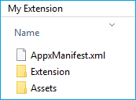
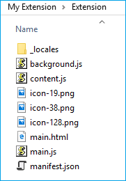

# Creating and testing a Microsoft Edge extension AppX package  

[!INCLUDE [deprecation-note](../../includes/deprecation-note.md)]  

Microsoft Edge extensions are packaged as AppX, similar to how Universal Windows Apps are packaged. As of Windows 10 Anniversary Update, a new schema has been introduced for AppX that allows an AppX to include a Microsoft Edge extension as its content.

If you already know how Microsoft Edge extension AppXs are created, you can skip to [Using ManifoldJS to package extension](./using-manifoldjs-to-package-extensions.md) to learn how to use a Node.js based tool to do all of this for you!

> [!NOTE]
> Submitting a Microsoft Edge extension to the Microsoft Store is currently a restricted capability. Once you've created, packaged and tested your extension, please submit a request on our [extension submission form](https://aka.ms/extension-request).

## Preparing the submission folder

To prepare your extension for submission, you need to create a folder with the following structure:



At the root of the folder, you should include an AppXManifest.xml file. This file is used to specify the contents and layout of the package.

You should also have an Assets folder which contains the UI assets to be used in the Microsoft Store, and an Extension folder that contains your extension's files (scripts, icons, etc).

> [!IMPORTANT]
> You can create a different folder structure for your package, but the folder structure must match the AppXManifest values.

### AppXManifest.xml
The AppXManifest file is an XML document that contains info the system needs to deploy, display, or update a Windows app. This file also includes package identity, capabilities, and visual elements. Every app package must include one AppXManifest file.

Developers can use the following template for their AppXManifest.xml file:

```xml
<?xml version="1.0" encoding="utf-8"?>
<Package
  xmlns="http://schemas.microsoft.com/appx/manifest/foundation/windows10"
  xmlns:uap="http://schemas.microsoft.com/appx/manifest/uap/windows10"
  xmlns:uap3="http://schemas.microsoft.com/appx/manifest/uap/windows10/3"
  IgnorableNamespaces="uap3">

  <Identity
    Name="[REPLACE WITH PACKAGE/IDENTITYNAME]"
    Publisher="[REPLACE WITH PACKAGE/IDENTITY/PUBLISHER]"
    Version="[REPLACE WITH PACKAGE VERSION in the form X.X.X.0]"/>

  <Properties>
    <DisplayName>[REPLACE WITH RESERVED STORE NAME]</DisplayName>
    <PublisherDisplayName>[REPLACE WITH PACKAGE/PROPERTIES/PUBLISHERDISPLAYNAME]</PublisherDisplayName>
    <Logo>[REPLACE WITH RELATIVE PATH TO 50x50 ICON]</Logo>
  </Properties>

  <Dependencies>
    <TargetDeviceFamily Name="Windows.Desktop"
      MinVersion="10.0.14393.0"
      MaxVersionTested="10.0.14800.0" />
  </Dependencies>

  <Resources>
    <Resource Language="en-us"/>
  </Resources>

  <Applications>
    <Application Id="App">
      <uap:VisualElements
        AppListEntry="none"
        DisplayName="[REPLACE WITH RESERVED STORE NAME]"
        Square150x150Logo="[REPLACE WITH RELATIVE PATH TO 150x150 ICON]"
        Square44x44Logo="[REPLACE WITH RELATIVE PATH TO 44x44 ICON]"
        Description="This is the description of the extension"
        BackgroundColor="white">
      </uap:VisualElements>
    <Extensions>
    <uap3:Extension Category="windows.appExtension">
    <uap3:AppExtension Name="com.microsoft.edge.extension"
        Id="EdgeExtension"
        PublicFolder="Extension"
      DisplayName="[REPLACE WITH RESERVED STORE NAME]">
    </uap3:AppExtension>
    </uap3:Extension>
    </Extensions>
 </Application>
</Applications>
</Package>
```  

#### App identity template values
Once you've [reserved the name of your extension](./extensions-in-the-windows-dev-center.md#name-reservation) through the Windows Dev Center, you'll be able to find the necessary package identity information needed to replace the following values in AppXManifest.xml:

-   `Name`
-   `Publisher`
-   `DisplayName`
-   `PublisherDisplayName`

You can access your App identity page using the following steps:

1.  Navigate to [Windows Dev Center](https://developer.microsoft.com/windows/).
2.  Sign in to your developer account.
3.  Navigate to the Dashboard.
4.  Select the name of your extension.
    
    
    
5.  Navigate to the App identity page which is under the App management section (after you've registered your app).
    
    
    
You can now populate the AppXManifest template with values from the App identity page, as indicated in the template:

```xml
<Identity
  Name="37369abigailc.MyExtension"
  Publisher="CN=732F2E5E-B9A6-4243-85F6-A4210F57AA10"
  Version="[REPLACE WITH PACKAGE VERSION in the form X.X.X.0]" />

<Properties>
  <DisplayName>My Extension</DisplayName>
  <PublisherDisplayName>abigailc</PublisherDisplayName>
  <Logo>[REPLACE WITH RELATIVE PATH TO 50x50 ICON]</Logo>
</Properties>
```  

#### JSON manifest template values
Some values in the AppXManifest need to match those that are defined in the JSON manifest. Please update the following values in appxmanifest.xml based on your extension JSON manifest:

-   `Version` - This is the version listed in your extension's JSON manifest. The string needs to match the X.X.X.X format where the last integer has to be 0. E.g. 1.2.3.0
    
    ```xml
    <Identity
         Name="37369abigailc.MyExtension"
         Publisher="CN=732F2E5E-B9A6-4243-85F6-A4210F57AA10"
         Version="1.0.0.0" />
    ```  
    
-   `Description` - This is a copy of the description in your extension's JSON manifest.
    
    ```xml
    <uap:VisualElements
         AppListEntry="none"
         DisplayName="My Extension"
         Square150x150Logo="[REPLACE WITH RELATIVE PATH TO 150x150 ICON]"
         Square44x44Logo="[REPLACE WITH RELATIVE PATH TO 44x44 ICON]"
         Description="This extension will allow you to quickly print by clicking the browser action."
         BackgroundColor="white">
    </uap:VisualElements>
    ```  
    
### Assets folder

Within the Assets folder you will need three different icon sizes. These icons will be used in the Microsoft Store and the Windows UI. For more information on these icons, see the [Design](./../design.md#icons-for-packaging) guide.


Once you've created the necessary UI assets, update AppXManifest.xml to point to the correct files:

-   44x44
    
    ```xml
    Square44x44Logo="Assets/icon_44.png"
    ```  
    
-   50x50
    
    ```xml
    <Logo>Assets/icon_50.png</Logo>
    ```  
    
-   150x150
    
    ```xml
    Square150x150Logo="Assets/icon_150.png"
    ```  
    
### Extension folder
Copy your extension files (keeping the folder structure) into the Extension folder. Make sure `manifest.json` is at the root your Extension folder.



### Supporting more than one locale
If your extension supports more than one language, you may want to configure the AppX package with all the locales that you need so that the correct localized icon and description appear in the Microsoft Store. See [Localizing extension packages](./localizing-extension-packages.md) for more information.

### Creating an Appx

To create an Appx, you'll need to find the path for makeappx. This is usually located in the following location if you're on a 64-bit machine.

`C:\Program Files (x86)\Windows Kits\10\bin\x64`

Execute the following command to create the AppX package for your extension:

`[Path to makeappx] makeappx pack /h SHA256 /d [Path to package folder created in #1] /p [Path to the appx file that you want to create]`

This should look something like this once you've filled in the paths:

`C:\Program Files (x86)\Windows Kits\10\bin\x64>makeappx.exe pack /h SHA256 /d "C:\Extension\My Extension" /p C:\Extension\MyExtension.appx`

### Unpacking an Appx
You may want to unpack a previously generated AppX and use it as a starting point for the next iteration of your extension or to confirm that the AppX was created correctly.

To do this, you can execute the following command to unpack the AppX package of your Microsoft Edge extension:

```shell
[Path to makeappx] makeappx unpack /v /p [Path to appx file you want to unpack] /d [Path to the location where you want to create the package folder]
```  

This should look something like this when filled out:

```text
C:\Program Files (x86)\Windows Kits\10\bin\x64>makeappx.exe unpack /v /p "C:\Extension\MyExtension.appx" /d "C:\Extension\My Extension"
```  

## Testing an AppX package

You can test your Microsoft Edge extension AppX package by sideloading it in Microsoft Edge. Sideloading the extension AppX package is similar to sideloading a Universal Windows app. You will need to create a certificate for signing the package, and then add the package to Windows.

### Signing

See [How to create an app package signing certificate](https://msdn.microsoft.com/library/windows/desktop/jj835832.aspx) and [How to sign an app package using SignTool](https://msdn.microsoft.com/library/windows/desktop/jj835835.aspx) for info on the signing and certification process for packages.

> [!NOTE]
> You do not need to sign an extension package before submitting it to the Microsoft Store; the Store ingestion process will take care of that for you!

After you've signed the package with the certificate that you created, the certificate is still not trusted by the local machine for deployment of app packages until you install it into the trusted certificates store of the local computer. You can use Certutil.exe, which comes with Windows to do this.

To install certificates with WindowsCertutil.exe, run Cmd.exe as administrator
and run the following command:

```shell
Certutil -addStore TrustedPeople MyKey.cer
```  

Once the certificates are no longer in use, it is recommended that you remove them by running the following command from an administrator command prompt:

```shell
Certutil -delStore TrustedPeople certID
```  

The certID is the serial number of the certificate. To determine the certificate serial number, run the following command:

```shell
Certutil -store TrustedPeople
```  

### Deploying
You can deploy the Microsoft Edge Extension AppX package by running the following command in PowerShell (as administrator):

```powershell
Add-AppxPackage [path to AppX]
```  

## Automated testing with WebDriver

As of the Anniversary Update, you can programmatically sideload your extension in Microsoft Edge with WebDriver, enabling automated testing of extensions when Microsoft Edge is launched in WebDriver mode. This will allow you to set up automated tests for any extension that manipulates content on a page and verify that the correct behavior is exhibited.

To sideload your extension for automated testing, you'll need to store your extension's folder under `%LOCALAPPDATA%\Packages\Microsoft.MicrosoftEdge_8wekyb3d8bbwe\LocalState\`. Once your extension is in the `LocalState` directory, you'll need to create an [`EdgeOptions`](https://seleniumhq.github.io/selenium/docs/api/dotnet/html/T_OpenQA_Selenium_Edge_EdgeOptions.htm) object, and add the `extensionPaths` capability to it. The value of this capability is an array of absolute paths to the extensions (in the `LocalState` directory) you wish to have side loaded when Microsoft Edge starts in WebDriver mode.

Check out the following [C# file](https://github.com/scottlow/Ignite2016/blob/master/Ignite%202016%20WebDriver%20Demo/IgniteWebDriverDemo/Program.cs) for a complete sample on side loading extensions in Microsoft Edge with WebDriver.
