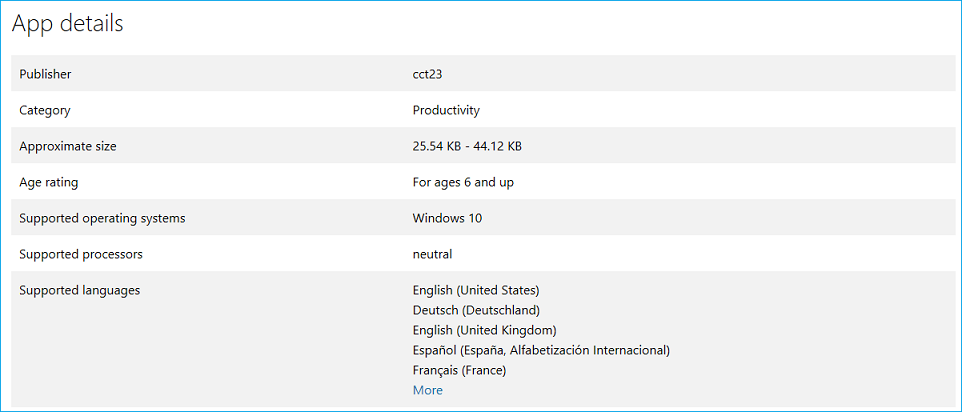
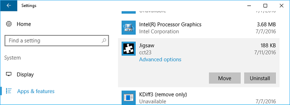
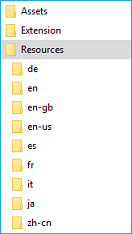
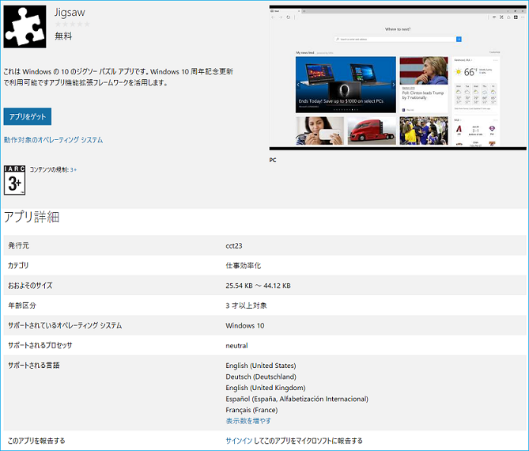

# Localizing Microsoft Edge extensions for Windows and the Microsoft Store  

[!INCLUDE [deprecation-note](../../includes/deprecation-note.md)]  

This guide walks through how to localize your Microsoft Edge extension so that it's ready for multiple locales upon release.  To fully localize your extension, you'll need to follow the steps for both Windows and the Microsoft Store.  

If you want to localize your extension resources for Microsoft Edge, you can learn how to use the i18n framework in the [Internationalization guide](../internationalization.md).  

> [!NOTE]
> If your extension doesn't support multiple languages, you can skip to [Localizing name and description in the Microsoft Store](#localizing-name-and-description-in-the-microsoft-store).  

## The localization process overview  

The first step towards getting your extension available to a wide audience is to [configure its AppxManifest](#configuring-the-appxmanifest) for multiple languages.  In the Microsoft Store, this will show users what languages your extension supports.  Certain fields in the AppxManifest will also need to be changed if you want the name of your extension to be [localized in the Windows UI and the Microsoft Store](#localizing-extension-resources-for-windows-and-the-microsoft-store).  

Once your AppxManifest is configured, you'll need to [create JSON string resources](#creating-json-string-resources) for the languages that you indicated as supported.  This requires creating a `.resjson` file for each language, where each file has all the UI strings of that language within it.  

After the `.resjson` files for the supported languages have been made, a [.pri resource file will need to be created](#creating-the-resources-file). This will be created by using a configuration file to the MakePRI tool that comes with the [Windows 10 SDK](https://developer.microsoft.com/windows/downloads/windows-10-sdk).  

> [!NOTE]
> If you are only downloading the Windows 10 SDK to use the `MakePri.exe` tool, you can select only the **Windows SDK Signing Tools for Desktop Apps** and **Windows SDK for UWP Managed App** features to keep the download lighter.  The `MakePri.exe` tool will appear in subfolders of `C:\Program Files (x86)\Windows Kits\10\bin\10.0.17713.0`.  

Once you've uploaded your extension, the final step is to [localize the name and description in the Microsoft Store](#localizing-name-and-description-in-the-microsoft-store).  

> [!NOTE]
> Submitting a Microsoft Edge extension to the Microsoft Store is currently a restricted capability.  **Reach out to us** with your requests to be a part of the Microsoft Store, and we'll consider you for a future update.  

## Configuring the AppXManifest  

Your extension's Supported languages list in the Microsoft Store is generated based on its AppXManifest values.  This list is specified using the `Resource` element.  

  

To specify the list of languages that are supported by your extension, you can add a `Resource` element in the format seen below \(this `Resource` element will show support for English, German, and French in the Microsoft Store\):  

```xml
<Resources>
    <Resource Language="en-us"/>
    <Resource Language="de-de"/>
    <Resource Language="fr-fr"/>
</Resources>
```  

See [Supported languages](/windows/uwp/publish/supported-languages) for info on the languages/language codes that the Microsoft Store supports.  

In order to specify localized strings for all publicly visible elements in the AppxManifest, you'll have to use a resource identifier in the format of `ms-resource:<resource id>`.  

The snippets below make a complete AppxManifest. The following values should be retrieved from localized resource files:  

*   Properties\DisplayName  
*   Properties\Description  
*   Properties\PublisherDisplayName  

```xml
<Properties>
    <DisplayName>ms-resource:DisplayName</DisplayName>
    <Description>ms-resource:Description</Description>
    <Logo>Assets\PackageLogo.png</Logo>
    <PublisherDisplayName>ms-resource:PublisherName</PublisherDisplayName>
</Properties>
```  

*   Applications\Application\VisualElements\DisplayName  
*   Applications\Application\VisualElements\Description  
*   Applications\Application\Extensions\Extension\AppExtension\DisplayName  

```xml
<Applications>
    <Application Id="App">
      <uap:VisualElements
        AppListEntry="none"
            DisplayName="ms-resource:DisplayName"
       Square150x150Logo="Assets\Square150x150Logo.png"
       Square44x44Logo="Assets\Square44x44Logo.png"
            Description="ms-resource:Description"
        BackgroundColor="transparent">
      </uap:VisualElements>
      <Extensions>
      <uap3:Extension Category="windows.appExtension">
        <uap3:AppExtension Name="com.microsoft.edge.extension"
            Id="MicrosoftTranslate"
            PublicFolder="Extension"
            DisplayName="ms-resource:DisplayName">
        </uap3:AppExtension>
      </uap3:Extension>
      </Extensions>
    </Application>
  </Applications>
```  

## Localizing extension resources for Windows and the Microsoft Store  

Now that your AppxManifest is configured for multiple languages, there are some key differences you should know between localizing the UI within your extension and localizing your extension for Windows and the Microsoft Store.  

While Microsoft Edge extensions don't run outside of Microsoft Edge, the management of them can occur within Windows.  For example, users can manage their extensions in the Settings app:  

  

The name of the extension that shows up in the Settings app in Windows comes from the AppXManifest.  If this value is hardcoded in English, the English version of the name will show up on non-English Windows devices.  If the branding of your extension is English only, it's ok to leave it hardcoded.  

> [!NOTE]
> If you want to use localized names for your Microsoft Edge Extension in Windows, make sure the localized names are also [available and reserved](./extensions-in-the-windows-dev-center.md#name-reservation) before you make the changes in the AppXManifest file.  If the names are not reserved, you'll get the following error when you upload the final package to Windows Dev Center:  
> 
>   

The i18n based localization infrastructure that's defined for JavaScript extensions is only applicable within the Microsoft Edge environment.  

Outside of Microsoft Edge, within Windows and the Microsoft Store, the only supported localization framework is based on the Universal Windows Platform (UWP) localization framework.  

While we do support JSON based resources for HTML based Windows apps, the schema for the JSON resources doesn't match the one defined for JavaScript extensions.  

The following are the key differences in [HTML based Windows apps](/previous-versions/windows/apps/hh465228(v=win.10)):  

*   Resources are specified in `.resjson` files instead of `.json` files.  
*   The locales supported should be specified in the AppXManifest file, with the first locale being the default locale.  
*   HTML based Windows apps resources use the following schema:  
    
    ```json
    {
        "greeting"              : "Hello",
        "_greeting.comment"     : "A welcome greeting.",

        "farewell"              : "Goodbye",
        "_farewell.comment"     : "A goodbye."
    }
    ```  
    
    The name/value pair denoted by an underscore are comments for the corresponding string resource.  
*   `.resjson` files are compiled into `.pri` files which must be included during AppX package creation.  
    
### Creating JSON string resources  

With a configured AppxManifest in hand and the differences between the i18n and UWP localization frameworks highlighted, you're ready to create your resource files.  

Only one resource string in the manifest is applicable to Microsoft Edge extension packages.  The `DisplayName` string is commonly localized in JavaScript extensions, and can be easily mapped to the `.resjson` files that Windows expects.  Assuming that this is the only resource that you would like to localize, here is a sample `.resjson` file that should be created:  

```json
{
    "DisplayName"              : "Jigsaw",
    "_DisplayName.comment"     : "Name of extension."
}
```  

The resource ID in each `.resjson` file needs to match the ID used in the AppXManifest.  Using the example `.resjson` snippet above, the corresponding AppXManifest entry should be:  

`DisplayName="ms-resource:DisplayName"`  

Each language that your extension supports should have a corresponding resources `.resjson` file and be placed in the following folder structure:  

  

### Creating the resources file  

Once you've created all your `.resjson` files, you're ready to create your package resource index \(PRI\) file.  This file stores the resources for all your supported languages.  To do this you can use the **MakePRI** tool which is included with the Windows 10 SDK.  

First you'll need to create the configuration file.  This defines the default qualifiers and platform for the resources.  For this example, make the default language `English (US)` and the platform Windows 10.  To do this, create a `priconfig.xml` file with the following content in the `[Root folder]`:  

  

```xml
<?xml version="1.0" encoding="UTF-8" standalone="yes"?>
<resources targetOsVersion="10.0.0" majorVersion="1">
    <index root="\" startIndexAt="\">
        <default>
            <qualifier name="Language" value="en-US"/>
            <qualifier name="Contrast" value="standard"/>
            <qualifier name="HomeRegion" value="001"/>
            <qualifier name="TargetSize" value="256"/>
            <qualifier name="LayoutDirection" value="LTR"/>
            <qualifier name="Theme" value="dark"/>
            <qualifier name="AlternateForm" value=""/>
            <qualifier name="DXFeatureLevel" value="DX9"/>
            <qualifier name="Configuration" value=""/>
            <qualifier name="DeviceFamily" value="Universal"/>
            <qualifier name="Custom" value=""/>
        </default>
        <indexer-config type="folder" foldernameAsQualifier="true" filenameAsQualifier="true" qualifierDelimiter="."/>
        <indexer-config type="resw" convertDotsToSlashes="true" initialPath=""/>
        <indexer-config type="resjson" initialPath=""/>
        <indexer-config type="PRI"/>
    </index>
</resources>
```  

Now you can use the configuration file and the MakePRI tool to create the resources.pri file.  For this example, the root location for the project will be `[Root folder]`.  

```cmd
MakePRI new /pr [Root folder] /cf [Root folder]\priconfig.xml /mn [Root folder]\AppxManifest.xml /of [Root folder]\resources.pri /o
```  

You should now have one resources.pri file in your root folder:  

  

## Localizing name and description in the Microsoft Store  

Once you try to upload your complete, localized package, the Windows Dev Center will detect that more than one language is supported and check that you have corresponding localized names and descriptions for each.  If any of the localized values are missing, your submission will be blocked until you provide the values.  

If you are only interested in providing a localized name and description for the Microsoft Store (and not Windows), you can do so by [reserving all the localized names for your extension](./extensions-in-the-windows-dev-center.md#name-reservation).  

Once you've reserved additional localized names, you can create an updated submission.  In the description section you can manage additional languages for your Microsoft Store listing:  

  

Once you've selected **Manage additional languages**, you'll get to select which languages you want to add to your Microsoft Store listing.  The new language will show up as **Additional description language** in the **Description** section.  

You can click on the individual link in the **Description** section to provide a localized name and description, release notes, and visual assets for each language.  The description for the Microsoft Store is not extracted from the AppXManifest.  Each localized description needs to be manually entered in the Windows Dev Center:  

  

Once the localized descriptions are submitted and the extension is published, anyone accessing a localized page of the extension in the Microsoft Store will see the following UI:  

  

## AppxManifest samples  

### Non-localized AppxManifest  

The following example shows an AppxManifest that isn't localized, and only supports the `en-us` locale.  

```xml
<?xml version="1.0" encoding="utf-8"?>
<Package
    xmlns="http://schemas.microsoft.com/appx/manifest/foundation/windows10"
    xmlns:uap="http://schemas.microsoft.com/appx/manifest/uap/windows10"
    xmlns:uap3="http://schemas.microsoft.com/appx/manifest/uap/windows10/3"
    IgnorableNamespaces="uap3">
    <Identity
        Name="63533cct23.Jigsaw"
        Publisher="CN=932A7C4A-0308-4632-9E2F-5931E8F02B7C"
        Version="1.3.0.0" />

    <Properties>
        <DisplayName>Jigsaw</DisplayName>
        <PublisherDisplayName>cct23</PublisherDisplayName>
        <Logo>Assets\icon-50.png</Logo>
    </Properties>

    <Dependencies>
        <TargetDeviceFamily Name="Windows.Desktop" MinVersion="10.0.14393.0" MaxVersionTested="10.0.14800.0" />
    </Dependencies>

    <Resources>
        <Resource Language="en-us" />
    </Resources>

    <Applications>
        <Application Id="App">
            <uap:VisualElements
                AppListEntry="none"
                DisplayName="Jigsaw"
                Square150x150Logo="Assets\icon-150.png"
                Square44x44Logo="Assets\icon-44.png"
                Description="This is a jigsaw puzzle app"
                BackgroundColor="transparent">
            </uap:VisualElements>
            <Extensions>
                <uap3:Extension Category="windows.appExtension">
                    <uap3:AppExtension
                        Name="com.microsoft.edge.extension"
                        Id="EdgeExtension"
                        PublicFolder="Extension"
                        DisplayName="Jigsaw">
                        <uap3:Properties>
                            <Capabilities>
                                <Capability Name="websiteContent"/>
                                <Capability Name="websiteInfo"/>
                                <Capability Name="browserStorage"/>
                            </Capabilities>
                        </uap3:Properties>
                    </uap3:AppExtension>
                </uap3:Extension>
            </Extensions>
        </Application>
    </Applications>
</Package>
```  

#### Localized AppxManifest  

This AppxManifest sample is localized for eight other locales besides "en-us". Notice the `ms-resource:<resource id>` occurrences:  

```xml
<?xml version="1.0" encoding="utf-8"?>
<Package
    xmlns="http://schemas.microsoft.com/appx/manifest/foundation/windows10"
    xmlns:uap="http://schemas.microsoft.com/appx/manifest/uap/windows10"
    xmlns:uap3="http://schemas.microsoft.com/appx/manifest/uap/windows10/3"
    IgnorableNamespaces="uap3">
    <Identity
        Name="63533cct23.Jigsaw"
        Publisher="CN=932A7C4A-0308-4632-9E2F-5931E8F02B7C"
        Version="1.3.0.0" />

    <Properties>
        <DisplayName>ms-resource:DisplayName</DisplayName>
        <PublisherDisplayName>cct23</PublisherDisplayName>
        <Logo>Assets\icon-50.png</Logo>
    </Properties>

    <Dependencies>
        <TargetDeviceFamily Name="Windows.Desktop" MinVersion="10.0.14393.0" MaxVersionTested="10.0.14800.0" />
    </Dependencies>

    <Resources>
        <Resource Language="en-us" />
        <Resource Language="de" />
        <Resource Language="en" />
        <Resource Language="en-gb" />
        <Resource Language="es" />
        <Resource Language="fr" />
        <Resource Language="it" />
        <Resource Language="ja" />
        <Resource Language="zh-cn" />
    </Resources>

    <Applications>
        <Application Id="App">
            <uap:VisualElements
                AppListEntry="none"
                DisplayName="ms-resource:DisplayName"
                Square150x150Logo="Assets\icon-150.png"
                Square44x44Logo="Assets\icon-44.png"
                Description="ms-resource:Description"
                BackgroundColor="transparent">
            </uap:VisualElements>
            <Extensions>
                <uap3:Extension Category="windows.appExtension">
                    <uap3:AppExtension
                        Name="com.microsoft.edge.extension"
                        Id="EdgeExtension"
                        PublicFolder="Extension"
                        DisplayName="ms-resource:DisplayName">
                        <uap3:Properties>
                            <Capabilities>
                                <Capability Name="websiteContent"/>
                                <Capability Name="websiteInfo"/>
                                <Capability Name="browserStorage"/>
                            </Capabilities>
                        </uap3:Properties>
                    </uap3:AppExtension>
                </uap3:Extension>
            </Extensions>
        </Application>
    </Applications>
</Package>
```  
