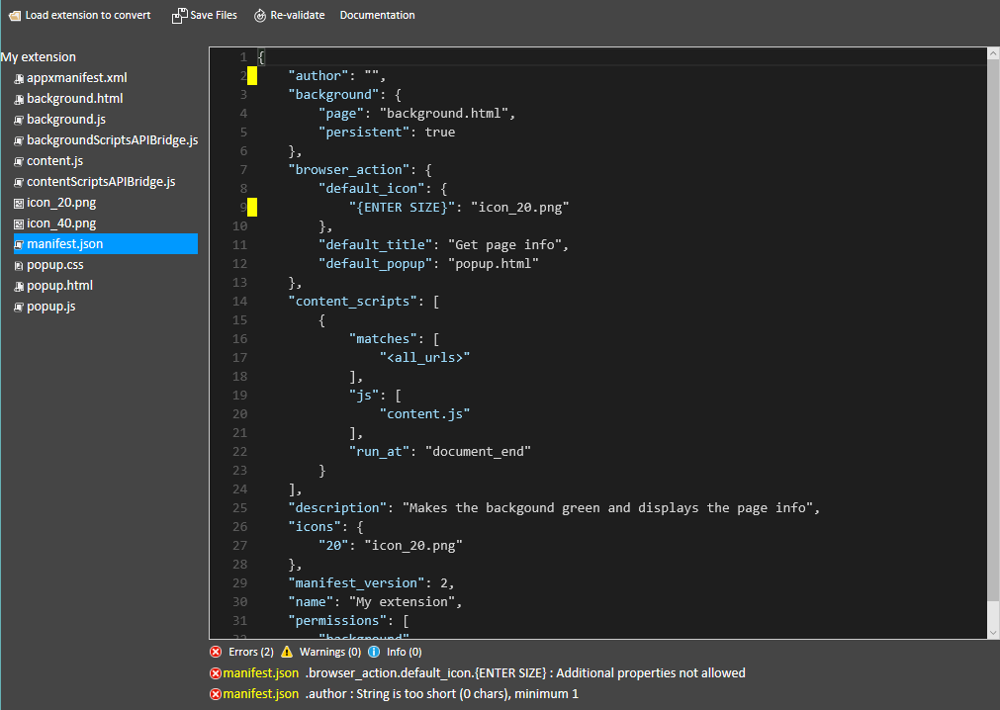

# Porting an extension from Chrome to Microsoft Edge  

[!INCLUDE [deprecation-note](../includes/deprecation-note.md)]  

Porting an extension from Chrome to Microsoft Edge is made easy with the help of the
[Microsoft Edge Extension Toolkit](https://www.microsoft.com/store/p/microsoft-edge-extension-toolkit/9nblggh4txvb). This developer tool converts an unpacked Chrome extension to an unpacked Microsoft Edge extension by bridging APIs and surfacing any errors in your `manifest.json` file.


### API bridges
In order to allow for seamless porting of Chrome APIs to supported Microsoft Edge APIs, two scripts are added to your extension's folder. These scripts bridge APIs (polyfiling where necessary), meaning you won't have to worry about changing any Chrome specific code in your background script or content scripts.

After conversion, you will see them included in the manifest file of your extension with the `"-ms-preload"` key:

```json
"-ms-preload": {
  "backgroundScript": "backgroundScriptsAPIBridge.js",
  "contentScript": "contentScriptsAPIBridge.js"
}
```

## Using the Microsoft Edge Extension Toolkit

The following instructions detail how to convert your Chrome extension to run on Microsoft Edge in the Windows 10 Anniversary Update edition:

1. Install the [Microsoft Edge Extension Toolkit](https://www.microsoft.com/store/p/microsoft-edge-extension-toolkit/9nblggh4txvb).
2. Make a copy of your Chrome extension's folder for safe keeping. The conversion process will overwrite the code. 
3. Run the Microsoft Edge Extension Toolkit and load the copy of your extension.  
 
4. Correct all the errors that are reported within the tool's text editor. Select "Re-validate" to check for errors after making corrections.  
 
5. Select "Save files".

You can now exit out of the toolkit and load your extension in Microsoft Edge! 

You can search for known platform issues with the [EdgeHTML issue tracker](http://issues.microsoftedge.com). If you think you've found something new, [open an issue](https://developer.microsoft.com/microsoft-edge/platform/issues/new/)!
