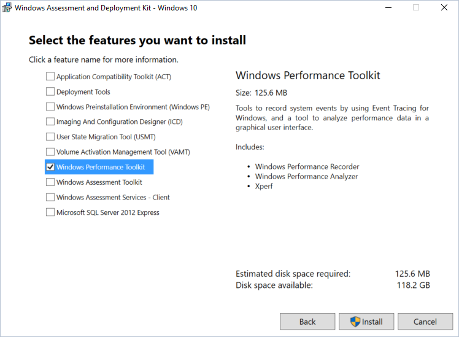
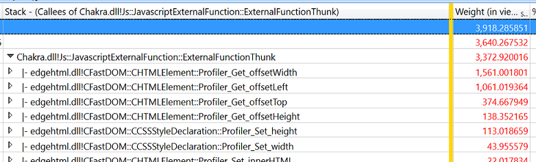

# Performance Analysis  

If you're new to performance, you should check out the [F12 DevTools guide](../devtools-guide/index.md).
The [F12 tools](../devtools-guide/index.md) built into Microsoft Edge can be used to analyze the general performance of a web site.  It provides similar (but more limited) capabilities to the [Windows Performance Toolkit](/windows-hardware/test/wpt/index) from right within the browser.  

If you want a deeper analysis of browser performance, the Microsoft Edge team uses the [Windows Performance Toolkit](/windows-hardware/test/wpt/index) (WPT).  WPT was created by the Windows team to conduct in-depth program performance analysis.  It straddles the boundaries between website JavaScript and Microsoft Edge native code, allowing both to be viewed within the same tool.  WPT can be used to:  

*   Measure CPU time taken for software to complete work  
*   Calculate the memory allocated by software  
*   Show the details of downloading files from remote servers  
*   Measure frame rate.  

To get started with using the Windows Performance Toolkit to analyze your website, you'll first need to download the [Windows 10 Assessment and Deployment Kit (ADK)](https://developer.microsoft.com/windows/hardware/windows-assessment-deployment-kit).  Select the *Windows Performance Toolkit* option during installation:  

  

Here we'll cover how to record and analyze a performance trace.  
To learn more about what's included in the Windows Performance Toolkit, check out the full [WPT documentation](/windows-hardware/test/wpt/index).  

## Recording a trace  

Next, set up your user scenario and prepare to gather a trace using Windows Performance Recorder.  
Here's how to profile your web scenario with the *Windows Performance Recorder (WPR)*.  

### 1.  Prepare your environment to gather a performance trace  

Shut down as many running programs as possible to avoid noise in the trace that you're about to record.  Ideally, the only running software will be Windows Performance Recorder (WPR) and the browser.  

### 2.  Launch Windows Performance Recorder (WPR) and select options  

Launch the Windows Performance Recorder and ensure that **More options** toggle is expanded.  Select the *Edge Browser* and *HTML Responsiveness* scenario analysis checkboxes.  

  

#### Tips and tricks for gathering traces  

*   Try to keep background activity to an absolute required minimum.  Background processes may skew both perceived performance and actual performance characteristics and affect the results.  Ideally there are no other running applications beside browser and WPR.  
*   Identify the scenarios you're analyzing and try to keep them as atomic as possible.  For example, if your site has performance problems when loading the page, scrolling, and selecting something in a table, separate the issues into three scenarios:  
    *   Page load (from start of navigation to page load complete)  
    *   Scroll  
    *   Selecting something in the table  
*   If a scenario involves navigating to a site, consider beginning the scenario at about:blank.  Starting at about:blank will avoid the overhead of the previous page.  If it involves navigating away from a site, navigate to about:blank to complete the scenario.  This will keep the noise of other sites out of the trace unless the specific interaction between sites is the issue under investigation.  

### 3.  Record the scenario  

Click **Start** to begin recording.  The tool will report the size of the buffer it is using to help you anticipate the size of the generated file.  Perform the user scenario you want to measure, then click **Save** to stop the recording and save the trace.  Saving immediately after finishing your scenario will help minimize the size of the trace file.  

  

The WPR tool will indicate that your trace information was saved successfully:  

  

## Analyzing a trace  

Now that you've gathered your performance data, you can analyze the trace using Windows Performance Analyzer to see what optimizations can be made.  
Here's how to analyze your web scenario performance data.  

### 1.  Open Windows Performance Analyzer (WPA)  

Launch Windows Performance Analyzer and open the `.etl` file to be analyzed (**File** > **Open...**).  

### 2.  Load symbols and apply the *HTML analysis* profile  

> [!WARNING]
> Loading symbols for the first time will require a large download and will take a significant amount of time on a typical internet connection.  

Load your symbols by selecting **Trace** > **Load Symbols** from the menu.  The symbols will be cached to disk and future traces will load symbols much faster.  

You can load symbols significantly faster by restricting the loading to Microsoft Edge and the web apps host.  Select **Trace** > **Configure Symbols** and restrict the **Load Settings** to only `MicrosoftEdgeCP.exe` and `WWAHost.exe`.  

  

After symbols begin loading, apply the *Html Analysis Profile* (**Profiles** > **Apply...** > **Browse Catalog...** > **HtmlResponsivenessAnalysis.wpaProfile**)  
The profile will load several graphs and tables for your analysis.  For nearly all website investigations, we recommend starting with this profile.  

  

#### The Html Responsiveness Analysis Profile  

The *Html Responsiveness* analysis profile provides four tabs:  

**Big Picture** - This is useful for confirming that there are no unexpected sources of CPU activity and the browser is indeed using all available resources.  Check your CPU usage and verify that no processes contribute significantly to CPU usage other than the browser.  

**Frame Analysis** - This section is used for basic analysis.  The *CPU Usage (Attributed)* graph enables a quick glance for understanding of the subsystems responsible for CPU usage.  Breaking down the samples in the *CPU Usage (Sampled)* table on the *HTML UI Thread* is helpful for identifying critical performance bottlenecks.  

**Trace Markers** - This section shows all tracing markers coming from the browser (Microsoft Edge), including *msWriteProfilerMark*, which provides precise points for measuring code.  To see *msWriteProfilerMark* tracing, scroll down to the  *Generic Events* graph and select **HTML msWriteProfilerMark** from the drop-down menu.  

**Thread Delay Analysis** - This tab is often used by Microsoft Edge developers to investigate when one thread is blocked and waiting on another.  On rare occasions it might also be useful to web developers.  

### 3.  Zoom to remove trace rundown  

You can focus your analysis by removing the empty trailing *Trace Rundown* sections of your graphs.  From any of the graphs currently showing:  
*   Left-click at the start of the graph data you wish to investigate  
*   Hold, drag and release to select the desired region  
*   Right-click and select **Zoom**  

The zoom will apply to all graphs and charts on the active tab.  

  

### 4.  Investigate what's taking up CPU cycles  

 The **CPU Usage (Sampled)** table in the **Frame Analysis** tab is where most of your analysis will likely happen.  You can expand the various processes to identify the most compute intensive JavaScript and browser code.  Often a single bit of JavaScript is responsible for a performance issue, and taking the time to optimize it can make a significant difference.  

### 5.  Drill into any slow-running JavaScript code  

Bottom up DOM call analysis can be useful for identifying the JavaScript responsible for taking up the majority of time during the scenario.  This is especially helpful when many top level calls are re-using the same JavaScript libraries.  

Start by looking at *CPU Usage (Sampled) Breakdown by Process, Thread, Activity, Stack*.  Click on any cell in **Stack** column.  Press *Ctrl+F* and search for *ExternalFunctionThunk*.  

> [!NOTE] 
> This only works if you have successfully loaded symbols.  

  

Investigate any lines with *ExternalFunctionThunk*.  This is the interface from the Chakra JavaScript engine to the Microsoft Edge engine.  It shows where code bridges from the browser to JavaScript execution.  Right-click on the line and select **View Callees** > **By Module** to see a weighted list of longest running browser engine functions.  

  

To identify all the JavaScript calling a specific API, right-click on it and select **View Callers** > **By Function** and expand the tree to view and compare the relative weights.  
