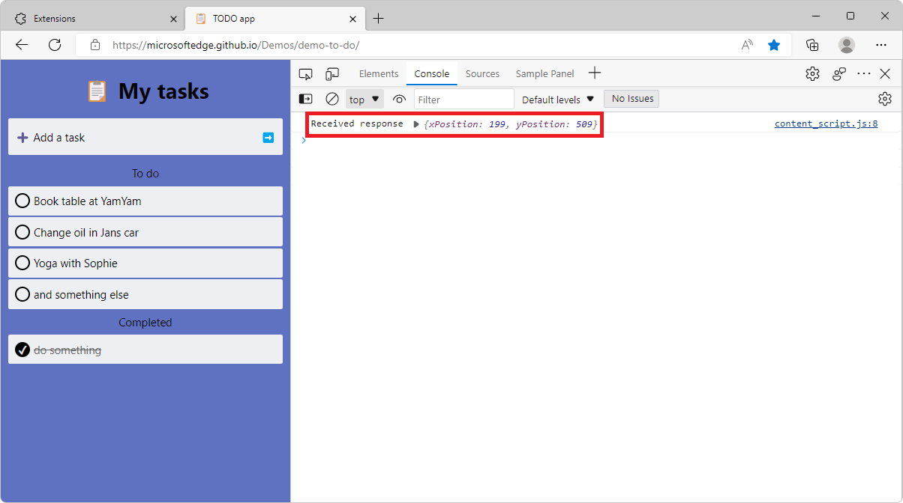

# Create a DevTools extension

This tutorial shows you how to build your own DevTools extension from scratch. It is a good way to experience what goes into a typical DevTools extension. At the end of the tutorial, you should have a working DevTools extension that creates its own panel and interacts with the DevTools extension APIs.

First please review the prerequisites. Then download and run the final extension from the [Solution](#solution) section to see what you will be building in this tutorial. Otherwise, start at the [Step 1 - Create a Basic DevTools Extension](#step-1---create-a-basic-devtools-extension) section to build the extensions from scratch.


<!-- ====================================================================== -->
## Prerequisites

* [Microsoft Edge Browser](https://www.microsoft.com/edge) to run the extension.
* A code editor such as [Visual Studio Code](https://code.visualstudio.com/) to follow along with the tutorial.
* Knowledge of [GitHub](https://github.com/) to download the code presented in this tutorial.


<!-- ====================================================================== -->
## Solution

In this section, you download and run the final state of the extension that the rest of this tutorial will teach you to build. Later, you will start from scratch and learn to write the code to create your own extension.

1. Get the final extension code by [downloading this zip file](https://codeload.github.com/MicrosoftEdge/Demos/zip/refs/heads/main) and extracting its content to a folder on your computer.

1. Open Microsoft Edge and navigate to the `edge://extensions/` page.

1. Make sure that **Developer mode** is enabled.

1. Click **Load unpacked** and navigate to the folder where you extracted the zip file. In this folder, select **Demos-main** > **devtools-extension** > **sample 4**, and then click **Select Folder**.

Your DevTools extension should now be loaded. Open a new tab in Microsoft Edge then open DevTools by pressing `F12`.

The extension creates a `Sample Panel` in the DevTools window, and displays some information by using CDP APIs available to Microsoft Edge extensions.


<!-- ====================================================================== -->
## Step 1 - Create A Basic DevTools Extension

A basic DevTools extension consists of 2 files, as shown in the [Step 1 code](https://github.com/MicrosoftEdge/Demos/tree/main/devtools-extension/sample%201):

1. A manifest file.

    ```json
    {
        "name": "DevTools Sample Extension",
        "description": "A Basic DevTools Extension",
        "manifest_version": 3,
        "version": "1.0",
        "devtools_page": "devtools.html"
    }
    ```

    | Property | Description |
    |----------|-------------|
    | name | The name of the extension that will appear under `edge://extensions/` |
    | description | The description of the extension that will be displayed under the name of the extension |
    | version | The version of the extension that will appear next to the name of the extension |
    | manifest_version | Determines the feature set that the extension will be using.  This includes Service workers, Network request modification, etc. The current version is version `3`. To learn more about this version and the differences with version `2`, see [Overview and timelines for migrating to Manifest V3](./manifest-v3) |
    | devtools_page | The path to an HTML file that will be executed every time the DevTools UI is opened. Though the page is not rendered, it will be used to load the necessary JavaScript files for the extension. |

1. An html file to match the `devtools_page` field in the manifest file.

    ```html
    <!DOCTYPE html>
    <html>
      <head>
        <meta charset="UTF-8" />
      </head>
      <body>
        A Basic DevTools Extension.
      </body>
    </html>
    ```

To load and test your DevTools extension in Microsoft Edge, use the **Developer mode**:

1. Open Microsoft Edge and navigate to the `edge://extensions/` page.

1. Make sure that **Developer mode** is enabled.

1. Click **Load unpacked**, navigate to the folder where you wrote the code for your extension, and click **Select folder**.

Your DevTools extension should now be loaded. Open a new tab and then open DevTools (`F12`).

Your  extension is loaded but invisible in DevTools because you have not created a panel for the extension yet.


<!-- ====================================================================== -->
## Step 2 - Add a DevTools Panel

In this step, you will create a new panel in DevTools. You can find the code for this step here: [Step 2 code](https://github.com/MicrosoftEdge/Demos/tree/main/devtools-extension/sample%202), or write it yourself by following the instructions below.

A panel is a top level tab in DevTools such as **Elements**, **Sources**, or **Console** as shown below. In this step, we will create a basic DevTools extension with a sample panel.


1. Create a `devtools.js` file with the following contents

    ```javascript
    chrome.devtools.panels.create("Sample Panel", "icon.png", "panel.html", panel => {
        // code invoked on panel creation
    });
    ```

    The method requires four parameters: `title`, `iconpath`, `pagePath`, and a callback function. Note that while the panel's icon is a required parameter, it does not get displayed in Microsoft Edge DevTools currently.

    To learn more about the `chrome.devtools.panels` extension API, see [the chrome.devtools.panels API reference](https://developer.chrome.com/docs/extensions/reference/devtools_panels/).

1. Load the file from the HTML page specified in the `devtools_page` manifest field earlier (the `devtools.html` file), by adding a `script` element in the source code.

    ```html
    <!DOCTYPE html>
    <html>
      <head>
        <meta charset="UTF-8" />
      </head>
      <body>
        <script src="devtools.js"></script>
      </body>
    </html>
    ```

1. Create the `panel.html` file the you referenced in the previous `chrome.devtools.panels.create` method call. This webpage will contain the user interface of the panel your extension is adding to DevTools.

    ```html
    <!DOCTYPE html>
    <html>
      <head>
        <meta charset="UTF-8" />
      </head>
      <body>
        <h1>A Basic DevTools Extension with Panel</h1>
      </body>
    </html>
    ```

To test your changes in Microsoft Edge, reload your extension from the `edge://extensions/` page:

1. Navigate (or go back) to the `edge://extensions/` page.

1. Find the unpacked extension entry you loaded in step 1.

1. Click **Reload**.

Your DevTools extension should now be reloaded. Open a new tab and then open DevTools (`F12`). Your DevTools extension panel should be displayed in DevTools:


<!-- ====================================================================== -->
## Step 3 - Invoking CDP APIs from a DevTools Extension

In this step, you will use CDP APIs to display memory information in your DevTools panel.  To do this, we will need to update the `permissions` in the manifest file, the panel interface, and the devtools script. The source code for this step can be found in [Step 3 code](https://github.com/MicrosoftEdge/Demos/tree/main/devtools-extension/sample%203), or write it yourself by following the instructions below.

1. Use the `permissions` manifest member in your `manifest.json` file. This member defines which permissions your extension requires from the user. Some permissions are needed to use certain CDP APIs.

    ```json
    "permissions": [
      "system.memory",
    ]
    ```

    The `system-memory` permission is required to use extension APIs we will use later in this tutorial. To learn more about the available APIs and associated permissions, see [the API reference](https://developer.chrome.com/docs/extensions/reference/).

1. Add the following to the body in the `panel.html` file to display the data in the panel.

    ```html
    <div>
      Available Memory Capacity: <span id="availableMemoryCapacity"></span>
    </div>
    <div>
      Total Memory Capacity: <span id="totalMemoryCapacity"></span>
    </div>
    ```

1. Update the `devtools.js` file with the following code.

    ```javascript
    let availableMemoryCapacity;
    let totalMemoryCapacity;

    chrome.devtools.panels.create("Sample Panel", "icon.png", "panel.html", panel => {
        // code invoked on panel creation
        panel.onShown.addListener((extPanelWindow) => {
            availableMemoryCapacity = extPanelWindow.document.querySelector('#availableMemoryCapacity');
            totalMemoryCapacity = extPanelWindow.document.querySelector('#totalMemoryCapacity');
        });
    });

    setInterval(() => {
        chrome.system.memory.getInfo((data) => {
            if (availableMemoryCapacity) {
                availableMemoryCapacity.innerHTML = data.availableCapacity;
            }
            if (totalMemoryCapacity) {
                totalMemoryCapacity.innerHTML = data.capacity;
            }
        });
    }, 1000);
    ```

The above code snippet does the following:

1. It creates a new panel `Sample Panel` in DevTools.
1. When the panel is displayed (`panel.onShown` listener), the `availableMemoryCapacity` and `totalMemoryCapacity` elements are retrieved from the DOM.
1. Next, a timer is set to execute code every second after the panel is shown.
1. When the timer fires, the `chrome.system.memory.getInfo` method is used to retrieve the available and total memory capacity of the device and these values are displayed in the corresponding DOM elements.

To test your changes in Microsoft Edge, reload your extension from the `edge://extensions/` page:

1. Navigate (or go back) to the `edge://extensions/` page.

1. Find the unpacked extension entry you loaded in step 1.

1. Click **Reload**.

Your DevTools extension should now be reloaded. Open a new tab and then open DevTools (`F12`). Your DevTools extension panel should now show the available and total memory capacities.


More CDP APIs can be found in the [API Reference](https://developer.chrome.com/docs/extensions/reference/) page.


<!-- ====================================================================== -->
## Step 4 - Interacting with the Inspected Webpage

In this step of the tutorial, you will add code that interacts with the inspected webpage. That code will:

1. Listen to click events that happen on the webpage and log them into the DevTools **Console** tool.
1. Show the mouse click position in the DevTools extension panel.
1. Show a greeting alert in the inspected page when user clicks a button in the DevTools extension panel.

The source code for this step can be found in [Step 4 code](https://github.com/MicrosoftEdge/Demos/tree/main/devtools-extension/sample%204), or write it yourself by following the instructions below.

Unfortunately, the DevTools panel you just created does not have direct access to the inspected webpage and does not run until DevTools is opened. For this you will use a content script and a background service worker.

* A content script runs in the context of the inspected webpage and, in the same way other scripts are loaded by the page, they have access to the DOM and can change it.
* A background service worker is a script that the browser runs in a separate thread and has access to extension APIs.

The following diagram gives an overview of how the DevTools page, inspected page, content script, and background service worker fit together in an extension.


In this part of the tutorial, you will detect the user clicks on a webpage using a content script.  The content script will relay this info to the `devtools.js` file where the data will be displayed in both the console and the DevTools extension panel.

1. Append the following to the `manifest.json` file

    ```json
    "content_scripts": [{
      "matches": [
        "http://*/*",
        "https://*/*"
      ],
      "run_at": "document_idle",
      "js": [
        "content_script.js"
      ]
    }],
    "background": {
        "service_worker": "background.js"
    }
    ```

    | Property | Value |
    |----------|-------|
    | matches | Specifies which pages this content script will be injected into |
    | run_at | Indicates when the browser injects the script onto the page |
    | js | The javascript files to be injected |

1. Create the file `content_script.js` with the following content:

    ```javascript
    document.addEventListener("click", (event) => {
      chrome.runtime.sendMessage({
          click: true,
          xPosition: event.clientX + document.body.scrollLeft,
          yPosition: event.clientY + document.body.scrollTop
        },
        response => {
          console.log("Received response", response);
        }
      );
    });
    ```

    The above code snippet prints a message to the console when the script is injected in the page. It also adds a click event listener to the page that will send a message with mouse click position in the inspected page by using the `chrome.runtime.sendMessage` API.

1. In the `panel.html` file, add a `sayHello` button and a `youClickedOn` label . These two items are used to demo the interaction between the inspected page, the DevTools panel, and the background service worker. When the user clicks the `sayHello` button in the DevTools extension, it will display a greeting message in the inspected window. When the user clicks anywhere in the inspected page, it will display a message to show the mouse click position in the DevTools extension panel.

    ```html
    <button id="sayHello">Say Hello to The Inspected Page!</button>
    <h2><span id="youClickedOn"></span></h2>
    ```

1. In the `devtools.js` file, use the `chrome.runtime.connect` method to create a connection to the background service worker, then send the inspected window `tabId` to the service worker with the `backgroundPageConnection.postMessage` method. Finally, add event listeners to the `sayHello` button and `youClickedOn` label defined in the  `panel.html` file.

    ```javascript
    let youClickedOn; 
    chrome.devtools.panels.create("Sample Panel", "icon.png", "panel.html", panel => {
        // code invoked on panel creation
        panel.onShown.addListener( (extPanelWindow) => {
            let sayHello = extPanelWindow.document.querySelector('#sayHello');
            youClickedOn = extPanelWindow.document.querySelector('#youClickedOn');
            sayHello.addEventListener("click", () => {
                // show a greeting alert in the inspected page
                chrome.devtools.inspectedWindow.eval('alert("Hello from the DevTools Extension");');
            });             
        });
    });

    chrome.runtime.onMessage.addListener((request, sender, sendResponse) => {
        // Messages from content scripts should have sender.tab set
        if (sender.tab && request.click == true) {
            console.log('I am here!');
            if (youClickedOn) {
                youClickedOn.innerHTML = `You clicked on position (${request.xPosition}, ${request.yPosition}) in the inspected page.`;
            }
            sendResponse({
                xPosition: request.xPosition,
                yPosition: request.yPosition
            });
        }
    });

    // Create a connection to the background service worker
    const backgroundPageConnection = chrome.runtime.connect({
        name: "devtools-page"
    });

    // Relay the tab ID to the background service worker
    backgroundPageConnection.postMessage({
        name: 'init',
        tabId: chrome.devtools.inspectedWindow.tabId
    });
    ```

    When the user clicks the `sayHello` button, the DevTools extension will execute a code snippet of `alert("Hello from the DevTools Extension");` in the inspected window by invoking the `eval()` method of the inspected window `chrome.devtools.inspectedWindow`.

    When the user clicks anywhere in the inspected window, the DevTools extension will get a message, from the background service worker, with `request.click == true` and the mouse position information.

1. Create the `background.js` file and add the following code to it.

    ```javascript
    let id = null;
    const connections = {};

    chrome.runtime.onConnect.addListener(devToolsConnection => {
        // Assign the listener function to a variable so we can remove it later
        let devToolsListener = (message, sender, sendResponse) => {
            if (message.name == "init") {
                id = message.tabId;
                connections[id] = devToolsConnection;
                // Send a message back to DevTools
                connections[id].postMessage("Connected!");
            }
        };

        // Listen to messages sent from the DevTools page
        devToolsConnection.onMessage.addListener(devToolsListener);

        devToolsConnection.onDisconnect.addListener(() => {
            devToolsConnection.onMessage.removeListener(devToolsListener);
        });
    });
    ```

    The above code snippet connects the background service worker with the DevTools page. It listens to when the DevTools page connects, saves the connection, and sends a response back to the DevTools page.

    This is useful when your background service worker is collecting data or performing tasks in the background that you want to be available in your DevTools extension.

To test the new `sayHello` button:

1. Navigate (or go back) to the `edge://extensions/` page.

1. Find the unpacked extension entry you loaded in step 1.

1. Click **Reload**.

1. Open a new browser tab, open DevTools (`F12`), and click **Sample panel**.

1. Click the `"Say Hello to The Inspected Page!"` button in your panel. You should see an alert in the inspected page, as shown below.

    

To learn more about content scripts, see [the Content Scripts documentation](https://developer.chrome.com/docs/extensions/mv3/content_scripts/).

To test the `youClickedOn` label:

1. Reload your extension as before, open a new browser tab, and open DevTools again.

1. Click anywhere in the inspected page, you should see a **You clicked on position (x,y) in the inspected page** message similar to the image below.

    

    You should also see a message in the DevTools **Console** tool.

    


<!-- ====================================================================== -->
## Conclusion

In this tutorial, you learned how to create DevTools extensions from scratch and load them into the browser.  You extended DevTools by creating a new panel to display memory information using APIs available to Microsoft Edge extensions.  And then you added a content script to detect the mouse clicks on a webpage, and sent that information to DevTools. Finally, you learned how to send and receive messages between a background service worker and DevTools. The background service worker is able to track the mouse clicks in the background and log outputs in the DevTools console.


<!-- ====================================================================== -->
## See also

* [Manifest V3](https://developer.chrome.com/docs/extensions/mv3)
* [Extending DevTools](https://developer.chrome.com/docs/extensions/mv3/devtools/)
* [CDP API Reference](https://developer.chrome.com/docs/extensions/reference/)
