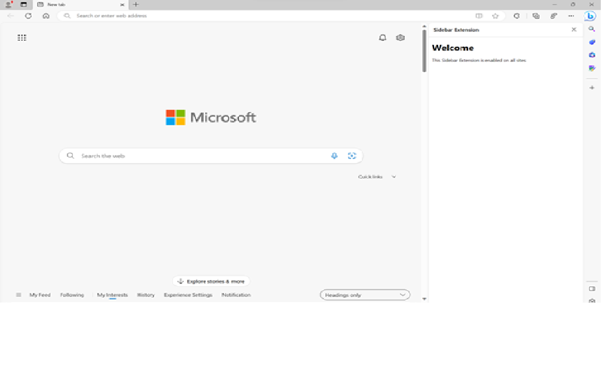
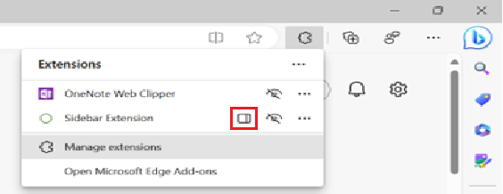
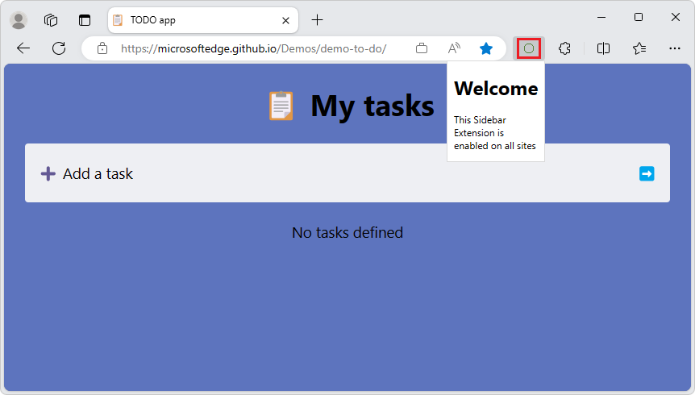
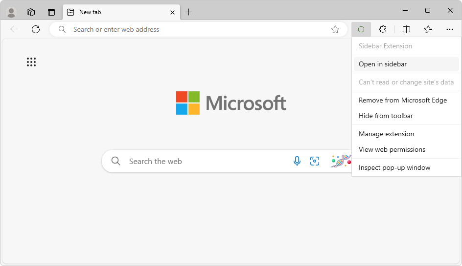
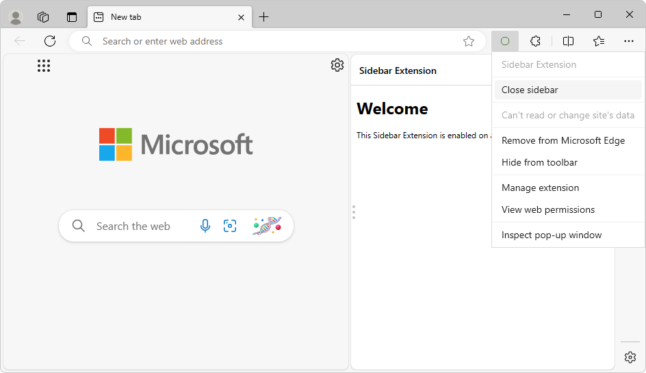
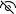

# Extensions in the Microsoft Edge sidebar

As a Microsoft Edge extension developer, use this article to make your new or existing Microsoft Edge extension appear in the sidebar.  Any extension can use the sidebar in addition to its other UI.



Note: The sidebar extensions feature is being rolled out to a growing user base for all channels of Microsoft Edge.<!-- todo: after rollout is complete, delete sentence -->

By using the Sidebar API for extensions, you can enhance the browsing experience by enabling users to view additional information alongside the main content of a webpage.

The _sidebar_ is a persistent pane located on the side of the browser, which coexists with the primary content of the browser.  The sidebar reduces the need to constantly switch between tabs, resulting in a more productive browsing experience.

Extensions can optionally use the sidebar API to show a custom UI in the Microsoft Edge sidebar.  Extensions can continue appearing in the Microsoft Edge toolbar along with a UI such as popups, and can inject scripts, for example.


<!-- ------------------------------ -->
#### Terminology

| Term | Definition |
|---|---|
| Sidebar API | Name of the feature that you can use in your Microsoft Edge extensions.  Chrome docs use the term _side panel_. |
| `sidePanel` or `side_panel` | Name of the API and permission to enable any extension as a sidebar extension. |
| Sidebar extension | A Microsoft Edge extension that has a UI in the sidebar. |


<!-- ====================================================================== -->
## Features of the Sidebar API

Features of the Sidebar API include:

* The sidebar remains open while navigating between tabs.

* An extension in the sidebar can be made available for specific websites.

* An extension in the sidebar has access to all of the [Supported APIs for Microsoft Edge extensions](./api-support.md).


<!-- ====================================================================== -->
## Origin

As with other extension resources, the sidebar page commits to a trusted extension context on its origin (`extension://<id>`).  The sidebar has the same API access as other trusted extension contexts.

All the existing extensions APIs are available for sidebar extensions, so you can leverage all current capabilities of the extensibility framework in your sidebar-enabled extension.


<!-- ====================================================================== -->
## Add the sidePanel permission in the extension's manifest file

To use the Sidebar API, add a permission in your `manifest.json` file.  Include the `sidePanel` permission in the extension's `manifest.json` file:

```json
{
  ...
  "name": "My sidebar extension",
  ...
  "side_panel": {
    "default_path": "sidebar.html"
  },
  "permissions": [
    "sidePanel"
  ]
   ...
}
```

Every extension for Microsoft Edge has a JSON-formatted manifest file, named `manifest.json`.  The manifest file is the blueprint of your extension.

See also:
* [Manifest file format for extensions](../getting-started/manifest-format.md)


<!-- ====================================================================== -->
## Use cases for the Sidebar API

The following sections demonstrate some common use cases for the Sidebar API.


<!-- ------------------------------ -->
#### Display the same sidebar on every site

A sidebar can be set as the default, to show the same extension throughout all the open browser tabs.  Default values persist across browser sessions.

In `manifest.json`, define the `"default_path"` key, such as `"sidebar.html"`:

```json
{
  "name": "My sidebar extension",
  ...
  "side_panel": {
    "default_path": "sidebar.html"
  }
  ...
}
```

The file you specified as the default, such as `sidebar.html`, appears in all the open browser tabs:

```html
<!DOCTYPE html>
<html>
  <head>
    <title>My Sidebar</title>
  </head>
  <body>
    <h1>Sidebar extension for all sites</h1>
    <p>This sidebar is enabled on all sites</p>
  </body>
</html>
```


<!-- ------------------------------ -->
#### Enable a sidebar for a specific site only

An extension can use [sidepanel.setOptions()](https://developer.chrome.com/docs/extensions/reference/sidePanel/#method-setOptions) to enable a sidebar on a specific tab.  This can be a particular website, so the extension opens in the sidebar when the user goes to this website.

This example uses [chrome.tabs.onUpdated()](https://developer.chrome.com/docs/extensions/reference/tabs/#event-onUpdated) to listen for any updates made to the tab.  It checks whether the URL is `www.bing.com` and if so, enables the sidebar.  Otherwise, it disables the sidebar.

In `service-worker.js`, in `addListener()`, test `url.origin` to see if it's the desired tab, and then in `sidePanel.setOptions()`, set `enabled` to `true` or `false`:

```js
const BING_ORIGIN = 'https://www.bing.com';

chrome.tabs.onUpdated.addListener(async (tabId, info, tab) => {
  if (!tab.url) return;
  const url = new URL(tab.url);
  // Enables the sidebar when at bing.com
  if (url.origin === BING_ORIGIN) {
    await chrome.sidePanel.setOptions({
      tabId,
      path: 'sidepanel.html',
      enabled: true
    });
  } else {
    // Disables the sidebar when at other sites
    await chrome.sidePanel.setOptions({
      tabId,
      enabled: false
    });
  }
});
```

When a user switches to a tab or site for which the sidebar is not enabled, the sidebar is hidden.

For a complete example, see [Site-specific side panel example](https://github.com/GoogleChrome/chrome-extensions-samples/tree/main/functional-samples/cookbook.sidepanel-site-specific).


<!-- ------------------------------ -->
#### Enable the extension's shortcut icon to open the sidebar

To allow users to open the sidebar by clicking the action toolbar icon, use [sidePanel.setPanelBehavior()](https://developer.chrome.com/docs/extensions/reference/sidePanel/#method-setPanelBehavior).  First, declare the `"action"` key in `manifest.json`:

```json
{
  "name": "My sidebar extension",
  ...
   "action": {
    "default_title": "Click to open sidebar"
  },
  ...
}
```

Then, add the following code to the `service-worker.js` code listing that's in [Enable a sidebar for a specific site only](#enable-a-sidebar-for-a-specific-site-only), above:

```js
// Allow users to open the sidebar by clicking the action toolbar icon
chrome.sidePanel
  .setPanelBehavior({ openPanelOnActionClick: true })
  .catch((error) => console.error(error));
```


<!-- ------------------------------ -->
#### Switch to a different sidebar

An extension can use [sidepanel.getOptions()](https://developer.chrome.com/docs/extensions/reference/sidePanel/#method-getOptions) to retrieve the current sidebar, and then enable a different sidebar for a specific tab.

This example sets a sidebar containing a welcome message on [runtime.onInstalled()](https://developer.chrome.com/docs/extensions/reference/runtime/#event-onInstalled).  When the user navigates to a different tab, the sidebar is replaced with the browser-level sidebar.

```js
// service-worker.js:
const welcomePage = 'sidebar/welcome-sb.html';
const mainPage = 'sidebar/main-sb.html';

chrome.runtime.onInstalled.addListener(() => {
  chrome.sidePanel.setOptions({ path: welcomePage });
});

chrome.tabs.onActivated.addListener(async ({ tabId }) => {
  const { path } = await chrome.sidePanel.getOptions({ tabId });
  if (path === welcomePage) {
    chrome.sidePanel.setOptions({ path: mainPage });
  }
});
```


<!-- ------------------------------ -->
#### Opening the sidebar upon user interaction

[sidePanel.open()](https://developer.chrome.com/docs/extensions/reference/sidePanel/#method-open) allows extensions to open the sidebar through a user gesture, such as clicking the action icon, or through any user interaction on an extension page or content script, such as clicking a button.

The following code shows how to open a global sidebar on the current window when the user clicks on a context menu.  When using `sidePanel.open()`, choose the context in which the sidebar should open:
* Use `windowId` to open a global sidebar, as shown in the following example.
* Or, set the `tabId` to open the sidebar only on a specific tab.

```js
// service-worker.js:
chrome.runtime.onInstalled.addListener(() => {
  chrome.contextMenus.create({
    id: 'openSidePanel',
    title: 'Open sidebar',
    contexts: ['all']
  });
});

chrome.contextMenus.onClicked.addListener((info, tab) => {
  if (info.menuItemId === 'openSidePanel') {
    // Open the sidebar in all the tabs of the current window.
    chrome.sidePanel.open({ windowId: tab.windowId });
  }
});
```


<!-- ====================================================================== -->
## Sidebar extensions user experience

Extensions in the Microsoft Edge sidebar have these user experience (UX) features.


<!-- ------------------------------ -->
#### Opening the extension in the sidebar

There are several ways for the user to open the extension in the sidebar:


<!-- ---------- -->
###### By clicking an icon

Users can click the **Open in sidebar** icon (), which is displayed next to the extension's name in the Extensions hub:



Or, users can click the extension's custom icon in the toolbar, if it's enabled.  This user experience requires that the extension has enabled the shortcut icon to open the sidebar, as described in [Enable the extension's shortcut icon to open the sidebar](#enable-the-extensions-shortcut-icon-to-open-the-sidebar), above.  In this example, the extension's custom icon is a circle ():




<!-- ---------- -->
###### By right-clicking the extension's icon

Users can right-click the extension's icon in the toolbar, and then select **Open in sidebar** or **Close sidebar**:





The extension's icon appears in the toolbar if the user has clicked the **Show in toolbar** () icon next to the extension's name in the Extensions hub.


<!-- ---------- -->
###### By pressing a keyboard shortcut

Users can press a keyboard shortcut, if the action command is enabled and the action icon is enabled to open the sidebar.

* To enable the action command, see [Action commands](https://developer.chrome.com/docs/extensions/reference/commands/#action-commands) in _chrome.commands_ in API reference.
* To enable the action icon, see [Open the side panel by clicking the toolbar icon](https://developer.chrome.com/docs/extensions/reference/sidePanel/#open-action-icon) in _chrome.sidePanel_ in API reference.

If the `openPanelOnActionClick()` property of the [PanelBehavior](https://developer.chrome.com/docs/extensions/reference/sidePanel/#type-PanelBehavior) type is set to `true`, the user can open the sidebar by using a keyboard shortcut.  To enable this, you specify an action command in the manifest.


<!-- ---------- -->
###### Open through a gesture

The sidebar can also be opened through the following interactions:

* Open the sidebar by an extension user gesture, such as clicking the action icon.  This approach uses [sidePanel.open()](https://developer.chrome.com/docs/extensions/reference/sidePanel/#method-open).  See [Opening the sidebar upon user interaction](#opening-the-sidebar-upon-user-interaction), above.

* Open the sidebar by clicking the toolbar icon.  This approach uses [sidePanel.setPanelBehavior()](https://developer.chrome.com/docs/extensions/reference/sidePanel/#method-setPanelBehavior).  See [By clicking an icon](#by-clicking-an-icon) in section "Opening the extension in the sidebar", above.


<!-- ====================================================================== -->
## Extension samples

For more Sidebar API extensions demos, explore any of the following extensions:

* [Dictionary side panel example](https://github.com/GoogleChrome/chrome-extensions-samples/tree/main/functional-samples/sample.sidepanel-dictionary)
* [Global side panel example](https://github.com/GoogleChrome/chrome-extensions-samples/tree/main/functional-samples/cookbook.sidepanel-global)
* [Multiple side panels example](https://github.com/GoogleChrome/chrome-extensions-samples/tree/main/functional-samples/cookbook.sidepanel-multiple)
* [Opening the side panel through a user interaction](https://github.com/GoogleChrome/chrome-extensions-samples/tree/main/functional-samples/cookbook.sidepanel-open)
* [Site-specific side panel example](https://github.com/GoogleChrome/chrome-extensions-samples/tree/main/functional-samples/cookbook.sidepanel-site-specific)


<!-- ====================================================================== -->
## Types and methods

See [Types](https://developer.chrome.com/docs/extensions/reference/sidePanel/#type) and [Methods](https://developer.chrome.com/docs/extensions/reference/sidePanel/#method) in the _chrome.sidePanel_ API reference page at `developer.chrome.com`.


<!-- ====================================================================== -->
## See also

* [Supported APIs for Microsoft Edge extensions](../developer-guide/api-support.md)
* [Declare API permissions in extension manifests](../developer-guide/declare-permissions.md)
* [Manifest file format for extensions](../getting-started/manifest-format.md)
* [Create an extension tutorial, part 1](../getting-started/part1-simple-extension.md)
* [Create an extension tutorial, part 2](../getting-started/part2-content-scripts.md)


<!-- ====================================================================== -->
> [!NOTE]
> Portions of this page are modifications based on work created and [shared by Google](https://developers.google.com/terms/site-policies) and used according to terms described in the [Creative Commons Attribution 4.0 International License](https://creativecommons.org/licenses/by/4.0).
> The original page is found [here](https://developer.chrome.com/docs/extensions/reference/sidePanel/).

[](https://creativecommons.org/licenses/by/4.0)
This work is licensed under a [Creative Commons Attribution 4.0 International License](https://creativecommons.org/licenses/by/4.0).
