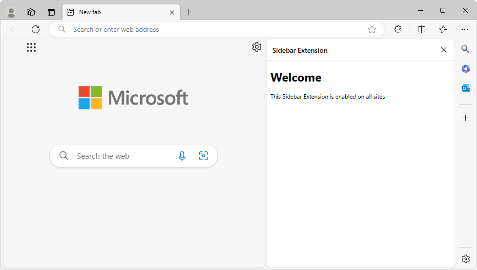

# Extensions in the Microsoft Edge sidebar

<!-- compare https://developer.chrome.com/docs/extensions/reference/sidePanel/ -->

This is a forthcoming feature; sidebar extensions are not yet in a stable release of Microsoft Edge.

As a Microsoft Edge extension developer, use this article to make your new or existing Microsoft Edge extension appear in the sidebar.  Any extension can use the sidebar in addition to its other UI.



By using the Sidebar API for extensions, you can enhance the browsing experience by enabling users to view additional information alongside the main content of a webpage.

The _sidebar_ is a persistent pane located on the side of the browser, which coexists with the primary content of the browser.  The sidebar reduces the need to constantly switch between tabs, resulting in a more productive browsing experience.

Extensions can optionally use the sidebar API to show a custom UI in the Microsoft Edge sidebar.  Extensions can continue appearing in the Microsoft Edge toolbar along with a UI such as popups, and can inject scripts, for example.


<!-- ------------------------------ -->
#### Terminology

| Term | Definition |
|---|---|
| Sidebar API | Name of the feature that you can use in your Microsoft Edge extensions.  Chrome docs use the term _side panel_. |
| `sidePanel` or `side_panel` | Name of the API and permission to enable any extension as a sidebar extension. |
| Sidebar extension | A Microsoft Edge extension that has a UI in the sidebar. |


<!-- ====================================================================== -->
## Features of the Sidebar API

* An extension in the sidebar has access to all of the [Supported APIs for Microsoft Edge extensions](./api-support.md).

* The sidebar remains open while navigating between tabs.

* An extension in the sidebar can be made available for specific sites.

For details on how to create an extension, see:
* [Create an extension tutorial, part 1](../getting-started/part1-simple-extension.md)
* [Create an extension tutorial, part 2](../getting-started/part2-content-scripts.md)


<!-- ====================================================================== -->
## Origin

As with other extension resources, the sidebar page commits to a trusted extension context on its origin (`extension://<id>`).  The sidebar has the same API access as other trusted extension contexts.

All the existing extensions APIs are available for sidebar extensions, so you can leverage all current capabilities of the extensibility framework in your sidebar-enabled extension.

To add a sidebar to your extension, follow the steps below.


<!-- ====================================================================== -->
## Add the sidePanel permission in the extension's manifest file

<!-- compare https://developer.chrome.com/docs/extensions/reference/sidePanel/#manifest -->

To use the Sidebar API, add a permission in your `manifest.json` file.  Include the `sidePanel` permission in the extension's manifest file:

`manifest.json`:

```json
{
  ...
  "name": "My sidebar extension",
  ...
  "side_panel": {
    "default_path": "sidebar.html"
  },
  "permissions": [
    "sidePanel"
  ]
   ...
}
```

Every extension for Microsoft Edge has a JSON-formatted manifest file, named `manifest.json`.  The manifest file is the blueprint of your extension.

See also:
* [Manifest file format for extensions](../getting-started/manifest-format.md)


<!-- ====================================================================== -->
## Use cases for the Sidebar API

<!-- compare https://developer.chrome.com/docs/extensions/reference/sidePanel/#use-cases -->

The following sections demonstrate some common use cases for the Sidebar API.


<!-- ------------------------------ -->
#### Display the same sidebar on every site

<!-- compare https://developer.chrome.com/docs/extensions/reference/sidePanel/#every-site -->

A sidebar can be set as the default, to show the same extension throughout all the open browser tabs.  Default values persist across browser sessions.

`manifest.json`:

```json
{
  "name": "My sidebar extension",
  ...
  "side_panel": {
    "default_path": "sidebar.html"
  }
  ...
}
```

`sidebar.html`:

```html
<!DOCTYPE html>
<html>
  <head>
    <title>My Sidebar</title>
  </head>
  <body>
    <h1>Sidebar extension for all sites</h1>
    <p>This sidebar is enabled on all sites</p>
  </body>
</html>
```


<!-- ------------------------------ -->
#### Enable a sidebar for a specific site only

<!-- compare https://developer.chrome.com/docs/extensions/reference/sidePanel/#by-site -->

An extension can use [sidepanel.setOptions()](https://developer.chrome.com/docs/extensions/reference/sidePanel/#method-setOptions) to enable a sidebar on a specific tab.  This can be a particular website, so the extension opens in the sidebar when the user goes to this website.

This example uses [chrome.tabs.onUpdated()](https://developer.chrome.com/docs/extensions/reference/tabs/#event-onUpdated) to listen for any updates made to the tab.  It checks whether the URL is `www.bing.com` and if so, enables the sidebar.  Otherwise, it disables the sidebar.

`service-worker.js`:

```js
const BING_ORIGIN = 'https://www.bing.com';

chrome.tabs.onUpdated.addListener(async (tabId, info, tab) => {
  if (!tab.url) return;
  const url = new URL(tab.url);
  // Enables the sidebar when at bing.com
  if (url.origin === BING_ORIGIN) {
    await chrome.sidePanel.setOptions({
      tabId,
      path: 'sidepanel.html',
      enabled: true
    });
  } else {
    // Disables the sidebar when at other sites
    await chrome.sidePanel.setOptions({
      tabId,
      enabled: false
    });
  }
});
```

When a user switches to a tab or site for which the sidebar is not enabled, the sidebar is hidden.

For a complete example, see [Site-specific side panel example](https://github.com/GoogleChrome/chrome-extensions-samples/tree/main/functional-samples/cookbook.sidepanel-site-specific).


<!-- ------------------------------ -->
#### Enable the extension's shortcut icon to open the sidebar

<!-- compare https://developer.chrome.com/docs/extensions/reference/sidePanel/#open-action-icon -->

To allow users to open the sidebar by clicking the action toolbar icon, use [sidePanel.setPanelBehavior()](https://developer.chrome.com/docs/extensions/reference/sidePanel/#method-setPanelBehavior).  First, declare the `"action"` key in the manifest:

`manifest.json`:

```json
{
  "name": "My sidebar extension",
  ...
   "action": {
    "default_title": "Click to open sidebar"
  },
  ...
}
```

Then, add the following code to the code listing that's in [Enable a sidebar for a specific site only](#enable-a-sidebar-for-a-specific-site-only) above:

`service-worker.js`:

```js
// Allow users to open the sidebar by clicking on the action toolbar icon
chrome.sidePanel
  .setPanelBehavior({ openPanelOnActionClick: true })
  .catch((error) => console.error(error));
...
```


<!-- ------------------------------ -->
#### Switch to a different sidebar

<!-- compare https://developer.chrome.com/docs/extensions/reference/sidePanel/#multi-panels -->

An extension can use [sidepanel.getOptions()](https://developer.chrome.com/docs/extensions/reference/sidePanel/#method-getOptions) to retrieve the current sidebar, and then enable a different sidebar for a specific tab.

This example sets a sidebar containing a welcome message on [runtime.onInstalled()](https://developer.chrome.com/docs/extensions/reference/runtime/#event-onInstalled).  When the user navigates to a different tab, the sidebar is replaced with the browser-level sidebar.

`service-worker.js`:

```js
const welcomePage = 'sidebar/welcome-sb.html';
const mainPage = 'sidebar/main-sb.html';

chrome.runtime.onInstalled.addListener(() => {
  chrome.sidePanel.setOptions({ path: welcomePage });
});

chrome.tabs.onActivated.addListener(async ({ tabId }) => {
  const { path } = await chrome.sidePanel.getOptions({ tabId });
  if (path === welcomePage) {
    chrome.sidePanel.setOptions({ path: mainPage });
  }
});
```


<!-- ====================================================================== -->
## Sidebar extensions user experience

<!-- compare https://developer.chrome.com/docs/extensions/reference/sidePanel/#user-experience -->

Extensions in the Microsoft Edge sidebar have these user experience (UX) features.


<!-- ------------------------------ -->
#### Opening the extension in the sidebar

<!-- compare https://developer.chrome.com/docs/extensions/reference/sidePanel/#open -->

There are several ways to open the extension in the sidebar:


<!-- ---------- -->
*  Click the **Open in sidebar** icon (), which is displayed next to the extension's name in the Extensions hub:

   


<!-- ---------- -->
*  Right-click the extension's icon in the toolbar, and then select **Open in sidebar** or **Close sidebar**:

   

   

   The extension's icon appears in the toolbar if the user has clicked the **Show in toolbar** () icon next to the extension's name in the Extensions hub.


<!-- ---------- -->
*  Left-click the extension's custom icon in the toolbar, if it's enabled.  In this example, the extension's custom icon is a circle ():

   

<!-- ---------- -->
*  Press a keyboard shortcut, if the [action command](https://developer.chrome.com/docs/extensions/reference/commands/#action-commands) and the [action icon](https://developer.chrome.com/docs/extensions/reference/sidePanel/#open-action-icon) are enabled.


<!-- ====================================================================== -->
## Extension samples

<!-- compare https://developer.chrome.com/docs/extensions/reference/sidePanel/#examples -->

For more Sidebar API extensions demos, explore any of the following extensions:

* [Site-specific side panel example](https://github.com/GoogleChrome/chrome-extensions-samples/tree/main/functional-samples/cookbook.sidepanel-site-specific)
* [Multiple side panels example](https://github.com/GoogleChrome/chrome-extensions-samples/tree/main/functional-samples/cookbook.sidepanel-multiple)
* [Global side panel example](https://github.com/GoogleChrome/chrome-extensions-samples/tree/main/functional-samples/cookbook.sidepanel-global)
* [Dictionary side panel example](https://github.com/GoogleChrome/chrome-extensions-samples/tree/main/functional-samples/sample.sidepanel-dictionary)


<!-- ====================================================================== -->
## Types and methods

See [chrome.sidePanel Types and Methods](https://developer.chrome.com/docs/extensions/reference/sidePanel/#type) API Reference at `developer.chrome.com`.


<!-- ====================================================================== -->
## See also

* [chrome.sidePanel Types and Methods](https://developer.chrome.com/docs/extensions/reference/sidePanel/#type) API Reference at `developer.chrome.com`.
* [Supported APIs for Microsoft Edge extensions](../developer-guide/api-support.md)
* [Declare API permissions in extension manifests](../developer-guide/declare-permissions.md)
* [Manifest file format for extensions](../getting-started/manifest-format.md)


<!-- ====================================================================== -->
> [!NOTE]
> Portions of this page are modifications based on work created and [shared by Google](https://developers.google.com/terms/site-policies) and used according to terms described in the [Creative Commons Attribution 4.0 International License](https://creativecommons.org/licenses/by/4.0).
> The original page is found [here](https://developer.chrome.com/docs/extensions/reference/sidePanel/).

[](https://creativecommons.org/licenses/by/4.0)
This work is licensed under a [Creative Commons Attribution 4.0 International License](https://creativecommons.org/licenses/by/4.0).
